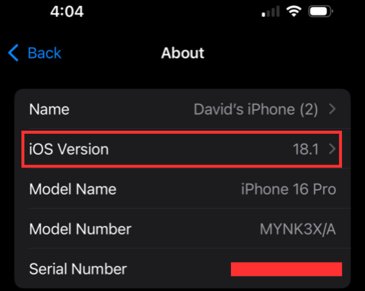
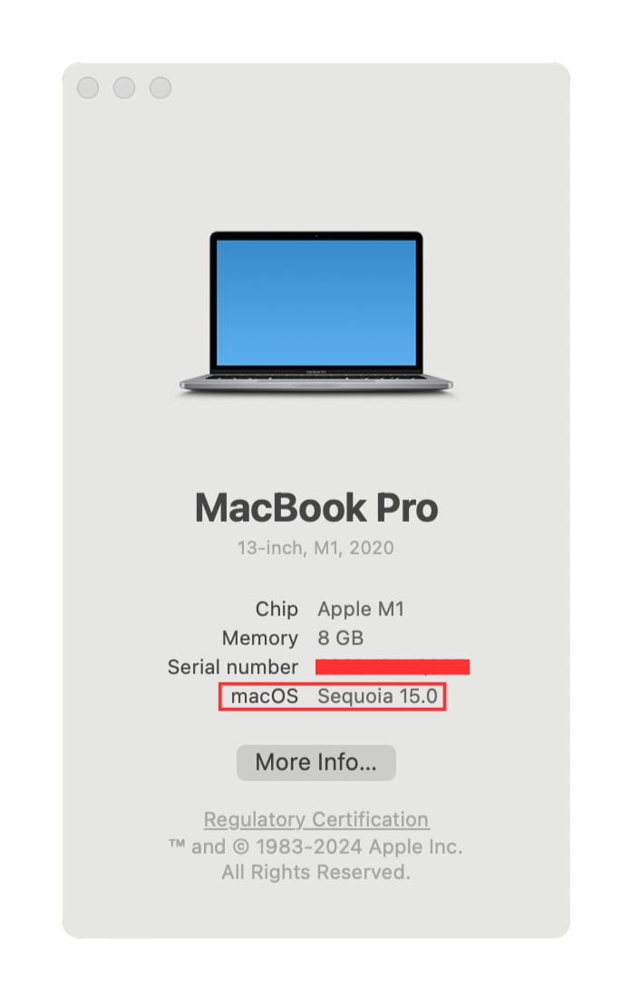
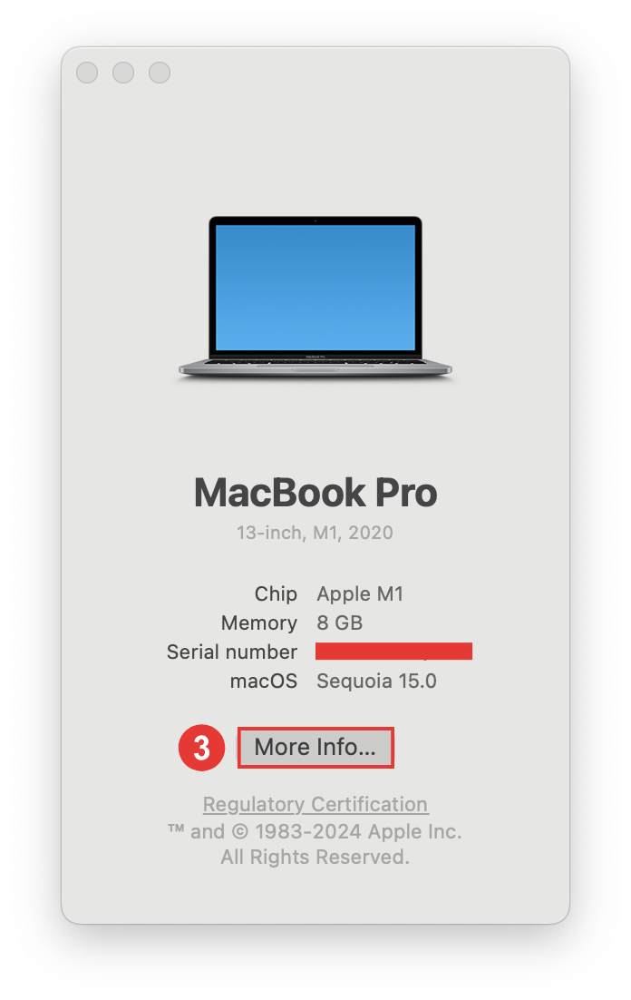

## Overview

!!! info "Time Estimate"

    - 5 minutes, if your computer meets minimum requirements.
    - 30-60 minutes, if you need to install macOS updates.

!!! abstract "Summary"

    To build the Trio app on a Mac, your computer, iPhone, and Xcode must have compatible versions. If you are buying a Mac to use the build with the Mac method, choose one that can be updated to the Sequoia (macOS 15) operating system and has at least 256 GB (512 GB is better). The Build with Browser method works on any computer or tablet.

!!! question "FAQs"

    - **Do I need a Mac?** No, you can [Build Trio with Browser](INSERT LINK TO BROWSER BUILD) on any computer.
    - **How often do I need to use the computer to build with the Mac method?** Computer access is required when:
        - Initially installing the Trio app.
        - Trio will expire annually for a paid account or weekly for a free account.
        - Updating to a newer Trio release.
        - You do not need access to an Apple computer to update your phone's iOS, troubleshoot, or change Trio settings
    - **What if my computer doesn't meet the minimum requirements** If your 'macOS' does not meet the minimum standards as your iOS version dictates, you will need to complete a software update on your computer to continue. Suppose you cannot update your computer to the required 'macOS' due to hardware limitations. In that case, your options are as follows:
        - Build Trio with GitHub using the Browser Build method.
        - Borrow an up-to-date Mac computer.
        - Purchase an up-to-date Mac computer.

## Prepare your Computer

### Computer Compatibility

Let's confirm that your computer is compatible with and meets the requirements for building Trio. 

The iOS of the phone on which you wish to build Trio dictates the required macOS of your computer. At a minimum, the current release of Trio requires iOS 16.3 or higher, Xcode version 15 or higher, and macOS 13.5 or higher. 

The table below lists the **minimum** requirements to build the current release of Trio. If your macOS or Xcode version is higher, you can build on a Mac.

Find your phone iOS in the table below. 

!!! info "iOS Version"
    If your iOS is not listed, e.g., 17.6.1, choose the first row that is less than your iOS.

| iOS Version | minimum Xcode | minimum macOS | 
|:---:|:---:|:---:|
| 18.1 | 16.1 | 14.5 |
| 18.0 | 15.4 | 14.5 |
| 17.5 | 15.4 | 14.0 |
| 17.4 | 15.3 | 14.0 |
| 16.3 to 17.0 | 15.0 | 13.5 |

!!! warning "Warning"

    **Your phone iOS dictates your MacOS requirements**  - The more up-to-date you keep your phone iOS, the more up-to-date your computer and MacOS must be to build Trio with Xcode. 

### Check your iOS version

1. On your iPhone, click on the 'Settings' application.

2. Next,  select the 'General' option.

3. Then, select the 'About' option.

4. Review and take note of your 'iOS Version' at the top of the page.

5. Compare your 'iOS Version' with the above table to confirm what "macOS" your computer requires. 

    {width="481"}
      {align= "center"}

### Check your 'macOS' version.

1. Select the 'Apple' icon at the top left corner of your computer screen. 

2. Next, select the 'About This Mac' option.

3. This will open an application with information specific to your Mac computer. Take note of your 'macOS', and in combination with your 'iOS Version,' review the above table to confirm compatibility.

    {width="348"}
      {align= "center"}

### Check the Space Available on your Hard Drive

In order to install Xcode on your Mac computer, your hard drive must have at least 50GB of free space. You can check how much space you have by following the instructions below.

1. Select the 'Apple' icon at the top left corner of your computer screen. 

2. Next, select the 'About This Mac' option.

    {width="308"}
      {align= "center"}

3. This will open an application with information specific to your Mac computer. Select the 'More Information' button to open a new window with additional information about your computer. 

    {width="348"}
      {align= "center"}

4. Ensure the 'General' tab is open. Scroll down to the' Storage' section. Your hard drive will be listed with the volume available out of the total capacity. 

5. As noted above, a minimum of 50GB capacity is required to install Xcode and its components. 

    {width="414"}
      {align= "center"}
   
