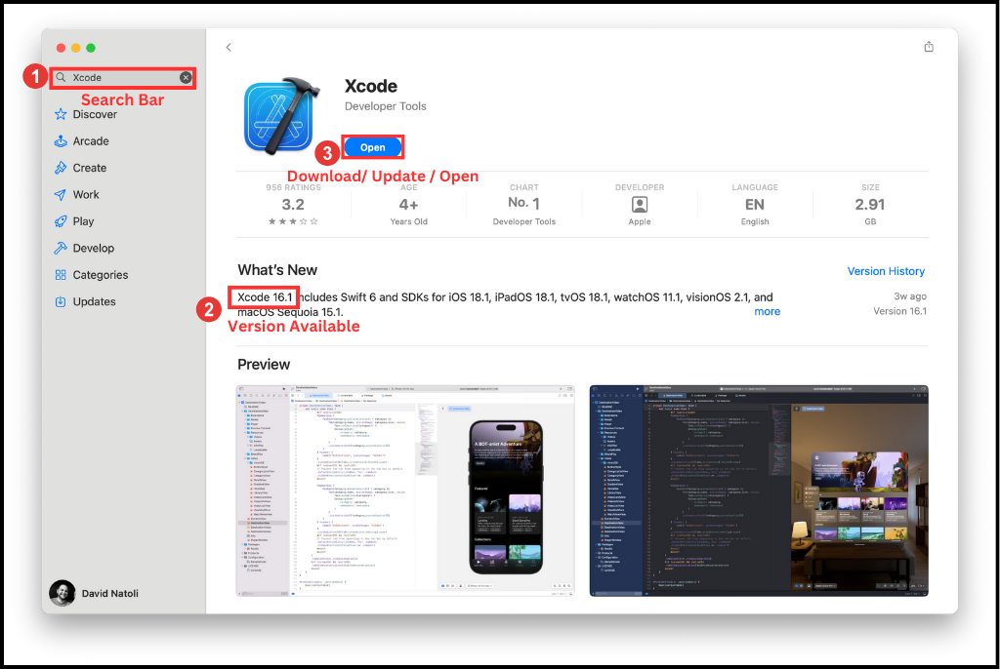
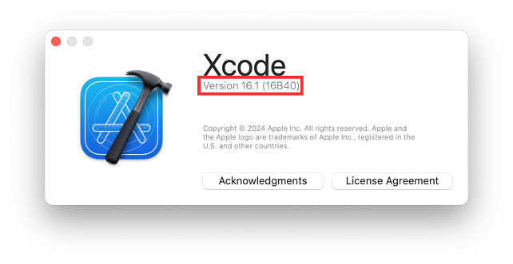
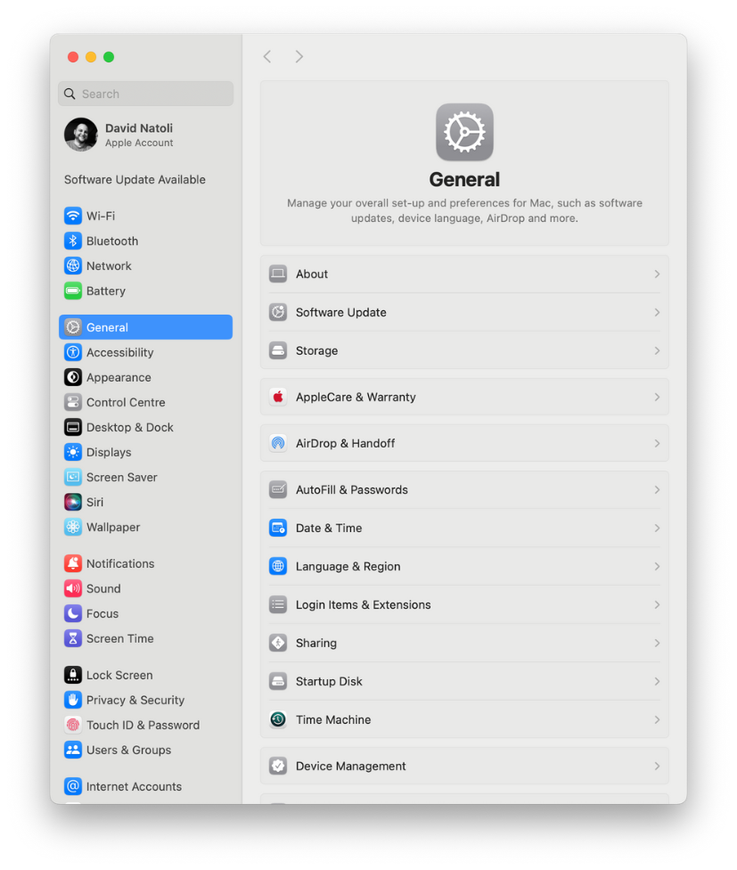
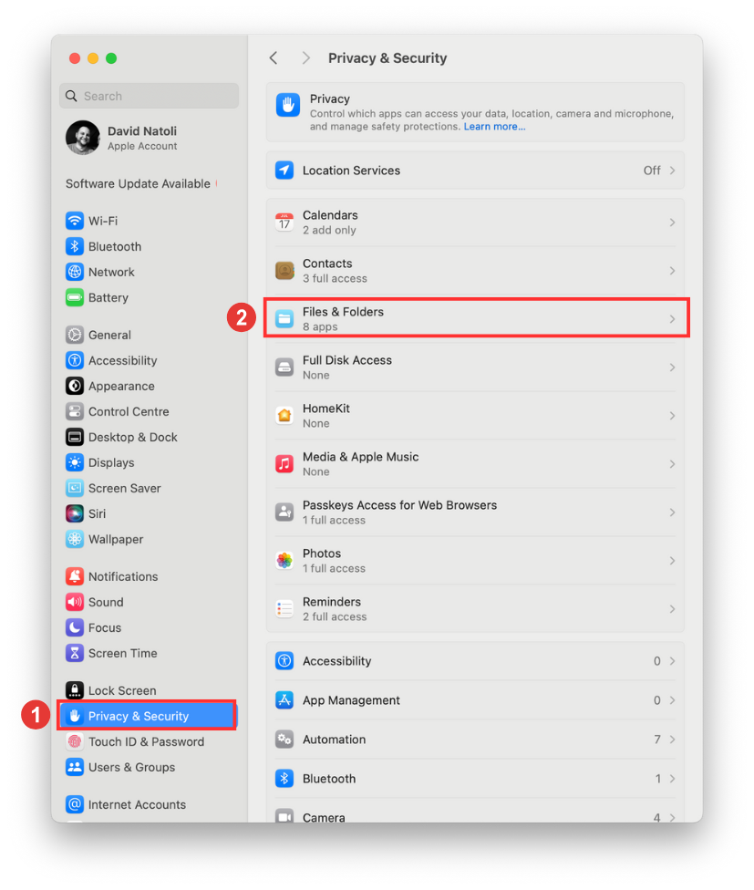
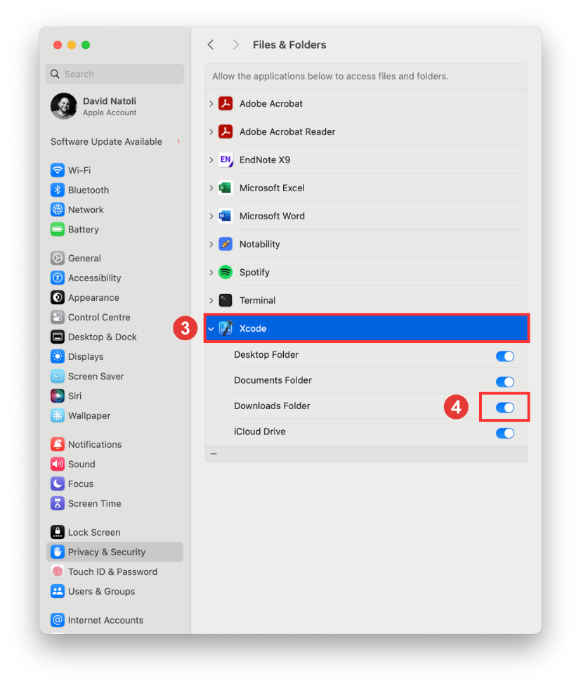
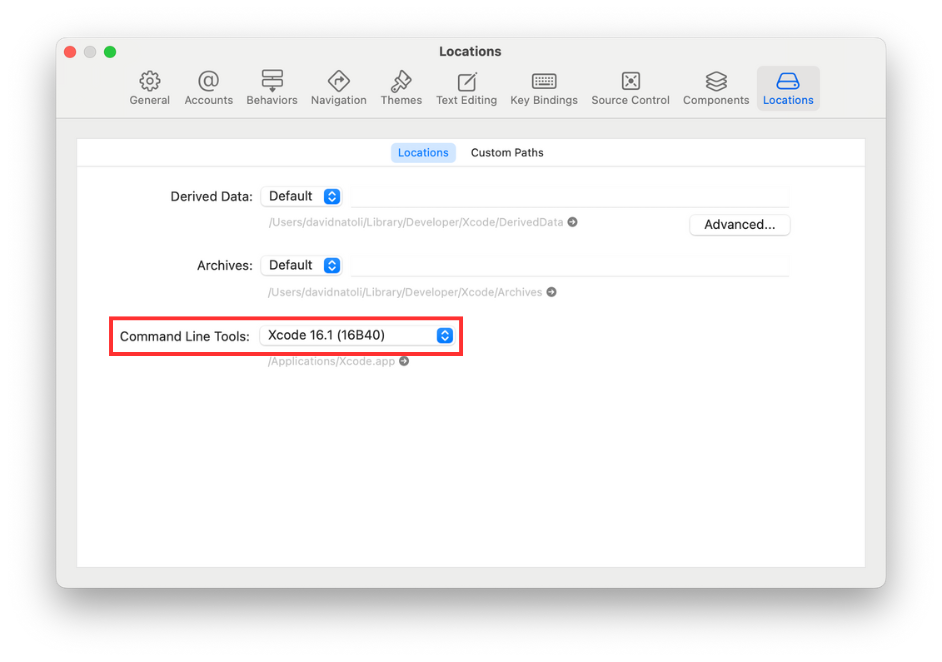
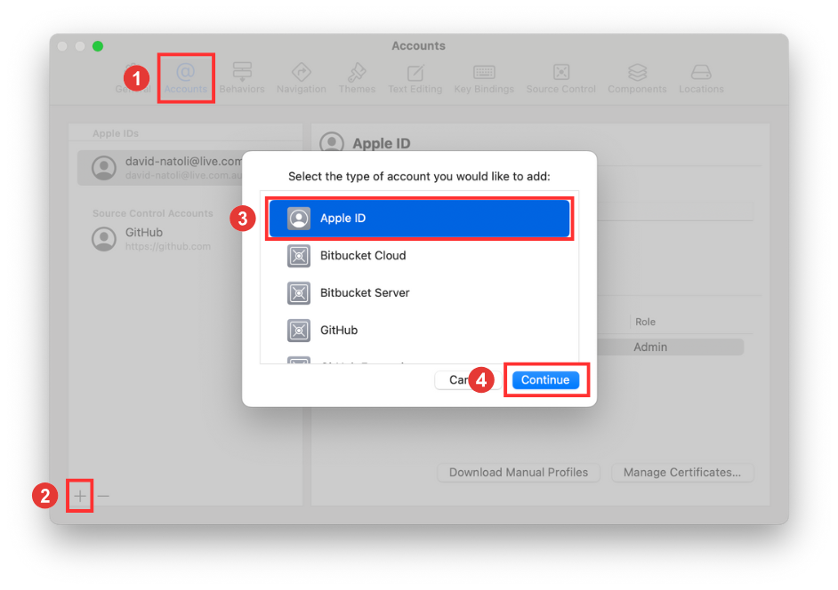

## Overview

!!! info "Time Estimate"

    It will take 45 minutes to 2 hours, depending on your internet connection, but you don't need to babysit the download.

!!! abstract "Summary"

    - Check the phone's iOS version
        - The iOS version determines the minimum Xcode version.
        - The minimum Xcode version determines the minimum macOS version.
        - If necessary, update your MacOS first and then return to this step.
    - Download (or update) Xcode from your computer's 'App Store' application.

!!! question "FAQs"
    - **Why isn't my Xcode installing?**  
    The two most common reasons are:
        1. Lack of internet connection, or;
        2. Not enough space on your hard drive.
            Xcode is a large download that requires at least 50GB of space to unpack and install properly.
            - You will have installation failures if you do not have enough space on your hard drive.
            Although the download takes a long time, the good news is that you can walk away once it starts. If your laptop goes to sleep when you close the lid or when the screen saver starts, disable the screen saver and leave the computer open.
            - After Xcode has finished downloading (it looks like the progress bar is almost completed), it takes a long time to unpack and install; be patient.
    - **Can I install Xcode on an external drive?**
    Unfortunately, no. Xcode needs to be on the Mac hard drive.

## Download and Configure Xcode

### What is Xcode?

Xcode is a free application for Apple computers. You will use Xcode to turn the "raw" Trio source code into an iOS application and install it onto your iPhone. Which version of Xcode you install on your computer depends on the iOS version you have on the iPhone you will be installing Trio on and the macOS version you have on your computer. 

### What version of Xcode will I need?

First, choose an appropriate Xcode version for your iOS device. Then, determine the minimum macOS version required for that Xcode version. Update to at least that minimum macOS version. 

### How do all the minimum versions relate to each other?

The current release of Trio requires iOS 16.3 or higher, Xcode version 15 or higher, and macOS 13.5 or higher. 

The table below lists the **minimum** requirements to build the current release of Trio. If your macOS or Xcode version is higher, you can build with a Mac.

!!! info "iOS Version"
    If your iOS is not listed, e.g., 17.6.1, choose the first row that is less than your iOS.  

| iOS Version | minimum Xcode | minimum macOS | 
|:---:|:---:|:---:|
| 18.1 | 16.1 | 14.5 |
| 18.0 | 15.4 | 14.5 |
| 17.5 | 15.4 | 14.0 |
| 17.4 | 15.3 | 14.0 |
| 16.3 to 17.0 | 15.0 | 13.5 |

### Download Xcode
1. On your Mac computer, open the app store.

2. Next, in the top left corner of the App Store, there is a search engine. Search for Xcode. 

3. Select the Xcode application from the search results.

4. Review the available Xcode version.

5. If the Xcode version you require is higher than the Xcode version available in the App Store, you need to update your computer. 

6. Select download. Be patient; depending on your download speeds, this could take a couple of hours. 

    {width="1024"}
      {align= "center"}

7. the Xcode application will be available from your Launchpad or Applications file once the download is complete. 

### Configure Xcode

!!! info "Time Estimate"

    - Installing the Command Line Tools takes about 10-15 minutes.
    - 5 minutes to add your Apple ID, assuming you remember your password.

!!! abstract "Summary"

    - Verify that Command Line Tools are installed.
    - Add your Apple Developer account to Xcode.

!!! question "FAQs"

    - **I still only see an account with `(personal team)` beside it even though I enrolled in the paid Developer Account program...what should I do?** You should check your spam email box in case Apple sent you an email there. Ensure you've waited the 48 hours Apple says it may take to get your account approved. If it's been 48 hours and you still don't see anything in your email, contact Apple support and ask them about your enrollment status. It may be held up by something on their end.

Now that you have downloaded Xcode, you must configure some settings to streamline Trio's build process. Let's get started. 

### Check Xcode Version

Let's check if the correct version of Xcode was installed.

1. Open Xcode from either Launchpad or Applications folder. 

2. In the top left-hand corner of the window, select 'Xcode'

3. Next, select 'About Xcode' from the menu.

4. A window will open, and you can review the Xcode version installed on the computer. 

    {width="642"}
      {align= "center"}

### Privacy Settings

Sometimes, people have their macOS privacy settings configured so that Xcode does not have permission to access their computer's 'Downloads' folder. This can become problematic when using the build script to build an app with Xcode. To ensure access is allowed, follow the following instructions:

1. Select the 'Apple symbol' in the top left-hand corner of the screen.

2. Next, select 'System Settings'.

    {width="827"}
      {align= "center"}

3. Next, we are going to select 'Privacy & Security".

4. Then, we are going to select the 'Files & Folders' option.

    {width="827"}
      {align= "center"}

5. We can then select the Xcode application. 

6. Once you select the Xcode application, ensure access to the downloads folder is toggled on.

    {width="827"}
      {align= "center"}

### Command Line Tools

The first time you open Xcode, it will want to install a package of command-line tools. Please wait patiently for this to be completed. In some instances, the command-line tools may have been installed without asking. Before proceeding, please confirm that the tools have been installed correctly.

1. Open Xcode.

2. In the top left-hand corner of the screen, select 'Xcode'.

3. Next, select 'Settings'. This will open the Xcode'  Settings' window.

4. In the Xcode'  Settings' window, select 'Locations'

5. In the 'Locations' tab, you will observe a drop-down menu for 'Command Line Tools'. Ensure the Xcode version listed matches the version you just downloaded and installed. 

    {width="942"}
      {align= "center"}

### Add Apple ID to Xcode

When you first use Xcode, you will need to add your Apple ID to the accounts within Xcode. 

1. Open Xcode.

2. In the top left-hand corner of the screen, select 'Xcode'.

3. Next, select 'Settings'. This will open the Xcode'  Settings' window.

4. Next, ensure you are in the 'Accounts' tab.

5. Press the plus symbol in the bottom left-hand corner of the screen. Follow the prompts to add your Apple ID.

    {width="942"}
      {align= "center"}
