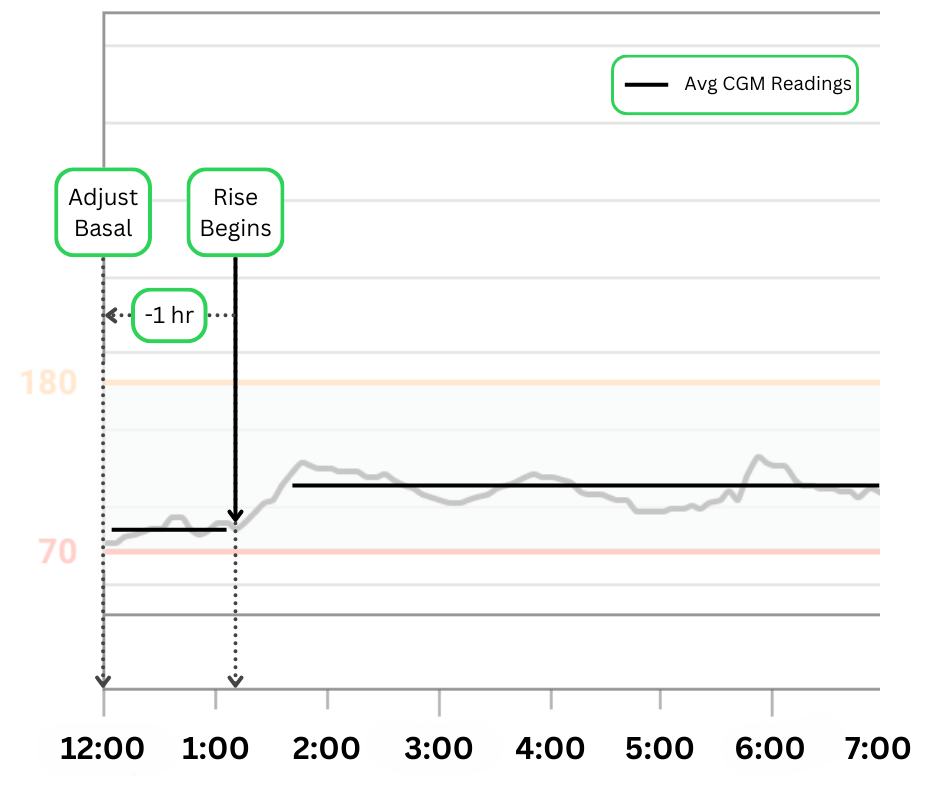

## Evaluate Basal

!!! warning "Not a Medical Advice"
    
    This is not medical advice.  
    Understanding the changes you are making is important, and always be sure to exercise caution.  
    When in doubt, consult your diabetes care team for settings guidance.

### Before Adjusting Basal Rates

1. **Consider CR and ISF _First_**
	- *Were carbs eaten in the last 3 hours?*
	-  *Are you in open loop?*  
         
        !!! warning "Caution"
          
            Until you understand how the Trio algorithm works, you should only make basal adjustments after basal testing in an open loop.

1. **Is this a one-time event, or does it happen consistently over multiple days?**  
   Make sure it happens twice at the same time of day before making any adjustments.

### How to Adjust Basal

!!! tip
    
    A general rule of thumb is to adjust the basal rate 1 hour before the CGM shows a change in glucose levels that you want to correct. This is determined by the approximate peak time of rapid-acting insulin.

!!! example
    
    This person noticed an increase in their average CGM readings starting around 1:00 AM. They were in open loop and had no late-night snacks so that they could rule out CR and ISF as factors. Because the rise began at 1:00 AM, they should increase their basal rate at 12:00 AM.

{width="600px"}
{align=center}

### Nightscout

Nightscout (NS) is a valuable resource that provides detailed information for analyzing your settings. Nightscout reports and Loopalyzer can be great tools for understanding your data.

#### Build Nightscout
[Instructions to build Nightscout](https://nightscout.github.io/nightscout/new_user/)

#### Using Nightscout for Basal Adjustments
[How to use Loopalyzer](https://nightscout.github.io/nightscout/reports/#loopalyzer)
