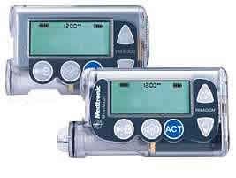

## Compatible Pumps

There are three types of pumps compatible with iAPS:
<b>
* Omnipod DASH pumps
* Omnipod Eros pumps
* Older Medtronic pumps
</b>

Time Estimate for this section:

* Omnipod users: 1 minute
* Medtronic users: 10 minutes

No other pumps work with iAPS at this time, but there are other open-source closed loop options such as [AAPS: Android Artificial Pancreas System](https://androidaps.readthedocs.io/en/latest/index.html) and [OpenAPS](https://openaps.readthedocs.io/en/latest/) that support other pumps.

### Omnipod Pumps

<i>Reminder and Disclaimer</i>

<i>The use of Omnipod pumps with iAPS is not supported by Insulet, although they are aware it is happening. Do not call Insulet asking for help with your iAPS build, setup, or operation. You are fully responsible for your use of iAPS and do so at your own risk. Please read these documents and familiarize yourself with iAPS before using.</i>

#### Omnipod Eros

Eros pods were launched in 2013 and continue to be sold by Insulet. They will stop being available in the US at the end of 2023, but will continue to be obtainable in other countries for now. Eros pods are also referred to as "Omnipod System", "Omnipod Classic", or "Gen3". The Eros uses radio waves for communication between the Pod and the PDM. The iPhone does not support these radio waves, so in order to use Eros with iAPS, you need to get a separate device that can translate radio waves to Bluetooth. These devices are called RileyLink, EmaLink, etc.

#### Omnipod DASH

The DASH pods were launched in 2019 and use Bluetooth, so they don't require a RileyLink or similar device as they connect directly to the phone. DASH pods are easy to identify with their blue tab instead of the clear tab used on Eros and Omnipod 5.

#### Omnipod 5

iAPS does not support Omnipod 5 pods. The Omnipod 5 has built-in closed loop functionality and works with Dexcom.

### Medtronic Pumps

There are a number of Medtronic insulin pumps manufactured between 2006 – 2012 which are iAPS compatible.  Compatibility has two requirements: (1) pump model and (2) firmware.

* Medtronic 515 or 715 (any firmware)
* Medtronic 522 or 722 (any firmware)
* Medtronic 523 or 723 (firmware 2.4 or lower)
* Medtronic Worldwide Veo 554 or 754 (firmware 2.6A or lower)
* Medtronic Canadian/Australian Veo 554 or 754 (firmware 2.7A or lower)

If you have one of the pumps listed above, you are good to go on iAPS! Congrats!

#### Medtronic Pump Model

To determine your pump model, look at the backside of your pump.  There should be a sticker on the underside of the pump.  On the right-hand side of the sticker, it says REF MMT-XXXXXX

    * MMT ---> Pump Manufacturer Model (MiniMed Medtronic)
    * 722 ---> Pump Model Number
    * NA ---> Pump Region (NA=North America, CA=Canada/Australia, WW=Worldwide)
    * S ---> Pump Color (S=Smoke, L=Clear/Lucite, B=Blue, P=Pink/Purple)

Some pumps may have an “L” or “S” or "R" before the pump region, e.g. a model number like MMT-722LNAS.  This does not affect iAPS compatibility.

#### Medtronic Pump Firmware

A pump’s firmware is the internal software that runs your pump.  Older Medtronic firmware allows iAPS to act as a “remote control” to set temp basals and report back pump data.  Newer firmware disabled that “remote control” access and therefore cannot be used with these DIY closed-loop systems.  There is currently no ability to downgrade a pump’s firmware or replace it with older firmware.  Before you buy a used pump, make sure you are getting one with compatible firmware. <b>You cannot change the firmware on a Medtronic pump.</b>

The firmware on all 515/715 and 522/722 model Medtronic pumps is compatible with iAPS. You will only need to check the firmware version for 523/723 and 554/754 model Medtronic pumps.

* Medtronic 515 or 715 (any firmware)
* Medtronic 522 or 722 (any firmware)
* Medtronic 523 or 723 (firmware 2.4 or lower)
* Medtronic Worldwide Veo 554 or 754 (firmware 2.6A or lower)
* Medtronic Canadian/Australian Veo 554 or 754 (firmware 2.7A or lower)

To find your pump’s firmware you will need to power it on. If the pump has not been powered on for some time (i.e., has been in storage without a battery for a while), it will run through a start-up count and the firmware version will appear on the bottom right of the pump’s screen.  Don’t turn away, as the version number will only be displayed for a little while before the screen moves onto other information displays.  

If the pump has been active recently or has a reservoir installed, follow these steps:

1. Press the  button on your pump.  

2. Scroll down with the  button to the bottom of the status display.  

3. Read the bottom line of the display.

#### Medtronic Pump Differences

If you are in the position of being able to shop around for different pump models, there are some slight differences between the iAPS-compatible Medtronic pumps.

**500 vs 700**: The difference between the Medtronic 500 series and the 700 series pumps is the size of the insulin reservoirs.  The 500 series pumps use a 180 unit reservoir, and the 700 series pumps use a 300 unit reservoir (or smaller 180 unit reservoir, if you want).

**x15/x22 vs x23/x54**: The noteworthy differences between the x15 and x22 pumps versus the x23 and x54 series pumps are:

* The x23/x54 pumps will allow for smaller insulin deliveries in certain situations, if the smaller scroll rate is selected in the Bolus>Setup>Scroll Rate menu.  **iAPS will have the insulin delivery automatically rounded by the pump to the units available in the pump model, and any smaller adjustments (to make up for the rounding) will be made through iAPS’s use of temp basals.  If you want the smaller increments of basal rates, you can still enter those values in the iAPS app's settings and iAPS will use those values for the purposes of insulin delivery calculations.**

|Pump Model  |Basal increments  |Bolus increments  |Range  |
|---------|---------|---------|---------|
|515/715 and 522/722     |  0.05 0.1       |    0.1 0.1     | deliveries of less than 10 units greater than 10 units        |
|523/723 and 554/754     |  0.025 0.05 0.1       |   0.025  0.05  0.1      | between 0.025 to 0.975 units between 1 to 9.95 units greater than 10 units        |

* Additionally, because of the way iAPS fetches information from the pump, the x23/x54 series of pumps are slightly better at conserving battery life through the use of the MySentry packets to collect information from the pump.  x22 pumps do not use MySentry.

* The x23/x54 series pumps are also faster at delivering boluses greater than 10 units.  On an x23 pump, a 13-unit bolus takes 5:00 minutes to complete.  On an x22 pump, a 13-unit bolus takes 8:40 minutes to complete.

#### Finding a Medtronic Pump

Finding a compatible Medtronic pump is probably the most difficult part for most new iAPS users. Our suggestions:

* Talk to friends in the diabetic community.

* Ask your endocrinologist.  

* Ask at a local JDRF chapter meeting if someone has an old backup pump they'd be willing to donate to you.  

* Join diabetic supply groups on Facebook; both for-trade and for-sale groups. [Looping in a time of covid](https://www.facebook.com/groups/1087611668259945/) is a Facebook group focused on DIY looping devices and supplies. Be sure to read their rules if you join.

* Check Craigslist often and be willing to expand your search area to include larger cities.

* Check out the **HelpAround, NextDoor, OfferUp, and/or LetGo** apps for pumps.

The most success appears to come from either one-on-one discussions with fellow diabetics/doctors or using apps (Craigslist, NextDoor, LetGo, HelpAround).  If you are using Craigslist, you may wish to use an app on your iPhone to make the searching easier. There are apps to search multiple cities at once for your keywords and set up alerts.

#### Safe Purchasing

If you choose to purchase from a remote or unknown seller, here are some tips for safe purchasing:

* Use PayPal and purchase using the "Goods and Services" payment option. This costs nothing for the buyer, but the seller will lose 2.95% of the sale to PayPal fees. PayPal offers some protection for both buyer and seller in the event of fraud.  

* Ask for photos of the pump. Check to make sure the serial number of the pump on the backside matches the serial number of the pump showing in the display menu. Ask for a short video of the pump, or at least a photo of the pump turned on, so that you can see the pump's firmware and model number. Cracks and some wear on these pumps are expected. These pumps are not usually free of marks. Many people are successfully looping on pumps that have cracks and rub marks, but you may want to ask if you are concerned about any you see in photos.

* Beware if the bottom of the reservoir/motor sleeve has the drive support cap pushed out, as shown [here](../troubleshooting/pump-errors.md#motor-error). Those pumps will generally not work (or only work intermittently), however some people have successfully repaired those pumps as shown in that link. Just be aware that it should be checked in advance.

* Repairs to cracks or missing bits of plastic on battery cap area and reservoir caps are possible and not very difficult in most situations. You can read more about how to repair those [here](../troubleshooting/pump-errors.md#crackmissing-piece-repairs).

* Ask for shipping that includes a tracking number. USPS Priority Mail's smallest box is a great option.  It's only $10.20 domestically in the US and includes tracking. Ask the seller to add a small bit of packing protection such as bubble wrap around the pump to keep it safe during shipping. Make sure you get a tracking number within a reasonable period of time after you have paid.  

Red flags that may indicate a scam:

* Asking for payment through "friends and family" on PayPal, especially if you don't know the person or have any solid references for them. Paying in that way offers you no buyer protection. It's just like giving the seller cash, so you had better trust the seller.  

* Offering an "almost new" pump is a big red flag. These pumps should be at least 5-years-old by now. Do you really think a 5 year old pump should be unused and sitting in shrink wrap at this point? This seems highly suspicious. There are some out there, but they are very infrequent.  

* Not able to provide new pictures of the pump when requested. Sure they posted some pictures with the ad, but what if they just downloaded them from other people's ads? The seller should be able to furnish a couple of "new" photos at your request. A good one to ask for is the battery and reservoir tops so you can see the condition of those.

#### Pump Supplies

Medtronic will not typically sell pump supplies directly to customers who have not previously purchased a registered Medtronic pump. Ask your insurance about purchasing pump supplies through a durable medical equipment (DME) provider. Typically, the DME provider will coordinate with your insurance and doctor's office to get the necessary insurance approval and prescriptions for the supplies. If you are brand new to Medtronic infusion sites, you may want to ask for help from friends to try a variety of infusion sets before purchasing a full 90-day supply of any type in particular.

<b> Next Step: Compatible CGM</b>

Now you are ready to check if you have a [Compatible CGM](../settings/devices/cgm.md).
