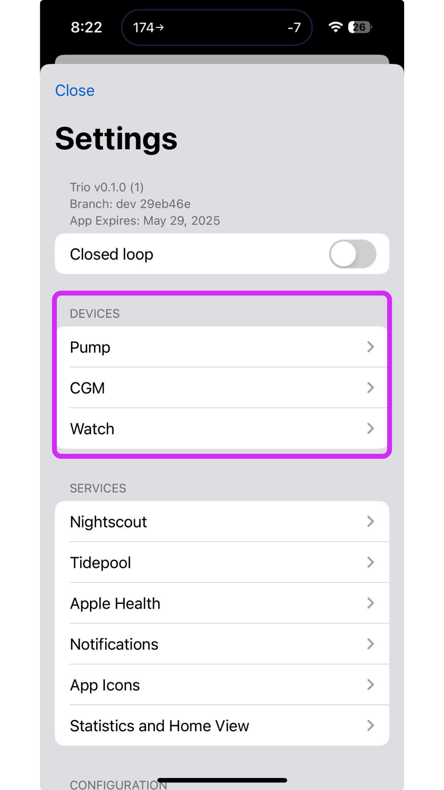
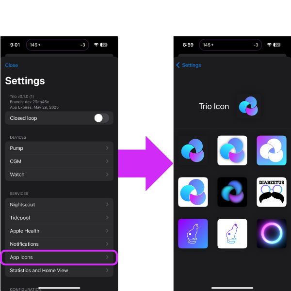

# New User Setup
To set up your Trio app, touch the settings icon located on the bottom right of the main screen. Follow this step-by-step guide to start using Trio. Each step contains links to information on setting up each part of your Trio app. Use this as your homebase to reference back to as you set up your app.
 

## Step 1: Connect your Devices
The first step in setting up your Trio app is to connect your devices to the app. 

### Verify Compatibility
If you have not already, please verify that your devices are compatible:

 1. [Phones/Watches](../Getting-Started/iphone.md)
 2. [Pumps](../Getting-Started/pump.md)
 3. [CGMs](../settings/devices/cgm.md)
 

### Connect Devices
Once you have verified that you are using compatible devices, you can connect them in the Trio app settings menu.

 1. [Pump](./Configuration/Devices.md#pump)
 2. [CGM](./Configuration/Devices.md#cgm)
 3. [Watch (optional)](./Configuration/Devices.md#watch)
 

## Step 2: Add Profile Settings
The next step is to enter your main profile settings: Basal, ISF, CR, and Target Glucose.

:::{important}
If you use mg/dL, you must first change the 'Glucose Units' before entering your profile settings.

This is found in the Trio Settings menu under 'Preferences'
:::

 1. [Basal](./settings/configuration/basalprofile.md)
 2. [Insulin Sensitivity Factor (ISF)](./settings/configuration/insulinsensitivites.md)
 3. [Carb Ratio (CR)](./settings/configuration/carbratios.md)
 4. [Set Target Glucose](./settings/configuration/targetglucose.md)
 

## Step 3: Adjust Safety Limits
The next step is to adjust the standard safety limits that will allow Trio to function effectively. There are many more settings that are not mentioned in this section. It is not advised to adjust those until you have familiarized yourself with the system by using it for a while.

:::{warning}
<b>DO NOT ENABLE DYNAMIC SETTINGS YET</b>

It is essential that Trio have enough data to make sound recommendations. This takes a minimum of 7-14 days. It is not advised to enable dynamic settings until BOTH criteria below are met:

 - You are sure your settings are accurate
 - You have used Trio with a real CGM and real pump (not simulators) for at least 7 consecutive days

:::

 1. [Recommended Bolus Percentage](./settings/configuration/preferences/trio.md#recommended-bolus-percentage)
 2. [Max IOB](./settings/configuration/preferences/mainsettings.md#max-iob)
 3. [Max COB](./settings/configuration/preferences/mainsettings.md#max-cob)
 4. [Bolus Increment](./settings/configuration/preferences/smbsettings.md#bolus-increment)
 5. [Enable SMB](./settings/configuration/preferences/smbsettings.md)
 6. [Max Delta-BG Threshold SMB](./settings/configuration/preferences/smbsettings.md#max-delta-bg-threshold-smb)
 7. [Enable UAM](./settings/configuration/preferences/smbsettings.md#enable-uam)
 8. <b>HANDS OFF DYNAMIC SETTINGS!</b>
 

## Step 4: Enable Closed Loop

Closed loop is turned off by default. This means Trio cannot make adjustments automatically. The system relies solely on you to make any recommended adjustments while Closed Loop is OFF. You can control your pump and bolus with the Trio app, but nothing will be done without your approval while in "open loop."

[More on closing the loop](./Configuration/Configure.md)
 

## Step 5: Change App Icon (Optional)
Under "App Icons" in the Settings Menu, you can find a variety of icons to use for your Trio app.
 

 
If you have a special one in mind, you can use your own custom Icon by following [these instructions](./operate/customize.md#add-custom-icon).
