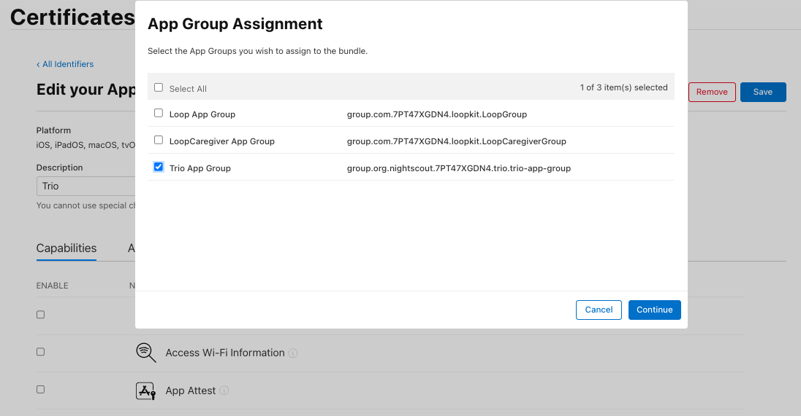
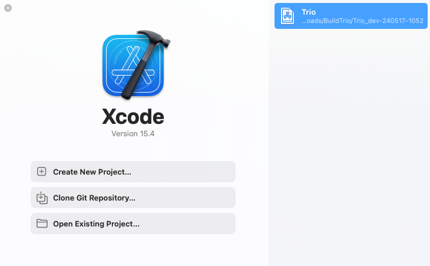
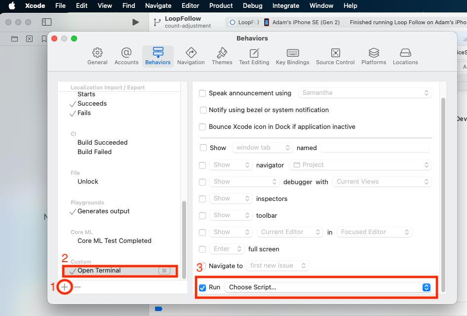
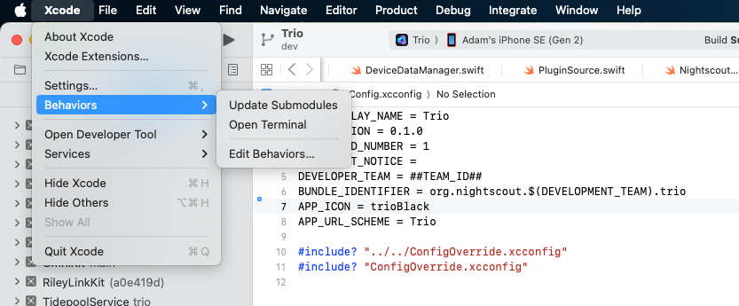
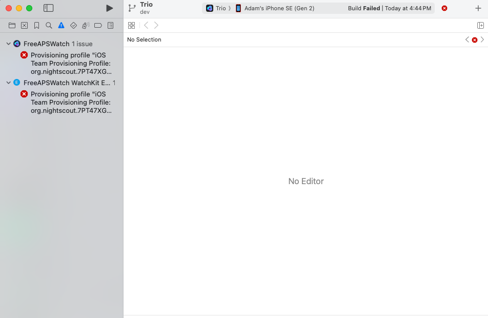

# Build and Update

**Jump to...**\
Build with [GitHub](#build-trio-with-github) | [Mac-Xcode](#build-trio-with-xcode) | [Script](#build-trio-with-script)\
Update with [GitHub](#update-trio-with-github) | [Mac-Xcode](#update-trio-with-xcode) \
Special Section on Trio App Group [Special Section on Trio App Group](#special-section-on-trio-app-group)

## Build Trio with GitHub

The Trio repository contains instructions for building the Trio app using a browser and GitHub. More detailed instructions are also available in LoopDocs.

* [GitHub Build Instructions](https://github.com/nightscout/Trio/blob/main/fastlane/testflight.md)
* [LoopDocs: GitHub Build Overview](https://loopkit.github.io/loopdocs/browser/bb-overview/)
* [LoopDocs: GitHub Build Other Apps](https://loopkit.github.io/loopdocs/browser/other-apps/)

:::{tip} If using the LoopDocs instructions you need the important information below to build Trio intead of Loop
:::

**Every app you build will use the same [6 Secrets](https://loopkit.github.io/loopdocs/browser/intro-summary/#make-a-secrets-reference-file).**

* Fork from: [https://github.com/nightscout/Trio](https://github.com/nightscout/Trio)
* Identifiers for Trio: see [Table of Identifiers](#table-of-identifiers)
* You use the `Trio App Group` for Trio, see [Create the `Trio App Group`](#create-the-trio-app-group)
* Add the `Trio App Group` to these identifiers:
    * Trio
    * Trio Watch
    * Trio WatchKit Extension
* In `App Store Connect`, the `Bundle ID` for Trio will be: `org.nightscout.TEAMID.trio`

### Create the `Trio App Group`

If you already have a `Trio App Group`

* You can skip this step - your existing App Groups are found at this link: [App Group List](https://developer.apple.com/account/resources/identifiers/list/applicationGroup)
* If your `Trio App Group` was created from a Mac with Xcode, you may choose to edit the Description to make the **NAME** match

If you do not have a `Trio App Group`:

* Go to [Register an App Group](https://developer.apple.com/account/resources/identifiers/applicationGroup/add/) on the apple developer site and use the table below to help you create one.

| NAME | Xcode version (NAME) | IDENTIFIER |
|:--|:--|:--|
| Trio App Group | group org nightscout TEAMID trio trio-app-group| group.org.nightscout.TEAMID.trio.trio-app-group |

### Table of Identifiers

* If you built previously using a Mac with Xcode, you may see the Xcode version in your **NAME** column - it starts with XC and then the **IDENTIFIER** is appended where the `.` is replaced with a space, the example for Trio is shown in detail
* If you built during early beta testing, you might not have `Trio` at the beginning of each **IDENTIFIER** and the full **NAME** may be slightly different
* Optional: You can click on a given row, edit the Description to match the **NAME** from the table below and it might making building easier in future

| NAME | Xcode version (NAME) | IDENTIFIER |
|:--|:--|:--|
| Trio | XC org nightscout TEAMID trio | org.nightscout.TEAMID.trio |
| Trio LiveActivity | - | org.nightscout.TEAMID.trio.LiveActivity |
| Trio Watch | XC IDENTIFIER | org.nightscout.TEAMID.trio.watchkitapp |
| Trio WatchKit Extension | XC IDENTIFIER | org.nightscout.TEAMID.trio.watchkitapp.watchkitextension |

### Add Trio App Group to Identifiers

Open the [App IDs Identifier page for your Apple Developer Account](https://developer.apple.com/account/resources/identifiers/list).

Click on the Trio Identifier and assign the Trio App Group to the Identifier - see graphic below.



Repeat this for the other 2 identifiers that need to have an App Group assigned: `Trio Watch` and `Trio WatchKit Extension`

### Configure Trio App

Follow the directions in [LoopDocs](https://loopkit.github.io/loopdocs/browser/prepare-app/#create-loop-app-in-app-store-connect), but use the Trio `Bundle ID`

* In `App Store Connect`, the `Bundle ID` for Trio will be: `org.nightscout.TEAMID.trio`

### Create Certificates

Follow the directions in [LoopDocs](https://loopkit.github.io/loopdocs/browser/certs/) but run the Create Certificates action for the Trio fork.

### Build Trio

Follow the directions in [LoopDocs](https://loopkit.github.io/loopdocs/browser/build-yml/) but run the Build Trio action for the Trio fork.

## Optional

### One-Time Update to Display Branch And Commit in Testflight

The Trio build can be configured to display the branch name and commit ID as test notes in TestFlight. This is an optional step, which can be especially useful if building the `dev` branch.

First, you must have already built Trio and have it available on [Apple App Store Connect](https://appstoreconnect.apple.com/apps).

* Tap on the TestFlight tab
* Choose any build to open a new detailed screen for that build
* In the Test Details section, type anything you want

After you have done this one-time step, each successive build will include the branch name and commit automatically.

You can add additional tests notes for any build if you desire.

[Top of Page](#build-and-update)

## Update Trio with GitHub

First makes sure any Apple License agreements have been accepted:

* [Apple Developer Page](https://developer.apple.com/account)

Second, make sure you have a valid Distributor certificate; if not, see [Distribution Certificate](#distribution-certificate):

* [Apple Certificate Page](https://developer.apple.com/account/resources/certificates/list)

### One-time Update for Trio App Group

If you built previously, before the App Group changed from Loop to Trio, you need to do this step. Then you can [Continue Updating](#continue-updating).

* [Create the `Trio App Group`](#create-the-trio-app-group)
* Examine the [Table of Identifiers](#table-of-identifiers) - it is optional, but editing the descriptions to match the **Names** in that table will make following directions easier in the future
* Update the [App Group to be the `Trio App Group` for the Identifiers (Trio, Trio Watch and Trio Watchkit Extension)](#add-trio-app-group-to-identifiers)
* Run the **Action: 3. Create Certificates** to make certificate which go with the new `Trio App Group`

### Continue Updating

Open your fork at `github.com/YOUR-USERNAME/Trio` with your GitHub username instead of `YOUR-USERNAME`

* Look to see if your fork is up to date
* If your fork shows that your branch is behind, sync the branch to get the latest updates

### Distribution Certificate

When you first build using GitHub, a Distribution Certificate is generated. It typically is valid for one year. You should get an email from Apple when you are within 30 days of that certificate expiring. When it expires, you can no longer build a new app. (Existing apps in TestFlight are not affected, they get the full 90 days.)

The directions to renew your Distribution Certificate are found in [LoopDocs: Renew Certificate](https://loopkit.github.io/loopdocs/browser/bb-update/#renew-certificate).

### Build Trio

Select **Actions: 4. Build Trio** and wait about an hour for your updated app to appear in TestFlight.

[Top of Page](#build-and-update)

## Build Trio with Xcode

If you build Trio on your Mac using Xcode, the recommendation is to use the [**TrioBuildSelectScript**](#build-trio-with-script) to build your code.

### Build Trio with Script

The **TrioBuildSelectScript** is similar to the script used to build Loop. If you need it, extensive instructions for that script are provided at these links: [LoopDocs: Build Select Script](https://loopkit.github.io/loopdocs/build/step14/#build-select-script) and [Loop and Learn: Build Select Script](https://www.loopandlearn.org/build-select/).

The **TrioBuildSelectScript** offers the choice to:

1. [Build Trio](#build-trio)
2. [Build Related Apps](#build-related-apps)
3. [Run Maintenance Utilities](#run-maintenance-utilities)
4. Exit Script

To execute the **TrioBuildSelectScript**, open a terminal on your Mac and copy and paste the command below into the terminal. Then, read and follow the directions. 

```
/bin/bash -c "$(curl -fsSL \
  https://raw.githubusercontent.com/loopandlearn/lnl-scripts/main/TrioBuildSelectScript.sh)"
```

### Build Trio

When you select **Build Trio**, you will be provided with a choice of branches with information to guide your selection and URL for documentation. This script will then download a fresh copy of your selected branch and guide you through building with Xcode on your Mac.

* Once the download completes, the script will also
    * Create the automatic signing file
    * Offer to remove provisioning profiles from your computer to ensure the build will last an entire year
    * Provide instructions for how to build the app once Xcode opens
    * Open Xcode with your new download.
* At this point the main menu is displayed again for you to select another option or to exit the script

The download is placed in your `Downloads` folder in a directory called `BuildTrio`. The downloaded clone is found in a folder with the branch name, date, and time encoded.

### Build Related Apps

When you select **Build Related Apps**, you will be provided with a choice of apps that users of Trio often use. Once you make your selection, the script will provide similar steps to download and build the selected app.

The choices are:

1. Build Loop Follow
2. Build xDrip4iOS
3. Build Glucose Direct
4. Return to Menu

### Run Maintenance Utilities

When you select **Run Maintenance Utilities**, you will be provided with a choice of utilties helpful for Mac builders.

The following options are offered:

1. Delete Old Downloads
2. Clean Derived Data
3. Xcode Cleanup (The Big One)
4. Clean Profiles
5. Return to Menu

For more information, refer to [Loop and Learn: Maintenance Utitilites](https://www.loopandlearn.org/build-select/#utilities-disk) documentation.


### Build Errors

If you encounter any build issues, please look at the [LoopDocs Build](https://loopkit.github.io/loopdocs/build/build_errors/) errors page. Only some things on that page are relevant for building Trio, but many potential issues will likely be covered there. You will also get helpful advice about what info to provide if you need to ask for help. When you have identified the error message(s), you can use the search tool in LoopDocs to see if your error is mentioned.

If you need it, you are most likely to get help in one of these groups:

* [Discord: Trio channel](https://discord.gg/FnwFEFUwXE)
* [Facebook group: Trio](https://www.facebook.com/groups/1351938092206709)
* Facebook groups like [Loop and Learn](https://www.facebook.com/groups/LOOPandLEARN) and [Looped](https://www.facebook.com/groups/1782449781971680) primarily focus on Loop but offer a wide variety of support surrounding all types of DIY Looping.

### xDrip4iOS or Glucose Direct as CGM Source

:::{important}
LibreTransmitter is provided as part of Trio. Neither xDrip4iOS or Glucose Direct are required to interact with your compatible Libre sensor using Trio.
:::

:::{important}
Until the providers of Glucose Direct add a Trio App Group to their app, you cannot use this app with Trio.
:::

If you want to use xDrip4iOS as a CGM source via “shared app group,” you must also build that app from a source with the same developer ID used for building Trio. Scripts are available for these apps as well. All scripts follow the same download and build pattern and configure automatic signing files for you.

The download is placed in your `Downloads` folder in a directory called `BuildxDrip4iOS` or `BuildGlucoseDirect`, respectively. The downloaded clone is found in a folder with the branch name, date, and time encoded.

These can be accessed using the [**TrioBuildSelectScript**](#build-trio-with-script) menu options mentioned above. Or you can run each script individually.

### xDrip4iOS

:::{important}
You must build xDrip4iOS version 5.3.1 or newer to have access to the Trio App Group required to work with Trio.
:::

```
/bin/bash -c "$(curl -fsSL \
  https://raw.githubusercontent.com/loopandlearn/lnl-scripts/main/BuildxDrip4iOS.sh)"
```

### Glucose Direct

:::{important}
Until the providers of Glucose Direct add a Trio App Group to their app, you cannot use this app with Trio.
:::

```
/bin/bash -c "$(curl -fsSL \
  https://raw.githubusercontent.com/loopandlearn/lnl-scripts/main/BuildGlucoseDirect.sh)"
```

### Alternative Branch for Trio

Sometimes, specific branches are offered for testing. Any desired branch can be cloned using the **Build Trio** script. After the final quote of the script command, add a space, hyphen, space, and branch_name. An example is shown below: replace `branch_name` with your desired branch. Note that specific branches like this are not deleted as part of the `Delete Old Downloads` utility discussed in [Maintenance Utilities](#run-maintenance-utilities).

```
/bin/bash -c "$(curl -fsSL \
  https://raw.githubusercontent.com/loopandlearn/lnl-scripts/main/BuildTrio.sh)" - branch_name
```

[Top of Page](#build-and-update)

## Update Trio with Xcode

Because Trio uses submodules, there are actions you need to perform when updating that are easiest using command line interface (CLI) in a terminal opened in the same folder as the Trio workspace.

If you prefer, you can use the [Build Script](#build-trio-with-script) to download and build a fresh copy.

This section tells you how to update the version you already have on your computer.

Open Xcode. If your Trio workspace is not already open, you can usually find it in the recent projects, as shown in the graphic below. You can also pull down the Xcode menu for `File`, select `Open Recent`, and find your workspace.



### Open Terminal

Once you have Xcode open with your previous build of Trio, the first thing to do is open a terminal. Here are two methods - choose one:

1. Use Xcode, Behaviors, Open Terminal if you configured [Xcode Behaviors](#xcode-behaviors)
2. Locate the Trio folder using [Where is my Download](#where-is-my-download)

### Customizations

Always attempt to [Update your Code](#update-your-code) first. Typically, your customizations can be left alone and `git` will merge the new code without requiring any additional action on your part.

* If you have a customization, you can often proceed with the update with no issues
* If your customization conflicts with a file or submodule that is being updated, you get a clear error message and need to proceed to [Fix Trio Conflicts](#fix-trio-conflicts)

### Update your Code

In the terminal, you will copy and paste this pair of commands to update your workspace and all your submodules.

```
git fetch
git pull --recurse
```

The first command `git fetch` brings down any updates about the state of the Trio workspace repository from GitHub.

The second command `git pull --recurse` does several things:

* Brings down any updates about the state of the submodule repositories from GitHub, e.g., `Fetching submodule XXXX` repeated for each submodule
* Merges any changes from GitHub into your local copy of the Trio workspace
* For each submodule, updates the version to match that selected in GitHub, see [Submodule Update](#submodule-update) for more details

There can be errors in several places, for example:

```{code-block}
:class: no-copybutton
error: Your local changes to the following files would be overwritten by merge:
	FreeAPS/folder/file.swift
Please commit your changes or stash them before you merge.
Aborting
```

The `pull` command halts at this error and does not move on updating the submodules. You must first fix the Trio workspace files using [Fix Trio Conflicts](#fix-trio-conflicts).

* If there was no error similar to that shown above, you will see the word `Updating` with the list of files changed.
* If there were no updates, you'll see `Already up to date`

### Submodule Update

* If there are no updates to submodules, you won't see any submodule update messages - that is not uncommon
* If there are updates to one or more submodules with no errors, you will see messages indicating the submodules are being checked out similar to the one below

```{code-block}
:class: no-copybutton
Submodule path 'ModuleName': checked out 'f11abde5e2eea2cbf7ac80f3f4bc4bc6e7f6de56'
```

If you see the word `error` or `conflict` on the output, similar to the following, head over to [Fix Submodule Conflicts](#fix-submodule-conflicts).

```{code-block}
:class: no-copybutton
error: Your local changes to the following files would be overwritten by checkout:
	SubModuleName/folder/file.swift
Please commit your changes or stash them before you switch branches.
Aborting
fatal: Unable to checkout 'f11abde5e2eea2cbf7ac80f3f4bc4bc6e7f6de56' in submodule path 'SubModuleName'
```

If you saw no errors, you are ready to build.

### Fix Trio Conflicts

If you have customizations in the Trio code (in the workspace) that cause a conflict when you `pull`, it is best to delete those and start fresh. (Expert users know how to handle this, these directions are for novices):

```
git reset --hard
git clean -fd
git pull
```

You should see the words: `Your branch is up to date with origin/main` (or `dev` or other branch if you are not running `main`.)

Now you need to continue to update the submodules with this command:

```
git submodule update
```

If there are no conflicts, you are ready to build the Trio app to your phone.

If there are conflicts similar to those shown in [Submodule Update](#submodule-update), fix them before building.

### Fix Submodule Conflicts

If you have customizations in the submodules that conflict with the update, you see a message `fatal: Unable to checkout` the submodule. It is easiest to discard the customizations and reapply them manually after the update:

* Read which submodule failed to `checkout`
* Change directory to that module: `cd modulename`
* Discard your changes: `git reset --hard; git clean -fd`
* Return to the Trio folder and try again: `cd ..; git submodule update`

If another submodule fails to checkout, repeat the steps for that `modulename`.

If there are no errors, the Trio code is now updated.

If Xcode is not open, you can open it by typing `xed .` in the Trio folder of your terminal window.

You can now build the updated Trio app to your phone.

### First Xcode Build with Trio App Group

If you previously built using Xcode when the Loop App Group was used, you may need to let Xcode connect with *Apple* to update the new Trio App Group. See instructions at [Mac Build after App Group Change](#mac-build-after-app-group-change).


[Top of Page](#build-and-update)

## Xcode Behaviors

You can add Behaviors to your version of Xcode. These custom Behaviors only need to be added once.

You will create a shell script and add it to Xcode.

* `Open Terminal` will open a terminal in the workspace or project folder currently in use by Xcode

### Prepare the Shell Script

Open a new terminal:

Step 1: Create a folder to store your shell scripts by copying and pasting the next line (only do this one time or you will get an error message):

```
mkdir ~/scripts
```

Step 2: Copy and paste this command into your terminal to prepare the `Open Terminal` shell script:

```
touch ~/scripts/open_terminal.sh; open -e ~/scripts/open_terminal.sh
```

Copy and paste the following lines into the editor and then save and close the file.

```
#!/bin/bash
open -a Terminal "`pwd`"
```

Step 3: Make the shell script executable; Copy and paste this command into your terminal:

```
chmod +x ~/scripts/*.sh
```

### Add Behaviors to Xcode

Under the Xcode menu item, select Behaviors, Edit Behaviors

Follow these steps (refer to graphic below):

1. At the bottom of the window, click the `+` sign
2. Under the Custom section, you should see the New Behavior row, enter `Open Terminal`
3. On the right side at the bottom, click on Run, then `Choose Script`



* Navigate to your username (mine is `marion`) and find the `scripts` directory
* Highlight the file `open-terminal.sh` and then select `Save`


The Behavior `Open Terminal` is now ready for you to use, as shown in this graphic.



Return to [Open Terminal](#open-terminal).

## Where is my Download

If you have Xcode open, you can right-click on any file and select `Show in Finder`. Then at the bottom of the Finder window, right click on the Trio folder and select `New Terminal at Folder`.

If you do not have Xcode open, you can use finder to locate the directory where the BuildTrio script saved the code. The directory is named after the branch with the date and time for the download:

* Released (main) branch: Downloads/BuildTrio/Trio_main-[date-time]/Trio
    * Example: ~/Downloads/BuildTrio/Trio_main-220122-1352/Trio
* Development (dev) branch: Downloads/BuildTrio/Trio_dev-[date-time]/Trio
    * Example: ~/Downloads/BuildTrio/Trio_dev-220108-1827/Trio

Use finder to open a Terminal window at the Trio directory by right-clicking on it and selecting `New Terminal at Folder`. 

To open Xcode, type `xed .` in the Terminal.

Return to [Open Terminal](#open-terminal).

## Special Section on Trio App Group

* If you have never built Trio before - just follow the instructions on this page: return [Top of Page](#build-and-update)
* If you have already built Trio and have added the Trio App Group: return [Top of Page](#build-and-update)
* If you have already built Trio, but you did not add the Trio App Group (or are not sure), please read this section for hints and help

Instructions for [GitHub](#browser-build-after-app-group-change) | [Mac-Xcode](#mac-build-after-app-group-change)

### Browser Build after App Group Change

In order to build the Trio app with Browser Build, you must assign the Trio App Group to 3 of the 4 identifiers for Trio.

#### Step 1: Create Trio App Group

* Check if you have a Trio App Group: [List your App Groups](https://developer.apple.com/account/resources/identifiers/list/applicationGroup)
* Create a Trio App Group if you don't have one: [Register an App Group](https://developer.apple.com/account/resources/identifiers/applicationGroup/add/)

| NAME | Xcode version (NAME) | IDENTIFIER |
|:--|:--|:--|
| Trio App Group | group org nightscout TEAMID trio trio-app-group| group.org.nightscout.TEAMID.trio.trio-app-group |

#### Step 2: Assign Trio App Group to Trio Identifiers

Return to [Add Trio App Group to Identifiers](#add-trio-app-group-to-identifiers)

### Mac Build after App Group Change

The first time you build Trio after the change from Loop App Group to Trio App Group, you are likely to the see the build error in the first graphic.



You must be connected to the internet and must allow Xcode to connect to Apple to update your app group. Tap in the four locations (in order): (1) Folder Icon, (2) FreeAPS folder, (3) Signing & Capabilities and (4) Target: FreeAPS, as indicated in the graphic below. The app group may momentarily appear in red font, then will update to black font for the trio-app-group. Continue until you have examined three targets `FreeAPS`, `FreeAPSWatch` and `FreeAPSWatch Watchkit Extension`. When those targets show the correct App Group, press the build symbol again.


### Consequences of `Trio App Group`

If you use xDrip4iOS or GlucoseDirect as your CGM for Trio, they need to support the same `App Group` as Trio.

* xDrip4iOS requires version 5.3.1 or newer to support the `Trio App Group`
* GlucoseDirect has not been updated, at this time, so does not currently work with Trio as a CGM source

