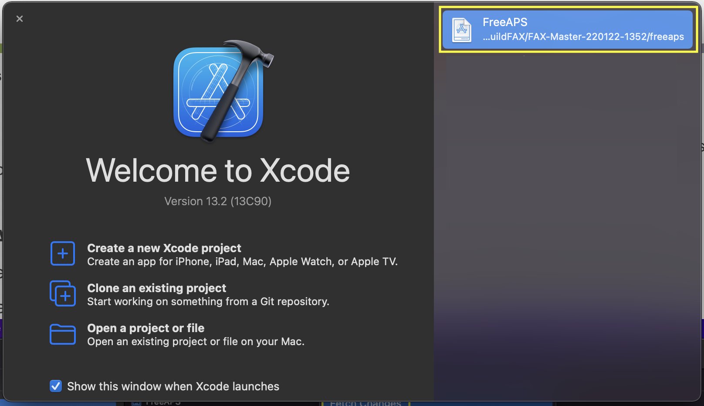
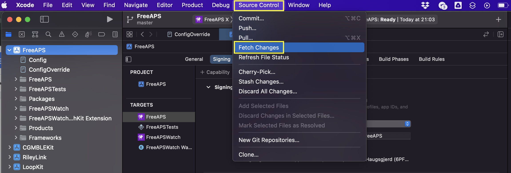
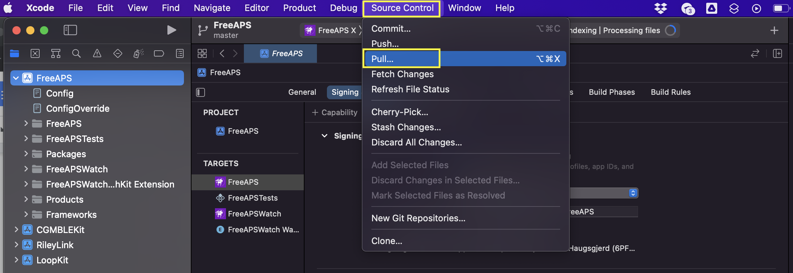
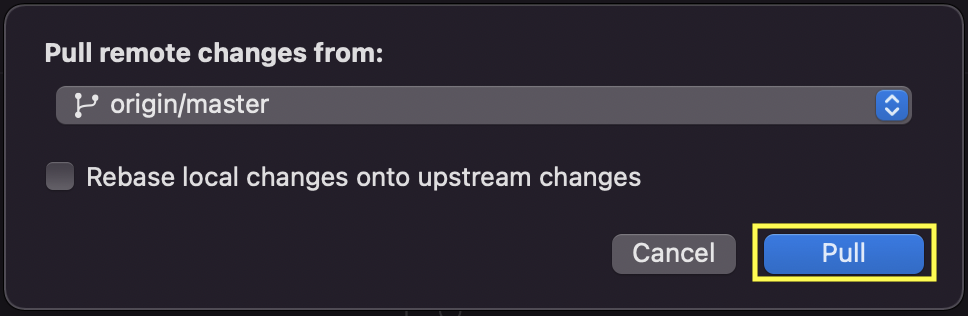
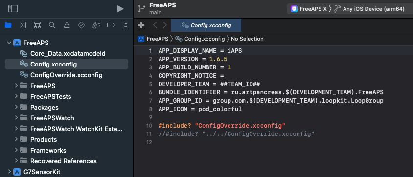

# Build and Update

The iAPS app can be built with two methods:

* [Build iAPS with GitHub](#build-iaps-with-github) using a browser on any computer or tablet
* [Build iAPS with Script](#build-iaps-with-script) using a Mac with Xcode

The iAPS app can be updated to the latest release or to a development branch when you choose.

* [Update iAPS with GitHub](#update-iaps-with-github) using a browser on any computer or tablet
* [Update iAPS with Xcode](#update-iaps-with-xcode) using a Mac with Xcode

## Build iAPS with GitHub

The instructions for using a browser and GitHub to build the iAPS app are found in the iAPS repository.

* [GitHub Build Instructions](https://github.com/Artificial-Pancreas/iAPS/blob/main/fastlane/testflight.md)
* The instructions at the link above are complete and include the details found beneath the LoopDocs links below.

If those instructions are too sparse for you, look at the LoopDocs instructions, which are very verbose. Between the two, you should be able to figure things out:

* [LoopDocs: GitHub Build First-Time](https://loopkit.github.io/loopdocs/gh-actions/gh-first-time/)
* [LoopDocs: GitHub Build Other Apps](https://loopkit.github.io/loopdocs/gh-actions/gh-first-time/)

If you use the LoopDocs instructions, you will need this information to build iAPS (rather than Loop):

* Fork from: [https://github.com/Artificial-Pancreas/iAPS](https://github.com/Artificial-Pancreas/iAPS)
* `Identifier Names` will be: `FreeAPS`, `FreeAPSWatch`, `FreeAPSWatch WatchKit Extension`
* `Identifiers` will be:
    * `ru.artpancreas.TEAMID.FreeAPS`
    * `ru.artpancreas.TEAMID.FreeAPS.watchkitapp`
    * `ru.artpancreas.TEAMID.FreeAPS.watchkitapp.watchkitextension`
* The `App Group` name is the same as for Loop: `group.com.TEAMID.loopkit.LoopGroup`
* You must add this `App Group` to all 3 identifiers
* The `FreeAPS Identifier`, in addition to the `App Group`, must also have: `HealthKit` and `NFC Tag Reading` enabled (which should be automatic)
* In `App Store Connect`, the `Bundle ID` for iAPS will be: `ru.artpancreas.TEAMID.FreeAPS`

## Update iAPS with GitHub

Open your fork at your GitHub username.

* Look to see if your fork is up to date
* If your fork shows that your branch is behind, sync the branch to get the latest updates
* Before building, you can [Verify iAPS Version](#verify-iaps-version)

If you selected a GitHub Personal Access Token (GH_PAT) that never expires, then simply select Actions: 4. Build iAPS and wait about an hour for your updated app to appear in TestFlight.

If you token has expired, create a new one (and set it to never expire) and update the GH_PAT in your iAPS secrets. Then you can build your updated code.


## Build iAPS with Script

A build script is available that will

* Download either the main or dev branch for iAPS
* Create the automatic signing file
* Offer to remove the provisioning profiles from your computer
    * This ensures the build will last a full year
* Provide instructions for how to build the app once Xcode opens
* Opens Xcode with your new download.

To execute the build script, open a terminal on your Mac and then copy and paste the command below into the terminal. Read and follow the directions. 

```
/bin/bash -c "$(curl -fsSL \
  https://raw.githubusercontent.com/loopnlearn/loopbuildscripts/main/Build_iAPS.sh)"
```

The download is placed in your `Downloads` folder in a directory called `Build_iAPS`. The downloaded clone is found in a folder with the branch name, date and time encoded.

This script is similar to one used to build Loop. Extensive instructions are provided on the [LoopDocs: Build Select Script](https://loopkit.github.io/loopdocs/build/step14/#build-select-script) page. If you need additional information, review that section and then return. The script for iAPS must be run stand-alone; it is not part of the Build Select Script.

### Build Errors

Should you encounter any build issues, please have a look at the [LoopDocs Build](https://loopkit.github.io/loopdocs/build/build_errors/) errors page. Not everything on that page is relevant for building iAPS, but many potential issues will likely be covered there. You will also get useful advice about what info to provide if you need to ask for help. When you have identified the error message(s), please use the search tool in LoopDocs to see if your error is mentioned.

If you need it, you are most likely to get help in one of these groups:

* [Discord: iAPS channel](https://discord.gg/ptkk2Y264Z)
* [Facebook group: iAPS](https://www.facebook.com/groups/1351938092206709)
* Facebook groups like “Loop and Learn” and “Looped” may become useful too, but these groups are still mostly focussed on Loop

### xDrip4iOS or Glucose Direct as CGM Source

Please note that LibreTransmitter is provided as part of iAPS, so you are not required to use either xDrip4iOS or Glucose Direct to interact with your compatible Libre sensor using iAPS.

If you want to use xDrip4iOS or Glucose Direct as a CGM source via “shared app group”, you must also build that app from source with the same developer ID used for building iAPS. Scripts are available for these apps as well. All scripts follow the same download and build pattern, and configure automatic signing files for you.

```
/bin/bash -c "$(curl -fsSL \
  https://raw.githubusercontent.com/loopnlearn/loopbuildscripts/main/BuildxDrip4iOS.sh)"
```

```
/bin/bash -c "$(curl -fsSL \
  https://raw.githubusercontent.com/loopnlearn/loopbuildscripts/main/BuildGlucoseDirect.sh)"
```

The download is placed in your `Downloads` folder in a directory called `BuildxDrip4iOS` or `BuildGlucoseDirect` respectively. The downloaded clone is found in a folder with the branch name, date and time encoded.


### Alternative Branch

Sometimes, specific branches are offered for testing. Any desired branch can be cloned using the **Build_iAPS** script. After the final quote of the script command, add a space, hyphen, space and branch_name. An example is shown below; replace branch_name with your desired branch. Note that specific branches like this are not deleted as part of the `Delete Old Downloads` utility discussed in [Maintenance Utilities](#maintenance-utilities).

```
/bin/bash -c "$(curl -fsSL \
  https://raw.githubusercontent.com/loopnlearn/loopbuildscripts/main/Build_iAPS.sh)" - branch_name
```

### Maintenance Utilities

Several maintenance utilities are availble with the Build Select Script which is typically used with Loop. For more information, refer to [Loop and Learn: Build Select Script](https://www.loopandlearn.org/build-select/) documentation.  Issue the command below in your terminal, select Option 3 for Maintenance Utilities. Then choose from these options:

1. Delete Old Downloads
1. Clean Derived Data
1. Xcode Cleanup (The Big One)
1. Return to Menu

```
/bin/bash -c "$(curl -fsSL \
  https://raw.githubusercontent.com/loopnlearn/loopbuildscripts/main/BuildSelectScript.sh)"
```

Once each option completes, you are returned to the top menu, so must select Maintenance Utilities again if desired.

## Update iAPS with Xcode

The recommendation is to use the Xcode Source Control features to update your code.

If you prefer to use the command line interface, skip ahead to [Update iAPS with CLI](#update-iaps-with-cli).

### Update iAPS with Source Control

**Note** Released code is found in the  `main` branch. These figures show the older name of `master` rather than `main`. 

Open Xcode. If your iAPS (FreeAPS) workspace is not already open for you, you will probably find it in the recent projects as shown in the graphic below. You can also pull down the Xcode menu for `File`, select `Open Recent` and find your workspace.

{width="600"}
{align="center"}

Refer to the graphic below:

1. Click Source Control
2. Choose `Fetch changes`

{width="600"}
{align="center"}

Refer to the graphic below:

1. Click Source Control again
2. Select `Pull…`

{width="600"}
{align="center"}

Refer to the graphic below:

1. Select the branch to pull from
2. Click `Pull`

The correct branch should already be selected for you. If you built from `main`, select `main`. If you built from `dev`, select `dev`. (This graphic has the older branch name of `master`.)

{width="500"}
{align="center"}

The last steps are only relevant if you made any changes to the code:

- You may see a pop up asking to stash your changes. In that case, name the stashed changes to something that is meaningful to you.
- Select “Apply Stash After Operation”.
- Click “Stash and Pull”

The iAPS code is now updated. That was easy, wasn't it? If you used the build script that automatically creates your ConfigOverride file, the targets are already signed, and you are ready to build the iAPS app to your phone.

The next section is only for those who prefer to use the command line interface for `git`. Skip ahead to [Verify iAPS Version](#verify-iaps-version).

### Update iAPS with CLI

Use finder to locate the directory where the Build_iAPS script saved the code. The directory is named after the branch with the date and time for the download:

* Released (main) branch: Downloads/Build_iAPS/iAPS_main-[date-time]/iAPS
    * example: ~/Downloads/Build_iAPS/iAPS_main-220122-1352/iAPS
* Development (dev) branch: Downloads/Build_iAPS/iAPS_dev-[date-time]/iAPS
    * example: ~/Downloads/Build_iAPS/iAPS_dev-220108-1827/iAPS

Use finder to open a Terminal window at the iAPS directory by right-clicking on it and select `New Terminal at Folder`. 

Copy each line below and paste into the terminal window one at a line and hit enter for each line:

```
git stash
```

```
git fetch
git pull
```

```
git stash pop
```

If the final `git stash pop` had errors, you will need to repeat any customizations that you had in your prior code - they are no longer compatible with the updated code.

The iAPS code is now updated. To open the workspace in Xcode, type `xed .` in your terminal window.

The targets should be signed and you are ready to build the iAPS app to your phone.

## Verify iAPS Version

Verify the iAPS code was successfully updated by examining the `APP_VERSION` value shown in the Config.xcconfig file. (Refer to the graphic below.) Make sure what is shown in your Xcode display matches the expected version in the iAPS GitHub Releases page.

If you are using the GitHub method, you can view this same file in your fork of the iAPS repository.

{width="600"}
{align="center"}
