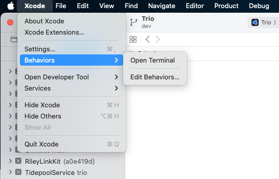

# Build and Update

**Jump to...**\
Build with [GitHub](#build-trio-with-github) | [Mac-Xcode](#build-trio-with-xcode) | [Script](#build-trio-with-script)\
Update with [GitHub](#update-trio-with-github) | [Mac-Xcode](#update-trio-with-xcode) 

## Build Trio with GitHub

The Trio repository contains instructions for building the Trio app using a browser and GitHub. More detailed instructions are also available in LoopDocs.

* [GitHub Build Instructions](https://github.com/nightscout/Trio/blob/dev/fastlane/testflight.md)
* [LoopDocs: GitHub Build First-Time](https://loopkit.github.io/loopdocs/gh-actions/gh-first-time/)
* [LoopDocs: GitHub Build Other Apps](https://loopkit.github.io/loopdocs/gh-actions/gh-other-apps/)

:::{tip} If using the LoopDocs instructions you need the important information below to build Trio intead of Loop
:::

* Fork from: [https://github.com/nightscout/Trio](https://github.com/nightscout/Trio)
* Identifiers for Trio: see [Table of Identifiers](#table-of-identifiers)
* You use the `Loop App Group` for Trio, see [Create the `Loop App Group`](#create-the-loop-app-group)
* Add the `Loop App Group` to these identifiers:
    * Trio
    * Trio Watch
    * Trio WatchKit Extension
* In `App Store Connect`, the `Bundle ID` for Trio will be: `org.nightscout.TEAMID.trio`

### Create the `Loop App Group`

If you already have a `Loop App Group`

* You can skip this step - your existing App Groups are found at this link: [App Group List](https://developer.apple.com/account/resources/identifiers/list/applicationGroup)
* If your `Loop App Group` was created from a Mac with Xcode, you may choose to edit the Description to make the **NAME** match

If you do not have a `Loop App Group`:

* Go to [Register an App Group](https://developer.apple.com/account/resources/identifiers/applicationGroup/add/) on the apple developer site and use the table below to help you create one.

| NAME | XCode version | IDENTIFIER |
|:--|:--|:--|
| Loop App Group | group com TEAMID loopkit LoopGroup| group.com.7PT47XGDN4.loopkit.LoopGroup |

#### Table of Identifiers

* If you built previously using a Mac with Xcode, you may see the XCode version in your **NAME** column - it starts with XC and then the **IDENTIFIER** is appended where the `.` is replaced with a space, the example for Trio is shown in detail
* If you built during early beta testing, you might not have `Trio` at the beginning of each **IDENTIFIER** and the full **NAME** may be slightly different
* Optional: You can click on a given row, edit the Description to match the **NAME** from the table below and it might making building easier in future

| NAME | XCode version | IDENTIFIER |
|:--|:--|:--|
| Trio | XC org nightscout TEAMID trio | org.nightscout.TEAMID.trio |
| Trio LiveActivity | - | org.nightscout.TEAMID.trio.LiveActivity |
| Trio Watch | XC IDENTIFIER | org.nightscout.TEAMID.trio.watchkitapp |
| Trio WatchKit Extension | XC IDENTIFIER | org.nightscout.TEAMID.trio.watchkitapp.watchkitextension |


### One-Time Update to Display Branch And Commit in Testflight

The Trio build can be configured to display the branch name and commit ID as test notes in TestFlight. This is an optional step, which can be especially useful if building the dev branch.

First, you must have already built Trio and have it available on [Apple App Store Connect](https://appstoreconnect.apple.com/apps).

* Tap on the TestFlight tab
* Choose any build to open a new detailed screen for that build
* In the Test Details section, type anything you want

After you have done this one-time step, each successive build will include the branch name and commit automatically.

You can add additional tests notes for any build if you desire.

## Update Trio with GitHub

First makes sure any Apple License agreements have been accepted:

* [Apple Developer Page](https://developer.apple.com/account)

Second, make sure you have a valid Distributor certificate; if not, see [Distribution Certificate](#distribution-certificate):

* [Apple Certificate Page](https://developer.apple.com/account/resources/certificates/list)

Open your fork at `github.com/YOUR-USERNAME/Trio` with your GitHub username instead of `YOUR-USERNAME`

* Look to see if your fork is up to date
* If your fork shows that your branch is behind, sync the branch to get the latest updates

Select Actions: 4. Build Trio and wait about an hour for your updated app to appear in TestFlight.

## Distribution Certificate

When you first build using GitHub, a Distribution Certificate is generated. It typically is valid for one year. You should get an email from Apple when you are within 30 days of that certificate expiring. When it expires, you can no longer build a new app. (Existing apps in TestFlight are not affected, they get the full 90 days.)

The directions to renew your Distribution Certificate are found in [LoopDocs: Renew Certificate](https://loopkit.github.io/loopdocs/gh-actions/gh-update/#renew-certificate).

## Build Trio with Xcode

If you build Trio on your Mac using Xcode, the recommendation is to use the [**TrioBuildSelectScript**](#build-trio-with-script) to build your code.

### Build Trio with Script

The **TrioBuildSelectScript** is similar to the script used to build Loop. If you need it, extensive instructions for that script are provided at these links: [LoopDocs: Build Select Script](https://loopkit.github.io/loopdocs/build/step14/#build-select-script) and [Loop and Learn: Build Select Script](https://www.loopandlearn.org/build-select/).

The **TrioBuildSelectScript** offers the choice to:

1. [Build Trio](#build-trio)
2. [Build Related Apps](#build-related-apps)
3. [Run Maintenance Utilities](#run-maintenance-utilities)
4. Exit Script

To execute the **TrioBuildSelectScript**, open a terminal on your Mac and copy and paste the command below into the terminal. Then, read and follow the directions. 

```
/bin/bash -c "$(curl -fsSL \
  https://raw.githubusercontent.com/loopandlearn/lnl-scripts/main/TrioBuildSelectScript.sh)"
```

#### Build Trio

When you select **Build Trio**, you will be provided with a choice of branches with information to guide your selection and URL for documentation. This script will then download a fresh copy of your selected branch and guide you through building with Xcode on your Mac.

* Once the download completes, the script will also
    * Create the automatic signing file
    * Offer to remove provisioning profiles from your computer to ensure the build will last an entire year
    * Provide instructions for how to build the app once Xcode opens
    * Open Xcode with your new download.
* At this point the main menu is displayed again for you to select another option or to exit the script

The download is placed in your `Downloads` folder in a directory called `BuildTrio`. The downloaded clone is found in a folder with the branch name, date, and time encoded.

#### Build Related Apps

When you select **Build Related Apps**, you will be provided with a choice of apps that users of Trio often use. Once you make your selection, the script will provide similar steps to download and build the selected app.

The choices are:

1. Build Loop Follow
2. Build xDrip4iOS
3. Build Glucose Direct
4. Return to Menu

#### Run Maintenance Utilities

When you select **Run Maintenance Utilities**, you will be provided with a choice of utilties helpful for Mac builders.

The following options are offered:

1. Delete Old Downloads
2. Clean Derived Data
3. Xcode Cleanup (The Big One)
4. Clean Profiles
5. Return to Menu

For more information, refer to [Loop and Learn: Maintenance Utitilites](https://www.loopandlearn.org/build-select/#utilities-disk) documentation.


#### Build Errors

If you encounter any build issues, please look at the [LoopDocs Build](https://loopkit.github.io/loopdocs/build/build_errors/) errors page. Only some things on that page are relevant for building Trio, but many potential issues will likely be covered there. You will also get helpful advice about what info to provide if you need to ask for help. When you have identified the error message(s), you can use the search tool in LoopDocs to see if your error is mentioned.

If you need it, you are most likely to get help in one of these groups:

* [Discord: Trio channel](https://discord.gg/FnwFEFUwXE)
* [Facebook group: Trio](https://www.facebook.com/groups/1351938092206709)
* Facebook groups like [Loop and Learn](https://www.facebook.com/groups/LOOPandLEARN) and [Looped](https://www.facebook.com/groups/1782449781971680) primarily focus on Loop but offer a wide variety of support surrounding all types of DIY Looping.

### xDrip4iOS or Glucose Direct as CGM Source

:::{important}
LibreTransmitter is provided as part of Trio. Neither xDrip4iOS or Glucose Direct are required to interact with your compatible Libre sensor using Trio.
:::

If you want to use xDrip4iOS or Glucose Direct as a CGM source via “shared app group,” you must also build that app from a source with the same developer ID used for building Trio. Scripts are available for these apps as well. All scripts follow the same download and build pattern and configure automatic signing files for you.

The download is placed in your `Downloads` folder in a directory called `BuildxDrip4iOS` or `BuildGlucoseDirect`, respectively. The downloaded clone is found in a folder with the branch name, date, and time encoded.

These can be accessed using the [**TrioBuildSelectScript**](#build-trio-with-script) menu options mentioned above. Or you can run each script individually.

#### xDrip4iOS

```
/bin/bash -c "$(curl -fsSL \
  https://raw.githubusercontent.com/loopandlearn/lnl-scripts/main/BuildxDrip4iOS.sh)"
```

#### Glucose Direct

```
/bin/bash -c "$(curl -fsSL \
  https://raw.githubusercontent.com/loopandlearn/lnl-scripts/main/BuildGlucoseDirect.sh)"
```

### Alternative Branch

Sometimes, specific branches are offered for testing. Any desired branch can be cloned using the **Build Trio** script. After the final quote of the script command, add a space, hyphen, space, and branch_name. An example is shown below: replace `branch_name` with your desired branch. Note that specific branches like this are not deleted as part of the `Delete Old Downloads` utility discussed in [Maintenance Utilities](#maintenance-utilities).

```
/bin/bash -c "$(curl -fsSL \
  https://raw.githubusercontent.com/loopandlearn/lnl-scripts/main/BuildTrio.sh)" - branch_name
```

## Update Trio with Xcode

Because Trio uses submodules, there are actions you need to perform when updating that are easiest using command line interface (CLI) in a terminal opened in the same folder as the Trio workspace.

If you prefer, you can use the [Build Script](#build-trio-with-script) to download and build a fresh copy.

This section tells you how to update the version you already have on your computer.

Open Xcode. If your Trio workspace is not already open, you can usually find it in the recent projects, as shown in the graphic below. You can also pull down the Xcode menu for `File`, select `Open Recent`, and find your workspace.


### Open Terminal

Once you have Xcode open with your previous build of Trio, the first thing to do is open a terminal:

1. Use Xcode, Behaviors, Open Terminal if you configured [Xcode Behaviors](#xcode-behaviors)
2. Locate the Trio folder using [Where is my Download](#where-is-my-download)

In the terminal, you will copy and paste each of the lines below. The `stash` lines are optional - use them if you have customizations you want to keep.

Optional - use this if you have modifications you want to keep.

```
git stash
```

Required - this updates your workspace and all your submodules.

```
git fetch
git pull --recurse
```

Optional - if you saved modifications, this will restore them.

```
git stash pop
```

If you made customizations in any of the submodules, the `recurse` command might fail. Follow the directions in [Fix Submodule Errors](#fix-submodule-errors).

If there were no errors, you are ready to build.

### Fix Submodule Errors

If a submodule gave an error in response to the `git pull --recurse` command:

* Read which submodule failed to `checkout`
* Change directory to that module: `cd modulename`
* Stash your changes: `git stash`
* Return to the Trio folder and try again: `cd ..; git submodule update`

If another submodule fails to checkout, repeat the steps for that `modulename`.

If the modification is one you want to keep, you must restore it:
 
* Change directory to that module: `cd modulename`
* Restore your changes: `git stash pop`
* Return to the Trio folder: `cd ..`

The Trio code is now updated.

If Xcode is not open, you can open it by typing `xed .` in the Trio folder of your terminal window.

You can now build the updated Trio app on your phone.

## Xcode Behaviors

You can add Behaviors to your version of Xcode. These custom Behaviors only need to be added once.

You will create a shell script and add it to Xcode.

* `Open Terminal` will open a terminal in the workspace or project folder currently in use by Xcode

### Prepare the Shell Script

Open a new terminal:

Step 1: Create a folder to store your shell scripts by copying and pasting the next line (only do this one time or you will get an error message):

```
mkdir ~/scripts
```

Step 2: Copy and paste this command into your terminal to prepare the `Open Terminal` shell script:

```
open -a TextEdit ~/scripts/open_terminal.sh
```

Copy and paste the following lines into the editor and then save and close the file.

```
#!/bin/bash
open -a Terminal "`pwd`"
```

Step 3: Make the shell script executable; Copy and paste this command into your terminal:

```
chmod +x ~/scripts/*.sh
```

### Add Behaviors to Xcode

Open Xcode
* Under Xcode menu item, select Behaviors, Edit Behaviors
* At the bottom of the window, click the `+` sign
    * Under the Custom section, you should see the New Behavior row, enter `Open Terminal`
    * On the right side at the bottom, click on Run, then `Choose Script` and select `~/scripts/open_terminal.sh`

The `Open Terminal` is now ready for you to use, as shown in this graphic.



Return to [Open Terminal](#open-terminal).

## Where is my Download

If you have Xcode open, you can right-click on any file and select `Show in Finder`. Then at the bottom of the Finder window, right click on the Trio folder and select `New Terminal at Folder`.

If you do not have Xcode open, you can use finder to locate the directory where the BuildTrio script saved the code. The directory is named after the branch with the date and time for the download:

* Released (main) branch: Downloads/BuildTrio/Trio_main-[date-time]/Trio
    * Example: ~/Downloads/BuildTrio/Trio_main-220122-1352/Trio
* Development (dev) branch: Downloads/BuildTrio/Trio_dev-[date-time]/Trio
    * Example: ~/Downloads/BuildTrio/Trio_dev-220108-1827/Trio

Use finder to open a Terminal window at the Trio directory by right-clicking on it and selecting `New Terminal at Folder`. 

To open Xcode, type `xed .` in the Terminal.

Return to [Open Terminal](#open-terminal).

