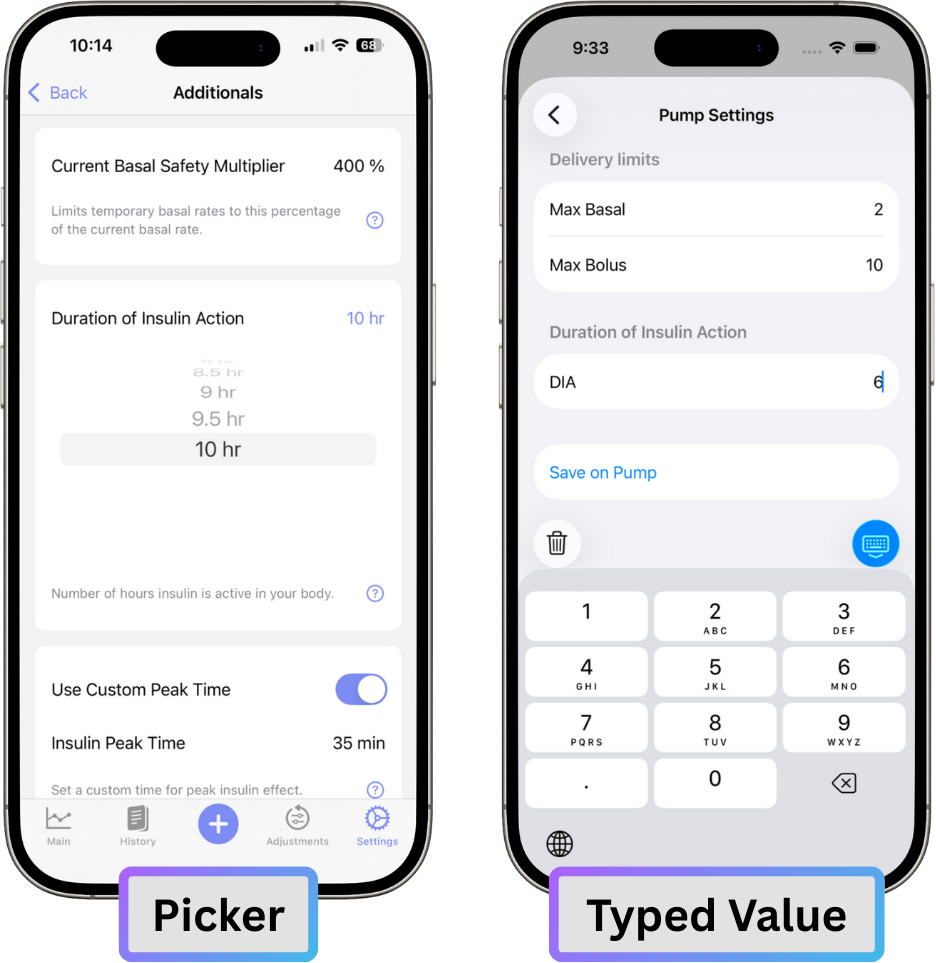
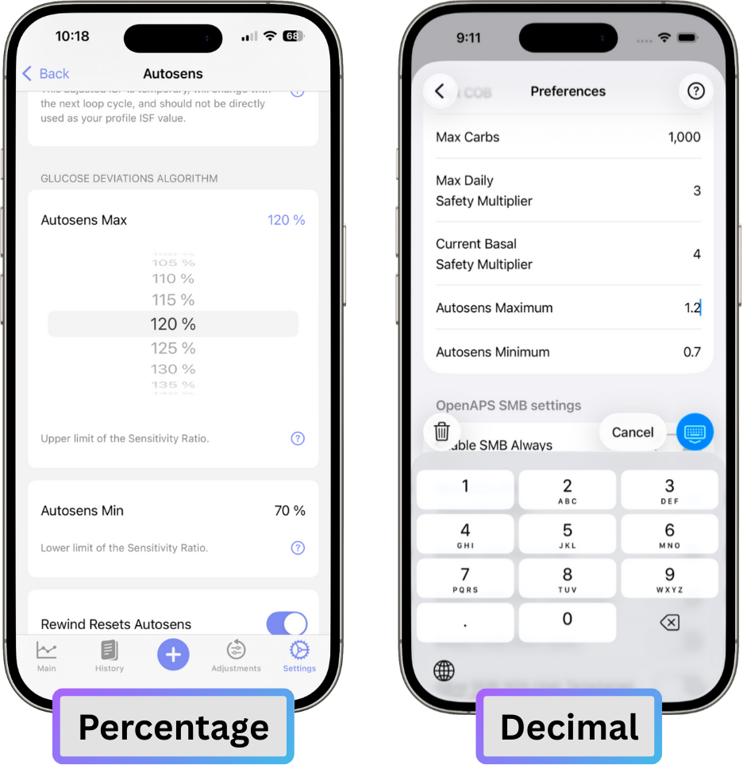

# Coming from Trio 0.2.x

!!! danger "Please Read This Page **BEFORE** Updating"
    Do not update without reading this documentation or you risk finding many unexpected changes that can easily be resolved with prior planning.

<!--    
!!! tip "Browser Build Users"
    Automatic builds for Browser Builders are disabled when updating from 0.2 to 0.7.
    You will have to...
    
    - manually update your fork of the Trio Main branch
    - manually run Action 4: Build in the workflow
-->
    
## What to Expect After Install

- **Brand New Interface**  
    A completely redesigned UI across the app, including the Watch app — clean, modern, and easier to use. Learn more in the [User Interface Walk-Through](../../usage/interface.md).
- **All-New Onboarding**  
    Step-by-step setup for new and returning users with smart defaults and safety checks. ***All users* will need to complete the new Onboarding Wizard after upgrading**. Learn more in the [New User Setup Guide](../new-user-setup.md).
- **Rewritten Backend & Data Storage**  
    Entire app logic and data storage rewritten for speed, stability, and future flexibility.
- **Remote Commands & iOS Shortcuts**  
    Trigger actions like carb entry, bolus, overrides or temporary targets [remotely](../settings/features/remote-control.md) or through [shortcut automation](../settings/features/shortcuts.md).
- **Smarter Settings**  
    Helpful hints, guidance sheets, and a built-in search function — just like iOS Settings. Information on the updated Trio Settings can be found [here](../settings/index.md).
- **New Bolus Calculator**  
    More accurate and simple dosing with clearer breakdowns and improved safety logic. Learn more about the [Bolus Calculator](../../usage/features/bolus-calculator.md).
- **Reworked Statistics**  
    All in-app statistics and graphs have been overhauled and extended. Learn more about the [New Statistics Screen](../../usage/features/statistics.md).
- **Improved Live Activity Widget**  
    Real-time loop data with optional chart — configurable and tailored to your preferences — visible on lockscreen, Watch, and CarPlay. Learn more about the [Live Activity Widget](../settings/notifications/live-activity.md).
- **Live Data on Watch**  
    Highly customizable “contact widgets” for glucose, IOB, COB, and more, always visible. Learn more about the [Contacts Configuration on Apple Watch](../settings/devices/smart-watch.md#contacts-configuration).
- **All-New Integrations**  
    Nightscout, Tidepool, and Apple Health connections have been rebuilt from scratch — faster and more stable. More on integrations [here](../settings/services/index.md).
- **Safety Improvements**  
    Dynamic ISF guarding (7-day required data), safer edge-case behavior, and improved support for high-insulin-resistance setups.
- **Updated Language & Translations**  
    Clear, friendly, and easy-to-understand. Fully localized with ongoing help from our Crowdin contributors ([translators still welcome](https://crowdin.triodocs.org)).
- **Now Requires Loop Follow v4.0 or Later**  
    More info at [LoopFollowDocs](https://loopfollowdocs.org/remote/remote-control-trio/)
- **Autotune Removed**  
    Autotune has not performed well with the addition of Dynamic ISF and many users using multiple ISF and CR in Therapy settings. For this reason, we have removed it until an improved Autotune-like feature is built.

### What *Will* Transfer from Trio 0.2 to Trio 0.5 (or higher)?

- Current pump and CGM sessions (but always a good idea to have a backup pump ready whenever updating, just in case)
- 24 hr treatment history
- Core therapy settings (glucose targets, basal rates, ISF, CR)

### What *Will Not* Transfer from Trio 0.2 to Trio 0.5 (or higher)?

- Algorithm settings, Dynamic ISF, and some integrations (like Nightscout) will reset.
- Treatment history older then 24 hours will not transfer
- Historical data used for Dynamic ISF and Statistics
- Override, Temp Target, and Meal Presets

!!! important "Upgrading is a one-way street"
    Once you upgrade to v0.5.0 (or higher), going back to v0.2.x is not supported.

- - -

## What to Expect in Your First 3 Hours

Here are some things to keep in mind after upgrading from Trio 0.2 to Trio 0.5 (or higher) in the first 3 hours:

- **Dynamic ISF & Autosens**  
    Dynamic ISF is disabled for the first **7 days**. *You may need to enter carbs and bolus during this time if you aren't already doing so.* Autosens will be used instead (but there's a long standing issue with autosens where it will likely be stuck at 1 when there are carb entries or SMBs.)
- **Onboarding Wizard**  
    Take this time to go through the Onboarding Wizard. Reference the [New User Setup Guide](../new-user-setup.md) or ask questions on [Facebook](https://facebook.triodocs.org) or [Discord](https://discord.triodocs.org) if you have any questions.
- **Test Settings**  
    This is a great time to test your settings so you can start fresh on solid footing.
- **New User Interface**  
    Use this time to learn the [New User Interface](../../usage/interface.md).

!!! danger "Do not use a pump or cgm simulator"
    - Doing so will result in false data being stored and you will have to delete the app with all the data and reinstall before you can use it on a live pump.
    - This will also reset your 7-day waiting period for Dynamic ISF.
    - [More information on simulator use](../settings/devices/pump.md/?h=simulator#pump-simulator)

- - -

## What to Expect After 24 Hours

A full day on Trio 0.5 (or higher)! Congratulations! Here's what to look for:

- **Autosens**  
    Autosens now has enough data to make adjustments
- **Review & Test Settings**  
    This is a good time to review your last 24 hours of results to see if your core settings performed as expected. If you had unexpected challenges with your settings, look at how to test them over the next 7 days

    - [Basal Testing](../../usage/concepts/basal-rates.md)
    - [ISF Testing](../../usage/concepts/isf.md)
    - [Carb Ratio Testing](../../usage/concepts/carb-ratios.md)

- **Review Dynamic ISF Documentation**  
    Review the documentation on [Using Dynamic ISF](../../usage/features/dynamic-isf.md) in preparation for [Day 7](#what-to-expect-after-7-days).

- - -

## What to Expect After 7 Days

You've completed a week on Trio 0.5 (or higher)! Here's what you should see:

- **Dynamic ISF**  
    Dynamic ISF now has enough data. You now have the option to enable it if you would like to.

!!! warning "Can't Enable Dynamic ISF?"
    If Dynamic ISF does not give you the option to enable, you may have experienced one or more of the following:

    - You were not in closed loop for the full 7 days.
        - *Trio needs 7 days of closed loop to safely enable Dynamic ISF*
    - You had significant loss of connection with your CGM and/or pump. 
        - *Check your last week of Looping Statistics in the Stats tab in the Trio app. You need both <b>7 days</b> and an <b>85% success rate</b> to enable Dynamic ISF*. 
    - You enabled a significant number of manual Temp Basals with long run times.
        - *When a manual Temp Basal is set, Trio is unable to complete a loop cycle for the duration of the temp basal. This will cause a reduction in your success rate. If you do not have <b>85% success rate</b> for <b>7 days</b>, you cannot enable Dynamic ISF.*

- **Dynamic CR**
    Dynamic CR has been removed due to no known scientific validity to CR changing with an increase or decrease in glucose.

- - -

## Changes from Trio 0.2 Settings to Trio 0.5 (or higher) Settings

When you update from Trio 0.2, some of your settings might look different even if they have the same or similar names. That’s because we changed some of the numbers from decimals to percentages to make them easier to understand.

!!! example
    In Trio 0.2 you might set "Autosens Maximum" to 1.2. In Trio 0.5 (or higher), we show "Autosens Max" as 120%, which means the same thing, but is easier to understand.

Some setting names have also changed. We did this to make things less confusing. To help you out, we added definitions right in the app. Just tap the question mark icon next to any setting to see what it means. Healthcare Professionals and users can also find those settings and explanations [in this section of the docs](../settings/index.md).

The charts below will help you see which setting names or formats have changed. The settings with changes are in bold.

!!! tip
    - To convert a value from a decimal to a percentage, multiply it by 100.  
    - To convert from a percentage to a decimal, divide by 100.

### [Therapy Settings](../settings/therapy/index.md)

| Trio 0.5+ Name | *Entry Type* | *Format   (example)* | Trio 0.2 Name | *Entry Type* | *Format   (example)* | Change |
|:---:|:---:|:---:|:---:|:---:|:---:|:---:|
| [**Glucose Targets**](../settings/therapy/glucose-targets.md#how-to-enter-your-glucose-targets-into-trio) | *schedule* | *decimal   (100 mg/dL / 5.5 mmol/L)* | **Target Glucose** | *schedule* | *decimal   (100 / 5.5)* | **Name** |
| [Basal Rates](../settings/therapy/basal-rates.md#how-to-enter-your-basal-profiles-into-trio) | *schedule* | *decimal   (1.0 U/hr)* | Basal Profile | *schedule* | *decimal   (1.0 U/hr)* | -- |
| [Carb Ratios](../settings/therapy/carb-ratios.md#how-to-enter-your-carb-ratios-cr-into-trio) | *schedule* | *decimal   (10 g/U)* | Carb Ratios | *schedule* | *decimal   (10 g/U)* | -- |
| [Insulin Sensitivities](../settings/therapy/isf.md#how-to-enter-your-isf-into-trio) | *schedule* | *decimal   (54 mg/dL/U / 3.0 mmol/L/U)* | Insulin Sensitivities | *schedule* | *decimal   (54 / 3.0)* | -- |
| [**Maximum Insulin on Board (IOB)**](../settings/therapy/units-limits.md#max-iob) | ***picker*** | *decimal   (2 U)* | **Max IOB** | ***typed value*** | *decimal   (2)* | **Name,   *Entry Type*** |
| [**Maximum Bolus**](../settings/therapy/units-limits.md#max-bolus) | ***picker*** | *decimal   (10 U)* | **Max Bolus** | ***typed value*** | *decimal   (10)* | **Name,   *Entry Type*** |
| [**Maximum Basal Rate**](../settings/therapy/units-limits.md#max-basal) | ***picker*** | *decimal   (2 U/hr)* | **Max Basal** | ***typed value*** | *decimal   (2)* | **Name,   *Entry Type*** |
| [**Maximum Carbs on Board (COB)**](../settings/therapy/units-limits.md#max-cob) | ***picker*** | *decimal   (120 g)* | **Max COB** | ***typed value*** | *decimal   (120)* | **Name,   *Entry Type*** |
| [**Minimum Safety Threshold**](../settings/therapy/units-limits.md#minimum-safety-threshold) | ***picker*** | *decimal   (60 mg/dL / 3.3 mmol/L)* | **Threshold Settings** | ***typed value*** | *decimal   (60)* | **Name,   *Entry Type,   mmol/L entry*** |

### [Algorithm Settings](../settings/algorithm/index.md)

#### [Autosens](../settings/algorithm/autosens.md)

| Trio 0.5+ Name | *Entry Type* | *Format   (example)* | Trio 0.2 Name | *Entry Type* | *Format   (example)* | Change |
|:---:|:---:|:---:|:---:|:---:|:---:|:---:|
| [Sensitivity Ratio](../settings/algorithm/autosens.md#sensitivity-ratio) | *N/A* | ***percentage   (105%)***| Autosens Ratio | *N/A* | ***decimal   (1.05)*** | ***Format*** |
| [Calculated Sensitivity](../settings/algorithm/autosens.md#calculated-sensitivity) | *N/A* | *decimal   (45 mg/dL/U / 2.5 mmol/L/U)* | Calculated Sensitivity | *N/A* | *decimal   (45 mg/dL/U / 2.5 mmol/L/U)* | -- |
| [**Autosens Max**](../settings/algorithm/autosens.md#autosens-max) | ***picker*** | ***percentage   (120%)*** | **Autosens Maximum** | ***typed value*** | ***decimal   (1.2)*** | **Name,   *Entry Type,   Format*** |
| [**Autosens Min**](../settings/algorithm/autosens.md#autosens-min) | ***picker*** | ***percentage   (70%)*** | **Autosens Minimum** | ***typed value*** | ***decimal   (0.7)*** | **Name,   *Entry Type,   Format*** |
| [Rewind Resets Autosens](../settings/algorithm/autosens.md#rewind-resets-autosens) | *toggle* | *(On/Off)* | Rewind Resets Autosens | *toggle* | *(On/Off)* | -- |

#### [SMB (Super Micro Bolus)](../settings/algorithm/smb-settings.md)

| Trio 0.5+ Name | *Entry Type* | *Format   (example)* | Trio 0.2 Name | *Entry Type* | *Format   (example)* | Change |
|:---:|:---:|:---:|:---:|:---:|:---:|:---:|
| [Enable SMB Always](../settings/algorithm/smb-settings.md#enable-smb-always) | *toggle* | *(On/Off)* | Enable SMB Always | *toggle* | *(On/Off)* | ***Now disables unused SMB settings*** |
| [Enable SMB With COB](../settings/algorithm/smb-settings.md#enable-smb-with-cob) | *toggle* | *(On/Off)* | Enable SMB With COB | *toggle* | *(On/Off)* | ***Now only appears if Enable SMB Always is OFF*** |
| [Enable SMB with Temptarget](../settings/algorithm/smb-settings.md#enable-smb-with-temptarget) | *toggle* | *(On/Off)* | Enable SMB with Temptarget | *toggle* | *(On/Off)* | ***Now only appears if Enable SMB Always is OFF*** |
| [Enable SMB After Carbs](../settings/algorithm/smb-settings.md#enable-smb-after-carbs) | *toggle* | *(On/Off)* | Enable SMB After Carbs | *toggle* | *(On/Off)* | ***Now only appears if Enable SMB Always is OFF*** |
| **[Enable SMB With High Glucose](../settings/algorithm/smb-settings.md#enable-smb-with-high-glucose)** | *toggle* | *(On/Off)* | **Enable SMB With High BG** | *toggle* | *(On/Off)* | **Name   *Now only appears if Enable SMB Always is OFF*** |
| **[High Glucose Target](../settings/algorithm/smb-settings.md#high-glucose-target)** | **picker** | *decimal   (110 mg/dL / 6.1 mmol/L)* | **... When Blood Glucose is Over (mg/dl)** | **typed value** | *decimal   (110)* | **Name   Entry Type   Format   *Now only appears when Enable SMB With High Glucose is ON,   mmol/L entry*** |
| [Allow SMB with High Temptarget](../settings/algorithm/smb-settings.md#allow-smb-with-high-temptarget) | *toggle* | *(On/Off)* | Allow SMB With High Temptarget | *toggle* | *(On/Off)* | -- |
| [Enable UAM](../settings/algorithm/smb-settings.md#enable-uam) | *toggle* | *(On/Off)* | Enable UAM | *toggle* | *(On/Off)* | -- |
| [Max SMB Basal Minutes](../settings/algorithm/smb-settings.md#max-smb-basal-minutes) | ***picker*** | *decimal   (30 min)* | Max SMB Basal Minutes | ***typed value*** | *decimal   (30)* | ***Entry Type*** |
| [**Max UAM Basal Minutes**](../settings/algorithm/smb-settings.md#max-uam-basal-minutes) | ***picker*** | *decimal   (30 min)* | **Max UAM SMB Basal Minutes** | ***typed value*** | *decimal   (30)* | **Name,   *Entry Type*** |
| [**Max Allowed Glucose Rise for SMB**](../settings/algorithm/smb-settings.md#max-allowed-glucose-rise-for-smb) | ***picker*** | ***percentage   (20%)*** | **Max Delta-BG Threshold SMB** | ***typed value*** | ***decimal   (0.2)*** | **Name,   *Entry Type,   Format*** |

#### [Target Behavior](../settings/algorithm/target-behavior.md)

| Trio 0.5+ Name | *Entry Type* | *Format   (example)* | Trio 0.2 Name | *Entry Type* | *Format   (example)* | Change |
|:---:|:---:|:---:|:---:|:---:|:---:|:---:|
| [**High Temp Target Raises Sensitivity**](../settings/algorithm/target-behavior.md#high-temp-target-raises-sensitivity) | *toggle* | *(On/Off)* | **High Temptarget Raises Sensitivity/Exercise Mode** | *toggle* | *(On/Off)* | **Name** |
| [**Low Temp Target Lowers Sensitivity**](../settings/algorithm/target-behavior.md#low-temp-target-lowers-sensitivity) | *toggle* | *(On/Off)* | **Low Temptarget Lowers Sensitivity** | *toggle* | *(On/Off)* | **Name** |
| [Sensitivity Raises Target](../settings/algorithm/target-behavior.md#sensitivity-raises-target) | *toggle* | *(On/Off)* | Sensitivity Raises Target | *toggle* | *(On/Off)* | -- |
| [Resistance Lowers Target](../settings/algorithm/target-behavior.md#resistance-lowers-target) | *toggle* | *(On/Off)* | Resistance Lowers Target | *toggle* | *(On/Off)* | -- |
| [Half Basal Exercise Target](../settings/algorithm/target-behavior.md#half-basal-exercise-target) | ***picker*** | *decimal   (160 mg/dL / 8.9 mmol/L)* | Half Basal Exercise Target | ***typed value*** | *decimal   (160)* | ***Entry Type, mmol/L entry*** |

#### [Additionals](../settings/algorithm/additionals.md)

!!! danger "Warning"
    The settings in this section typically do not require any modifications.  
    Do not alter them without a solid understanding of what you are changing and the full impact it will have on the algorithm.

| Trio 0.5+ Name | *Entry Type* | *Format   (example)* | Trio 0.2 Name | *Entry Type* | *Format   (example)* | Change |
|:---:|:---:|:---:|:---:|:---:|:---:|:---:|
| [Max Daily Safety Multiplier](../settings/algorithm/additionals.md#max-daily-safety-multiplier) | ***picker*** | ***percentage   (300%)*** | Max Daily Safety Multiplier | ***typed value*** | ***decimal   (3)*** | ***Entry Type,   Format*** |
| [Current Basal Safety Multiplier](../settings/algorithm/additionals.md#current-basal-safety-multiplier) | ***picker*** | ***percentage   (400%)*** | Current Basal Safety Multiplier | ***typed value*** | ***decimal   (4)*** | ***Entry Type,   Format*** |
| [Duration of Insulin Action](../settings/algorithm/additionals.md#duration-of-insulin-action) | ***picker*** | *decimal   (10 hr)* | Duration of Insulin Action | ***typed value*** | *decimal   (10)* | ***Entry Type*** |
| [Use Custom Peak Time](../settings/algorithm/additionals.md#use-custom-peak-time) | *toggle* | *(On/Off)* | Use Custom Peak Time | *toggle* | *(On/Off)* | -- |
| [Insulin Peak Time](../settings/algorithm/additionals.md#insulin-peak-time) | ***picker*** | *decimal   (65 min)* | Insulin Peak Time | ***typed value*** | *decimal   (65) | ***Entry Type*** |
| [Skip Neutral Temps](../settings/algorithm/additionals.md#skip-neutral-temps) | *toggle* | *(On/Off)* | Skip Neutral Temps | *toggle* | *(On/Off)* | -- |
| [Unsuspend If No Temp](../settings/algorithm/additionals.md#unsuspend-if-no-temp) | *toggle* | *(On/Off)* | Unsuspend If No Temp | *toggle* | *(On/Off)* | -- |
| [**SMB Delivery Ratio**](../settings/algorithm/additionals.md#smb-delivery-ratio) | ***picker*** | ***percentage   (50%)*** | **SMB DeliveryRatio** | ***typed value*** | ***decimal   (0.5)*** | **Name,   *Entry Type,   Format*** |
| [SMB Interval](../settings/algorithm/additionals.md#smb-interval) | ***picker*** | *decimal   (3 min)* | SMB Interval | ***typed value*** | *decimal   (3)* | ***Entry Type*** |
| [**Min 5m Carb Impact**](../settings/algorithm/additionals.md#min-5m-carb-impact) | ***picker*** | *decimal   (8 mg/dL)* | **Min 5m Carbimpact** | ***typed value*** | *decimal   (8)* | **Name,   *Entry Type*** |
| [**Remaining Carbs Percentage**](../settings/algorithm/additionals.md#remaining-carbs-percentage) | ***picker*** | ***percentage   (100%)*** | **Remaining Carbs Fraction** | ***typed value*** | ***decimal   (1)*** | **Name,   *Entry Type,   Format*** |
| [Remaining Carbs Cap](../settings/algorithm/additionals.md#remaining-carbs-cap) | ***picker*** | *decimal   (90 g)* | Remaining Carbs Cap | ***typed value*** | *decimal   (90)* | ***Entry Type*** |
| [**Noisy CGM Target Increase**](../settings/algorithm/additionals.md#noisy-cgm-target-increase) | ***picker*** | ***percentage   (130%)*** | **Noisy CGM Target Multiplier** | ***typed value*** | ***decimal   (1.3)*** | **Name,   *Entry Type,   Format*** |

- - -

## What are the reasons for these changes?

### Entry Type: Picker vs Typed Entry

{width="500"}
{align="center"}

- A typed entry can result in mistyping a value and could result in unintended consequences within the algorithm.
- A picker ensures the setting is within the guardrails of the algorithm. Both Trio 0.2 and 0.5 (or higher) have guardrails, however when typed in 0.2, those values were ignored and the closest valid number was used. 
    !!! example
        If you set your DIA to 2, Trio 0.2 would use a DIA of 5 without notifying you.

### Format: Percentage vs Decimal

{width="500"}
{align="center"}

- Percentages are easier to comprehend than decimals when trying to make decisions on your settings adjustments.

### Name Changes

- Some settings names in Trio 0.2 were the labels used in the Trio code and were really only clear to developers. This often times made those settings difficult to understand.
- Certain settings names in Trio 0.2 were unclear. We changed those names to make them easier to understand.
- In addition to updating names to be easier to understand, we also added clearer settings explanations in the app for every setting.

