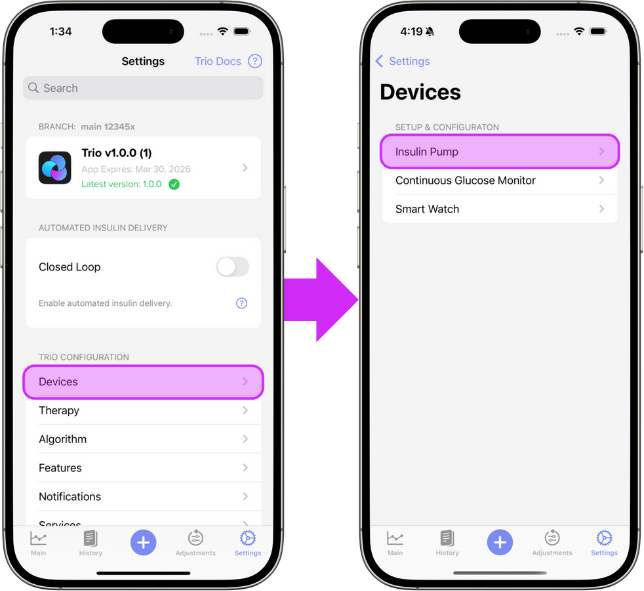

# New User Setup Guide

{ width="500px"  }
{align=center}

Welcome to the New User Setup Guide and congratulations on a successful Trio build! This guide walks you through how to set up your Trio app once you have installed it on your phone.  

If you still need to install the app, head to the Build Instructions for [Mac](../install/build/mac/overview.md) or [Browser](../install/build/browser/browser-build-overview.md) and come back here when you are ready to start the setup process!

Trio has an Onboarding Wizard that walks you through these steps when you first start the app. Each step contains a tab for During Onboarding and After Onboarding. The "During Onboarding" tab will provide additional information for that step of the Onboarding Wizard. The "After Onboarding" tab will show you where to edit the relevant settings after onboarding is complete as well as the additional information on those settings.

If you've completed the Onboarding Wizard and need guidance on what to do next, jump to [Step 7: Connect Your Devices](#step-7-connect-your-devices)

Use this documentation as your home base to refer back to as needed.

- - -

***Jump to:***

[**Step 1:** Prepare Trio](#step-1-prepare-trio)

[**Step 6:** Bluetooth](#step-6-bluetooth)

[**Step 2:** Therapy Settings](#step-2-therapy-settings)

[**Step 7:** Connect Your Devices](#step-7-connect-your-devices)

[**Step 3:** Delivery Limits](#step-3-delivery-limits)

[**Step 8:** Enable Closed Loop](#step-8-enable-closed-loop)

[**Step 4:** Algorithm Settings](#step-4-algorithm-settings)

[**Step 9:** Change App Icon (Optional)](#step-9-change-app-icon-optional)

[**Step 5:** Notifications](#step-5-notifications)

- - -
 
## **Step 1:** Prepare Trio

In this step, you'll configure diagnostics sharing, optionally sync with Nightscout, and enter other essential setup information.

=== "During Onboarding"
    ### Diagnostics

    By default, Trio collects crash reports and other anonymized data related to errors, exceptions, and overall app performance. Sharing this data helps developers maintain and improve the app. This is completely anonymous and optional.

    !!! tip
    
        If you select `Enable Sharing`, you must also read and accept the Privacy Policy in the Onboarding Wizard before you are able to proceed.

    ### Nightscout

    Nightscout is a cloud-based platform that allows you to store your diabetes data.  
    Nightscout is not required and can be added at a later time under [Services](settings/services/nightscout.md) in the Settings menu of the app.
    
    ### Units & Pump
    
    In the Onboarding Wizard, you will select your [Glucose Units](settings/therapy/units_limits.md#glucose-units) and Pump Model, but you will not pair your pump yet. You will pair your pump and CGM after completing the Onboarding process (See [Step 7](#step-7-connect-your-devices)).
        
=== "After Onboarding"
    ### Edit Diagnostics
    
    To enable or disable sharing after you've completed onboarding, open the settings menu, then Features, then App Diagnostics. Here you will find the ability to adjust sharing as well as the Privacy Policy.
    
    ### Edit Nightscout
    
    To connect or edit your Nightscout credentials after you've completed onboarding, follow the guidance [here](settings/services/nightscout.md).
    
    ### Edit Glucose Units
    
    { width="400px" }  
    [Learn more about setting your Glucose Units](settings/therapy/units_limits.md#glucose-units)
    {align=center}
    
    ### Edit Insulin Pump
    
    { width="400px" }  
    [Learn how to connect or change your insulin pump](settings/devices/pump.md)
    {align=center}  
    

- - -

## **Step 2:** Therapy Settings

The next step is to enter your Therapy Settings. These include:

- **Target Glucose**: Trio's dosing will aim for this glucose when calculating insulin dosage
- **Basal Rates**: Used as a baseline for increasing or decreasing insulin needs
- **Carb Ratios**: How many grams of carbohydrate are countered by 1 unit of insulin
- **Insulin Sensitivities**: How much 1 unit of insulin will lower your blood glucose

=== "During Onboarding"
    
    For more information about each therapy setting in this step, use the links below:
    
    - [Glucose Targets](settings/therapy/target_glucose.md)  
    - [Basal Rates](settings/therapy/basal_rates.md)  
    - [Carb Ratios (CR)](settings/therapy/carb_ratios.md)  
    - [Insulin Sensitivities (ISF)](settings/therapy/isf.md)  
    
=== "After Onboarding"
    
    Here is how to locate these settings after onboarding:  
    { width="400px"  }
    {align=center}
    
    Below you'll find a step by step guide to edit each of these settings:
    
    - [Glucose Targets](settings/therapy/target_glucose.md#how-to-enter-your-target-glucose-into-trio)  
    - [Basal Rates](settings/therapy/basal_rates.md#how-to-enter-your-basal-profiles-into-trio)  
    - [Carb Ratios (CR)](settings/therapy/carb_ratios.md#how-to-enter-your-carb-ratios-cr-into-trio)  
    - [Insulin Sensitivities (ISF)](settings/therapy/isf.md#how-to-enter-your-isf-into-trio)  

- - -

## **Step 3:** Delivery Limits

In this step you will set the boundaries for insulin delivery and carb entries to help Trio keep your insulin dosing safe, yet effective.

=== "During Onboarding"

    Below you'll find more information on each of the settings in order of appearance in the Onboarding Wizard:
    
    - [Max IOB](settings/therapy/units_limits.md#max-iob)  
    - [Max Bolus](settings/therapy/units_limits.md#max-bolus)  
    - [Max Basal Rate](settings/therapy/units_limits.md#max-basal)  
    - [Max COB](settings/therapy/units_limits.md#max-cob)  
    - [Minimum Safety Threshold](settings/therapy/units_limits.md#maximum-safety-threshold)
    
=== "After Onboarding"
    
    Here is how to locate these settings after onboarding:  
    { width="400px"  }
    {align=center}
    
    Below you'll find more information on each of these settings:
    
    - [Max IOB](settings/therapy/units_limits.md#max-iob)  
    - [Max Bolus](settings/therapy/units_limits.md#max-bolus)  
    - [Max Basal Rate](settings/therapy/units_limits.md#max-basal)  
    - [Max COB](settings/therapy/units_limits.md#max-cob)  
    - [Minimum Safety Threshold](settings/therapy/units_limits.md#maximum-safety-threshold)

- - -

## **Step 4:** Algorithm Settings

Trio includes several algorithm settings that allow you to customize the Oref algorithm behavior to suit your specific needs.

To configure the algorithm, you'll define the settings for Autosens, Super Micro Bolus (SMB), and Target Behavior.

!!! warning "Go Slow"
    - This step may feel overwhelming, so take it slow and use the links shared below to help guide your choices.
    - Our strong recommendation is to leave everything on the default settings as a new user.

!!! important "Important information for this step:"
    - DynamicISF requires at least 7 days of data and is not yet configurable
    - Even if you're an updating user, you'll be guided through this step-by-step. It is important to read each step as some things may have changed
    - **All additional "advanced settings" have been reset**
    - The duration of insulin action (DIA) is now locked to Trio's new default of _10 hours_.
        - We strongly recommend ***not*** changing DIA as it is essential for an accurate IOB calculation and necessary for safe and stable operation.

=== "During Onboarding"
    
    ### Autosens
    Autosensitivity, or [Autosens](settings/algorithm/autosens.md), adjusts insulin delivery based on observed sensitivity or resistance.
    
    **Step 1: Set Autosens Min**  
    This is the lower limit of the Autosens Ratio.  
    [Learn more about Autosens Min](settings/algorithm/autosens.md#autosens-min).  
    
    **Step 2: Set Autosens Max**  
    This is the upper limit of the Autosens Ratio.  
    [Learn more about Autosens Max](settings/algorithm/autosens.md#autosens-max).  
    
    ### Super Micro Bolus (SMB)
    [SMB (Super Micro Bolus)](settings/algorithm/smb_settings.md) is an oref algorithm feature that delivers small, frequent boluses instead of temporary basal adjustments, creating a more responsive system.
    
    **Step 3: Enable/Disable SMB Always**  
    If you do not want to always allow SMBs, and would rather be more selective with the SMBs you enable, keep `Enable SMB Always` ***OFF*** and follow the SMB documentation below to select other SMB options _after_ you've completed the Onboarding Wizard.  
    [Learn more about SMBs](settings/algorithm/smb_settings.md).
    
    **Step 4: Allow SMB with High Temp Target**  
    This is the only setting not enabled when `Enable SMB Always` is turned on. Turning this setting on will allow SMBs when a manual Temp Target is set greater than 100 mg/dL (5.5 mmol/L). 
    !!! warning
        This type of Temp Target is often set as a low recovery step. If you set a high temp target when recovering from a low to avoid over treatment during recovery, it is advised to keep this setting _OFF_.
        
    **Step 5: Enable UAM**  
    Best practice is to have both UAM and SMBs enabled at the same time. If you have enabled SMB Always (or plan to enable individual SMBs as soon as you complete onboarding), it is advised to turn `Enable UAM` ***ON*** during this step.  
    [Learn more about UAM](settings/algorithm/smb_settings.md#enable-uam).  
    
    !!! tip
        The settings in Steps 6, 7, and 8 are often misunderstood. Follow the links to understand what they do more clearly.
    
    **Step 6: Set Max SMB Basal Minutes**  
    This setting limits the size of a single SMB dose.  
    [Learn more about Max SMB Basal Minutes here](settings/algorithm/smb_settings.md#max-smb-basal-minutes).  
    
    **Step 7: Set Max UAM Basal Minutes**  
    This setting limits the size of a single unannounced meal SMB dose, aka UAM.  
    [Learn more about Max UAM Basal Minutes here](settings/algorithm/smb_settings.md#max-uam-basal-minutes).  

    **Step 8: Set Max Delta-BG Threshold SMB**  
    This setting disables SMBs if the last two glucose values differ by more than this percent.  
    [Learn more about Max Delta-BG Threshold SMB here](settings/algorithm/smb_settings.md#max-delta-bg-threshold-smb).
    
    ### Target Behavior
    [Target Behavior](settings/algorithm/target_behavior.md) allows you to adjust how temporary targets influence ISF, basal, and auto-targeting based on sensitivity or resistance.  
    
    **Step 9: High Temp Target Raises Sensitivity**  
    This setting increases sensitivity when glucose is above target if a manual Temp Target > 100mg/dL (5.5mmol/L) is set.  
    [Learn more about High Temp Target Raises Sensitivity here](settings/algorithm/target_behavior.md#high-temp-target-raises-sensitivity).  
    
    **Step 10: Low Temp Target Lowers Sensitivity**  
    This setting decreases sensitivity when glucose is below target if a manual Temp Target < 100mg/dL (5.5mmol/L) is set.  
    [Learn more about Low Temp Target Lowers Sensitivity here](settings/algorithm/target_behavior.md#low-temp-target-lowers-sensitivity).  
    
    **Step 11: Sensitivity Raises Target**  
    This setting raises the glucose target if the Sensitivity Ratio is > 1.0.  
    [Learn more about Sensitivity Raises Target here](settings/algorithm/target_behavior.md#sensitivity-raises-target).  

    **Step 12: Resistance Lowers Target**  
    This setting lowers the glucose target if the Sensitivity Ratio is < 1.0.  
    [Learn more about Resistance Lowers Target here](settings/algorithm/target_behavior.md#resistance-lowers-target).  
    
    **Step 13: Half Basal Exercise Target**
    This setting scales your basal rate such that your basal will be set to 50% at this value. This setting is only applied when `High Temp Target Raises Sensitivity` and/or `Low Temp Target Lowers Sensitivity` are enabled.  
    [Learn more about Half Basal Exercise Target here](settings/algorithm/target_behavior.md#half-basal-exercise-target).  

=== "After Onboarding"
    
    !!! warning "New To Trio?"
        - Before you adjust these settings, it is important to know what and why you are making those changes.
        - Start with the default limits for a few days or weeks before you adjust them.
    
    ### Edit Autosens
    Autosensitivity, or [Autosens](settings/algorithm/autosens.md), adjusts insulin delivery based on observed sensitivity or resistance.  
    
    Below you'll find more information on the Autosens settings:
    
    - [Autosens Min](settings/algorithm/autosens.md#autosens-min)  
    - [Autosens Max](settings/algorithm/autosens.md#autosens-max)  
    
    ### Edit Super Micro Bolus (SMB)
    [SMB (Super Micro Bolus)](settings/algorithm/smb_settings.md) is an oref algorithm feature that delivers small, frequent boluses instead of temporary basal adjustments, creating a more responsive system.
    
    !!! tip
        - Best practice is to have both UAM and SMBs enabled at the same time. If you enable any SMBs, also enable UAM.
        - Individual SMB Options are inclusive, not exclusive. Only **ONE** enabled setting needs to be true for SMBs to be allowed. More info in the flow chart: [Are SMBs Allowed?](settings/algorithm/smb_settings.md#are-smbs-allowed)
    
    Below you'll find more information on the SMB settings:
    
    - [Enable SMB Always](settings/algorithm/smb_settings.md#enable-smb-always) 
    - Enable Individual SMB Options
        - [Enable SMB with COB](settings/algorithm/smb_settings.md#enable-smb-with-cob)
        - [Enable SMB with TempTarget](settings/algorithm/smb_settings.md#enable-smb-with-temptarget)
        - [Enable SMB After Carbs](settings/algorithm/smb_settings.md#enable-smb-after-carbs)
        - [Enable SMB with High BG](settings/algorithm/smb_settings.md#enable-smb-with-high-bg)
        - [Allow SMB with High Temp Target](settings/algorithm/smb_settings.md#allow-smb-with-high-temptarget)
    - [Enable UAM](settings/algorithm/smb_settings.md#enable-uam)  
    - SMB Limiting Settings
        - [Max SMB Basal Minutes](settings/algorithm/smb_settings.md#max-smb-basal-minutes)
        - [Max UAM Basal Minutes](settings/algorithm/smb_settings.md#max-uam-basal-minutes)
        - [Max Delta-BG Threshold SMB](settings/algorithm/smb_settings.md#max-delta-bg-threshold-smb)
    
    ### Edit Target Behavior
    [Target Behavior](settings/algorithm/target_behavior.md) allows you to adjust how temporary targets influence ISF, basal, and auto-targeting based on sensitivity or resistance.
    
    Below you'll find more information on the Target Behavior settings:  
    
    [High Temp Target Raises Sensitivity](settings/algorithm/target_behavior.md#high-temp-target-raises-sensitivity)  
    [Low Temp Target Lowers Sensitivity here](settings/algorithm/target_behavior.md#low-temp-target-lowers-sensitivity)  
    [Sensitivity Raises Target](settings/algorithm/target_behavior.md#sensitivity-raises-target)  
    [Resistance Lowers Target](settings/algorithm/target_behavior.md#resistance-lowers-target)  
    [Half Basal Exercise Target](settings/algorithm/target_behavior.md#half-basal-exercise-target)  

- - -

## **Step 5:** Notifications
In this step you will allow Trio to send you notifications. These include alerts, sounds, and icon badges of your choosing. Notifications give you important Trio information without requiring you to open the app. It is essential that these are allowed in your iPhone system settings. Once you complete onboarding, you can customize your notifications. 

To edit Notifications after you've completed onboarding, head over to the [Notifications](settings/notifications/index.md) section for more information on each type of notification and how to edit them.
- - -

## **Step 6:** Bluetooth
Trio requires Bluetooth to function as a (hybrid) closed-loop system. If you do not have Bluetooth enabled in your iOS settings, you will not be able to connect your phone to your insulin pump or CGM. A pop up will appear that makes this easy to enable if it hasn't been already.

- - -

!!! important "You're Not Finished Yet!"
    **Steps 7 & 8 are not in the Onboarding Wizard**  
    These cannot be completed until you've finished onboarding, but _must_ be completed before you can start using Trio.
    
    If you are not ready to start using Trio with a live pump or cgm, you can either use the simulator pump/cgm option or wait to complete these steps and leave no pump or cgm connected.

## **Step 7:** Connect Your Devices
[Connect your Insulin Pump](settings/devices/pump.md)  
[Connect your CGM](settings/devices/cgm.md)  
[Connect your Watch](settings/devices/smart_watch.md)  

- - -

## **Step 8:** Enable Closed Loop

!!! warning
    Trio works best as a closed loop system. If you need to test your settings or are concerned about trying a new algorithm, it's best to close the loop and follow the configuration instructions [here](settings/closed-loop.md#want-to-stay-in-open-loop).

Closed loop functionality is turned **OFF** by default. This means Trio cannot make any adjustments automatically. The system relies solely on you to make any adjustments while Closed Loop is **OFF**. You can control your pump and manually bolus with the Trio app, but nothing can be done without your approval. This is often referred to as running in open loop. You will ***not receive any Trio-initiated protection from lows or highs while in open loop***.

{ width="500px" }  
[More on closing the loop](settings/closed-loop.md)
{align=center}

- - -

!!! warning "Dynamic Settings"  
    
    Trio will not allow you to enable Dynamic Settings until it has accumulated 7 days of data. This is essential so Trio can make sound dosing recommendations. Once it has enough data and you can enable Dynamic Settings, it is still recommended that you have already...  
    
    - ...tuned your core Trio settings (ISF, CR, and Basal Rates) for use in the Oref algorithm.
    - ...used Trio with a _real_ CGM and _real_ pump (not simulators) for the recommended minimum of **7 consecutive days**.
    - ...read and understand the Dynamic Settings and how they interact with each other.
    

!!! danger "DO NOT ALTER ANYTHING ELSE UNTIL YOU'VE TESTED AND VERIFIED YOUR SETTINGS"
    - If you are coming from another Oref-based system, like Trio 0.2, iAPS, or AAPS, you will want to watch your current settings to ensure they are performing as they did previously. You may need to make some adjustments, but you also may find your settings work as well as they did in the previous system.  
    - If you are coming from Loop, a commercial system, or multiple daily injections (MDI), you will want to first test your settings to ensure they do not require any adjustments. You've been using a completely different algorithm to manage your insulin dosing and that means you've tailored your settings to be optimized using that method of dosing. Because Trio uses a different algorithm, your settings will almost assuredly need to be adjusted to work optimally within the Oref algorithm.
    
<!--    You can find more information on transitioning to Trio [here](transition-qa.md) -->

- - -

## **Step 9:** Change App Icon (Optional)

Under "App Icons" in the Settings Menu, you can find various icons for your Trio app.

{align=center}

<!-- NOTE: Commented out until customizations page (install/customize.md) is updated. Will be removed if we do not include build customizations.
Have a special icon in mind?  
You can use your own custom icon by following the instructions under [Customizations](../install/customize.md#add-custom-icon).
-->
***Congratulations!*** You've completed the New User Setup for Trio!

