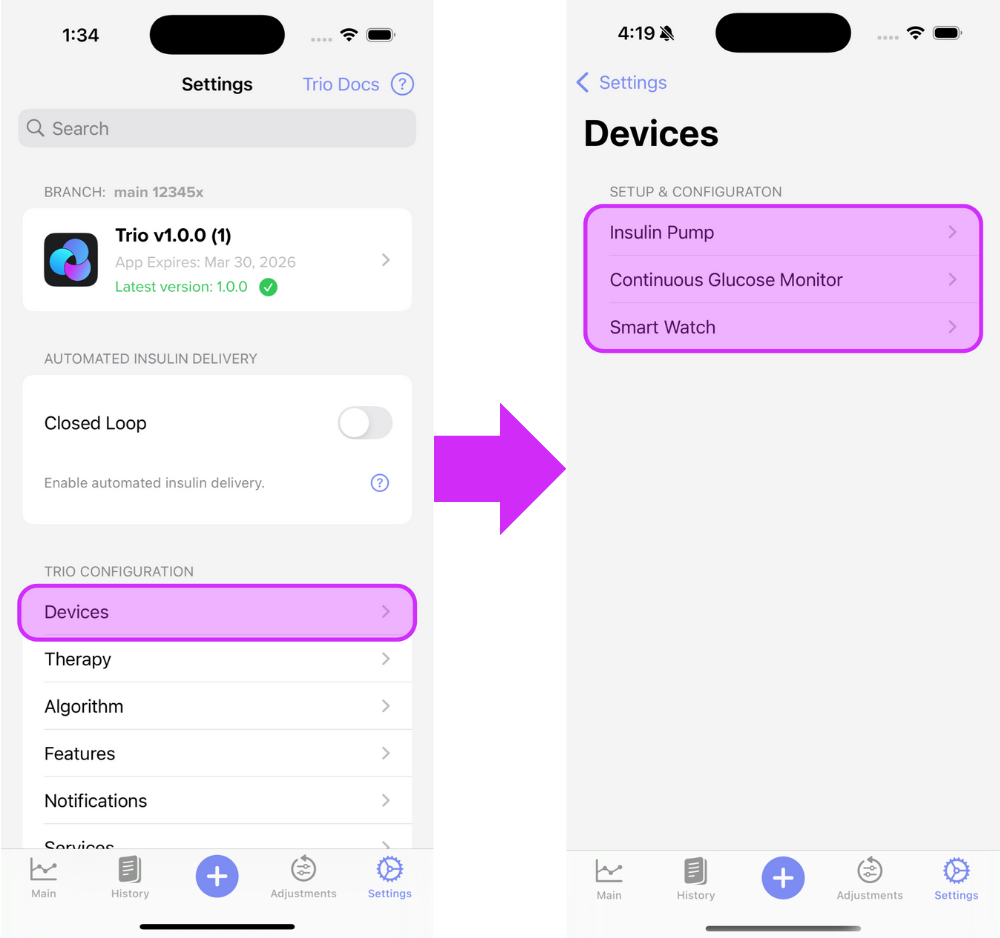
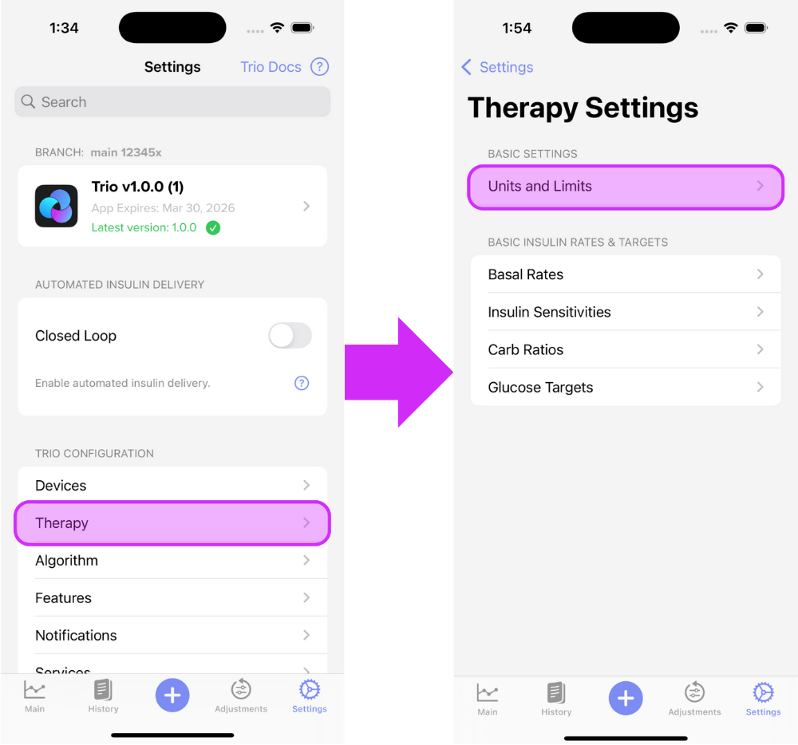
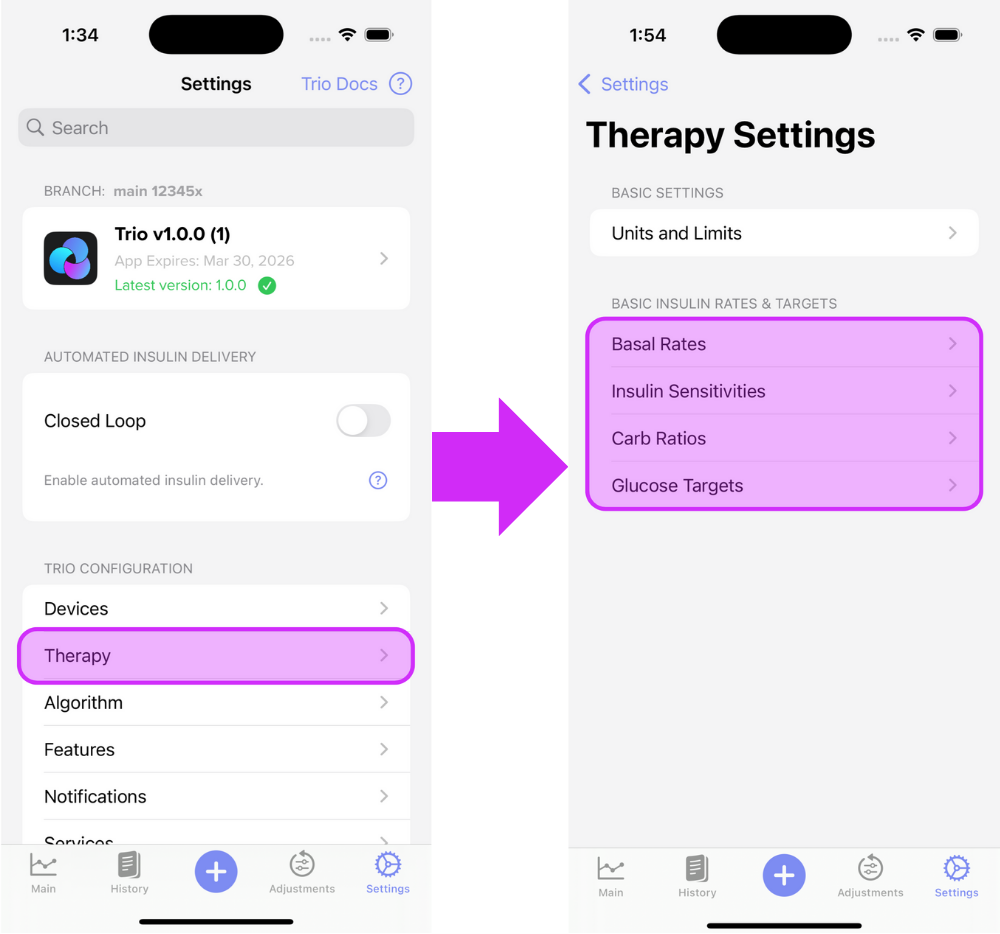
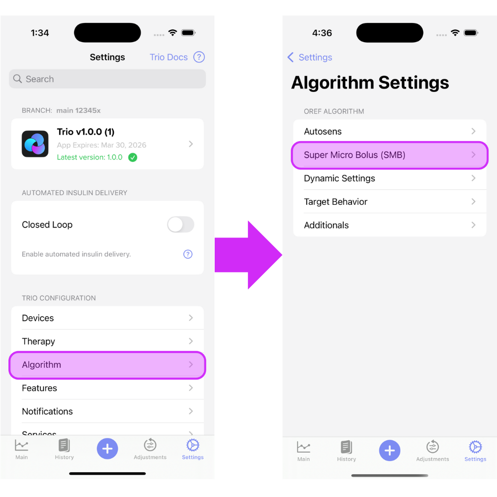
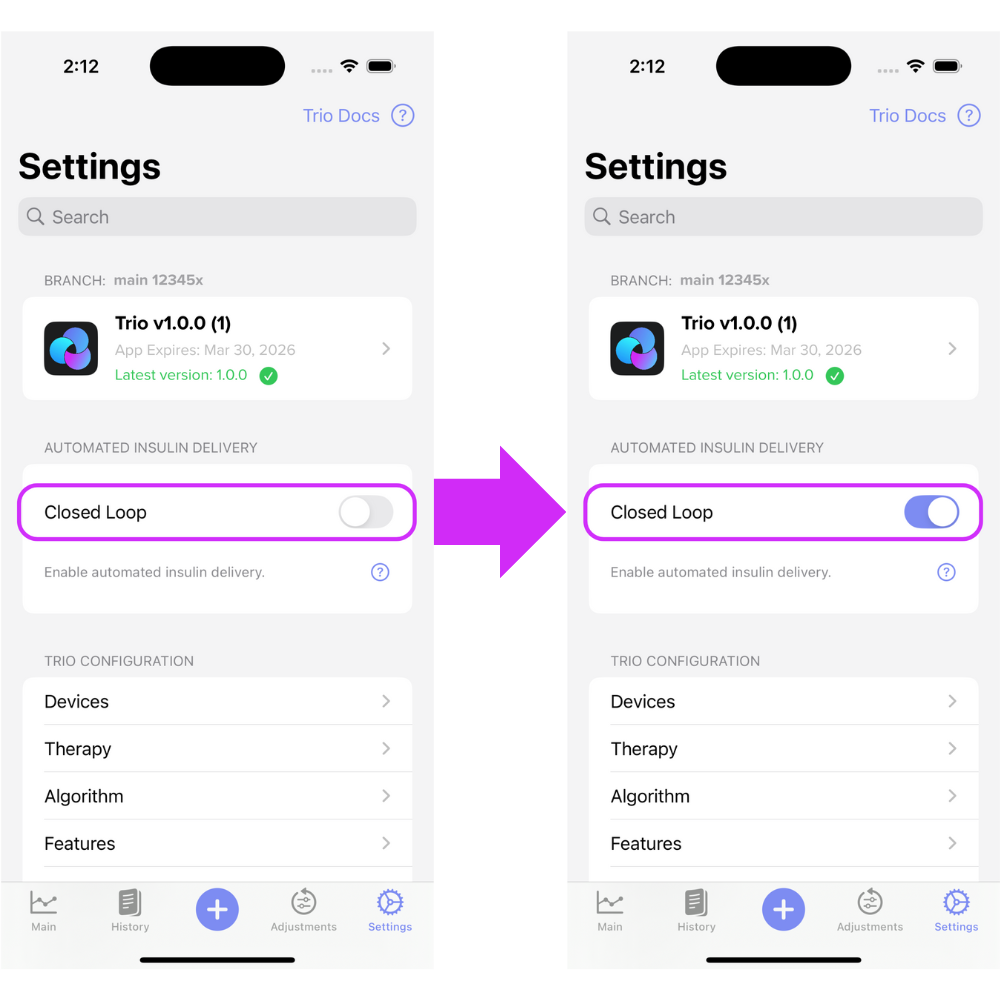
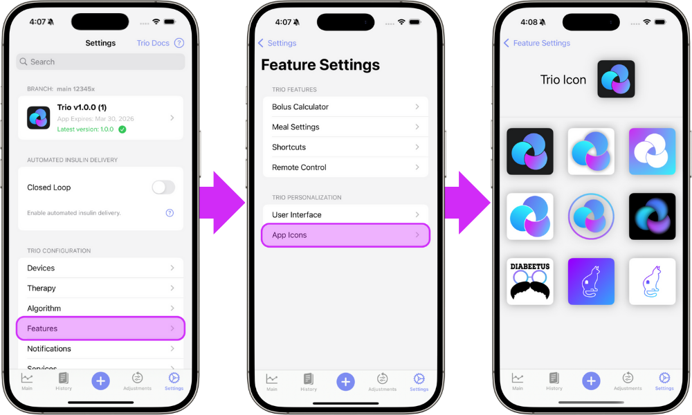

# New User Setup

{ width="500px"  }
{align=center}

Welcome to the New User Setup Guide and congratulations on a successful Trio build! This guide walks you through how to set up your Trio app once you have installed it on your phone. If you still need to install the app, head to the [Build Instructions](../operate/build.md) and come back here when you are ready to start the setup process!

To set up your Trio app, touch the settings icon located on the bottom right of the main screen. Each step contains links to information on setting up each part of your Trio app. Use this as your home base to refer back to as you set up your app.

## Step 1: Verify Compatibility and Connect Your Devices

The first step in setting up your Trio app is to connect your devices to the app, located in the Devices menu under Trio Configuration. 

### Verify Compatibility

If you have not already, please verify that your devices are compatible:

 1. [Phones](../configuration/CompatibleDevices.md#phones)
 2. [Watches](../configuration/CompatibleDevices.md#watches)
 3. [Pumps](../configuration/CompatibleDevices.md#pump)
 4. [CGMs](../configuration/CompatibleDevices.md#cgm)

### Connect Devices

Once you have verified that you are using compatible devices, you can connect them in the Trio app settings menu.

{ width="500px"  }
{align=center}

 a. [Connect Insulin Pump](settings/devices/pump.md)  
 b. [Connect Continuous Glucose Monitor (CGM)](settings/devices/cgm.md)  
 c. [Connect Smart Watch (optional)](settings/devices/smart_watch.md)

- - -

## Step 2: Enter Preferred Units and Safety Limits

The next step is to follow the guidance linked here for [Units and Limits](settings/therapy/units_limits.md). These settings not only give Trio the ability to dose you based on your settings (entered in Step 3), but they also act as safety limits to prevent over-correction. 

{ width="500px"  }
{align=center}

 a. [Glucose Units](settings/therapy/units_limits.md#glucose-units)  
 b. [Max IOB](settings/therapy/units_limits.md#max-iob)  
 c. [Max Bolus](settings/therapy/units_limits.md#max-bolus)  
 d. [Max Basal](settings/therapy/units_limits.md#max-basal)  
 e. [Max COB](settings/therapy/units_limits.md#max-cob)  
 f. [Minimum Safety Threshold](settings/therapy/units_limits.md#maximum-safety-threshold)

- - -

## Step 3: Add Therapy Settings

The next step is to enter your Therapy Settings under Trio Configuration.

{ width="500px"  }
{align=center}

 a. [Basal Rates](settings/therapy/basal_rates.md)  
 b. [Insulin Sensitivities (ISF)](settings/therapy/isf.md)  
 c. [Carb Ratios (CR)](settings/therapy/carb_ratios.md)  
 d. [Glucose Targets](settings/therapy/target_glucose.md)  

- - -

## Step 4: Enable UAMs and SMBs

After you've entered your therapy settings, the next step is to enable the SMB options of your choosing. Best practice is to have both UAM and SMBs enabled at the same time.

{ width="500px"  }
{align=center}

 a. [Enable UAMs](settings/algorithm/smb_settings.md#enable-uam)  
 b. [Enable chosen SMBs](settings/algorithm/smb_settings.md)  
        
- - -

## Step 5: Enable Closed Loop

Closed loop functionality is turned off by default. This means Trio cannot make adjustments automatically. The system relies solely on you to make any recommended adjustments while Closed Loop is OFF. You can control your pump and bolus with the Trio app, but nothing can be done without your approval. This is often referred to as running an 'open loop.'

{ width="500px"  }
{align=center}

[More on closing the loop](../configuration/Configure.md)

- - -

!!! danger "DO NOT ENABLE DYNAMIC SETTINGS YET"  
    
    It is essential that Trio has enough data to make sound recommendations. Your settings must be tuned to be used in an Oref algorithm and you must feel comfortable using the Trio app. It is not recommended to enable dynamic settings until ALL criteria below are met:  
    
    - You are confident that your ISF, CR, and Basal Rates are tuned for use in the Oref algorithm 
    - You have used Trio with a real CGM and real pump (not simulators) for the recommended minimum of **7 consecutive days**
    - You are comfortable with the Trio app
    

!!! danger "DO NOT ALTER ANYTHING ELSE UNTIL YOU'VE TESTED AND VERIFIED YOUR SETTINGS"
    - If you are coming from another Oref-based system, like Trio 0.2, iAPS, or AAPS, you will want to watch your current settings to ensure they are performing as they did previously. You may need to make some adjustments, but you also may find your settings work as well as they did in the previous system.  
    - If you are coming from Loop, a commercial system, or multiple daily injections (MDI), you will want to first test your settings to ensure they do not require any adjustments. You've been using a completely different algorithm to manage your insulin dosing and that means you've tailored your settings to be optimized using that method of dosing. Because Trio uses a different algorithm, your settings will almost assuredly need to be adjusted to work optimally within the Oref algorithm.
    
    You can find more information on transitioning to Trio [here](transition-qa.md)

- - -

## Step 6: Change App Icon (Optional)

Under "App Icons" in the Settings Menu, you can find various icons for your Trio app.

{align=center}

Have a special icon in mind?  
You can use your own custom icon by following the instructions under [Customizations](../operate/customize.md).

***Congratulations!*** You've completed the New User Setup for Trio!

