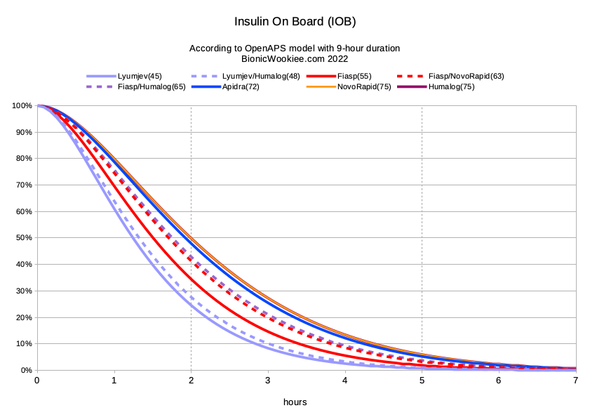

# Additionals

!!! danger "**Read This Before Proceeding**"
    This settings in this section typically do not require **_any_** modifications. Do not alter them without a solid understanding of what you are changing and the full impact it will have on the algorithm.

## Max Daily Safety Multiplier
**Default:** _300%_  
**Setting Limits:** _100%-500%_

This setting restricts the maximum automated temporary basal rate Trio can set. At the default of 300%, it caps temporary basal rates at 3 times your highest programmed basal rate of **_all your basal rates_**.

This limit works in conjunction with [Current Basal Safety Multiplier](#current-basal-safety-multiplier). Trio will use the smaller of the two limits. It serves as a safety limit, ensuring no temporary basal rates exceed safe levels.

!!! warning
    Increasing this setting is not advised
    
- - -

## Current Basal Safety Multiplier
**Default:** _400%_  
**Setting Limits:** _100%-500%_

This setting also restricts the maximum automated temporary basal rate Trio can set. At the default of 400%, it caps temporary basal rates to 4 times your **_current_** programmed basal rate.

This limit works in conjunction with [Max Daily Safety Multiplier](#max-daily-safety-multiplier). Trio will use the smaller of the two limits. It serves as a safety limit, ensuring no temporary basal rates exceed safe levels.

!!! warning
    Increasing this setting is not advised

- - -

## Duration of Insulin Action
**Default:** _10 hours_  
**Setting Limits:** _5-10 hours_

The Duration of Insulin Action (DIA) defines how long your insulin continues to lower glucose readings after it is given. This helps the system accurately track Insulin on Board (IOB), avoid over- or under- corrections by considering the tail end of insulin's effect.

{align=center}

Trio, as with other Oref-based systems like AndroidAPS, uses an exponential decay model for DIA. Working in collaboration with David Burren (Bionic Wookie), we found the DIA that most accurately reflects actual insulin activity in the body, is a 10 hour DIA. You can read more about insulin decay models used in Oref-based systems at [bionicwookie.com](https://bionicwookiee.com/2022/12/04/insulin-timings-2022/)

!!! warning
    Trio will not allow you to set a DIA below 5 hours. However, 5 hours is an extremely low DIA and it is not advised.
- - -

## Use Custom Peak Time
**Default:** _OFF_

Insulin Peak Time reflects when insulin is most effective in lowering glucose, aka the peak of insulin activity. Toggling this setting on exposes the Custom Peak Time setting and allows you to customize that peak.

Typically, this setting does not need to be adjusted. The one common case for adjusting insulin peak time is for Lyumjev users, where the programmed ultra-rapid insulin peak matches Fiasp's peak time rather than Lyumjev's.

### Insulin Peak Time
**Default:** _Determined By Insulin Selection_  
**Setting Limits:** _35-120 min_

The default settings are determined by your insulin selection:  
    - Rapid-Acting (Humalog, Novolog/Novorapid, Apidra)
        - Default: 75 minutes
        - Setting Limits: 50-120 minutes
    - Ultra-Rapid (Fiasp, Lyumjev)
        - Default: 55 minutes
        - Setting Limits: 35-100 minutes
        
!!! info "Lyumjev Users"
    Lyumjev has a peak time of 45 minutes

- - -

## Skip Neutral Temps
**Default:** _OFF_

When Skip Neutral Temps is enabled, Trio will not set neutral basal rates shortly before the hour, minimizing hourly pump alerts on Medtronic pumps. This can help light sleepers avoid alerts, but will delay basal adjustments. This will also only come into effect if SMBs are _disabled_.  

For most users, leaving this _OFF_ is recommended to ensure consistent basal delivery and loop calculation. If this option is enabled, loops will be skipped during the last 5 minutes of the hour.

- - -

## Unsuspend If No Temp
**Default:** _OFF_

Enabling this setting allows Trio to resume your pump after a _manual_ zero temp basal was set. This feature ensures insulin delivery restarts if you forget to manually unsuspend, adding a safeguard for pump reconnections.

- - -

## Suspend Zeros IOB
**Default:** _ON_

This is defaulted to on because it resets any active temporary basal rate to a 0 U/hr temp basal rate when you suspend your pump, either on the pump with Medtronic or on the pump screen with Omnipod. This setting ensures no undelivered temp basal insulin is recorded while insulin delivery is suspended on the pump.

!!! info
    This setting will be removed from Trio in the near future

- - -

## SMB Delivery Ratio
**Default:** _50%_  
**Setting Limits:** _30%-70%_

This is a safety limiter. Trio determines how much insulin is required to get you back to your target glucose. If SMB is enabled, Trio then delivers an SMB that defaults to half the required insulin.

Because SMBs can occur every 5 minutes with each loop cycle, it is important to set this value to a conservative level that will allow Trio to safely decrease insulin should needs suddenly change.

??? question "Trio determines Bill needs 2.4 units to return him to his target glucose. His `SMB Delivery Ratio` is set to 50%. What amount of insulin will Trio deliver?"

    $$
    2.4 \times 50\% = 1.2\ units
    $$

??? question "_Bonus Question_: Based on Bill's `Max SMB Basal Minutes` setting above, will he get an SMB of 1.2 units?"

    $$
    1.0 \lt 1.2
    $$
    
    No, Bill will only get **1.0 unit** because after Trio calculated his needed insulin, it reduced it by his `SMB Delivery Ratio`, and _then_ Trio limited the amount to his `Max SMB Basal Minutes` because it was higher than this setting.

!!! tip

    Allowed range for this setting is 30% - 70%

- - -

## SMB Interval
**Default** _3 min_  
**Setting Limits:** _1-10 min_

The minimum minutes since the last SMB or manual bolus that an automated SMB will be permitted.  

!!! tip

    Keep this setting at the default of 3 minutes to help Trio enact needed SMBs without interruption

- - -

## Min 5m Carb Impact
**Default:** _5 mg/dL_  
**Setting Limits:** _1-20 mg/dL_

This setting is used only when carb absorption isn't reflected in glucose data.

The default is an expected 8 mg/dL/5min. This affects how fast COB decays when there is little to no variation in glucose readings. The default setting correlates to a carb absorption rate of 24g/hr at a Carb Sensitivity Factor (CSF) of 4 mg/dL/g.

!!! info
    This setting is **_only_** used when glucose is not changing after a meal entry. When glucose _is_ changing, your CSF is used to determine carb decay and this setting is ignored.

- - -

## Remaining Carbs Percentage
**Default:** _100%_  
**Setting Limits:** _50%-100%_

Trio will reserve unabsorbed carb entries for 4 hours. This setting determines what percentage of the entered carbs will be in reserve for future glucose fluctuations.

At the default of 100%, all unabsorbed carbs will remain in reserve until glucose reflects carb absorption or 4 hours has elapsed.

!!! tip
    Trio will not dose for these carbs until glucose reflects their absorption

- - -

## Remaining Carbs Cap
**Default:** _90g_  
**Setting Limits:** _0-200g_

In combination with the previous setting, Trio will limit the number of carbs that can remain in reserve for future carb absorption. This setting is the maximum grams of carbs that can be held over the 4 hours following a meal entry.

- - -

## Noisy CGM Target Increase
**Default:** _130%_  
**Setting Limits:** _100%-200%_

This setting raises your glucose target by this percent of your current target glucose when CGM readings are fluctuating widely.

This helps reduce the risk of incorrect insulin dosing based on inaccurate sensor data, ensuring safer insulin adjustments during periods of poor CGM accuracy.

??? question "Bill has a Dexcom G7 and his CGM readings are very jumpy for the first 24 hours. His current glucose target is 110 mg/dL (6.1 mmol/L). What will Trio adjust his target glucose to in order to prevent extra, unnecessary insulin?"
    
    ??? info "Here is the formula you will need:"
        
        $$
        Target\ Glucose \times NoisyCGM\ Target\ Increase
        $$
        
    ??? note "Calculate Bill's new, temporary target:"
        
        $$
        110 \times 130\%
        $$
        
        $$
        143\ mg/dL\ (7.9 mmol/L)
        $$
        
    ??? success "Answer"
        
        Trio will increase his target glucose to **_143 mg/dL_** while a noisy CGM is indicated.
        
