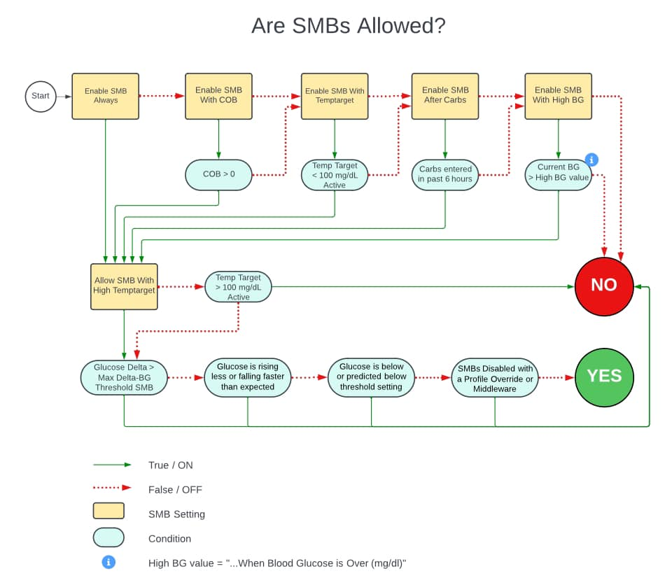

# SMB Settings

!!! summary "Highlights"

    - UAMs should be enabled **first**, then other SMBs should be enabled as needed.
    - Max UAM Basal Minutes should be set **lower** than Max SMB Basal Minutes.
    - Super micro boluses (SMB) often include your basal insulin. Your basal rate will be temporarily reduced after an SMB is delivered to prevent overdosing insulin.
    - SMBs reduce blood sugar more quickly than temporary basal rates.
    - If you want to configure SMBs only to run in certain conditions, do not turn on 'Enable SMB Always'.
    - For a detailed look at when SMBs are used, see the chart in [Are SMBs Allowed?](#are-smbs-allowed) section. 
    - For setup recommendations, see the [Start-Up Guide](http://diy-trio.org/start-up-guide).

- - -

!!! warning

    All of the SMB options listed below are **_inclusive_**, not exclusive. This means that if more than one option is enabled, only _one_ of those options needs to apply in order for SMBs to be utilized.

- - -
## Enable SMB Always
**Default:** _OFF_  
When this setting is enabled, Super Micro Boluses (SMBs) will always be allowed if dosing calculations determine insulin is needed via the SMB delivery method. The exception is when a high temp target is set. Enabling SMB Always will remove the other redundant "Enable SMBs if..." options.  

SMBs will remain on if you have a low temporary target set but will be fully disabled if a high temporary target is set (unless "[Allow SMB With High Temptarget](#allow-smb-with-high-temptarget)" is enabled).  

The size of SMBs is limited by [Max SMB Basal Minutes](#max-smb-basal-minutes).  

- - -

## Enable SMB with COB
**Default:** _OFF_  
When the carbs on board (COB) forecast line is active, enabling this feature allows Trio to use SMBs to deliver the insulin required.  

!!! tip

    Allowing SMBs when you have carbs on board can help with mealtime spikes in glucose.

- - -

## Enable SMB with TempTarget
**Default:** _OFF_  
Enabling this feature allows Trio to deliver insulin required using SMBs at times in which a manual temporary target (temp target) under **100 mg/dL (5.5 mmol/L)** is set.  

!!! tip

    Low temp targets are often set when struggling with high glucose readings. Allowing SMBs at this time can help counter elevated glucose levels faster.

- - -

## Enable SMB After Carbs
**Default:** _OFF_  
Enabling this feature allows Trio to deliver insulin required using SMBs for **6 hours** after any carb entry, regardless of whether there are active carbs on board (COB).  

!!! tip

    Carbs do not digest at the same rate. Allowing SMBs for the 6 hours after entering a meal will help Trio counter those carbs faster.

- - -

## Enable SMB with High BG
**Default:** _OFF_  
Enabling this feature allows Trio to deliver insulin required using SMBs when your glucose reading is above the value set as your 'High BG Target'. This additional setting will appear when you enable this feature.  

### High BG Target
**Default:** _110 mg/dL_ | _6.1 mmol/L_  
If 'Enable SMB with High BG' is enabled, SMBs will be allowed if your glucose is above this value.  

!!! warning "**Important**"

    - This setting was often misunderstood. It was never a restriction on SMBs. To help clarify it's purpose for users, it has moved under the only setting it applies to, `Enable SMB with High BG`. 
    - Its only function is to allow SMBs if glucose is above this number and `Enable SMB with High BG` is turned ON.
    - **It will not _prevent_ SMBs or UAMs below this number if other SMB settings are turned ON.**

- - -

## Allow SMB with High TempTarget
**Default:** _OFF_  
Enabling this feature allows Trio to deliver insulin required using SMBs when a manual Temp Target above **100 mg/dL (5.5 mmol/L)** is set.  

!!! warning "**Important**"

    High Temp Targets are often used to recover from lows. If you use a high temp target for that purpose, this feature should remain disabled.

- - -

## Enable UAM
**Default:** _OFF_

_This setting should be enabled **before** other SMBs are enabled._  

Enabling Unannounced Meal SMBs (UAM) allows Trio to detect and respond to unexpected rises in glucose readings caused by unannounced or miscalculated meals, meals high in fat or protein, or other factors like adrenaline or cortisol.  

It uses SMBs to deliver insulin in small amounts to correct glucose spikes. UAM also works in reverse, reducing or stopping insulin if glucose levels drop unexpectedly.  

The size of UAM SMBs is limited by [Max UAM Basal Minutes](#max-uam-basal-minutes)  

!!! tip

    Enabling UAM will give minor adjustments in your insulin dosing to account for the difference in expected glucose and actual glucose readings. For this reason, **UAM should be enabled first** and `Max UAM Basal Minutes` should be set more conservatively than `Max SMB Basal Minutes`.

- - -

## Max SMB Basal Minutes
**Default:** _30 minutes_  
**Setting Limits:** _30-180 minutes_

If any of the SMB options are enabled, this limit will apply to all SMBs except UAM SMBs. This is a limit on the size of a single SMB. One SMB can only be as large as this many minutes of your current profile basal rate.  

To calculate the maximum SMB allowed based on this setting, use the following formula:  

$$
\frac{Max\ SMB\ Basal\ Minutes}{60} \times Current\ Basal\ Rate
$$

??? question "Bill's current basal rate is 2.0 units/hr. His `Max SMB Basal Minutes` is set to 30 minutes. What is the largest SMB he can receive?"
    
    ??? info "Here is the formula you will need:"
    
        $$
        \frac{Max\ SMB\ Basal\ Minutes}{60} \times Current\ Basal\ Rate
        $$
        
    ??? note "Calculate Bill's largest SMB:"
    
        $$
        \frac{30}{60} \times 2.0 =
        $$
        
        $$
        \frac{1}{2} \times 2.0 =
        $$
        
        $$
        1.0\ unit
        $$
        
    ??? success "Answer"
        The largest SMB Bill can receive is **1.0 unit** every 5 minutes.  

!!! warning

    Increasing this value above 90 minutes may impact Trio's ability to effectively zero temp and prevent lows.

- - -

## Max UAM Basal Minutes
**Default:** _30 minutes_  
**Setting Limits:** _30-180_

If UAM is enabled, this setting limits the size of each UAM SMB. One UAM SMB can only be as large as this many minutes of your current profile basal rate.  

To calculate the maximum UAM allowed based on this setting, use the following formula:  

$$
\frac{Max\ UAM\ Basal\ Minutes}{60} \times Current\ Basal\ Rate
$$

!!! warning

    Increasing this value above 90 minutes may impact Trio's ability to effectively zero temp and prevent lows.

- - -

## Max Delta-BG Threshold SMB
**Default:** _30%_  
**Setting Limits:** _10%-40%_

This safety limiter looks at the difference between your last two blood glucose readings. If the difference is above this percent, Trio suspects them to be incorrect and will suspend all SMB delivery accordingly (including UAM). You can adjust the amount of change that should be allowed before SMBs are delivered.  

??? question "Bill's last CGM reading was 90 mg/dL. The very next reading is 115 mg/dL. Will Bill receive the insulin needed as an SMB?"
    
    ??? info "Here are the formulas you'll need:"
        Delta Percentage:
        
        $$
        \frac{Current\ Glucose - Previous\ Glucose}{Previous\ Glucose}
        $$
        
        Compare to Max Delta-BG Threshold SMB
        
        $$
        Delta\ Percentage \gt \ or\ = \ or\ \lt Max\ Delta-BG\ Threshold\ Setting
        $$
        
        **No SMB**: $\gt$  
        **Yes SMB**: $\lt$ or $=$
        
    ??? note "Calculate if an SMB will be used:"
    
        $$
        \frac{115-90}{90} =
        $$
        
        $$
        \frac{25}{90} =
        $$
        
        $$
        +0.28\ or\ +28\%
        $$

        His delta, or change in glucose, is an increase of **_28%_**

        $$
        28\%\gt 20\% = No\ SMBs
        $$
    
    ??? success "Answer"
        This change is larger than the threshold, so **no SMBs will be given**. Trio will administer needed insulin via temp basal adjustment.

!!! tip
    
    For a fully closed loop, 30% is advised.

- - -

## SMB Delivery Ratio
**Default:** _50%_  
**Setting Limits:** _30%-70%_

This is a safety limiter. Trio determines how much insulin is required to get you back to your target glucose. If SMB is enabled, Trio then delivers an SMB that defaults to half the required insulin.

Because SMBs can occur every 5 minutes with each loop cycle, it is important to set this value to a conservative level that will allow Trio to safely decrease insulin should needs suddenly change.

??? question "Trio determines Bill needs 2.4 units to return him to his target glucose. His `SMB Delivery Ratio` is set to 50%. What amount of insulin will Trio deliver?"

    $$
    2.4 \times 50\% = 1.2\ units
    $$

??? question "_Bonus Question_: Based on Bill's `Max SMB Basal Minutes` setting above, will he get an SMB of 1.2 units?"

    $$
    1.0 \lt 1.2
    $$
    
    No, Bill will only get **1.0 unit** because after Trio calculated his needed insulin, it reduced it by his `SMB Delivery Ratio`, and _then_ Trio limited the amount to his `Max SMB Basal Minutes` because it was higher than this setting.

!!! tip

    Allowed range for this setting is 30% - 70%

- - -

## SMB Interval
**Default** _3 min_  
**Setting Limits:** _1-10 min_

The minimum minutes since the last SMB or manual bolus that an automated SMB will be permitted.  

!!! tip

    Keep this setting at the default of 3 minutes to help Trio enact needed SMBs without interruption

- - -

## Are SMBs Allowed?

{align=center}

### By following the flow chart above, you can see which combination of settings will allow SMBs.

- If a setting in the top row is toggled off, look at the next box to the right. If no box in the top row is toggled on, then SMBs will not be allowed. 
- If any of the settings in the top row are toggled on and their condition is true, follow the green line down to the "Allow SMB with High Temptarget" box. 
- If "Allow SMB with High Temptarget" is toggled on (NOT the default), then continue to follow the green line to the bottom conditions.
- If "Allow SMB with High Temptarget" is toggled off (which IS the default), it will then check if you've set a Temp Target (not a custom profile) above 100 mg/dL (5.5 mmol/L). If you have a Temp Target set above 100 mg/dL, then SMBs are DISABLED and not allowed.

If you've made it to the bottom row, it checks all those conditions, and if none of them are true, then SMBs are allowed.

### Here is the order of settings Trio uses when deciding whether to enable or disable SMBs:

- Disable when a High Temptarget is set (unless "Allow SMB with High Temp Target" is enabled)
- Enable if "Enable SMB Always" is set (unless disabled for "High Temp Target")
- Enable while there are COB
- Enable for a full 6 hours after any carb entry
- Enable if a Low Temp Target is set

