# CGM
This section allows you to choose your glucose data source. Most options are self-explanatory.  For more information on compatible CGMs, please see the following [link](../../../install/build/requirements/devices/cgm.md#compatible-cgm).

## Step 1: Add CGM

The first step in setting up your continuous glucose monitor (CGM) on Trio is to tap the "Add CGM" button in the Devices Menu

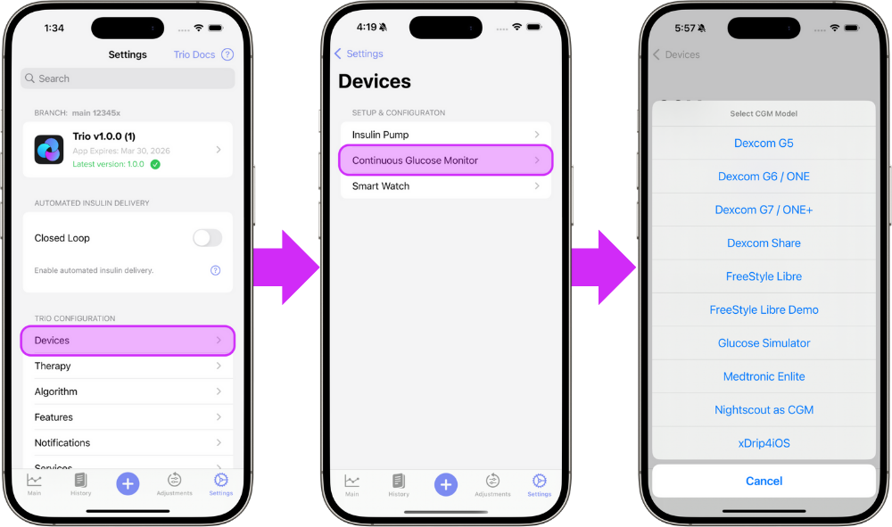
{align=center}

## Step 2: Select Your CGM
Select your CGM from the in-app menu and from the options below for step by step instructions. The links below will guide you through the connection instructions for your specific CGM:  

- [Dexcom G5 / G6 / ONE](#dexcom-g5-g6-one)
- [Dexcom G7 / ONE+](#dexcom-g7-one)
- [Dexcom Share](#dexcom-share)
- [Freestyle Libre](#freestyle-libre)
- [Freestyle Libre Demo](#freestyle-libre-demo)
- [Eversense E3 / 365](#eversense-e3-365)
- [Glucose Simulator](#glucose-simulator)  
- [Medtronic Enlite](#medtronic-enlite)  
- [Nightscout as CGM](#nightscout-as-cgm)  
- [xDrip4iOS](#xdrip4ios)  

- - -

### Dexcom G5 / G6 / ONE
Trio will intercept glucose readings between the transmitter and the Dexcom app. If you are using a Dexcom G5, G6, or ONE sensor, tap Configuration CGM to enter your transmitter's 6-digit ID. _Dexcom Share Credentials are not necessary_. When you switch transmitters, you must delete your current transmitter from Trio by tapping Configuration CGM, scrolling down, and tapping Delete CGM. Once you do this, you can add the new transmitter with its Transmitter ID.

**Step 3**
Enter your 6-digit Dexcom transmitter ID.

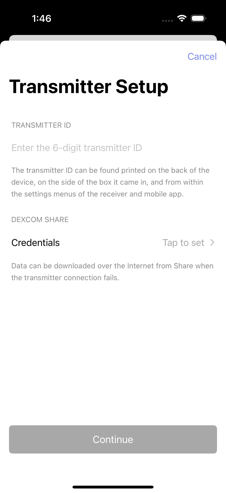{ width="300px"  }
{align=center}

**Step 4**
Continue to [Connect Watch](smart-watch.md) _OR_ return to [New User Setup](../../new-user-setup.md)

- - -

### Dexcom G7 / ONE+
As long as the Dexcom G7 or ONE+ app is installed on the same phone, Trio can intercept its glucose readings. When a new G7 or ONE+ sensor is paired to the Dexcom app, Trio will automatically start reading it.

**Step 3**
Tap "Continue" to use the G7/ONE+ as your CGM source

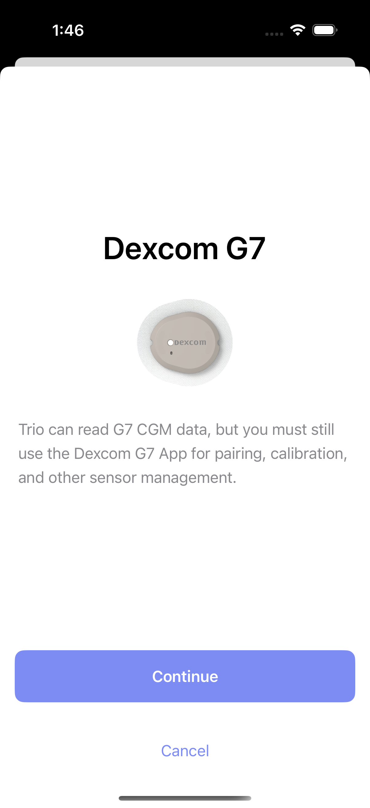{ width="300px"  }
{align=center}

**Step 4**
Continue to [Connect Watch](smart-watch.md) _OR_ return to [New User Setup](../../new-user-setup.md)

- - -

### Dexcom Share
<!-- TODO: add information on Dexcom Share -->

- - -

### Freestyle Libre
This option can be used to pair a compatible Libre CGM directly to Trio without going through a separate app like xDrip4iOS.

**Step 3**
Tap "Libre 2 Direct" to use Libre 2 sensors or "Bluetooth Transmitters" to use Libre 1 sensors with a Miao Miao or other 3rd party transmitter.

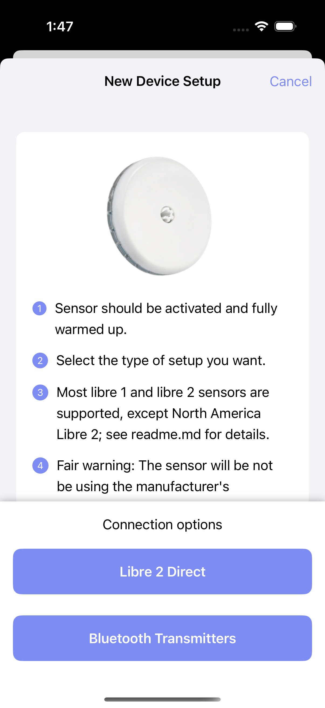{ width="300px"  }
{align=center}

**Step 4:Libre 2 Direct**
Tap "Pair Sensor" to connect your Libre 2/2+ sensor to Trio

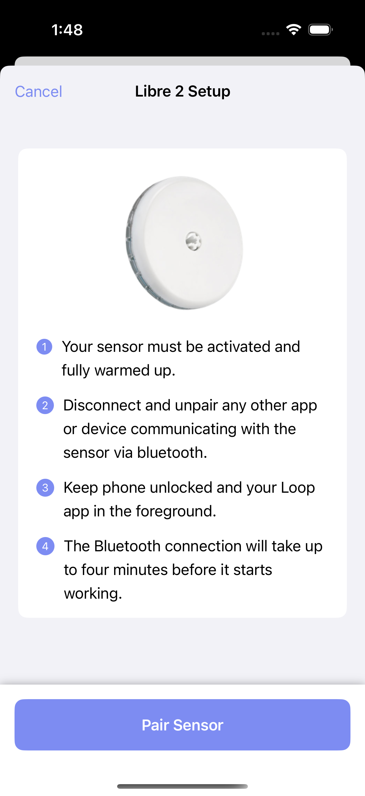{ width="300px"  }
{align=center}

**Step 4:Bluetooth Transmitters (Libre 1)**
Select your 3rd party transmitter from the list of found devices and tap "Save"

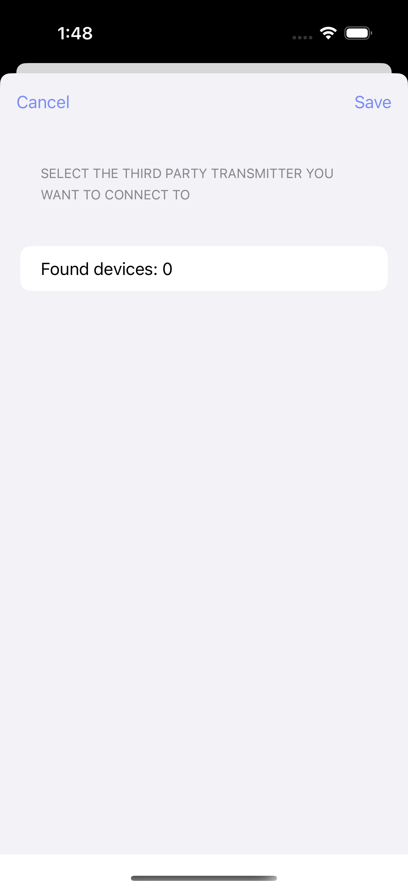{ width="300px"  }
{align=center}

**Step 5**
Continue to [Connect Watch](smart-watch.md) _OR_ return to [New User Setup](../../new-user-setup.md)

- - -

### Freestyle Libre Demo
<!-- TODO: add information on Libre Demo -->

**Step 3**
Continue to [Connect Watch](smart-watch.md) _OR_ return to [New User Setup](../../new-user-setup.md)

- - -

### Eversense E3 / 365

!!! warning "You must build the `dev` branch to use the Eversense CGM at this time"
    The Eversense CGM is in `dev` and is in open-beta for now

!!! warning "Wait until the initialization phase is completed"
    During the initialization phase of this system, the glucose reading might be incorrect.
    Before using automated insulin delivery, be sure to complete the initialization phase using the original Eversense app.

!!! warning "Do not use the Eversense 365 app and Trio concurrently"
    The 365 transmitter is not able to connect to multiple apps or devices at the same time, due to the security protocol.
    Make sure you either use the Eversense app or Trio, but not both at the same time.

**Step 3**
Select whether you want to pair the Eversense E3 or the Eversense 365.

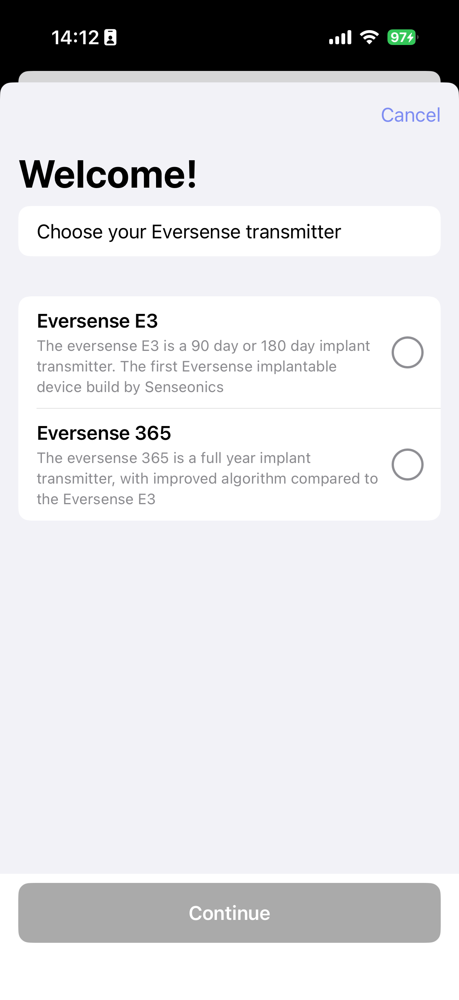{ width="300px" }
{align=center}

**Step 4 (only for Eversense 365)**
Log in using your Eversense account. If you do not have an accunt or you forgot your password, the appropriate links are included in this step

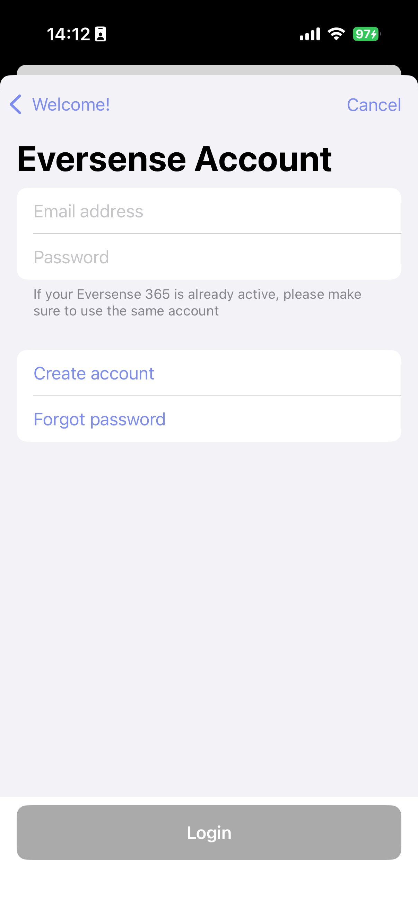{ width="300px" }
{align=center}

**Step 5**
Now put your Eversense transmitter in pairing mode (done by tapping the button 3 times), and wait till your Serial Number shows up on screen.
Click on the found transmitter, accept the pairing prompt (if show), and wait untill the pairing process is completed!

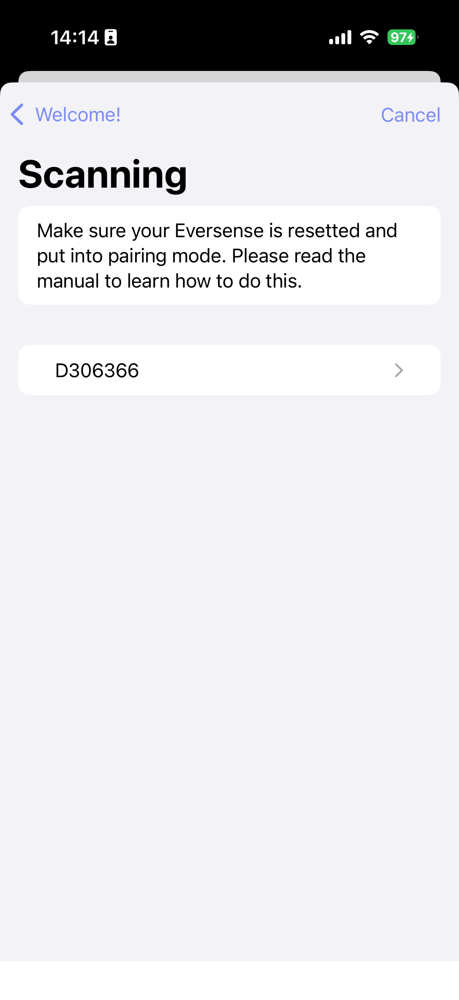{ width="300px" }
{align=center}

**Step 6**
Continue to [Connect Watch](smart-watch.md) _OR_ return to [New User Setup](../../new-user-setup.md)

- - -

### Accu-Chek SmartGuide

!!! warning "You must build the `feat/accuchek` branch to use the Accu-Chek SmartGuide CGM at this time"
    The Accu-Chek SmartGuide CGM is in `feat/accuchek` and is experimental for now

**Step 3**
Wait a minute while Trio is scanning for your Accu-Chek SmartGuide

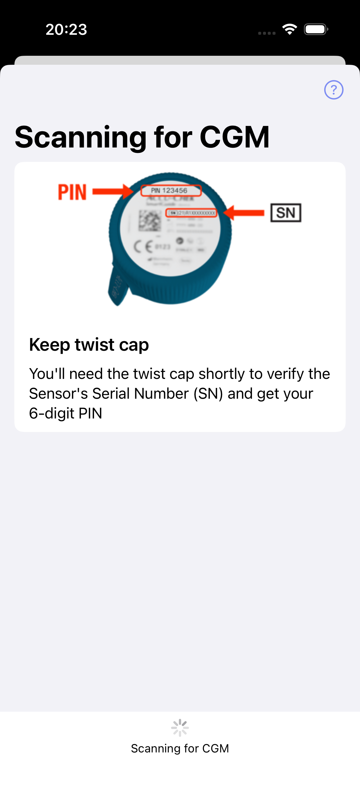{ width="300px" }
{align=center}

**Step 4**
Once Trio has found your Accu-Chek SmartGuide, it prompts you to confirm the Serial Number.
This Serial Number can be found on the twist cap of your applicator.

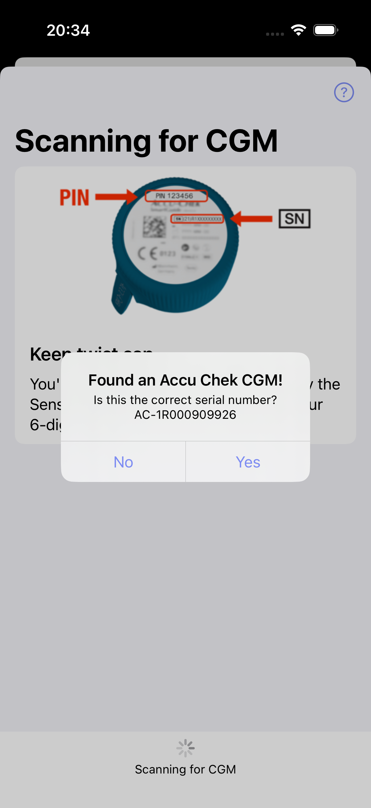{ width="300px" }
{align=center}

**Step 5**
After you've confirmed the Serial Number, Trio will pair and configure your CGM.
It might be the case that iOS asks for a Bluetooth pairing code, this code can be found at the top of the twist cap.
After pairing, be sure to either never remove your CGM from the Bluetooth list or keep the twist cap/pincode somewhere safe.

**Note** you will need this pincode if you want to migrate to a new phone

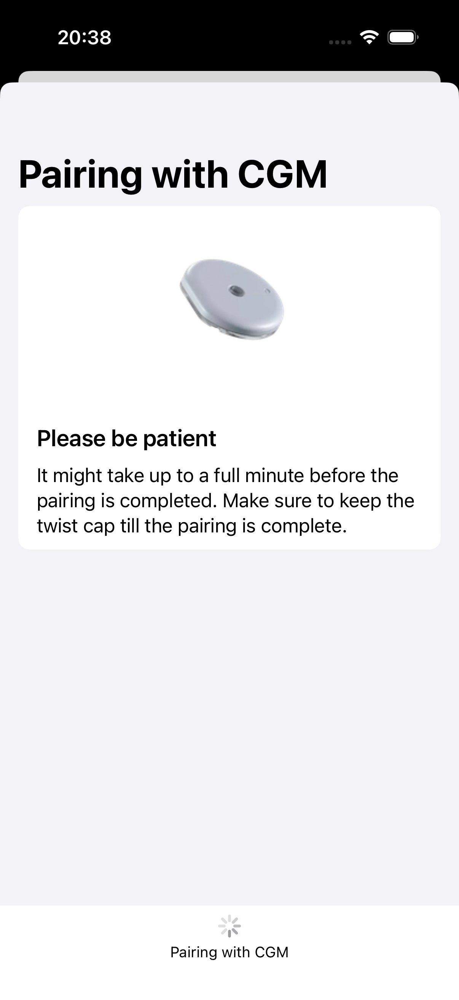{ width="300px" }
{align=center}

**Step 6**
Continue to [Connect Watch](smart-watch.md) _OR_ return to [New User Setup](../../new-user-setup.md)

- - -

### Glucose Simulator

!!! warning
    If using a Glucose Simulator, it is important to understand:
     
    - You will only experience the user interface of Trio.
    - Using a Glucose Simulator does not indicate how the app will perform, nor will it give accurate guidance or suggestions for insulin dosing.
    - A Glucose Simulator should **NEVER** be used with a live pump connected to a living person or pet.
    - **Only use a Glucose Simulator if you understand the conditions above.**

**Step 2**
Continue to [Connect Watch](smart-watch.md) _OR_ return to [New User Setup](../../new-user-setup.md)

- - -

### Medtronic Enlite
The Minimed Enlite CGM, available with the Medtronic 522/722, 523/723, and 554/754, wirelessly sends glucose readings to the pump. Trio can read the Medtronic CGM data directly from the pump using a RileyLink-compatible device.

**Step 2**
Continue to [Connect Watch](smart-watch.md) _OR_ return to [New User Setup](../../new-user-setup.md)

- - -

### Nightscout as CGM
While using Nightscout as a CGM is an option, it should be avoided if possible because it does not keep Trio running in the background like other CGM options.

**Step 2**
Continue to [Connect Watch](smart-watch.md) _OR_ return to [New User Setup](../../new-user-setup.md)

- - -

### xDrip4iOS
To use xDrip4iOS as a CGM source, you must build it yourself with the same Apple Developer account you used to build your Trio app. You cannot use Shuggah or a version distributed by someone else's TestFlight. Please see the following for instructions on how to build xDrip4iOS yourself: [link](../../../install/ecosystem/xdrip4ios.md)

However, if you are using Dexcom G6 or ONE with xDrip4iOS, you can choose the Dexcom G6 option in Trio rather than xDrip4iOS, and Trio will intercept the glucose readings even if you're using Shuggah or someone else's TestFlight of xDrip4iOS.

**Step 2**
Continue to [Connect Watch](smart-watch.md) _OR_ return to [New User Setup](../../new-user-setup.md)

- - -

## Smooth Glucose Value
**Default:** _OFF_  

Smooths CGM readings using Savitzky-Golay Filtering

<!-- Update with additional description of Savitzky-Golay filtering -->

- - -
