# Insulin Pump
This section allows you to choose your insulin pump. Most options are self-explanatory.  For more information on compatible insulin pumps, please see the following [link](../../../install/build/requirements/devices/pump.md/#compatible-pumps)

## Step 1: Add Pump

The first step in setting up your insulin pump on Trio is to tap the "Add Pump" button in the Devices Menu

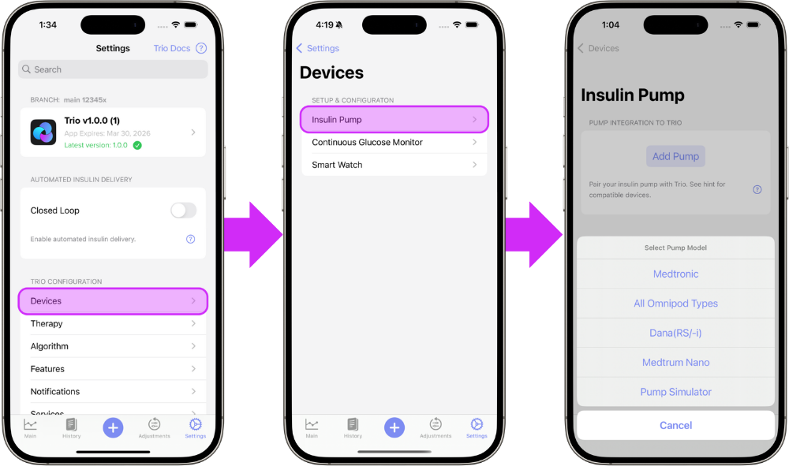
{align=center}

## Step 2: Select Your Pump
Select your pump from the in-app menu and from the options below for step-by-step instructions. The links below will guide you through the connection instructions for your specific pump.
 
- [Medtronic](#medtronic)  
- [Omnipod Eros](#omnipod-eros)  
- [Omnipod Dash](#omnipod-dash)  
- [Dana(RS/-i)](#danars-i)  
- [Pump Simulator](#pump-simulator)  
    
- - -
  
### Medtronic

**Step 3** Choose your insulin type and tap "Continue"

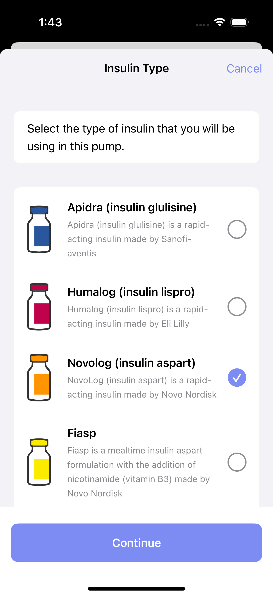{ width="300px"  }
{align=center}

**Step 4**
Connect your RileyLink, OrangeLink, or EmaLink and tap "Continue"

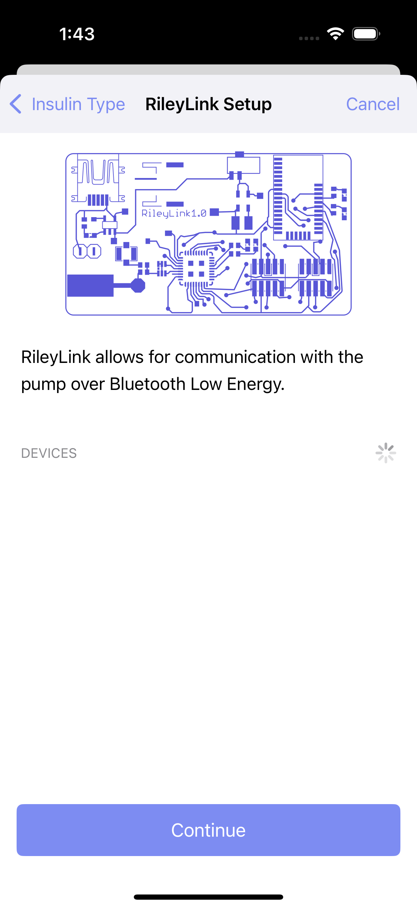{ width="300px"  }
{align=center}

**Step 5a**
Enter your pump region and color

**Step 5b**
Enter your 6-digit pump ID

Then, tap the "Connect" button when it turns blue at the bottom.

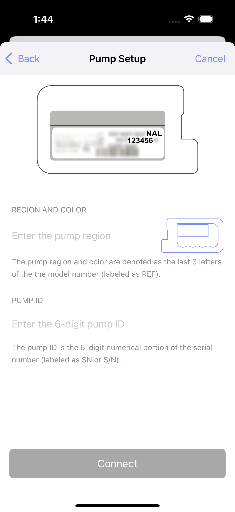{ width="300px"  }
{align=center}

**Step 6**
Continue to [Connect CGM](cgm.md) _OR_ return to [New User Setup](../../new_user_setup.md)

- - -

### Omnipod Eros
**Step 3**
Begin the process of configuring your Eros pod by tapping the blue "Continue" button at the bottom

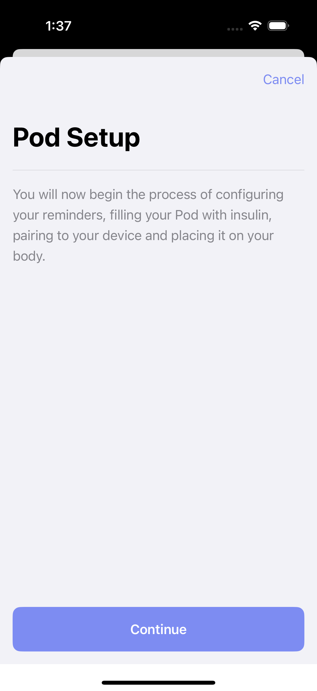{ width="300px"  }
{align=center}

**Step 4**
Choose the expiration reminder that you prefer and tap "Next"

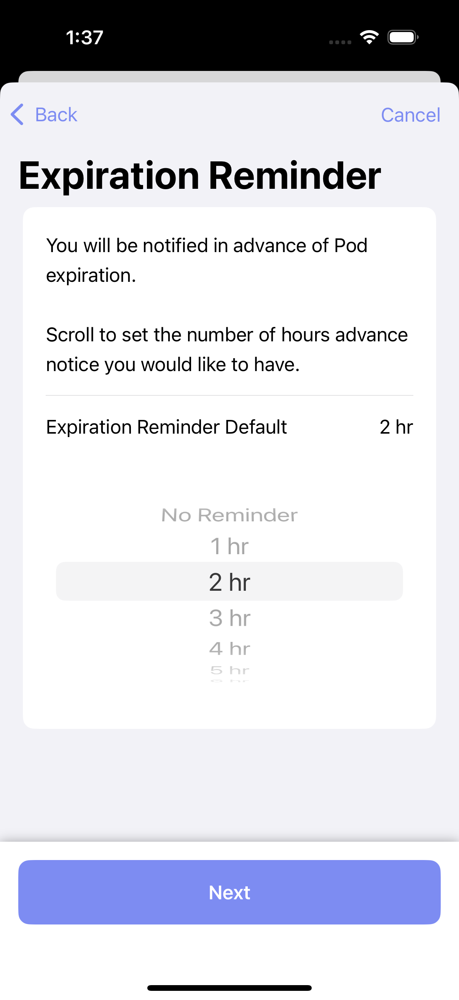{ width="300px"  }
{align=center}

**Step 5**
Choose the low reservoir reminder that you prefer and tap "Next"

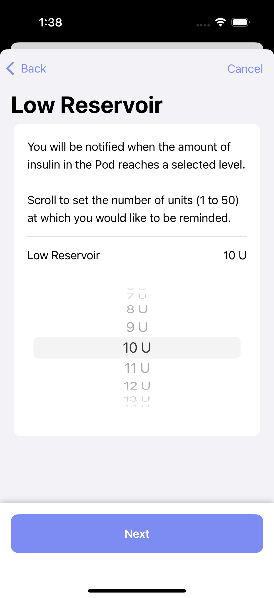{ width="300px"  }
{align=center}

**Step 6**
Choose your insulin type and tap "Continue"

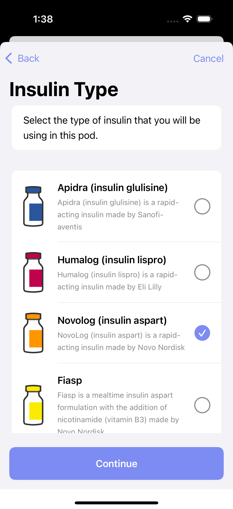{ width="300px"  }
{align=center}

**Step 7**
Connect your RileyLink, OrangeLink, or EmaLink and tap "Continue"

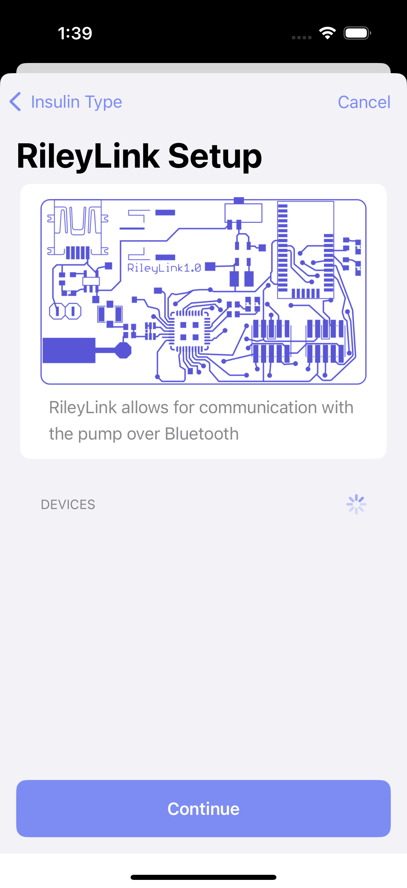{ width="300px"  }
{align=center}

**Step 8**
Continue to [Connect CGM](cgm.md) _OR_ return to [New User Setup](../../new_user_setup.md)

- - -

### Omnipod Dash
**Step 3**
Begin the process of configuring your Dash pod by tapping the blue "Continue" button at the bottom

{ width="300px"  }
{align=center}

**Step 4**
Choose the expiration reminder that you prefer and tap "Next"

{ width="300px"  }
{align=center}

**Step 5**
Choose the low reservoir reminder that you prefer and tap "Next"

{ width="300px"  }
{align=center}

**Step 6**
Choose your insulin type and tap "Continue"

{ width="300px"  }
{align=center}

**Step 7**
Continue to [Connect CGM](cgm.md) _OR_ return to [New User Setup](../../new_user_setup.md)

- - -

### Dana(RS/-i)
**Step 3**
Select your Dana pump model from the list and tap "Continue"

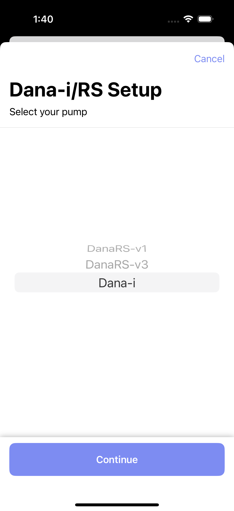{ width="300px"  }
{align=center}

**Step 4**
Read the in-app information and tap "Continue" when ready to proceed

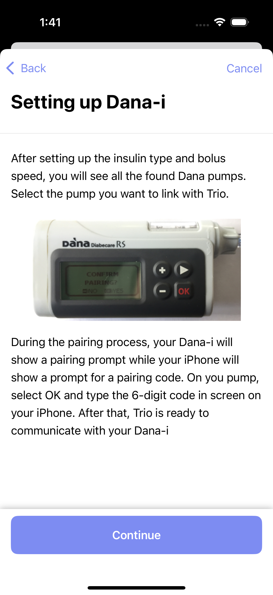{ width="300px"  }
{align=center}

**Step 5**
Choose your insulin type and tap "Continue"

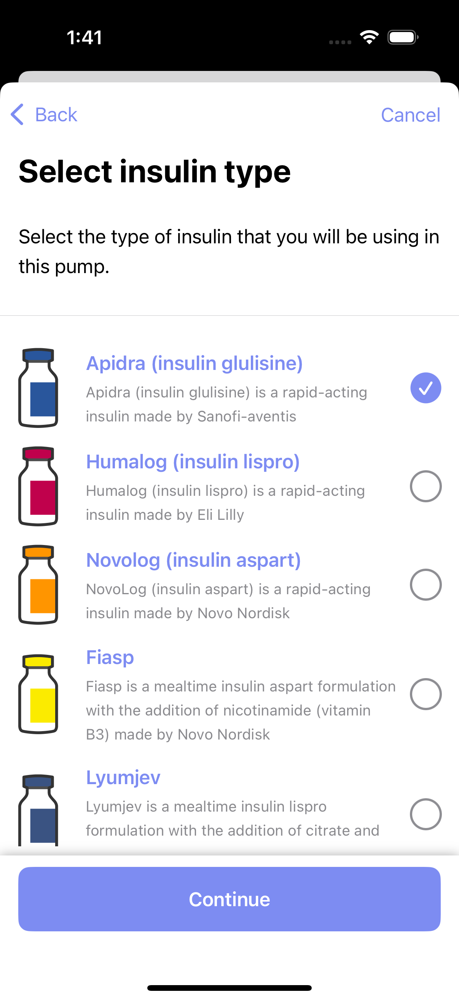{ width="300px"  }
{align=center}

**Step 6**
Choose your insulin delivery speed and tap "Continue"

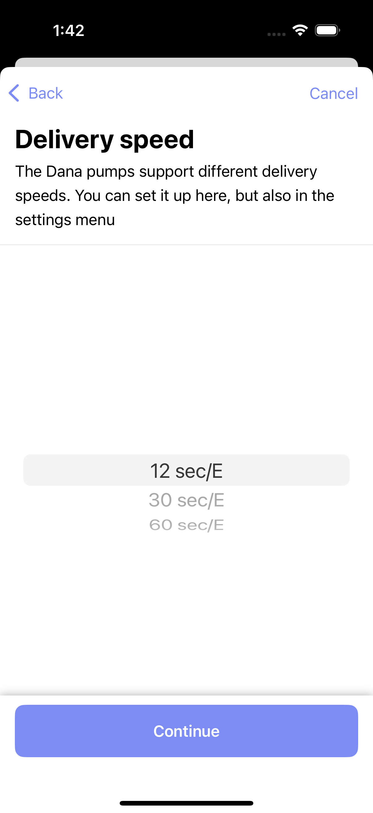{ width="300px"  }
{align=center}

**Step 7**
Select your pump from the list of found pumps

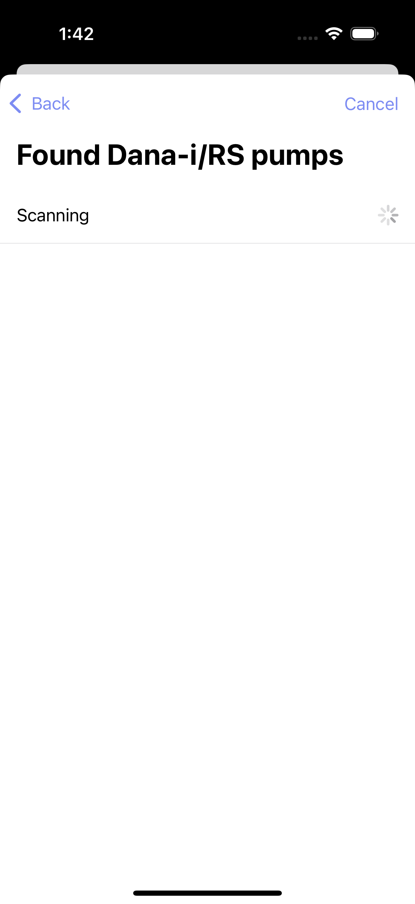{ width="300px"  }
{align=center}

**Step 8**
Continue to [Connect CGM](cgm.md) _OR_ return to [New User Setup](../../new_user_setup.md)

- - -

### Pump Simulator

!!! warning
    If using a pump simulator, it is important to understand:
     
    - You will only experience the user interface of Trio.
    - Using a pump simulator does not indicate how the app will perform, nor will it give accurate guidance or suggestions for insulin dosing.
    - Trio may not run consistently in the background when using a pump simulator
    - **Only use a pump simulator if you understand the conditions above.**
    
**Step 3**
Choose from the variety of simulator pump options and tap "Done" in the upper right corner to activate the pump simulator

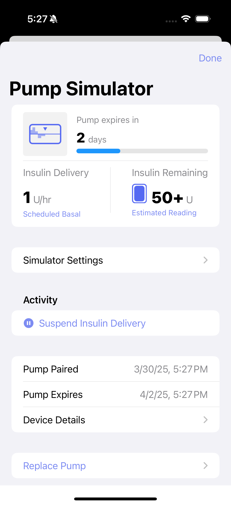{ width="300px"  }
{align=center}

**Step 4**
Continue to [Connect CGM](cgm.md) _OR_ return to [New User Setup](../../new_user_setup.md)

- - -
