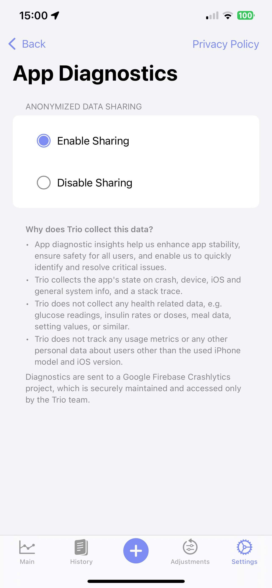

# App Diagnostics ✏️

## Crash Reporting

**Default:** _ON_  

Crash Reporting (Opt-In by default, with ability to Opt-Out).

Read the [Trio Privacy Policy](https://github.com/nightscout/Trio-dev/blob/dev/PRIVACY_POLICY.md).

When activated, Trio’s App Diagnostics feature automatically captures anonymized crash reports so the developers can keep the app stable and safe.

The captured data **never** includes personal or health information.  
No glucose values, insulin data, meals, settings, or usage analytics are collected.  

Crash reports are sent securely to the team’s private **Google Firebase Crashlytics** project, where **only the Trio developers can view them and use them to identify and fix critical issues quickly**.

{width="500"}
{align="center"}

