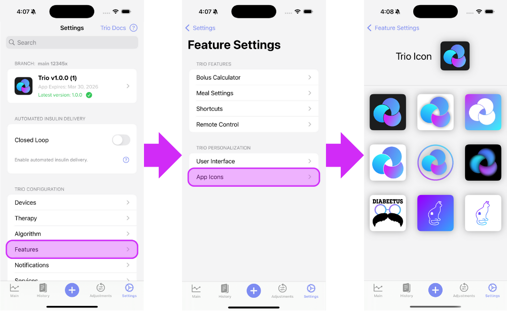

# App Icons

Trio has multiple different icons to choose from.

To change the Trio icon to suit your homescreen you can go to Settings -> Features -> App Icons and select your prefered Trio icon.

{width="600"}
{align="center"}

