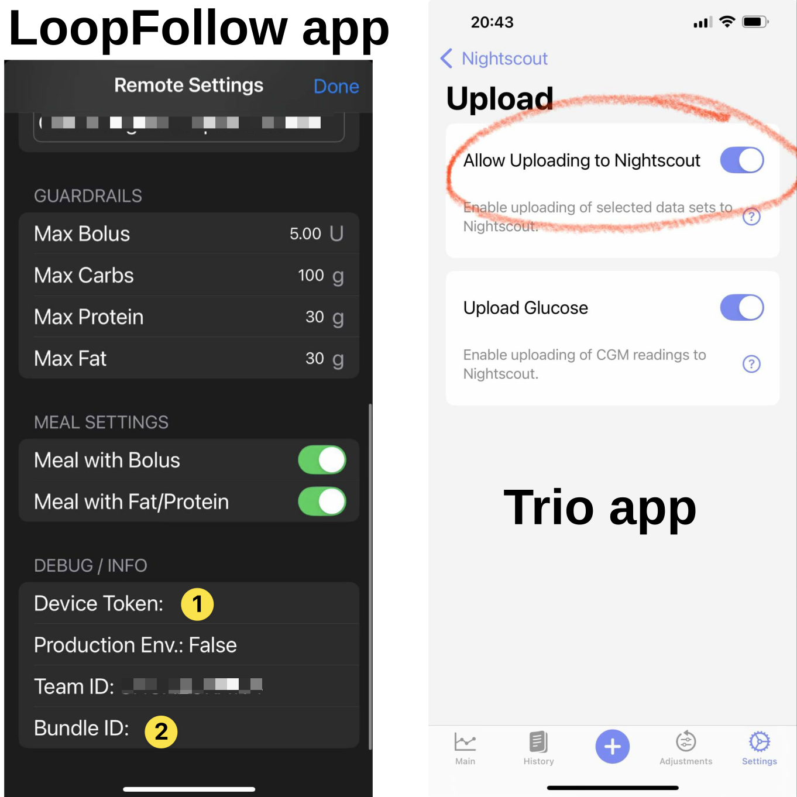
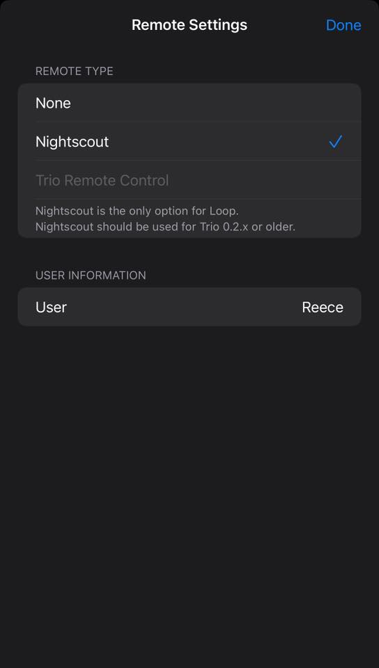
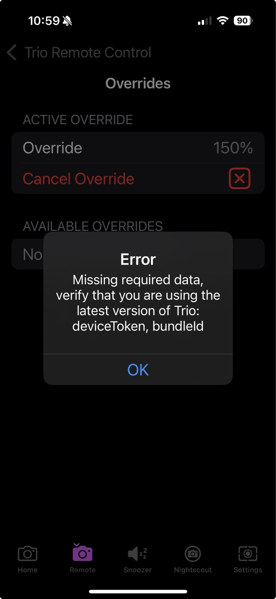

## Remote Control Overview

Trio can accept remote commands from *Nightscout* or from *LoopFollow*. There are a variety of options, but the final control of whether remote commands will be enacted rests with the Trio user. They can enable or disable remote control.

!!! warning "*Nightscout* version must be 15.0.2 or newer"
    To properly display the OpenAPS pill with Trio 0.5.x (or newer), your *Nightscout* version must be 15.0.2 (or newer). If you do not see the expected treatments or pills in the *Nightscout* dashboard, follow the steps to [Configure for OpenAPS](#configure-for-openaps).

The most powerful arrangement, for Trio 0.5.x (or newer), is to configure the *LoopFollow* app to use the Trio Remote Control (TRC) setting.

The limited use of remote control with *Nightscout*, i.e., entry of Carb Correction and Temporary Targets when Careportal is authenticated, continues to be supported with Trio.

| *Nightscout* URL or App | Options|
|:--|:--|
| ***Careportal*** | Carb Correction Temporary Target Temporary Target Cancel |

Additional remote capabilities are offered for Trio using the *LoopFollow* app with these versions:

* Trio 0.5.x (or newer)
* *LoopFollow* version 2.4.0 (or newer)

| *LoopFollow* Remote Type | Options|
|:--|:--|
| ***Nightscout*** | Set and Cancel Temp Target |
| **Trio Remote Control** | Meal (Carbs or Carbs & Bolus) Bolus Temp Target Overrides |

??? question "How does this differ from Trio 0.2.x?"
    Trio can use *Nightscout* Careportal to enter `Carb Correction`, and start and cancel `Temporary Target`.
    
    * This was available in Trio 0.2.x and continues to be available in Trio 0.5.x (or newer).

    Trio 0.2.x supported other remote options (using announcements via Careportal). 
    
    * Those options were replaced by the more secure Trio Remote Control for Trio 0.5.x (or newer)
    * **Using announcements to provide remote control of the Trio phone is no longer supported**

- - -

## Trio Remote Control

**Default:** _OFF_

Remote control must be enabled on the Trio phone or no remote information is accepted by the Trio phone.

> You can search for this screen in Trio settings or go through the sequence: Trio, Settings, Features, Remote Control.

Once Remote Control is enabled, a Shared Secret is available. This is only used if you want to [Configure *LoopFollow* Trio Remote Control](#configure-loopfollow-trio-remote-control).

{width="300"}
{align="center"}

When Remote Control is enabled on the Trio app and the *LoopFollow* phone is properly configured, you can add carbs, send boluses, set or cancel overrides or temporary targets from the *LoopFollow* phone to the Trio phone via *Apple* push notifications.

The `SHARED SECRET` should be copied from the Trio phone and added to the [`Shared Secret`](#shared-secret) row of the *LoopFollow* Remote Settings screen as part of the configuration for using *LoopFollow*.

!!! warning "Important"
    The ability for the Trio app to be remotely controlled will be **disabled** when `Enable Remote Control` is turned OFF, even if you have *LoopFollow* configured with the correct shared secret or your *Nightscout* URL has Careportal access. This is for the protection of the Trio user, so that they **always** are the primary controller of their insulin dosing app.

- - -

## *LoopFollow* Overview

The most flexible remote control for a caregiver to help their loved one is to use the *LoopFollow* app on the caregiver's phone. It is available only for iOS devices: iPhone, iPad or Mac.

The remote commands are sent from the *LoopFollow* phone to the *Trio* phone using Apple Push Notifications. A real-time response is returned to the *LoopFollow* phone for most cases with either success or failure, with the reason.

The documentation for *LoopFollow* can be reached by typing `loopfollowdocs.org` in a browser.

To configure *LoopFollow* for *Trio Remote Control*, read these two pages in detail:

* [LoopFollowDocs: Remote Control Overview](https://loopfollowdocs.org/remote/remote-control-overview/)
* [LoopFollowDocs: Trio Remote Control](https://loopfollowdocs.org/remote/remote-control-trio/)

- - -

## Use *LoopFollow* Trio Remote Control

Once the *LoopFollow* phone is configured, and while the Trio phone is handy, test sending Remote Commands. It is good to also have a browser open with the *Nightscout* site displayed.

Remember to give the system time to update.

The sequence for a remote command is 

* *LoopFollow* sends the command via *Apple Push Notifications* (APNS)
* *Apple Push Notifications* passes the command to *Trio*
    * *Trio* performs additional safety checks and either accepts or rejects the command
* *Trio* sends a real-time response via *Apple Push Notifications*
* *Apple Push Notifications* sends the response to the *LoopFollow* phone

*Trio* also uploads the treatments to *Nightscout* and *LoopFollow* presents those treatments on the *LoopFollow* mainb screen.

*LoopFollow* also provides logs and reports for these treatements.

{width="300"}
{align=center}

### Remote Meal

The Remote Meal command allows you to log carbohydrates (and optionally fat and protein) to Trio from LoopFollow, with or without an accompanying bolus.

#### How to Send a Remote Meal

1. Open LoopFollow and tap the Remote Control button
2. Select "Meal" from the command options
3. Enter the meal details:
    - **Carbs** (required): Grams of carbohydrates
    - **Fat** (optional): Grams of fat
    - **Protein** (optional): Grams of protein
    - **Bolus** (optional): Units of insulin to deliver with the meal
    - **Schedule** (optional): Time to log the carbs (for pre-bolusing)
4. Tap "Send" to transmit the command

#### What Happens When Trio Receives a Meal Command

1. **Validation**: Trio checks that:
    - At least one macronutrient (carbs, fat, or protein) is provided
    - Carbs don't exceed your Max Carbs setting
    - Fat doesn't exceed your Max Fat setting
    - Protein doesn't exceed your Max Protein setting
    - No newer carb entries exist (prevents accidental duplicates)

2. **Carb Entry Creation**: Trio creates a carb entry with:
    - The macronutrients you specified
    - A note: "Remote meal command"
    - FPU (Fat Protein Units) enabled if fat OR protein is present
    - Scheduled time (if provided)

3. **Bolus Delivery** (if bolus amount was included):
    - The bolus is delivered immediately (even if the meal is scheduled)
    - Bolus validation checks are performed (see Remote Bolus section)

4. **Response Notification**: *Trio* sends a success or failure notification to *LoopFollow* via APNS

5. **Upload to Nightscout**: The meal entry is logged to Nightscout for your records

!!! warning "Scheduled Meals with Bolus"
    When entering meals and choosing to schedule the meal, any bolus included in the meal is enacted immediately. Only the carb entry is entered according to the schedule.

#### Safety Features

- **Duplicate Prevention**: Won't log carbs if a newer entry already exists
- **Limit Enforcement**: Respects your Max Carbs, Max Fat, and Max Protein settings
- **FPU Calculation**: Automatically enables Fat Protein Units for low-carb, high-fat/protein meals
- **Nightscout Logging**: All remote meals are logged for audit trail

#### Use Cases

- **Pre-bolusing**: Schedule a meal for 15-30 minutes in the future while delivering insulin now
- **Macronutrient Tracking**: Log fat and protein for better extended bolus calculations
- **Meal + Bolus**: Deliver a complete meal bolus remotely in one command
- **Caregiver Support**: Parents can log meals for children at school

When entering meals and choosing to schedule the meal, any bolus included in the meal is enacted immediately. Only the carb entry is entered according to the schedule.

{width="300"}
{align=center}

### Remote Bolus

The Remote Bolus command allows you to deliver insulin remotely via LoopFollow. This is one of the most powerful remote features and includes multiple safety checks.

#### How to Send a Remote Bolus

1. Open LoopFollow and tap the Remote Control button
2. Select "Bolus" from the command options
3. Enter the bolus amount in units (U)
4. Tap "Send" to transmit the command

#### What Happens When Trio Receives a Bolus Command

1. **Validation**: Trio performs comprehensive safety checks:
    - Bolus amount is provided and greater than 0
    - Bolus amount doesn't exceed your Max Bolus setting
    - Current IOB (Insulin on Board) is calculable
    - Current IOB + bolus amount doesn't exceed Max IOB
    - No recent bolus >20% of the requested amount in the last 10 minutes
    - APSManager is available and functioning

2. **Insulin Delivery**: If all checks pass:
    - Trio sends the bolus command to your insulin pump
    - The pump delivers the insulin
    - Trio monitors the delivery for completion

3. **Response Notification**: *Trio* sends a success or failure notification to *LoopFollow* via APNS

4. **Upload to Nightscout**: The bolus is logged to Nightscout with:
    - Amount delivered
    - Timestamp
    - Note indicating it was a remote command

#### Safety Features

**Max Bolus Protection**
Your Max Bolus setting (configured in Trio settings) prevents delivery of dangerously large boluses. A remote bolus request exceeding this limit will be rejected.

**Example**: If Max Bolus = 10 U, a remote request for 12 U will fail with error message.

**Max IOB Protection**
Trio calculates your current Insulin on Board and ensures the new bolus won't exceed your Max IOB safety limit.

**Formula**: `Current IOB + Requested Bolus ≤ Max IOB`

**Example**:
- Current IOB: 8 U
- Max IOB: 12 U
- Remote bolus request: 5 U
- Result: REJECTED (8 + 5 = 13 U, which exceeds 12 U limit)

**Duplicate Bolus Prevention**
Trio checks for recent boluses in the last 10 minutes. If a bolus greater than 20% of the requested amount was recently delivered, the remote command is rejected.

**Example**:
- Remote request: 5 U
- Recent bolus (8 minutes ago): 4.5 U
- 20% of 5 U = 1 U
- Since 4.5 U > 1 U, the request is REJECTED as a likely duplicate

**Purpose**: Prevents accidental double-dosing if LoopFollow doesn't immediately reflect a bolus you just delivered manually.

**Time Window Validation**
All remote commands include a timestamp. Trio rejects commands that are:
- More than 10 minutes old (prevents replay attacks)
- From the future (prevents clock manipulation)

#### Error Messages

If a remote bolus fails, you'll receive a notification explaining why:

| Error | Meaning | Action |
|-------|---------|--------|
| "Bolus amount exceeds max bolus" | Requested bolus > Max Bolus setting | Reduce bolus amount or increase Max Bolus in settings |
| "IOB would exceed max IOB" | Current IOB + bolus > Max IOB | Wait for IOB to decrease, or increase Max IOB |
| "Recent bolus detected" | Similar bolus in last 10 minutes | Wait 10 minutes or verify this isn't a duplicate |
| "APSManager unavailable" | Trio can't access pump | Check Trio app is running and pump is connected |
| "Command too old" | Timestamp > 10 minutes ago | Check phone clocks are synchronized; resend command |

#### Use Cases

- **Meal Boluses**: Deliver insulin for meals when away from phone
- **Correction Boluses**: Correct high blood sugar remotely
- **Caregiver Support**: Parents can dose insulin for children
- **Emergencies**: Deliver insulin if user can't access their phone

!!! danger "Important Safety Note"
    Remote bolus is a powerful feature that delivers real insulin. Always:

    - Verify the bolus amount before sending
    - Check current blood glucose and IOB before sending
    - Ensure the user is aware a bolus is being sent
    - Have emergency glucagon available
    - Never use remote bolus as a prank or without authorization

### Temp Target

The Temp Target command allows you to set or cancel temporary glucose targets remotely via LoopFollow.

#### How to Set a Remote Temp Target

1. Open LoopFollow and tap the Remote Control button
2. Select "Temp Target" from the command options
3. Enter the temp target details:
    - **Target**: Desired glucose target in mg/dL (or mmol/L)
    - **Duration**: How long the target should be active (in minutes)
4. Tap "Send" to transmit the command

#### What Happens When Trio Receives a Temp Target Command

1. **Validation**: Trio checks that:
    - Target value is provided and valid
    - Duration is provided and greater than 0

2. **Temp Target Creation**: Trio creates a temporary target with:
    - `targetTop` and `targetBottom` both set to the specified target
    - Duration in minutes
    - Custom name indicating it's a remote target
    - Marked as a "local" entry

3. **Storage**: The temp target is saved to Trio's temp target storage

4. **Sync to Nightscout**: The temp target is uploaded to Nightscout

5. **UI Update**: Trio posts notifications to update the UI immediately

6. **Response Notification**: LoopFollow receives confirmation

#### How to Cancel a Remote Temp Target

1. Open LoopFollow and tap the Remote Control button
2. Select "Cancel Temp Target" from the options
3. Tap "Send" to transmit the command

#### What Happens When Canceling

1. **Fetch Active Targets**: Trio retrieves all currently active temp targets
2. **Create End Records**: For each active temp target, Trio creates a `TempTargetRunStored` record marking it as ended
3. **Disable All**: All active temp targets are marked as disabled
4. **Sync to Nightscout**: Changes are uploaded
5. **UI Update**: Trio interface updates to show no active temp targets

#### Common Temp Target Values

| Target | Use Case |
|--------|----------|
| **80-100 mg/dL** | Before meals (tighter control) |
| **110-120 mg/dL** | Sleeping/overnight (prevent lows) |
| **140-160 mg/dL** | Exercise (prevent lows) |
| **120-130 mg/dL** | After meals (less aggressive corrections) |

!!! tip "Temp Targets and Algorithm Behavior"
    Temporary targets affect how Trio delivers insulin:

    - **Higher targets** → Less aggressive insulin delivery, fewer/smaller SMBs
    - **Lower targets** → More aggressive insulin delivery, more/larger SMBs
    - Temp targets override your normal target glucose setting
    - Trio respects your safety limits (Max IOB, Max SMB) regardless of temp target

#### Use Cases

- **Exercise**: Set higher target before/during exercise to prevent lows
- **Sleep**: Set higher target at bedtime for peace of mind
- **Pre-meal**: Set lower target before eating to achieve tighter control
- **Illness**: Adjust targets when sick
- **Cancel**: Return to normal targets anytime

### Overrides

The Override command allows you to activate or cancel override presets remotely via LoopFollow. Overrides are powerful tools that simultaneously adjust multiple settings (insulin sensitivity, basal rates, carb ratios, and targets) based on predefined presets.

#### Prerequisites

Before using remote overrides, you must:

1. **Create Override Presets** in Trio:
    - Go to Trio Settings → Overrides
    - Create and name your override presets (e.g., "Exercise", "Sick Day")
    - Configure the percentage adjustments for each preset

2. **Configure LoopFollow** with the exact preset names

#### How to Start a Remote Override

1. Open LoopFollow and tap the Remote Control button
2. Select "Start Override" from the command options
3. Select the override preset from the dropdown (must match a preset name in Trio)
4. Tap "Send" to transmit the command

#### What Happens When Trio Receives a Start Override Command

1. **Validation**: Trio checks that:
    - Override name is provided and not empty
    - Override name matches an existing preset (exact match, case-sensitive)

2. **Fetch Presets**: Trio retrieves all override presets from storage

3. **Find Matching Preset**: Searches for a preset with the exact name specified

4. **Disable Other Overrides**: All currently active overrides are disabled first

5. **Enable Requested Override**: The matching override preset is:
    - Enabled
    - Timestamp set to current time
    - Marked as not yet uploaded to Nightscout

6. **Save to Core Data**: Changes are persisted

7. **UI Update**: Trio posts notifications to refresh the UI

8. **Upload to Nightscout**: The active override is logged

9. **Response Notification**: LoopFollow receives confirmation

#### How to Cancel a Remote Override

1. Open LoopFollow and tap the Remote Control button
2. Select "Cancel Override" from the options
3. Tap "Send" to transmit the command

#### What Happens When Canceling

1. **Fetch Active Overrides**: Trio retrieves all currently active overrides
2. **Create End Records**: For each active override, Trio creates an `OverrideRunStored` record marking it as ended
3. **Disable All**: All active overrides are marked as disabled
4. **Sync to Nightscout**: Changes are uploaded
5. **UI Update**: Trio returns to normal settings

#### How Overrides Work

Overrides modify your therapy settings by percentage:

| Setting | Override Adjustment | Effect |
|---------|---------------------|--------|
| **Insulin Sensitivity (ISF)** | Percentage multiplier | 50% = half the insulin, 200% = double the insulin |
| **Basal Rates** | Percentage multiplier | 150% = 1.5x normal basal |
| **Carb Ratios** | Percentage multiplier | 75% = less insulin per carb |
| **Target Glucose** | Override target value | Completely replaces normal target |

**Example "Exercise" Override**:
- ISF: 150% (more sensitive, less insulin)
- Basal: 75% (reduced basal delivery)
- CR: 120% (less insulin for carbs)
- Target: 140 mg/dL (higher target to prevent lows)

**Example "Sick Day" Override**:
- ISF: 50% (more resistant, more insulin)
- Basal: 150% (increased basal delivery)
- CR: 80% (more insulin for carbs)
- Target: 110 mg/dL (tighter control)

#### Override Preset Name Matching

!!! warning "Exact Match Required"
    The override name sent from LoopFollow must **exactly match** a preset name in Trio:

    - Case-sensitive: "Exercise" ≠ "exercise"
    - Spacing matters: "Sick Day" ≠ "SickDay"
    - Spelling must be exact

    If no match is found, the command will fail with an error message.

#### Use Cases

- **Exercise**: Activate exercise mode remotely before/during physical activity
- **Illness**: Switch to sick day settings when user is unwell
- **Travel**: Adjust settings for time zone changes or schedule disruptions
- **Stress**: Modify insulin delivery during stressful periods
- **Menstrual Cycle**: Adjust for hormonal changes
- **Cancel**: Return to normal settings anytime

#### Safety Considerations

- **Overrides are powerful**: They affect multiple settings simultaneously
- **Test first**: Test override presets locally before using remotely
- **Monitor closely**: Watch glucose trends closely when an override is active
- **Duration**: Consider setting automatic duration limits on override presets
- **Communication**: Ensure the user knows when an override is activated remotely

#### Troubleshooting

| Issue | Cause | Solution |
|-------|-------|----------|
| "Override not found" | Name doesn't match any preset | Check spelling and capitalization in both Trio and LoopFollow |
| "Failed to enable override" | Trio can't access storage | Restart Trio app and try again |
| Override not taking effect | Override successfully activated but settings unchanged | Verify the override preset has non-zero percentage adjustments configured |

- - -

## Troubleshooting

This section covers known troubleshooting issues:

* *Nightscout* not displaying Trio data: [Configure for OpenAPS](#configure-for-openaps)
* Was able to select Trio Remote Control in *LoopFollow* but it is no longer working: [Stop *Nightscout* access from the *Loop* app](#stop-nightscout-access-from-the-loop-app)
* Cannot select Trio Remote Control in *LoopFollow*: [Update Profile](#update-profile)

### Configure for OpenAPS

The *Nightscout* version must be 15.0.2 (or newer) to properly display the OpenAPS pill with Trio 0.5.x (or newer). Check your revision: *Nightscout* URL, Menu, scroll to bottom and examine the About section.

If you transitioned from the *Loop* app, you must make some modifications to *Nightscout* before you will be successful viewing your Trio data in your *Nightscout* site.

In *Nightscout*, you need to modify these config vars:

| Config Var | `Loop` |    `Trio` |
|:--|:--|:--|
| `ENABLE` | `loop` | `openaps` |
| `SHOW_PLUGINS` | `loop` | `openaps` |
| `SHOW_FORECAST` | `loop` | `openaps` |

Remember to restart the *Nightscout* server (restart dynos) after updating these variables.

### Stop *Nightscout* access from the *Loop* app

If you were previously running the *Loop* app:

* Remove *Nightscout* from *Loop* Services
* Add *Nightscout* credentials to Trio
    * You need the URL and the API_SECRET.

In addition to this step, you may need to force the profile (from Trio) to upload to *Nightscout* and overwrite the one stored as the default profile in *Nightscout*.

### Update Profile

!!! warning "Must on Trio 0.5.x (or newer)"
    If you are on Trio 0.2.x, you might see the option for Trio Remote Control in *LoopFollow* Remote Settings, but you can't use it. See [Use *LoopFollow* *Nightscout* Remote Control](#use-loopfollow-nightscout-remote-control).

If you were previously running the *Loop* app, take the actions in the [previous section](#stop-nightscout-access-from-the-loop-app) and then force the profile to update.

To force a profile to update to *Nightscout*, go to the Trio app and toggle Allow Uploading to Nightscout off (disable) and then enable it again.

Once the user has toggled "Allow Uploading to Nightscout", *LoopFollow* needs to be refreshed (pull down glucose value to refresh) or re-started in order to fetch the correct information. *LoopFollow* will refresh eventually, but most users are impatient.

If the Debug Info in *LoopFollow* is missing a Device Token or a Bundle ID, as shown on the left side of the graphic, you need to make sure the *Loop* app is no longer uploading to *Nightscout* and force the profile to update.

{width=600}
{align=center}

### Trio Remote Control Stops Working

Other signatures that you need to [force the update](#update-profile) are shown in the graphics below - for both these instances, Trio Remote Control (TRC) was working with *LoopFollow* and then stopped working:

| TRC Option Not Allowed | TRC Error |
|:-:|:-:|
| {width="300"} | {width="300"} |

- - -

## Build *LoopFollow*

The *LoopFollowDocs* have complete build instructions:

* [LoopFollowDocs: Build Options](https://loopfollowdocs.org/build/build-options/)
