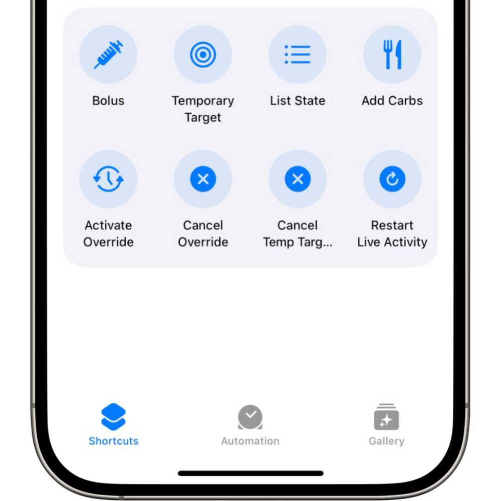

# Shortcuts

{width="400"}
{align="center"}

## Allow Bolusing with Shortcuts
**Default:** _OFF_  

Enabling this setting allows the iOS Shortcuts App to send bolus commands to Trio.

!!! tip
    Disabling this setting will still allow other Shortcut commands, like Temp Targets, Add Carbs, and Start/End Overrides.

- - -

## Available Shortcut actions: 

- [Bolus](#bolus) (if [enabled](#allow-bolusing-with-shortcuts))
- [List State](#list-state)
- [Add Carbs](#add-carbs)
- [Activate Override](#activate-override)
- [Cancel Override](#cancel-override)
- [Temporary Target](#temporary-target)
- [Cancel Temporary Target](#cancel-temporary-target)
- [Restart Live Activity](#restart-live-activity)

- - -

### Bolus

If [Allow Bolusing with Shortcuts](#allow-bolusing-with-shortcuts) is enabled, you will be able to use shortcuts to deliver a bolus.

- - -

### List State

Shows the last glucose reading, glucose trend arrow, time since last reading, and glucose delta. It also shows current IOB and COB.

- - -

### Add Carbs

Adds a carb entry into Trio.  

!!! tip
    You can only add a carb entry using shortcuts. You cannot add a fat or protein entry.

- - -

### Activate Override

Activates a chosen preset override.  

!!! tip
    You must first save the Preset Override on the [Adjustments](../../../usage/interface.md#action-buttons) screen before you can activate an override using Shortcuts.

- - -

### Cancel Override

Cancels an already set override.

- - -

### Temporary Target
    
Activates a chosen preset temp target.  

!!! tip
    You must first save the Preset Temp Target on the [Adjustments](../../../usage/interface.md#action-buttons) screen before you can activate a temp target using Shortcuts.

- - -

### Cancel Temporary Target

Cancels and already active temp target.

- - -

### Restart Live Activity

Restarts Trio's live activity.

- - -

<!--TODO: Add a How to use Shortcuts & Automations page and reference it here-->
