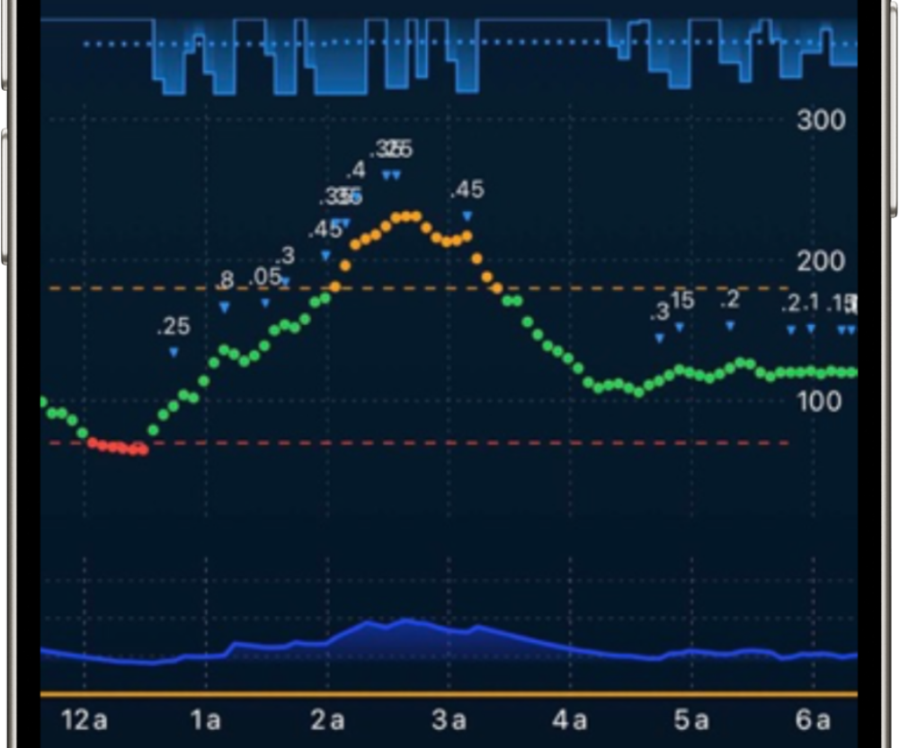
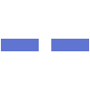
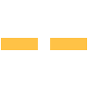
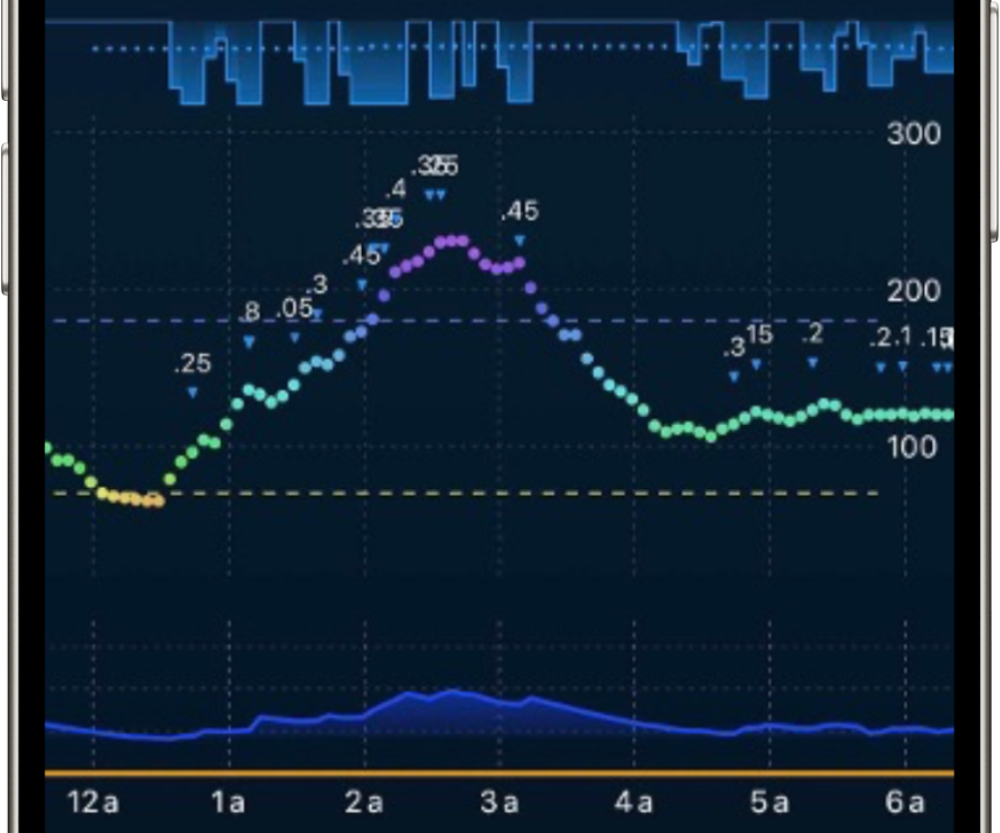

# User Interface Settings Menu

{width="600"}
{align="center"}

## Appearance
**Default:** _System Default_

### Options
**System Default:**  
This option follows the phone's current color scheme.

**Light:**  
Always in Light Mode

**Dark:**  
Always in Dark Mode

- - -

## Glucose Color Scheme
**Default:** _Static_  

### Options
**Static:**  
This option uses orange, green, and red to indicate where the glucose reading falls on the range set.  

!!! info inline "Threshold Graph Legend"
    
    {width="15" style="vertical-align: middle;"}  High Threshold   
    {width="15" style="vertical-align: middle;"}  Low Threshold  
    :fontawesome-solid-circle:  Above Range Glucose  
    :fontawesome-solid-circle:  In Range Glucose  
    :fontawesome-solid-circle:  Below Range Glucose      
            
{width="250"}
        {align="left"}

**Dynamic:**  
This option uses the color wheel to indicate where the glucose reading falls in relation to your target glucose.  
_*The colors of the threshold lines are also dynamic, so the exact coloring will depend on your settings_ 

!!! info inline "Threshold Graph Legend"
    
    {width="15" style="vertical-align: middle;"}  High Threshold (=180)  
    {width="15" style="vertical-align: middle;"}  Low Threshold (=70)  
    {width="15" style="vertical-align: middle;"}  Above Target  
    {width="15" style="vertical-align: middle;"}  At or Near Target  
    {width="15" style="vertical-align: middle;"}  Below Target  
        
{width="250"}
{align="left"}

- - -

## Axis Grid Lines  

### Show X-Axis Grid Lines
**Default:** _ON_  
Choose whether or not to display the X-Axis (horizontal) grid lines on the glucose graph.  

### Show Y-Axis Grid Lines
**Default:** _ON_  
Choose whether or not to display the Y-Axis (vertical) grid lines on the glucose graph.  

- - -

## Show Low and High Thresholds
**Default:** _ON_  
This setting displays the upper and lower values for your glucose target range.  

### Low Threshold
**Default:** _70 mg/dL (3.9 mmol/L)_  
The lower value of your displayed glucose target range.  

### High Threshold
**Default:** _180 mg/dL (10mmol/L)_  
The upper value of your displayed glucose target range.  

!!! tip
    This range is for display and statistical purposes only and does not influence insulin dosing.

- - -

## Forecast Display Type
**Default:** _Cone_  
This setting allows you to choose between the Cone of Uncertainty (Cone) and OpenAPS Forecast Lines (Lines) for the glucose forecast display. Descriptions for each option found below.  

### Options
**Cone (of Uncertainty):**  
<!-- TODO: Add image -->
Uses a combines range of all possible forecast from the OpenAPS lines and provides you with a range of possible forecasts. This option has shown to reduce confusion and stess around algorithm forecasts by providing a less concerning visual representation.

**Lines:**
<!-- TODO: Add image -->
Uses the IOB, COB, UAM, and ZT forecast lines from the OpenAPS (Oref) Algorithm used in Trio. This option provides a more detailed view of the algorithm's forecast and may be more or less helpful depending on the user's preference.

- - -

## eA1c Display Unit
**Default:** _Percent_  
Choose which format you'd prefer the eA1c (estimated A1c) value to be displayed as. Choose between percentage (Ex: 6.5%) or mmol/mol (Ex: 48 mmol/mol).

### Options
**Percent** or **mmol/mol**

- - -

## Show Carbs Required Badge
**Default:** _OFF_  
Turning this on will show the grams of carbs needed to prevent a low as a notification badge on the Trio home screen, located above the main icon.  

### Carbs Required Threshold
If `Show Carbs Required Badge` is enabled, this setting will appear. Set this to the lowest number of carbs you'd like to be recommended. A recommendation will not be given if the carbs required is below this number.  

!!! tip
    The carb suggested with this feature are to be used as a recommendation, not as a requirement. Depending on the current accuracy of your sensor and the accuracy of your settings, the suggested carbs can vary widely from what is actually required. Ultimately, use your best judgement before ingesting the suggested quantity of carbs.

- - -
