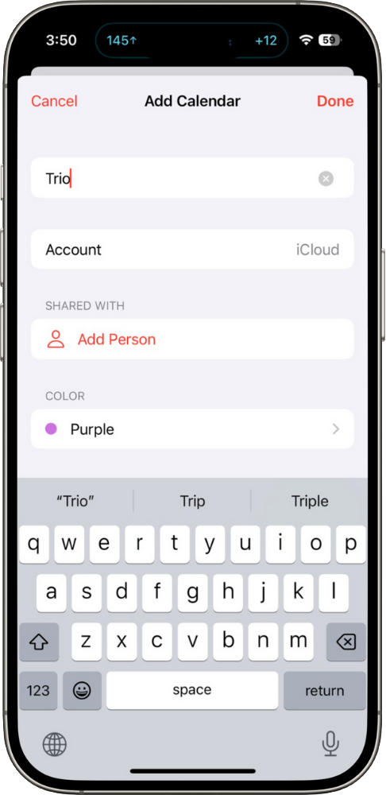

# Calendar Events

## Create Events in Calendar
**Default:** _OFF_

When enabled, Trio will create a customizable calendar event to keep you notified of your current glucose reading with every successful loop cycle.  

After this setting is turned on, the available customizations will appear. You can customize with the [calendar](#choose-calendar) of your choosing, use of [emoji labels](#display-emojis-as-labels), and the inclusion of [IOB and COB data](#display-iob-and-cob).

!!! info
    Once a new calendar event is created, the previous event will be automatically deleted

!!! note
    This is useful if you use CarPlay or a variety of other external services that limit the view of most apps, but allow the calendar app.

- - - 

### Choose Calendar
**Default:** _OFF_

Here you see all the available calendars as a drop down menu that you can use for Calendar Events.  

It is recommended that you start a specific calendar to be used only for Trio Calendar Events.

**To create a Trio calendar:**  
_Step 1_: In your phone's settings, open the calendar app. At the bottom, tap "Calendars" and then "Add Calendar" also at the bottom. Follow the prompts to create a calendar labeled "Trio". And tap "Done" to create a Trio calendar.

{ width="300px" }
{ align=center }

_Step 2_: Once you've created a Trio calendar, you can return to this setting in the Trio app and select the Trio calendar from the drop down menu.

!!! important
    Selecting a calendar that you use for other events can result in invitations being auto-declined. It is best to have a separate calendar for only Trio Calendar Events to prevent any unintended conflicts.

- - - 

### Display Emojis as Labels
**Default:** _OFF_

When enabled, the calendar event created will indicate where the current glucose reading is in relation to your [statistical target range](../features/user_interface.md#show-low-and-high-thresholds).

🟠 = Above Range Glucose  
🟢 = In Range Glucose  
🔴 = Below Range Glucose  

If [Display IOB and COB](#display-iob-and-cob) is also enabled, the words "IOB" and "COB" will be replaced with emojis.

💉 = IOB  
🥨 = COB

- - -

### Display IOB and COB
**Default:** _OFF_

When enabled, Trio will include the current IOB and COB values below the current glucose reading with each calendar event created.

- - -
