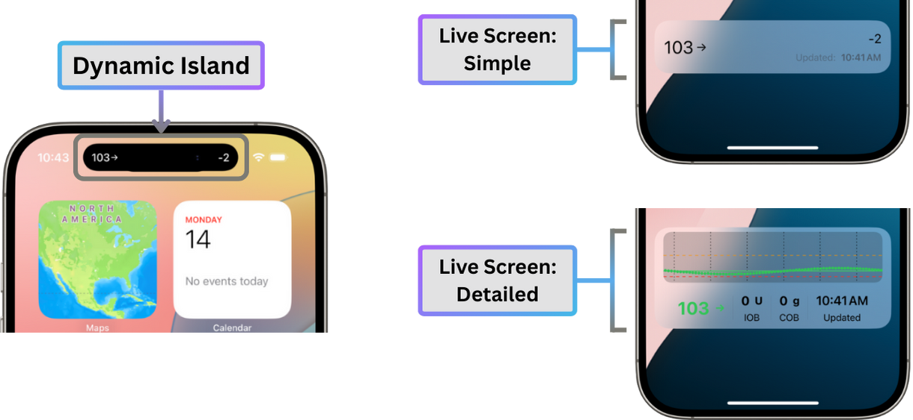
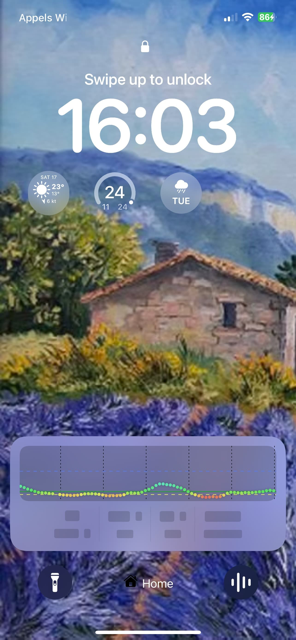
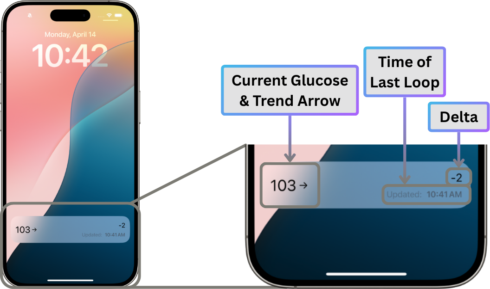
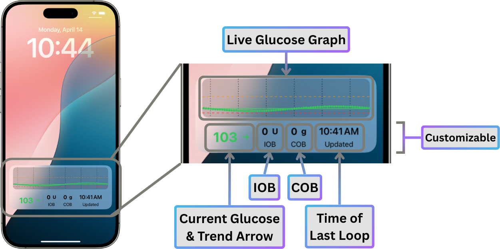
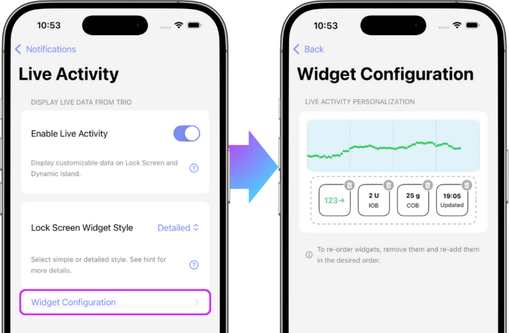

# Live Activity

## Enable Live Activity
**Default:** _OFF_

With Live Activities enabled, Trio displays your current data on your phone's Lock Screen and the Dynamic Island. Once this is enabled, you will have the option to choose either a "Simple" Display or "Detailed" Display with the setting [Live Screen Widget Style](#live-screen-widget-style).

{ width="600px" }
{ align=center }

!!! tip "Fix hidden Live Activity values on lock screen"
    
    If Trio Live Activities appear greyed out when your iPhone is locked and you want them to remain visible at all times, you need to adjust [this setting](#show-live-activity-values-on-locked-iphone).

### Show Live Activity Values on Locked iPhone

If **Trio Live Activities appear greyed out (blurred/hidden) when your iPhone is locked**, this is caused by a privacy setting in iOS.

{align="center"}

To show all Live Activities even when the phone is locked:

- Open the Apple **Settings** app.
- Tap **`Face ID & Passcode`**.
- Enter your passcode if prompted.
- Scroll down to the **`Allow Access When Locked`** section.
- Enable the toggle for **Live Activities**.

!!! info "This setting affects all apps"
    
    Once enabled, Live Activities from Trio—and other apps—will be shown on the Lock Screen.

- - -

## Live Screen Widget Style
**Default:** _Simple_

Customize your Live Activity Widget by choosing between "Simple" or "Detailed"  

You'll find more details on both "Simple" and "Detailed" styles below:

=== "Simple"
    Trio's simple widget displays your current glucose reading, trend arrow, delta, and the timestamp of the current reading.  
    
    { width="500px" }
    { align=center }
    
=== "Detailed"
    The detailed widget displays your live glucose graph.  
    
    { width="600px" }
    { align=center }
    
    You also have the ability to customize what information is provided below the graph and the order it is displayed, including:
    
    - Current glucose reading & trend arrow
    - IOB
    - COB
    - Time of Last Loop Cycle
    
    Choosing "Detailed" will expose a Widget Configuration option. When selected, you'll have multiple configurations to choose from.  

    { width="400px" }
    { align=center }
    

- - -

