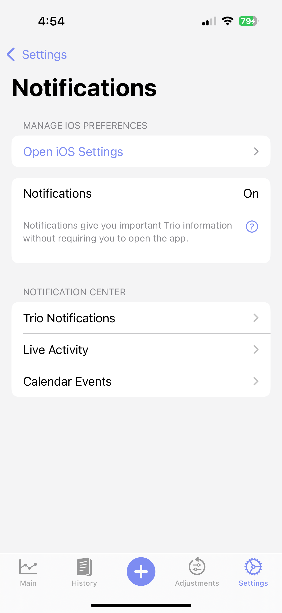
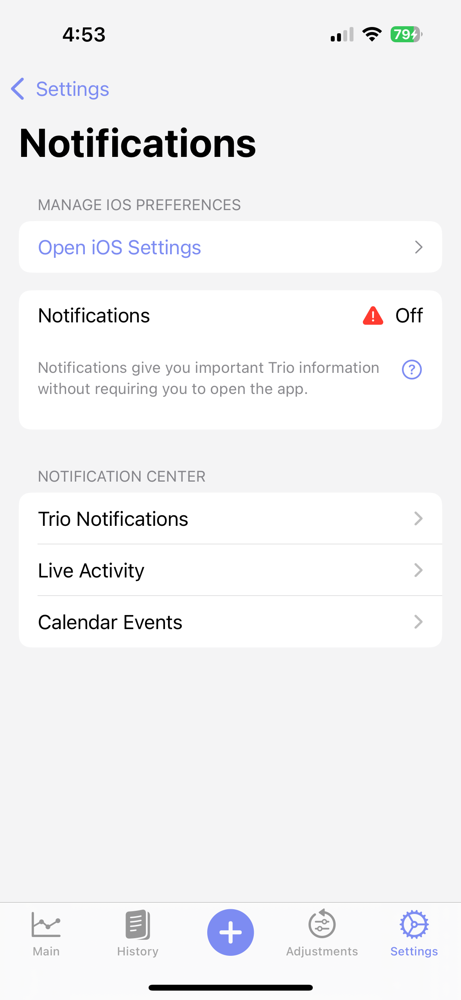
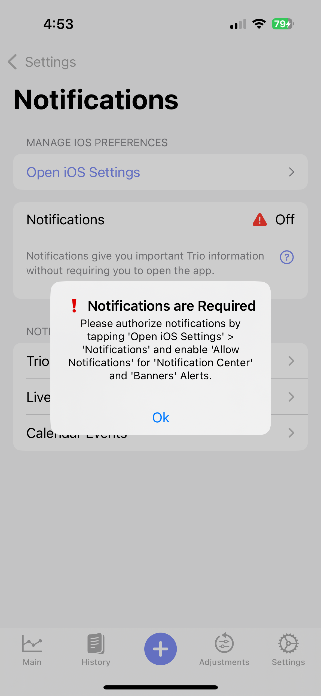
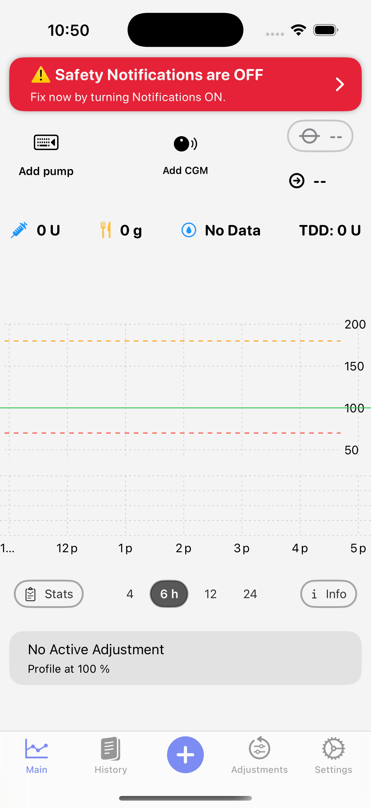

# Trio Notifications
Notifications give you important Trio information without requiring you to open the app. It is essential that these are allowed in your iPhone system settings. You can futher tailor them to your needs in this section.

=== "Notifications ON"
    You are good to go! Your notifications are turned on. Proceed to the 3 notification options on the app screen to customize your app notifications.
    
    { width="200px" }
    {align=center}
    
=== "Notifications OFF"
    Your notifications are off. Open iOS Settings and enable them
    
    { width="200px" }
    {align=center}

=== "Notifications Warning Popup"
    If notifications are off, this warning will pop up on the notifications screen. Follow the instructions to turn them on in iOS Settings.
    
    { width="200px" }
    {align=center}

=== "Safety Notifications Warning"
    If you ignore the warnings, you will see this banner across the top of the main Trio screen. Tap the warning and follow the instructions to resolve the issue.
    
    { width="200px" }
    {align=center}

## Play Alarm Sound
**Default:** _OFF_

This will cause a sound to be triggered by Trio notifications for Carbs Required and Glucose Low/High Alarms.
- - -

## Always Notify Pump
**Default:** _ON_

With iOS Trio Notifications enabled, you can let Trio display most Pump Notifications in iOS Notifications Center as a Banner, List, and/or on the Lock Screen. It allows you to refer to Trio Information at a glance and troubleshoot any informational issue. Setting iOS Notifications Banner Style to _Persistent_ displays alert banners in the app until you dismiss them.  

!!! note
    If iOS Trio Notifications are disabled, Trio will display these messages in-app as a banner only
- - -

## Always Notify CGM
**Default:** _ON_

With iOS Trio Notifications enabled, you can let Trio display most CGM Notifications in iOS Notifications Center as a Banner, List, and/or on the Lock Screen. It allows you to refer to Trio Information at a glance and troubleshoot any informational issue. Setting iOS Notifications Banner Style to _Persistent_ displays alert banners in the app until you dismiss them.  

!!! note
    If iOS Trio Notifications are disabled, Trio will display these messages in-app as a banner only
- - -

## Always Notify Carb
**Default:** _ON_

With iOS Trio Notifications enabled, you can let Trio display most Carb Notifications in iOS Notifications Center as a Banner, List, and/or on the Lock Screen. It allows you to refer to Trio Information at a glance and troubleshoot any informational issue. Setting iOS Notifications Banner Style to _Persistent_ displays alert banners in the app until you dismiss them.  

!!! note
    If iOS Trio Notifications are disabled, Trio will display these messages in-app as a banner only
- - -
## Always Notify Algorithm
**Default:** _ON_

With iOS Trio Notifications enabled, you can let Trio display most Algorithm Notifications in iOS Notifications Center as a Banner, List, and/or on the Lock Screen. It allows you to refer to Trio Information at a glance and troubleshoot any informational issue. Setting iOS Notifications Banner Style to _Persistent_ displays alert banners in the app until you dismiss them.  

!!! note
    If iOS Trio Notifications are disabled, Trio will display these messages in-app as a banner only
- - -
## Show Glucose App Badge
**Default:** _OFF_

This will add your current glucose readings on the top right of your Trio app icon as a red notification badge.

!!! note
    Changing this setting takes effect on the _next_ glucose reading

- - -

## Glucose Notifications
**Default:** _DISABLED_
Set the Glucose Notifications Option. Descriptions for each option found below:

=== "Disabled"  
    No glucose notifications will be triggered

=== "Always"
    A notification will be triggered every time your glucose is updated in Trio

=== "Only Alarm Limits"
    A notification will be triggered only when glucose levels are below the Low Limit or above the High Limit, as specified in [Glucose Alarm Limits](#glucose-alarm-limits).

## Glucose Alarm Limits

### Low Glucose Alarm Limit
**Default:** _70 mg/dL (3.9 mmol/L)_  
**Range:** _40 - 100 mg/dL (2.2 - 5.5 mmol/L)_  

This setting determines the low value for your alert range. Set this to the low value in which you'd like to receive alerts.

### High Glucose Alarm Limit
**Default:** _180 mg/dL_  
**Range:** _100 - 400 mg/dL (5.5 - 22.2 mmol/L)_  

This setting determines the high value for your alert range. Set this to the high value in which you'd like to receive alerts.

### Add Glucose Source to Alarm
**Default:** _OFF_

The source of your glucose reading will be added to the notification.
