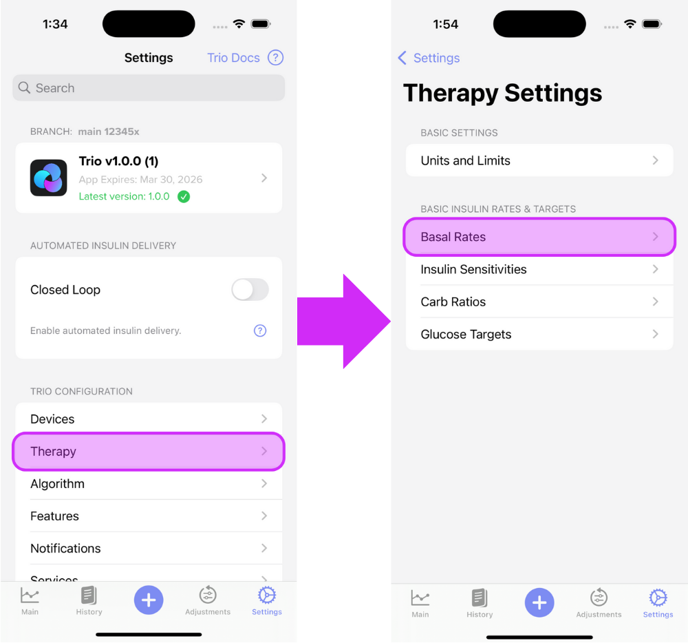
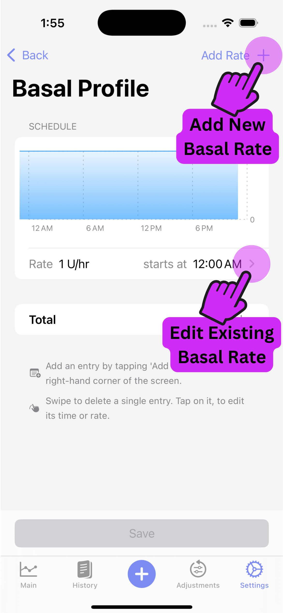
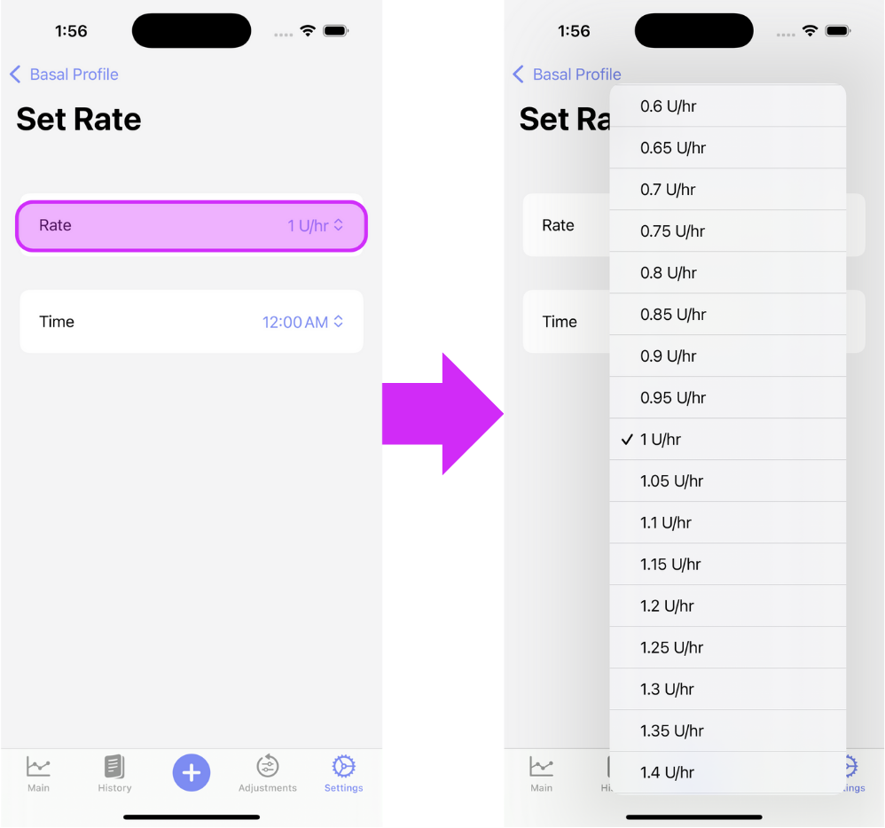
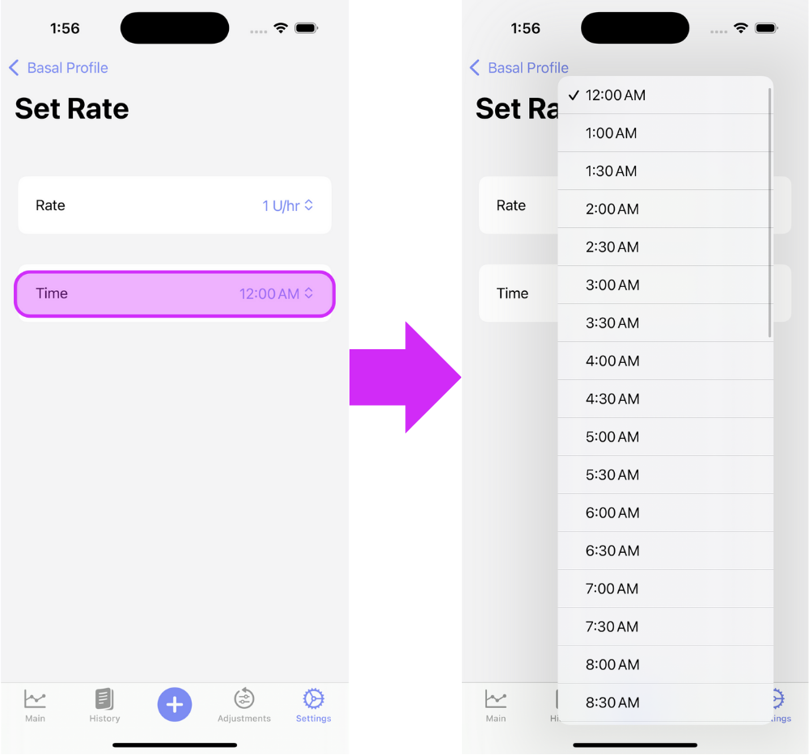
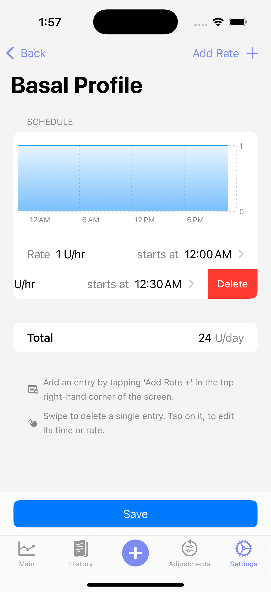
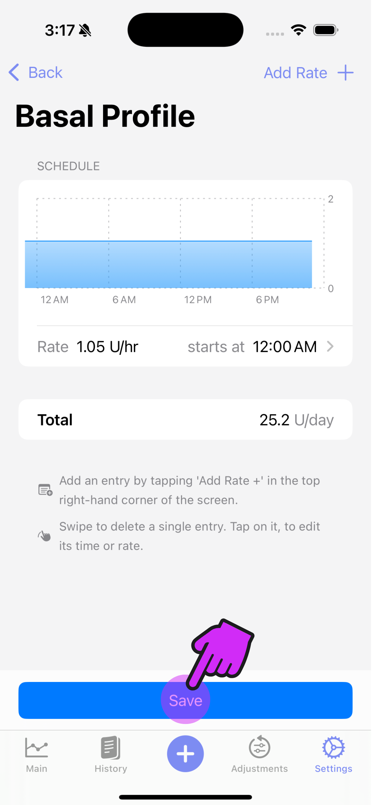

# Basal Profile

!!! tip "Highlights"
    
	 - Basal profile can be imported from a Medtronic pump or Nightscout account
     - Walsh calculation may help you with a starting basal rate to adjust from
	 - Adjust your basal profile by doing fasting experiments and reviewing your IOB at times of fasting
    
Basal profile consists of your scheduled basal rates, which determine how much insulin is being delivered at each hour of the day. It is important to understand that these settings are not taken verbatim when looping with Trio. Based on your current blood sugar reading, they are adjusted every loop cycle and replaced with temporary basal rates. Your set values are altered by autosens or dynamic ISF based on your historical data.

Your basal profile values should be near your true value. Basal profiles are also important for insulin on board (IOB) calculations. Trio treats your scheduled basal profile as the zero point. The calculated IOB increases if you receive additional insulin on top of your basal rates, either as boluses or high temporary basal rates. Likewise, if you receive low temporary basal rates for a set period, your IOB decreases and can even become negative. 

If you are coming from a pump, transferring basal profiles from your pump settings should be done with consideration and caution. They might not be entirely accurate for Trio. If you are going low or high while fasting, consider adjusting according to the instructions below

- - -

## Testing/Adjusting Your Basal Rate

### Baseline Calculation

If your current basal rates are close, but need some testing and adjustment, skip to the [next section](#basal-testing).

If your current basal rates are inaccurate or you are unsure where to even start, the formulas developed by Walsh, et.al. may help you find a starting point to then test or adjust your basal rates. Autosens and dynamicISF use these calculations as their foundation for making adjustments, so it stands to reason that a similar balancing of these settings would assist Trio in a more optimal performance.

!!! warning
    This calculation is to be used as a starting point for testing and is not considered definitive or exact.
    
<!-- TODO: Add description and formulas from Walsh-->
<!-- TODO: Add Bill Example Question to calculate -->

### Basal Testing

<!-- TODO: Update basal testing description -->
The standard method is to test your basal by having a relaxing 4-6 hours without eating at least two hours before you begin the test. Does your blood sugar stay steady? Or do you climb and need a correction? Or do you go low and need to eat? Setting accurate basal rates is crucial for Trio success. They determine how much of the insulin delivered (from basal and bolus) is counted as insulin on board (IOB).

### Basal Adjustment

<!-- TODO: Update description -->
You can also monitor your IOB to determine if your basal profile is accurate. Consistently negative or positive IOB during times of fasting _may_ suggest that these hours need to decrease or increase their basal rate, respectively.

- - -

## How To Enter Your Basal Profile(s) Into Trio

### Step 1

Enter the Basal Profile screen

{ width="600px"  }
{align=center}

### Step 2

Tap the "Add Rate +" on the top right of the screen until you have the number of basal rates you require. Then, edit each rate by tapping the arrow to the right of the basal rate.

{ width="300px"  }
{align=center}

### Step 3

Adjust the rate

{ width="600px"  }
{align=center}

### Step 4

Adjust the time

{ width="600px"  }
{align=center}

### Step 5

Repeat Steps [2](#step-2), [3](#step-3), and [4](#step-4) until all basal rates are set

### Delete a Basal Rate

Should you need to delete a basal rate, just swipe left on the rate you need to remove. 

{ width="300px"  }
{align=center}

### Step 6 **IMPORTANT**

Save your changes!

{ width="300px"  }
{align=center}

### Step 7

Proceed to [Carb Ratios](carb-ratios.md) or return to [New User Setup](../../new-user-setup.md)
