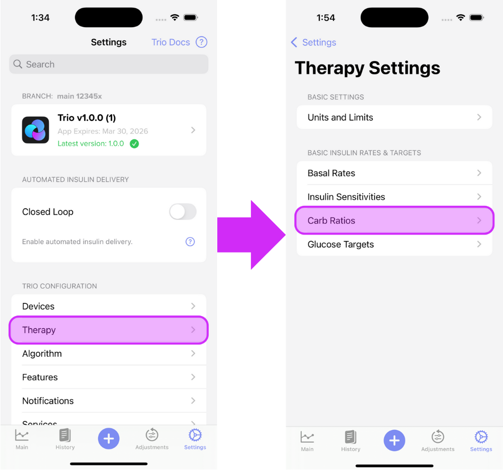
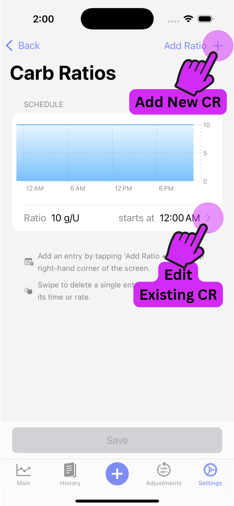
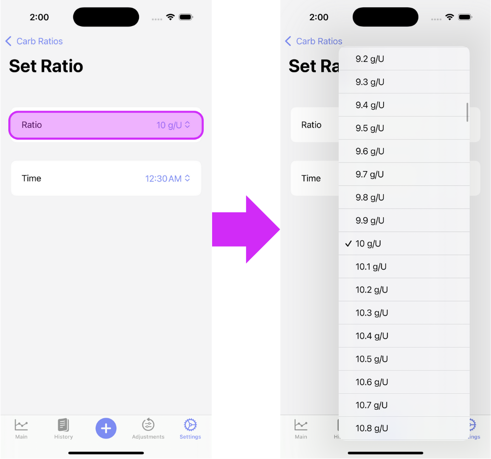
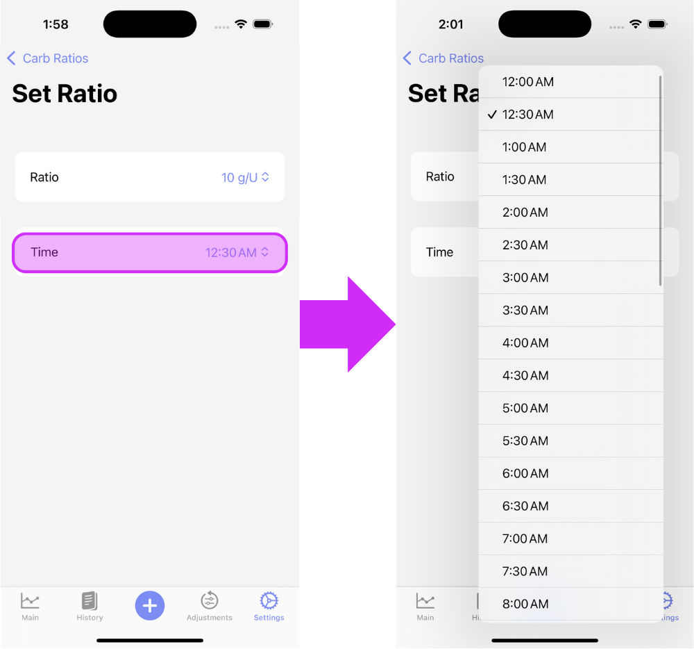
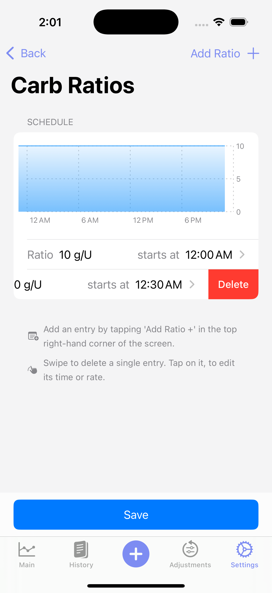
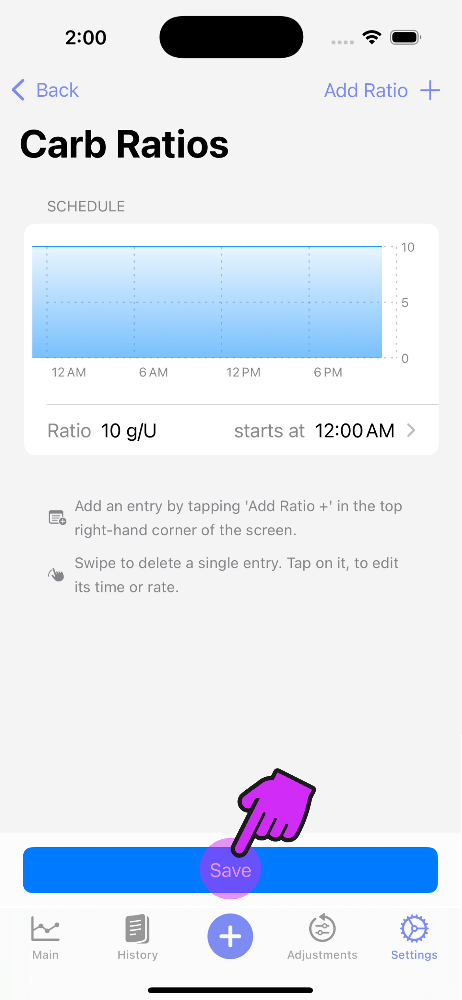

# Carb Ratio (CR)

!!! tip "Highlights"
    
	 - CR can be transferred from your pump
	 - Adjust your CR by performing a test meal experiment or observing autotune.

CR refers to the amount of carbohydrates one unit of insulin is able to neutralize.  

??? question "Bill has a CR of 10g/U. If Bill eats a meal containing 50g of carbs, how much insulin does Bill need for the entire meal?"

    ??? info "Here is the formula you will need:"
    
        $$
        \frac{grams\ of\ carb\ eaten}{C R}
        $$

    ??? note "Calculate Bill's Insulin Dose:"
    
        $$
        \frac{50}{10}=
        $$
        
        $$
        5\ units
        $$
        
    ??? success "Answer"
        Bill needs 5 units of insulin for his meal.

CR is not changed as drastically as basal rates or ISF unless Dynamic CR is enabled. Your CR must be as accurate as possible for proper Trio function.

It is safe to transfer your CR from your pump settings. However, your settings may not be accurate if you are experiencing high peaks with meals or lows three hours afterward. If you have SMB/UAM on and are experiencing sharp drops, you may also need to optimize your ISF.

## How To Enter Your Carb Ratios (CR) Into Trio

### Step 1

Enter the CR Profile screen

{ width="600px"  }
{align=center}

### Step 2

Tap the "Add Rate +" on the top right of the screen until you have the number of CRs you require. Then, edit each rate by tapping the arrow to the right of the CR.

{ width="300px"  }
{align=center}

### Step 3

Adjust the rate

{ width="600px"  }
{align=center}

### Step 4

Adjust the time

{ width="600px"  }
{align=center}

### Step 5

Repeat Steps [2](#step-2), [3](#step-3), and [4](step-4) until all CRs are set

### Delete an ISF Entry

Should you need to delete an CR entry, just swipe left on the rate you need to remove. 

{ width="300px"  }
{align=center}

### Step 6 **IMPORTANT**

Save your changes!

{ width="300px"  }
{align=center}

### Step 7

Proceed to [Glucose Targets](target_glucose.md) or return to [New User Setup](/configuration/new_user_setup/)

## Testing/Adjusting Your Carb Ratio (CR)

### Baseline Calculation

If your current carb ratio is close, but needs some testing and adjustment, skip to the [next section](#cr-testing).

If your current carb ratio is inaccurate or you are unsure where to even start, the adjustments in Trio are based on formulas developed by Walsh, et.al. and may help you find a starting point to then test or adjust your carb ratio.

!!! warning
    This calculation is to be used as a starting point for testing and is not considered definitive or exact.

<!-- TODO: Add description and formulas from Walsh-->
<!-- TODO: Add Bill Example Question to calculate -->

### CR Testing

<!-- TODO: Add description -->

### CR Adjustment

<!-- TODO: Update description -->
The standard way to adjust your CR is a test meal experiment, which can be done while not looping. Have a meal with a known amount of carbohydrates and bolus according to your current CR. Monitor your blood sugar at the three-hour mark; did you go high, low, or end up where you started prior to the meal? If you end up high, you can make your CR more aggressive by _DECREASING_ the value. If you were low, make your CR less aggressive by _INCREASING_ the value. You may also look to increase or decrease your adjustment factor if you have dynamic CR on.
