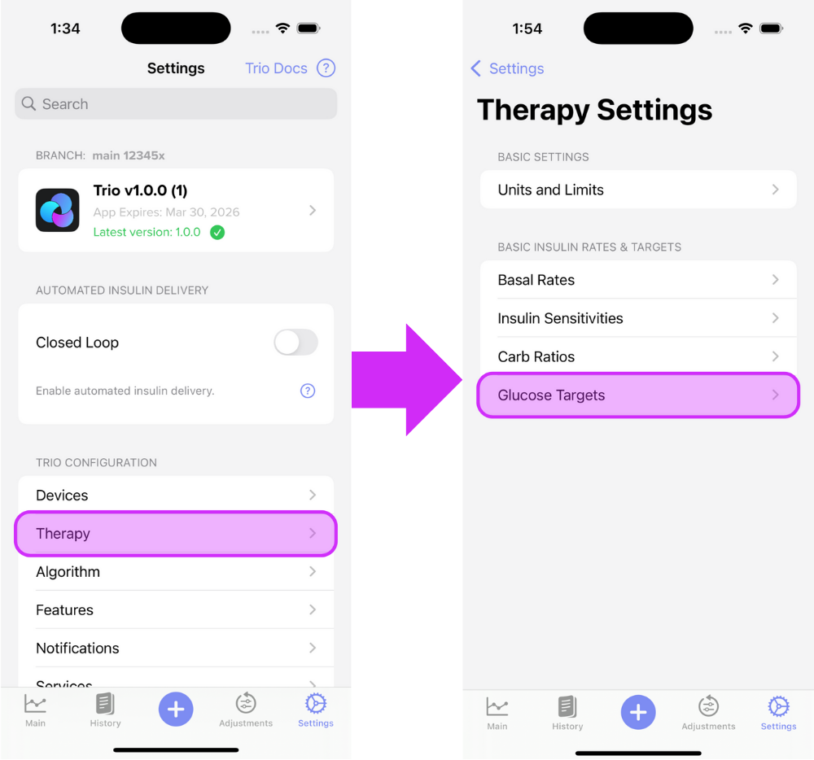
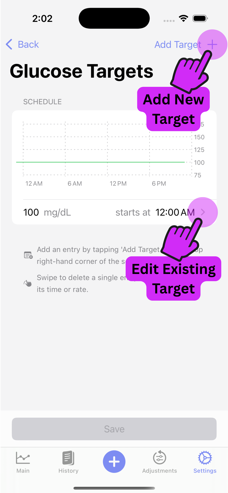
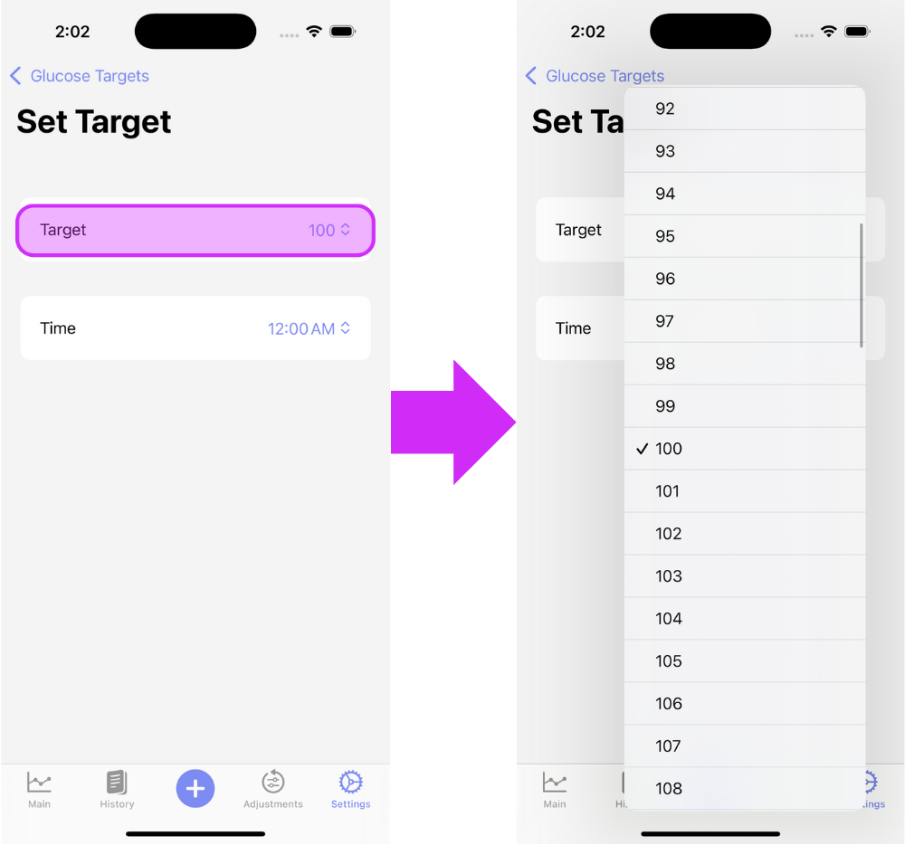
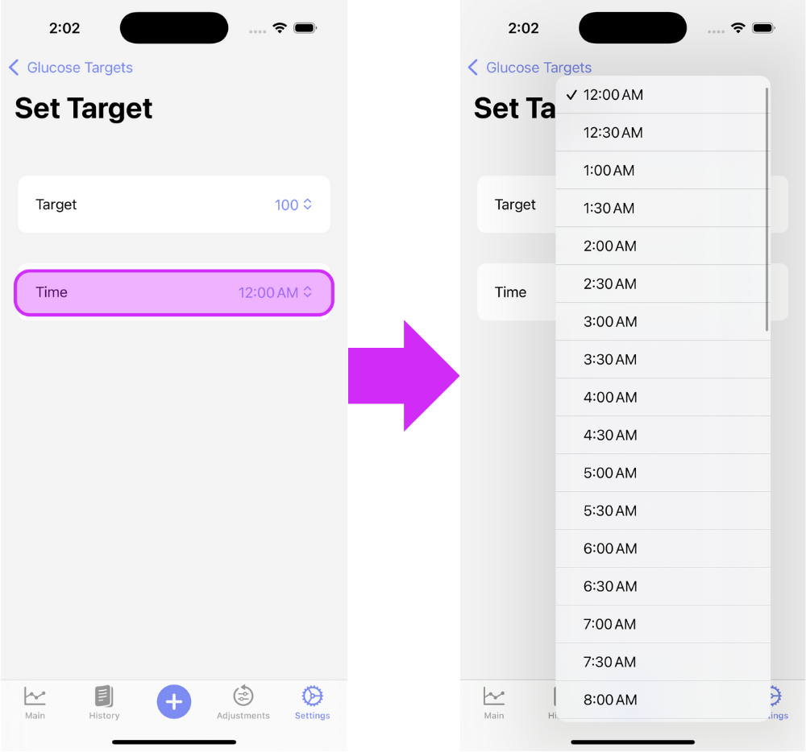
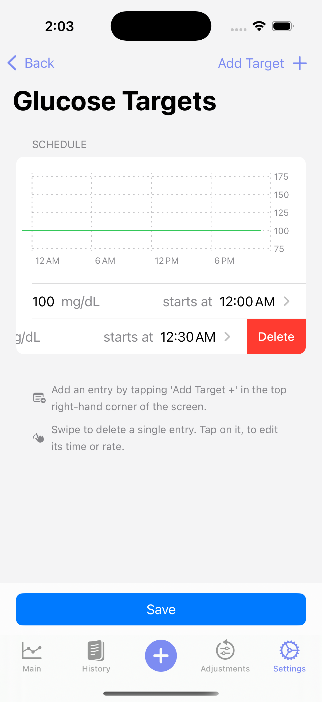
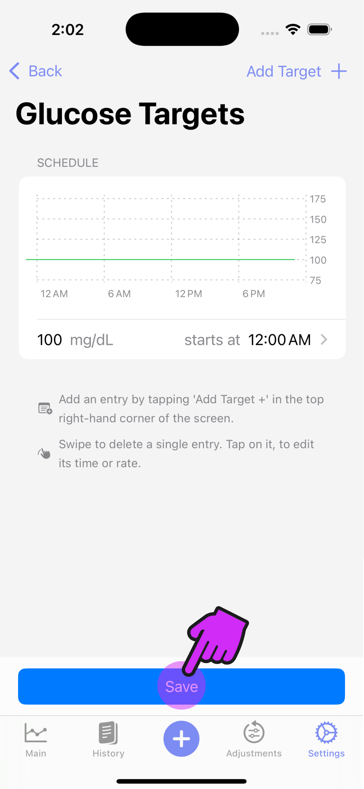

# Glucose Targets

Trio will target this value when calculating insulin needs. It should be set to the blood glucose you would like to reach when corrections are made. A recommended value is between 90-110mg/dL or 5-6mmol/L

!!! tip
    
    You can set different targets at different times.  
    Some users only have one target.  
    Others have a lower target during the day and a higher target during the night to avoid lows.

## How to Enter Your Glucose Targets Into Trio

### Step 1

Enter the Glucose Targets screen

{ width="600px"  }
{align=center}

### Step 2

Tap the "Add Rate +" on the top right of the screen until you have the number of targets you require. Then, edit each target by tapping the arrow to the right of the Glucose Target.

{ width="300px"  }
{align=center}

### Step 3

Adjust the target glucose value

{ width="600px"  }
{align=center}

### Step 4

Adjust the time

{ width="600px"  }
{align=center}

### Step 5

Repeat Steps [2](#step-2), [3](#step-3), and [4](step-4) until all CRs are set

### Delete a Glucose Target Entry

Should you need to delete an CR entry, just swipe left on the rate you need to remove. 

{ width="300px"  }
{align=center}

### Step 6 **IMPORTANT**

Save your changes!

{ width="300px"  }
{align=center}

### Step 7

Proceed to [Basal Rates](basal_rates.md) or return to [New User Setup](../../new_user_setup/)

