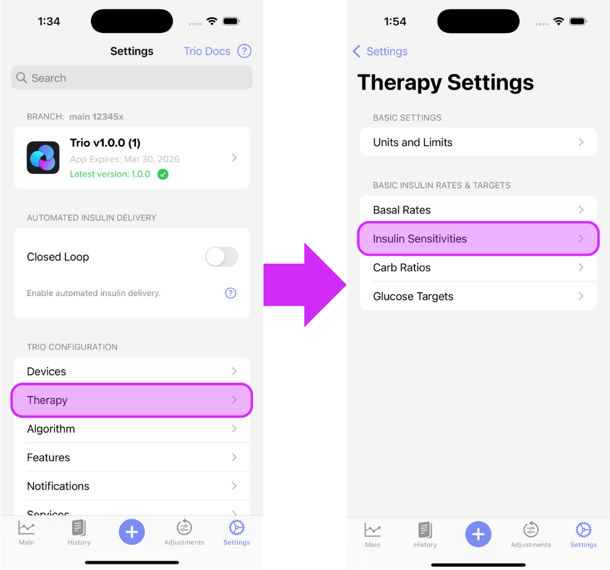
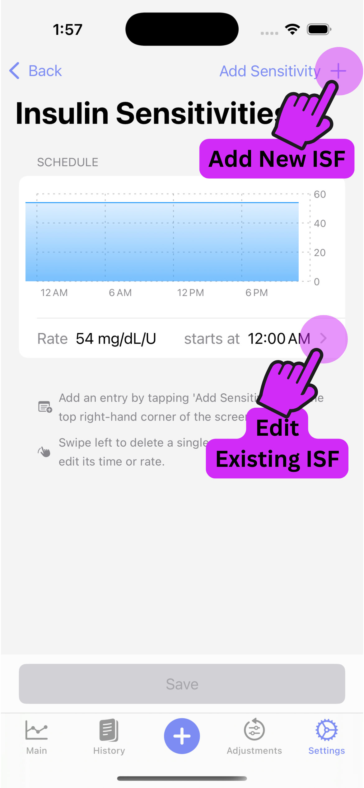
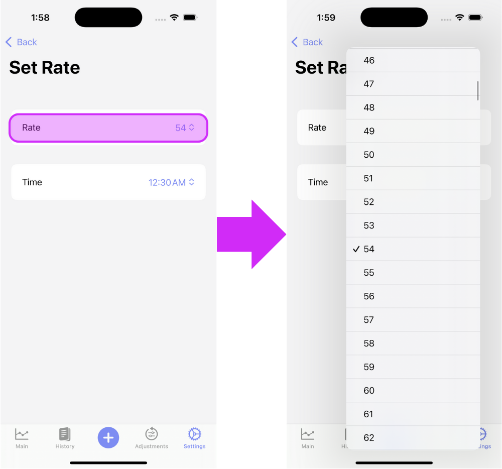
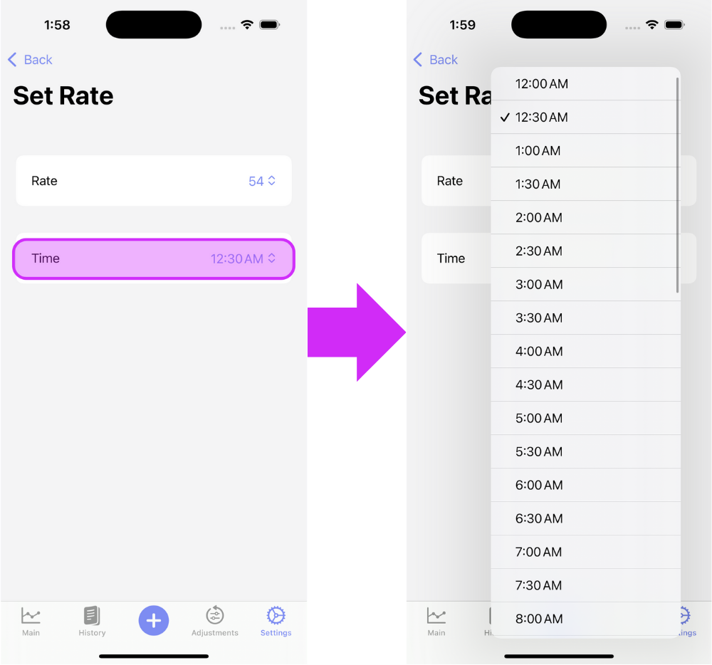
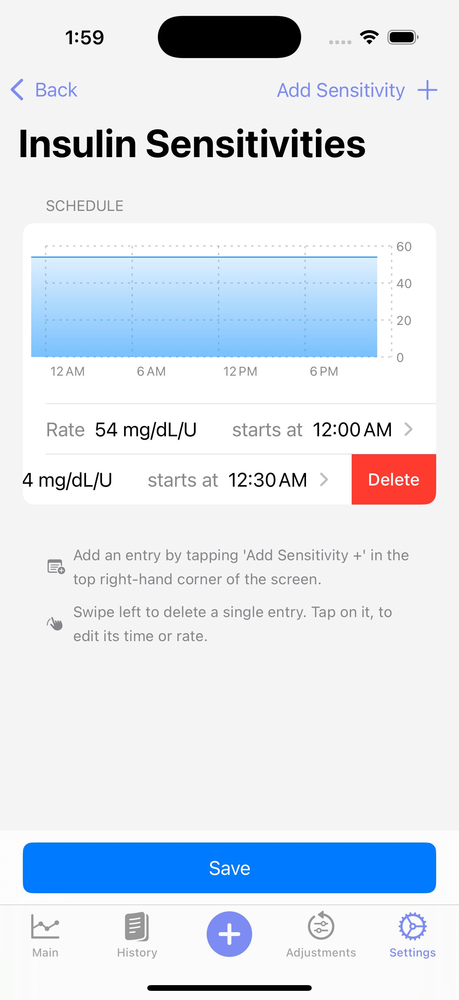
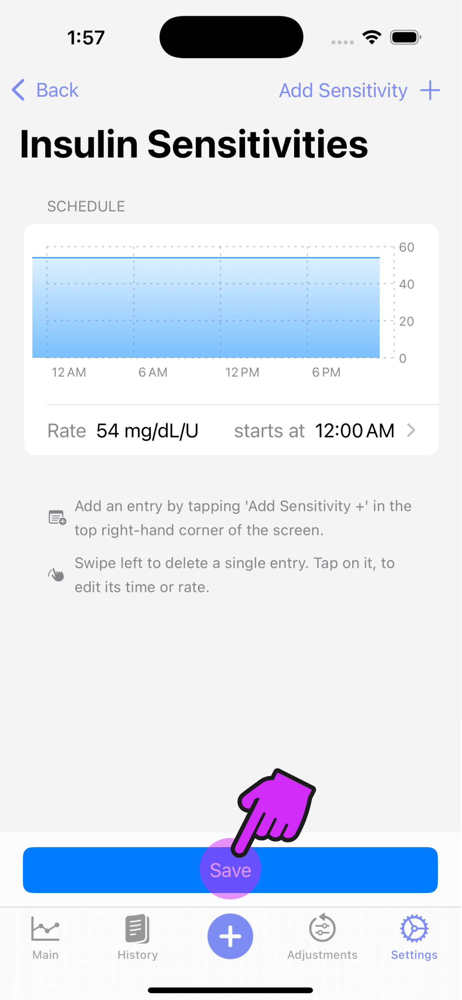

# Insulin Sensitivity Factor (ISF)

<!-- TODO: Update section with instructions and screenshots on how to enter basal profiles into the user's basal schedule -->

!!! tip "Highlights"
    
	 - ISF is the most problematic setting for new loopers.
	 - ISF can be transferred from your pump to start.
	 - Adjust ISF by performing a correction and seeing how far your glucose drops in 4 hours.

ISF, also called insulin correction factor (ICF), refers to the amount of blood glucose in mmol/L (or mg/dL, depending on your settings) that one unit of insulin can neutralize.

??? question "Bill has an ISF of 50 (this is also written in shorthand as an ISF of 50 mg/dL/U (2.8 mmol/L/U)). This means 1 U of rapid insulin will bring Bill's sugar down by 50 mg/dL (2.8 mmol/L). How many units of insulin would Bill need to reach his target glucose of 100 if his current glucose reading is 250 mg/dL (13.9 mmol/L)?"
    
    ??? info "Here is the formula you will need:"
    
        $$
        \frac{Current\ Glucose - Glucose\ Target}{I S F}
        $$

    ??? note "Calculate Bill's Insulin Dose:"
    
        $$
        \frac{250-100}{50}=
        $$
        
        $$
        \frac{150}{50}=
        $$
        
        $$
        3\ units
        $$
        
    ??? success "Answer"
        Bill needs 3 units of insulin to reach his target glucose of 100 mg/dL.

Like basal rates, ISF is not used verbatim by Trio but is modified over time as data on the patient is collected. Still, setting ISF as close to accurate as possible is important for Trio to function well.

It is safe to transfer your ISF from your pump settings. Note that almost all issues when starting with Trio are a result of an improperly set ISF. If you find you have lows with corrections, or you have SMB/UAM on and the application provides too much insulin at any time, resulting in a rollercoaster pattern, your ISF is likely to blame.

- - -

## Testing/Adjusting Your ISF

### Baseline Calculation

If your current ISF is close, but needs some testing and adjustment, skip to the [next section](#isf-testing).

If your current ISF is inaccurate or you are unsure where to even start, the adjustments in Trio are based on formulas developed by Walsh, et.al. and may help you find a starting point to then test or adjust your ISF.

!!! warning
    This calculation is to be used as a starting point for testing and is not considered definitive or exact.
    
<!-- TODO: Add description and formulas from Walsh-->
<!-- TODO: Add Bill Example Question to calculate -->

### ISF Testing

<!-- TODO: Add description -->

### ISF Adjustment

<!-- TODO: Update description -->

There are a few ways you can work to adjust your ISF. The easiest method is simply bringing yourself to a higher glucose with a glucose tab or choosing a time when you are "stuck" higher than your target, then correcting based on your ISF. If you are higher than your target after 4 hours, make your ISF more aggressive by _DECREASING_ the value. If you are lower than your target after 4 hours, make your ISF less aggressive by _INCREASING_ the value.

- - -

## How To Enter Your ISF Into Trio

### Step 1

Enter the ISF Profile screen

{ width="600px"  }
{align=center}

### Step 2

Tap the "Add Rate +" on the top right of the screen until you have the number of ISFs you require. Then, edit each rate by tapping the arrow to the right of the ISF.

{ width="300px"  }
{align=center}

### Step 3

Adjust the rate

{ width="600px"  }
{align=center}

### Step 4

Adjust the time

{ width="600px"  }
{align=center}

### Step 5

Repeat Steps [2](#step-2), [3](#step-3), and [4](#step-4) until all ISFs are set

### Delete an ISF Entry

Should you need to delete an ISF entry, just swipe left on the rate you need to remove. 

{ width="300px"  }
{align=center}

### Step 6 **IMPORTANT**

Save your changes!

{ width="300px"  }
{align=center}

### Step 7

Return to [New User Setup](../../new-user-setup.md)
