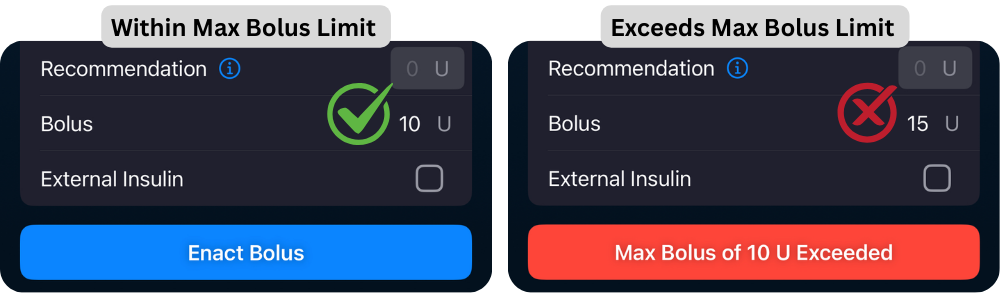

# Units and Limits

!!! tip  "Highlights"
    
	- Max IOB = Increase above 0 _before closing the loop_
	- Max Bolus = Max bolus you give for a meal
    - Max Basal = 4x highest hourly basal
	- Max COB = Maximum carbs active at any given time

## Glucose Units
Select either mg/dL or mmol/L.  
All settings descriptions and screen information will be adjusted to match your selection here.

- - -

## Max IOB
**Default:** _0 units_  

!!! warning "Important Information"
    This must be set to a value greater than 0 for any insulin to be administered above your current set basal rate.  
    If this remains at 0, Trio can suspend your insulin to prevent lows, but can only administer enough insulin to return you to your current basal rate amount.
    
This is the maximum amount of Insulin on Board (IOB) above your profile basal rates from all sources - positive temporary basal rates, manual or meal boluses, and SMBs - that Trio is allowed to accumulate to address an above target glucose.

If a calculated amount exceeds this limit, the suggested and/or delivered amount will be reduced so that active Insulin on Board (IOB) will not exceed this safety limit.

!!! tip
    You can still manually bolus above this limit, but the suggested bolus amount will never exceed this in the bolus calculator

- - -

## Max Bolus
**Default:** _10 units_  
**Setting Limits:** _1-30 units_  

This is the maximum bolus allowed to be delivered at one time. This only limits manual boluses given on the Treatments screen.

If you attempt to request a bolus larger than this, the bolus will not be accepted or proceed. So if your max bolus is set to 5U but you enter a 6U bolus, the "Enact Bolus" button will turn red and display a warning message. You will be unable to proceed until you lower your bolus to within this limit.

{ width="600px"  }
{align=center}

!!! tip
    Most set this to their largest meal bolus, then adjust if needed.

- - -

## Max Basal
**Default:** _2 units_  
**Setting Limits:** _0.5-30 units_  

This is the maximum basal rate allowed to be set or scheduled. This applies to bothe automatic temp basal rates, profile basal rates, and manual temp basal rates.

!!! tip
    Generally, users enter a value that is 4 times their highest hourly basal rate

!!! info "For Medtronic Users:"
    You must also manually set the max basal rate on the pump to match this value

- - -

## Max COB
**Default:** _120 grams of carb_  
**Setting Limits:** _0-300 g_  

This setting defines the maximum amount of Carbs On Board (COB) allowed at any given time for Trio to use in dosing calculations. If more carbs are entered than allowed by this limit, Trio will cap the current COB in calculations to this Max COB setting and remain at this max until all remaining carbs have shown to be absorbed or 6 hours has passed, whichever comes first.

For example, if Max COB is 120g and you enter a meal containing 150g of carb, your COB will remain at 120g until the remaining 30g have replaced absorbed carbs.

- - -

## Minimum Safety Threshold
**Default:** _Set By Algorithm_  
**Setting Limits:** _60 - 120 mg/dL_

Trio uses a Safety Threshold to prevent insulin dosing when your current glucose reading is too low. This threshold is always active, but you can increase this threshold from the system-determined value by entering a value into this setting in Trio.

The system-determined value is based on this calculation:

$$
Target\ Glucose - \frac{Target\ Glucose - 40}{2}
$$

The threshold is a safety limiter function. If blood sugar at any point is predicted to go below this value, Trio will suspend insulin delivery (SMBs are halted and Temp Basal of 0 U/hr set) and wait until forcasting says otherwise. Increasing this setting can be useful if you are experiencing a high number of hypoglycemia events. Please review the [OpenAPS documents](https://openaps.readthedocs.io/en/latest/docs/While%20You%20Wait%20For%20Gear/Understand-determine-basal.html?highlight=Safety%20Threshold) if you want a better understanding of how it is used. 

This setting allows you to choose a higher threshold setting than the default. Note that you cannot choose something lower than the default setting for a certain blood glucose target.

??? question "Bill has set a BG target of 110 mg/dl.  In his Trio Dynamic Settings, he has set his threshold to 65 mg/dl. Will Trio use the default threshold or the minimum safety threshold he set?"
    
    ??? info "Here are the formulas you'll need:"
        
        **Default Safety Threshold**:
        
        $$
        Target\ Glucose - \frac{Target\ Glucose - 40}{2}
        $$
        
        **Then, compare that value to the Minimum Safety Threshold**  
        
        Default Safety Threshold $\gt$ or $=$ or $\lt$ Minimum Safety Threshold
        
        
    ??? note "Now, enter in Bill's values"
        
        $$
        110 - \frac{110-40}{2} =
        $$
        
        $$
        110 - \frac{70}{2} =
        $$
        
        $$
        110 - 35 =
        $$
        
        $$
        65\ mg/dL
        $$
        
        $$
        75\ mg/dL \gt 65\ mg/dL
        $$
        
    ??? success "Answer"
        Because Trio's default threshold setting is 75 mg/dL for a 110 mg/dL blood glucose target, and that is greater than Bill's Minimum Safety Threshold, Trio will use the higher target of **_75 mg/dL_** and ignore this setting.
        
??? question "Bonus Question: Assuming Bill's target stays at 110 mg/dL, what would Bill have to set his Minimum Safety Threshold to for it to be used by Trio?"
    
    $$
    \geq 75\ mg/dL
    $$

!!! tip
    Basal may be resumed if there is negative IOB and glucose is rising faster than the forecast
    
- - -

Return to [New User Setup](../../new-user-setup.md)
