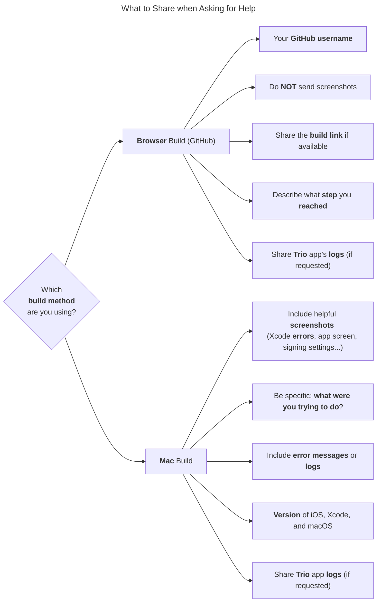

# Submit an Issue

## Where to Find Help

When you run into issues while building or using the Trio app, follow the steps below to get help efficiently and show respect for the time our volunteers generously offer.

- [ ] 🔍 **Start with** [**TrioDocs**](https://triodocs.org) — Use the 🔍 search bar at the top of the page.
- [ ] ⚙️ **Looking for a specific setting in the app**: Use the search field in `⚙️ Settings` to find it quickly without digging through every menu.
- [ ] 💬 **Search your support group** (Discord or Facebook) before posting your question:  
      
    !!! tip "Help the Community Help You"
        
        When you run into issues building or using the _Trio_ app, there’s a **wonderful community of loopers** ready to help. These volunteers offer their time freely — no one is paid to support or troubleshoot your setup. They simply want to help others.  
        To respect their efforts and get the most helpful response, please do your homework first and **[include the key details they’ll need](#what-to-share-when-asking-for-help) when asking for help**.
      
    - **[Facebook](https://facebook.triodocs.org)**
        -  Not sure **how to search in** a **Facebook** group? [Here’s a video to help.](https://www.youtube.com/watch?v=_vSN6C-Uo04)  
        - If you use **Facebook**, check the **Featured posts** at the top of the group, where many common questions have already been answered.
    - **[Discord](https://discord.triodocs.org)**: if your issue is related to:
        - [Build with Mac](https://discord.com/channels/1020905149037813862/1239982577008377958)
        - [Build with Browser](https://discord.com/channels/1020905149037813862/1239982525820960860)
        - [Trio Settings](https://discord.com/channels/1020905149037813862/1239982177190678549)  

I you haven't found an answer to solve your issue in [TrioDocs](https://triodocs.org/), or the Support Groups on [Discord](https://discord.triodocs.org/) or [Facebook](https://facebook.triodocs.org/), then feel free to ask for help — but please follow the recommendations outlined below.

## How to Ask for Help

- [ ] **Avoid posting the same question in multiple groups.**  
    Many mentors follow several communities, and cross-posting can lead to confusion. Only try another group if you've received no replies after several hours.

    !!! important "Do not cross-post your message"
      
        Please, do **not** send the same message on multiple sites/channels.  
        Our volunteers monitor multiple sites. 

- [ ] If your **question hasn’t been answered** by checking *[TrioDocs](https://triodocs.org)* or browsing [Discord](https:/discord.triodocs.org/) and the *Featured posts* in the [Facebook group](https://facebook.loopdocs.org/), go ahead and **post your question**.  
  Before doing so, review the tips on **[what to share when asking for help](#what-to-share-when-asking-for-help)**: this ensures our volunteers have all the details they need without having to ask multiple follow-up questions.
- [ ] Once your **issue is resolved**:
    - [ ] **Leave** your **post online** so it can help others
    - [ ] **Edit** your **original message** to **include** the word **RESOLVED** at the beginning.  
          This helps mentors know they don't need to respond to help you.

Do not forget to share key information about the issue as described in the next section.

## What to Share When Asking for Help

What you should share when asking for help depends on when the issue occurs — whether it’s during the process of **[building](#what-to-share-when-asking-for-help-building-trio)** or **[using](#what-to-share-when-asking-for-help-using-trio)** the Trio app.
 
!!! info "In all cases"
    Make it easy for volunteers to understand your situation.  
    Respect their time by including the right info.

### What to Share When Asking for Help Building Trio

If you are experiencing an **issue** while **building** the Trio app, what you share will depend on your **build method** with a Web browser on *GitHub* (also known as "**Browser-Build**") or with *Xcode on a **Mac** (often referred to as "**Mac-Build*").

- [ ] When **building** Trio with your **Browser** (on GitHub):
	- [ ] Share your **GitHub username**.
	- [ ] Do **NOT** send screenshots.
	- [ ] Share the **build link** if available.
	- [ ] Describe the **build actions** you **ran** and what **step** you **reached**.
- [ ] When **building** Trio on a **Mac**:
	- [ ] Include helpful **screenshots** (Xcode **errors**, app screen).
	- [ ] Describe what you were trying to do.
	- [ ] Include **error messages** and **logs**.
	- [ ] Include the [**versions** of **iOS**, **Xcode**, and **macOS**](../install/build/requirements/devices/compatibility-matrix.md#check-your-software-versions).

A diagram illustrating these steps is provided below for those who prefer a visual representation.

### What to Share When Asking for Help Using Trio 

If you are experiencing an **issue** while **using** the Trio app:

- [ ] Describe your actions in the app when the issue happened.
- [ ] If possible, include a helpful [screenshot](https://support.apple.com/en-us/HT200289) or [screen recording](https://support.apple.com/guide/iphone/take-a-screen-recording-iph52f6e1987/ios) of the app to help illustrate the issue.
- [ ] Be ready to share your [Trio app logs](share-logs.md) upon request.
