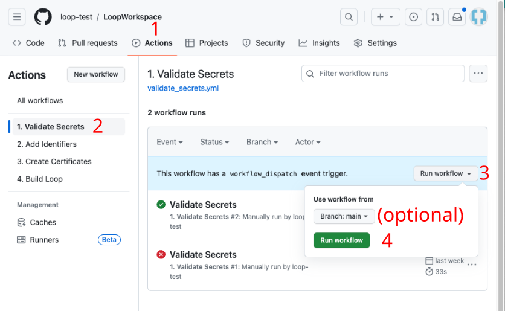

## Validate repository secrets

This step validates most of your six Secrets and provides error messages if it detects an issue with one or more. In addition, if you do not have a private Match-Secrets repository it creates one for you.

1. Click on the "Actions" tab of your Trio repository and enable workflows if needed
1. On the left side, select "1. Validate Secrets".
1. On the right side, click "Run Workflow", and tap the green `Run workflow` button.
1. Wait, and within a minute or two you should see a green checkmark indicating the workflow succeeded.
1. The workflow will check if the required secrets are added and that they are correctly formatted. If errors are detected, please check the run log for details. 

    > {width="700"}
    {align="center"}

!!! tip "Be Patient"
    * Refresh the browser if you are unsure if the action started
    * Do not start a new action until the first one completes
    * If it seems to take too long to finish - refresh your browser to see if it is done
