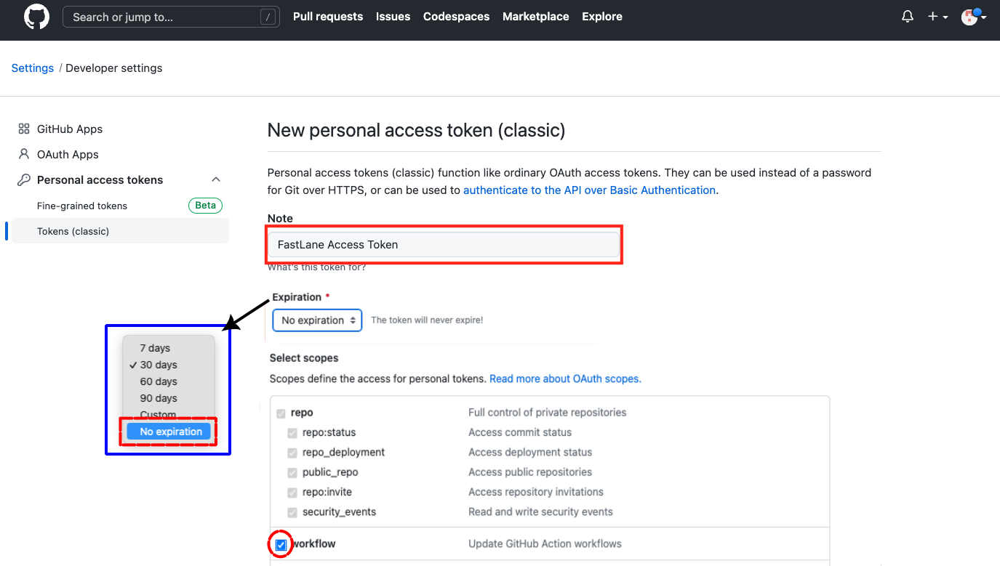

# Create a GitHub Account

[:material-skip-forward:](#create-github-personal-access-token) If you already have a *GitHub* Account, skip ahead to [Create *GitHub* `Personal Access Token`](#create-github-personal-access-token).

### New *GitHub* Account

If you do not already have a *GitHub* account, you need to create one. Be sure to record the email, password, and username for your *GitHub* account.

Decide on a couple of usernames that you will be happy with - this will get embedded into your *GitHub* URL. Your first choice might not be available, so be prepared with several candidates. Your personal URL will be: `https://github.com/username`.

* Click on this link to sign up for a free account: [*GitHub* account signup](https://github.com/signup)
    * You will need to enter the **email** you want associated your *GitHub* account
    * You will be asked to enter a **password**
    * You will be asked to enter a **username**
    * You will be asked if you want to receive email, ok to say `N` for no - you still get important account information with that email
    * Solve the puzzle to prove you're a person
    * Check the associated **email** to get the code and enter the code into github.com to confirm your account
* You should get the Welcome to *GitHub* screen
    * Indicate it is "Just me" on your team and Continue
    * Don't check anything on the next screen, just tap `Continue`
    * Select the `Free` option by selecting `Continue for Free`

The free level comes with plenty of storage and compute time to build the *Trio* app.

### Create `GitHub Personal Access Token`

??? abstract "Section Summary (click to open/close)"
    Log into your *GitHub* account to create a personal access token, which you will save as <code>GH_PAT</code>.

     Click to create a [new `personal access token`](https://github.com/settings/tokens/new):

    * Enter a name for your token, use "`FastLane Access Token`"
    * Change the Expiration selection to `No expiration`
    * Select the `workflow` `permission scope` (`repo` will be automatically selected)
        * This step enables automatic building
    * Click "Generate token"
    * Copy the token and record it. It will be used below as `GH_PAT`

    [:material-skip-forward:](#make-up-a-password) To skip the detailed instructions, click on [Make up a Password](#make-up-a-password).

!!! tip "Default Settings"
    These instructions are a prerequisite for automatic update and automatic build.

    Refer to [Modify Automatic Building](automatic.md#modify-automatic-building){: target="_blank" } if you don't want to accept the default recommendation to automatically update and build.

You must be logged into your *GitHub* account before starting this step. If you are continuing, you are already logged in.

1. You will be creating a new *GitHub* `Personal Access Token` and giving it the name "`FastLane Access Token`"
1. Open this link: [https://github.com/settings/tokens/new](https://github.com/settings/tokens/new)
    * Referring to the graphic
        * Note that `Tokens (classic)` is highlighted
        * Most people use the `classic Token`
            * If you are a developer who needs to use fine-grained `tokens`, that is fine
        * Edit the note box to be `FastLane Access Token`
    * The default Expiration time is 30 days - but you should select `No expiration` (use the dropdown menu to select)
        * *GitHub* will show a yellow warning when you do this
        * It is ok to ignore the warning
    * Add a check beside the `workflow` permission scope
    * A check will automatically appear in the `repo` scope as well - this is normal
    * Scroll all the way to the bottom and click `Generate token` (it's a long way, ignore all other settings, do not check anything else)

    > {width="700"}
    {align="center"}

    !!! tip "What does `repo` and  `workflow` do?"
        * `repo`: enables manual build actions
        * `workflow`: enables `repo` and automatic build actions

1. A new screen appears showing your access token
    * Copy the `token` and record it - once you leave this screen you can't see it again
    * You will use this for `GH_PAT` when you set up your Secrets
    * You can [Regenerate Personal Access Token](bb-update.md#regenerate-token){: target="_blank" } for `GH_PAT` if you lose it, but then you have to update that in the <code>Secrets</code> for all repositories using *GitHub* Build.

    > {width="600"}
    {align="center"}

### Create a Free *GitHub* Organization

This step is optional but it can save you a lot of time and is strongly recommended.

Prerequisite: You need a personal *GitHub* account. If you do not already have a personal *GitHub* account, click on [New *GitHub* Account](#new-github-account).

In the instructions below, use your *GitHub* username instead of `my-name`.

1. Follow the directions below to create a new *GitHub* organization account with a username of `my-name-org` (of course naming is up to you)
    * *GitHub* provides documentation at this link, [New *GitHub* Organization](https://docs.github.com/en/organizations/collaborating-with-groups-in-organizations/creating-a-new-organization-from-scratch){: target="_blank" }, or you can follow the bullets below
    * Log into `my-name` and click on your icon (at upper right) and choose Settings
    * On the left side-bar, click on Organizations
    * In the new view, click on New Organization and choose Free for the plan by clicking on  `Create a free organization`.
    * In the `Set up your organization` screen:
        * Enter `my-name-org` into the `Organization name` box
        * Enter the same email you use for `my-name` account
        * Select this organization belongs to `My personal account`
        * Check the box to accept the terms of service
        * Tap on the next button
2. You now see a Welcome screen
    * Unless you plan to collaborate with others, just tap `Complete setup`
    * You can always add others at a later time
3. Confirm access by entering the same password as you use for `my-name`

???+ tip "GH_PAT comes from personal `my-name` account"
    The *GitHub* personal access token used as one of the 6 <code>Secrets</code> is associated with your personal account (`my-name`); so if you already have one, you just keep using it.

**Your personal *GitHub* account is still needed. The free organization points to your personal account as a member. Please do not delete your personal *GitHub* account after creating an organization. If you do that - you will no longer have access to your organization.**

## Make up a Password

If you have not already made up a password, do it now and record it as <code>MATCH_PASSWORD</code>. Note that if you [build more than one app](other-apps.md){: target="_blank" }, you use the same <code>MATCH_PASSWORD</code> for all the apps. Every app needs to have the same 6 Secrets.

!!! info "What is this Password used for?"
    The <code>MATCH_PASSWORD</code> is a special password called a *passphrase* that is used to encrypt and decrypt your certificates from *Apple* so they can be used when building with *GitHub*; it helps keeps your certificates secret and safe.

    A *passphrase* is a little different from a regular password. A password is what you usually use to log in to a website or game. A *passphrase* is a secret code that helps protect important files by adding an extra layer of security when files are encrypted.

### *Passphrase* Suggestions

To make a *passphrase* that is hard to guess and keeps your certificates safe:

* Use at least 15 characters (20 is even better) and you can include spaces
* Mix in big letters, small letters, numbers, and symbols like $ or #
* Don’t use words or numbers that people might guess, like your name or birthday

If you already created a MATCH_PASSWORD that does not meet the criteria listed above, no worries, you are protecting an *Apple* developer certificate - not the family fortune. That information is provided for new builders who want guidance.
