## Update to Trio dev branch from Trio 0.2.x main

!!! important "A Note on Compatibility"
    Upgrading to Trio `0.5.x` from `0.2.x` is smooth and straightforward. The new Onboarding Wizard will guide you step by step. Your pump, CGM, therapy settings and the last 24 hours of treatment and glucose history will be brought over automatically.

    **Be Aware**
    
    * **Once you have upgraded to `0.5.x`, going back to `0.2.x` is not supported**
        * If you choose to downgrade, you will need to set everything up again from scratch
    * Some guardrails may be more limiting that `0.2.x`
        * They can be customized by you if required, reach out for help on how to do this
    * **Your saved Temp Targets and Overrides will not be maintained**
        * The storage method in `0.5.x` is different from `0.2.x`, so you will need to recreate them
        * Capture a screenshot of each important TT or Override that you want to add to `0.5.x`
    
    We have designed this release to be a stable and long-term foundation—so when you are ready, you can upgrade with confidence.

The Browser Build documentation is under construction for versions Trio 0.5.x and newer.

This temporary set of instructions is intended for the subset of users who **previously built Trio 0.2.x using Browser Build**. Because this is aimed at experienced builders, some of the steps are abbreviated and will be expanded as the documents are updated.

> If you are new to Trio - please wait until the documents have been expanded and preferrably until the release of Trio 1.0.

#### Mac-Xcode to Browser Build

!!! important "Experienced Mac-Xcode Builder"
    If you are an experienced Trio 0.2.x user who wants to join the open beta testing, but also wants to switch from Mac-Xcode build to Browser Build - welcome. For the time being, please do this:

    * Use the [0.2.x: Build Trio with *GitHub*](../../../0.2.x/operate/build.md#build-trio-with-github){: target="_blank"} instructions to build Trio 0.2.5 and wait for it to show up in your TestFlight. Do not install it - you just want to make sure you can succeed with a Browser Build.
    * Then return to this page and follow the directions; you will need to run Add Identifiers and Create Certificates again when updating to 0.5.x.

#### Transition from Other Apps to Trio Browser Build

!!! important "Coming from Other Apps"
    If you are an experienced Browser Build person who has not built Trio before, you will need to add the Trio App Group to 3 identifiers and create a Trio App in App Store Connect.

    The steps are summarized in [New Trio Builders](#new-trio-builders).

    If you are not experienced with Browser Build, we suggest you follow the 0.2.x instructions: [0.2.x: Build Trio with *GitHub*](../../../0.2.x/operate/build.md#build-trio-with-github){: target="_blank"} first. Then return to this page to update to 0.5.x; you will need to run Add Identifiers and Create Certificates again when updating to 0.5.x.

### Summary of Tasks to Build Trio 0.5.x

These steps assume:

* You previously built Trio 0.2.x using *GitHub* Actions (Browser Build)
* You confirmed your *Apple* Developer license agreements are up to date

These are the new steps for you to follow:

1. [Configure Browser Build Certificate Automation](#browser-build-certificate-automation)
1. [Configure `Fork` with `dev` branch](#configure-fork-with-dev-branch)
1. [Update Identifiers](#update-identifiers)
1. [Update Certificates](#update-certificates)
1. [Build Trio 0.5.x](#build-the-app)

### Browser Build Certificate Automation

Browser Build Certificate Automation was added to Trio 0.2.3 - if you have not added the `ENABLE_NUKE_CERTS` variable, you should add it now. Otherwise, skip ahead to [Configure `Fork` with `dev` branch](#configure-fork-with-dev-branch).

In order to utilize the new automatic certificate renewal feature, you’ll need to add a new Variable.  Variables are located in *GitHub*, in the same location as your Secrets.  The exact location will depend upon whether you build using a *GitHub organization* or a personal account.

If you use a personal account, click on your Trio repository.  If you have other repositories, just follow these same steps for each of them.

If you build using a *GitHub* organization and have already added this variable to your organization - there’s nothing for you to do. All repositories in your organization are covered. Otherwise, click on your organization name.

The numbered steps correspond to numbers in graphics below:

1. Choose settings 
1. Scroll down to select Secret and variables
1. Choose Actions
1. Choose Variable
1. Tap on “Create new organization variable” or “Create new repository variable”
1. Add the variable `ENABLE_NUKE_CERTS`
1. Type in the value `true`
1. Tap on Add Variable.

> 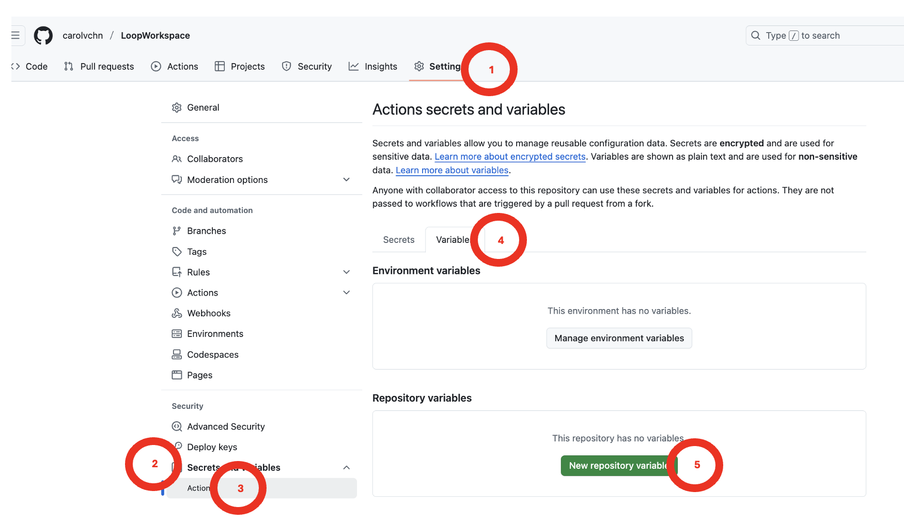{ width="800"}
{align="center"}

> 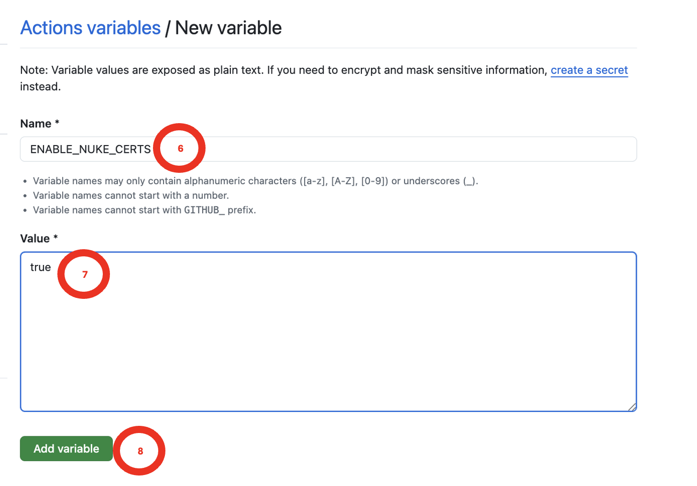{ width="600"}
{align="center"}

### Configure `Fork` with `dev` branch

The open beta testing for Trio uses the `dev` branch.

* If you do not have a dev branch you must first configure one following these directions.
* If you already have a `dev` branch, skip ahead to [Update Branch](#update-branch) and be sure to select the `dev` branch when you update your `fork`. 

#### Add `Branch`

First you need to get to your Trio repository and tap on the branch icon. (Do not worry how many branches you have.):

> 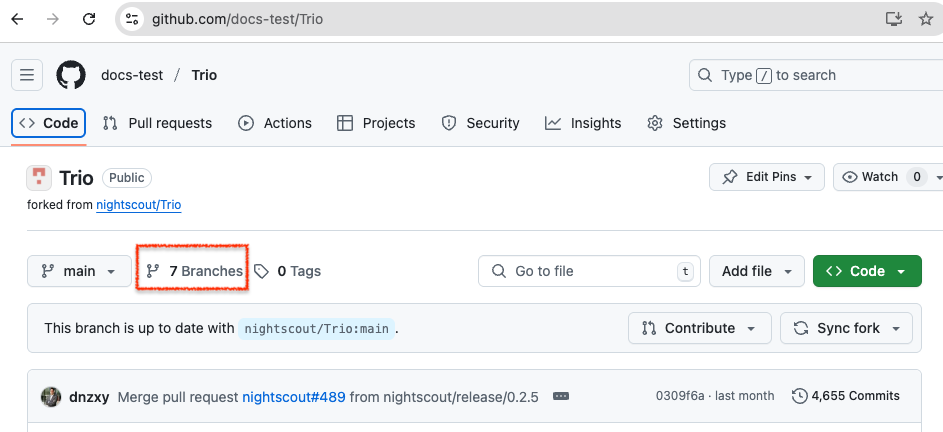{width="700"}
{align="center"}

The next screen displays the branches you currently have. It shows a `New branch` icon to upper right. If you don't see that, you are not logged in. Tap on the `New branch` button.

>  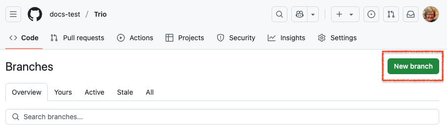{width="700"}
{align="center"}

Each step in the list below matches with the number in the graphic. In the top half of the graphic, the left side shows the initial display and the right side shows the display after making the indicated selections.:

1. Click on the drop down menu labeled 1 in the graphic and choose nightscout/Trio similar to the top right graphic
2. Click on the drop down menu labeled 2 in the graphic and choose `dev`
3. Click on the `Branch` name box labeled 3 in the graphic and type `dev`
    * The branch name in your `fork` should always match the branch name you are adding; check that you type it correctly
4. Review the dialog items to make sure everything is correct and then tap on Create branch

> 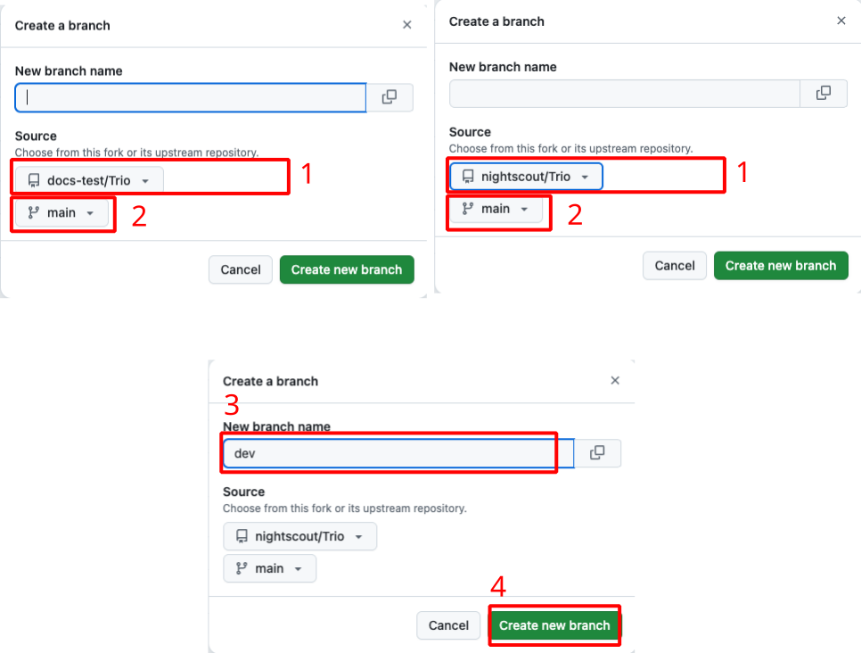{width="700"}
{align="center"}

#### Update `Branch`

> **Be aware that building from the `dev` branch will upgrade to Trio 0.5.x. Once you have upgraded to 0.5.x, going back to 0.2.x is not supported.**

Tap the `Code` button (upper left) and ensure this branch in your `fork` is up to date.

* Select the desired branch in the dropdown menu (this graphic shows `main` branch, to get 0.5.x, you must choose `dev` branch)
* If the message indicates this branch is "behind", tap on the sync `fork` button and then the Update branch button

> 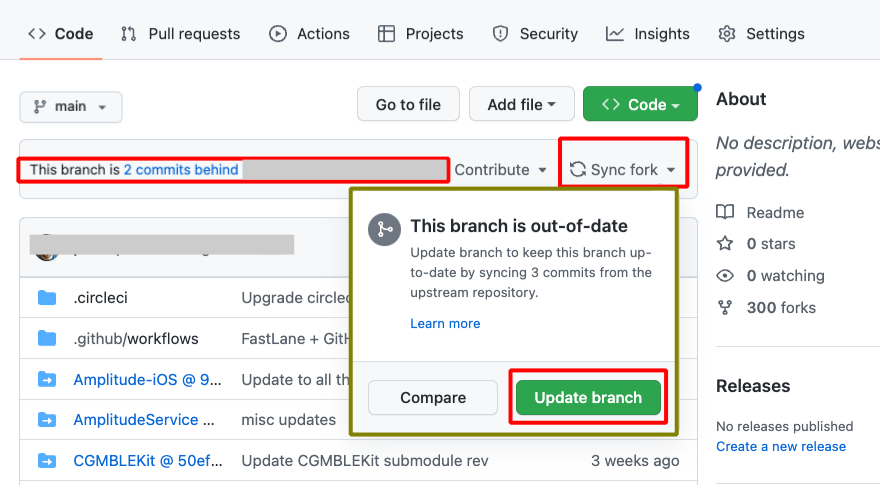{width="700"}
{align="center"}

### Update Identifiers

For Trio 0.5.x and newer, you must have *Apple* Push Notification enabled to build the app. This capability is added to the existing Trio Identifier by running the Action: Add Identifiers after you update your fork.

Refer to the graphic below for the numbered steps:

1. Click on the `Actions` tab of your <code>Trio</code> repository
1. On the left side, click on 2. <code>Add Identifiers</code>
1. On the right side, click `Run Workflow` to show a dropdown menu
    * You will see your default branch (typically this is `main`)
    * **To update the Identifiers so you can build the Trio 0.5.x, you must select `dev`**
1. Tap the green button that says `Run workflow`.

    > 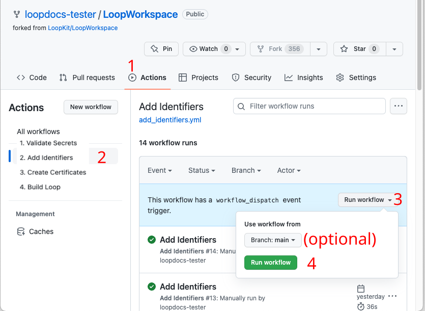{width="700"}
    {align="center"}

!!! tip "Be Patient"
    * Refresh the browser if you are unsure if the action started
    * Do not start a new action until the first one completes

The `Add Identifiers` &nbsp;Action&nbsp; should succeed or fail in a few minutes. Do not continue to the next step until this one succeeds.

### Update Certificates

For Trio 0.5.x and newer, you must have *Apple* Push Notification enabled to build the app. After you add this capability to the Trio Identifier, you must update the Certificate by running the Action: Create Certificates.

Refer to the graphic below for the numbered steps:

1. Click on the "<code>Actions</code>" tab of your <code>Trio</code> repository
1. On the left side, click on "`Create Certificates`"
1. On the right side, click "`Run Workflow`" to show a dropdown menu
    * You will see your default branch (typically `main`)
    * **Because you plan to build Trio 0.5.x, select `dev`**
1. Tap the green button that says "`Run workflow`".

    > 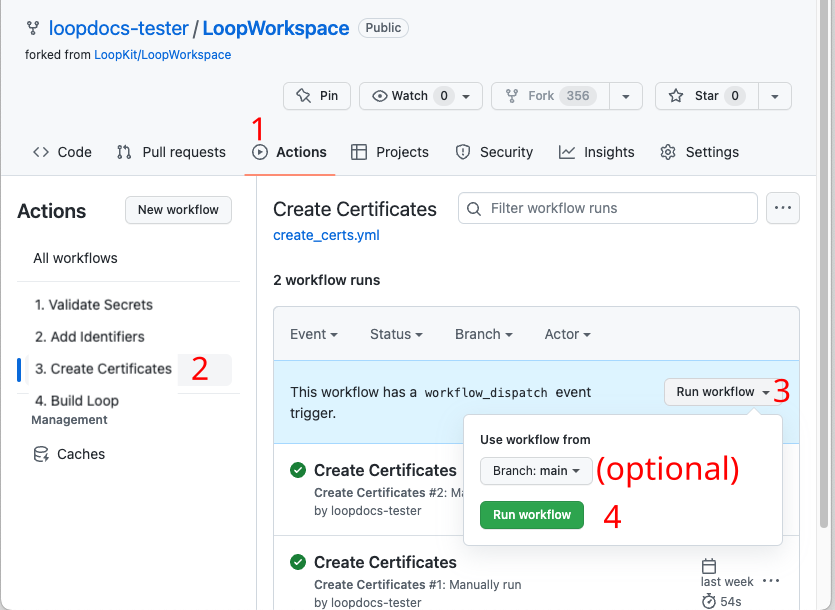{width="700"}
    {align="center"}

1. Wait a minute or two for the action to finish

!!! tip "Be Patient"
    * Refresh the browser if you are unsure if the action started
    * Do not start a new action until the first one completes

Once you see the green check mark by `Create Certificates`, the next step is to Build the app.

### Build the App

If you completed all the steps on this page successfully (got a green checkmark &#x2705;), you are ready to run Action: Build Trio.

> **We recommend most users leave their default branch as `main`. That means you must remember to select `dev` branch each time you build Trio 0.5.x**

If you have one branch as default, for example `main`, and choose to build a different branch, there is an extra step when you `Build Trio`. In addition to the normal steps 1, 2 and 3 in the graphic below, you must also do the (optional) step. Select the `dev branch` in the `branch dropdown` menu before continuing to step 4 and tapping on the green Run workflow button:

> 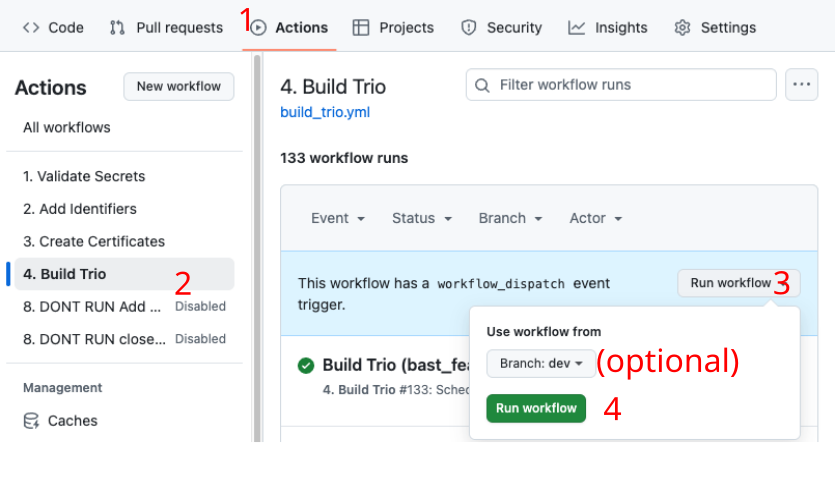{width="700"}
{align="center"}

#### Refresh, Do Not Repeat

!!! tip "Hit Refresh"
    After you tap the green Run workflow button, *GitHub* can be slow to update.

    * Refresh the browser if you are unsure if the action started
    * Do not start a new action until the first one completes

- - -

## Disable the DO NOT RUN Actions

You may notice some *GitHub* actions that have `DONT RUN` or `DO NOT RUN` in their names. Those are special actions that are used by the developers. They are skipped in your `Fork` but you may see logs for them.

If they already have the notation `disabled` beside them, so won't see them run. Otherwise, click on each one, click on the three dots at the upper right and then select `Disable workflow`. You will not be annoyed by seeing logs that say the action was automatically run and then skipped.

> 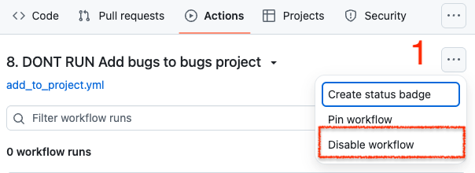{width="500"}

- - -

## Update Build Errors

The most likely build error is that you did not [Update Identifiers and Certificates](#solution).  
In that case, you will see this **error** in the **build action annotations**.

### Error

> 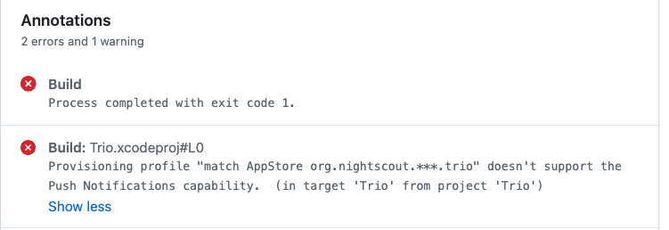{ width="600", align="center"}

If you decide to look at the action **log**, instead of reading the annotations, you may see an **error** similar to the two graphics below.

> 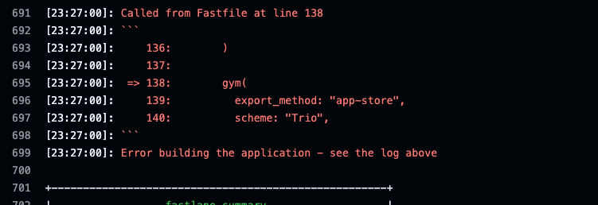{ width="600", align="center"}

> 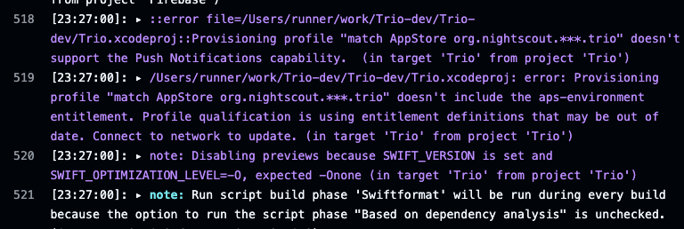{ width="600", align="center"}

### Solution

1. [Update Identifiers](#update-identifiers) - make sure you select `dev` branch
2. [Update Certificates](#update-certificates) - make sure you select `dev` branch

- - -

## New Trio Builders

For experienced browser builders, this minimal set of instructions might be sufficient. Warning - there is no hand holding in these directions.

**Every app you build will use the same [6 Secrets](https://loopkit.github.io/loopdocs/browser/intro-summary/#make-a-secrets-reference-file).**

* Fork from: [https://github.com/nightscout/Trio](https://github.com/nightscout/Trio)
* You use the `Trio App Group` for Trio, see [Create the `Trio App Group`](#create-the-trio-app-group)
* Identifiers for Trio: see [Table of Identifiers](#table-of-identifiers)
* Add the `Trio App Group` to these identifiers:
    * `Trio`
    * `Trio Watch`
    * `Trio WatchKit Extension`
* In `App Store Connect`, the `Bundle ID` for Trio will be: `org.nightscout.TEAMID.trio`

### Create the `Trio App Group`

If you already have a `Trio App Group`

* You can skip this step - your existing App Groups are found at this link: [App Group List](https://developer.apple.com/account/resources/identifiers/list/applicationGroup)
* If your `Trio App Group` was created from a Mac with Xcode, you may choose to edit the Description to make the **NAME** match

If you do not have a `Trio App Group`:

* Go to [Register an App Group](https://developer.apple.com/account/resources/identifiers/applicationGroup/add/) on the Apple developer site and use the table below to help you create one.
* Replace `TEAMID` with your *Apple* Developer ID.

| NAME | Xcode version (NAME) | IDENTIFIER |
|:--|:--|:--|
| Trio App Group | group org nightscout TEAMID trio trio-app-group| group.org.nightscout.TEAMID.trio.trio-app-group |

### Table of Identifiers

These are the identifiers created by running the *GitHub* action Add Identifiers. Only 3 of them need to have the Trio App Group added. Be sure that you selected `dev` branch when you start the Add Identifier action. For more details, see [Update Identifiers](#update-identifiers) but then return here when that action succeeds.

| NAME | Xcode version (NAME) | IDENTIFIER |
|:--|:--|:--|
| Trio | XC org nightscout TEAMID trio | org.nightscout.TEAMID.trio |
| Trio LiveActivity | - | org.nightscout.TEAMID.trio.LiveActivity |
| Trio Watch | XC IDENTIFIER | org.nightscout.TEAMID.trio.watchkitapp |
| Trio WatchKit Extension | XC IDENTIFIER | org.nightscout.TEAMID.trio.watchkitapp.watchkitextension |

### Add Trio App Group to Identifiers

Open the [App IDs Identifier page for your Apple Developer Account](https://developer.apple.com/account/resources/identifiers/list).

Click on the `Trio` Identifier and assign the `Trio App Group` to the Identifier - see graphic below.

> 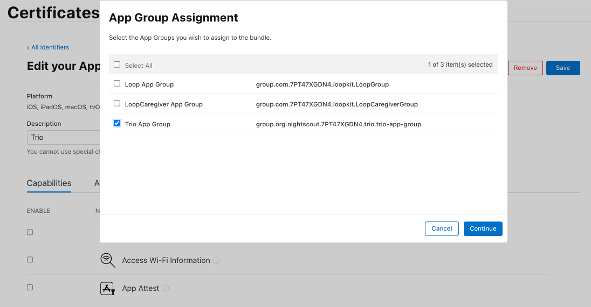

Repeat this for the other 2 identifiers that need to have an App Group assigned: `Trio Watch` and `Trio WatchKit Extension`

### Configure Trio App

Follow the directions in [LoopDocs](https://loopkit.github.io/loopdocs/browser/prepare-app/#create-loop-app-in-app-store-connect), but use the Trio `Bundle ID`

* In `App Store Connect`, the `Bundle ID` for Trio will be: `org.nightscout.TEAMID.trio`

Return to the main set of instructions on this page, [Update Certificates](#update-certificates) and keep going until you have a successful build.