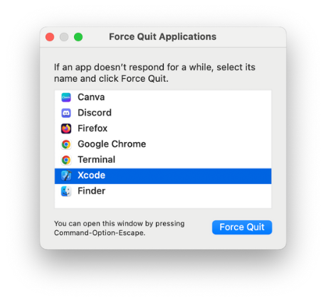
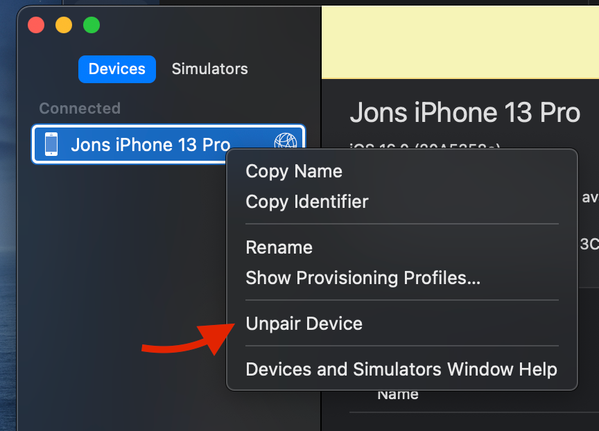
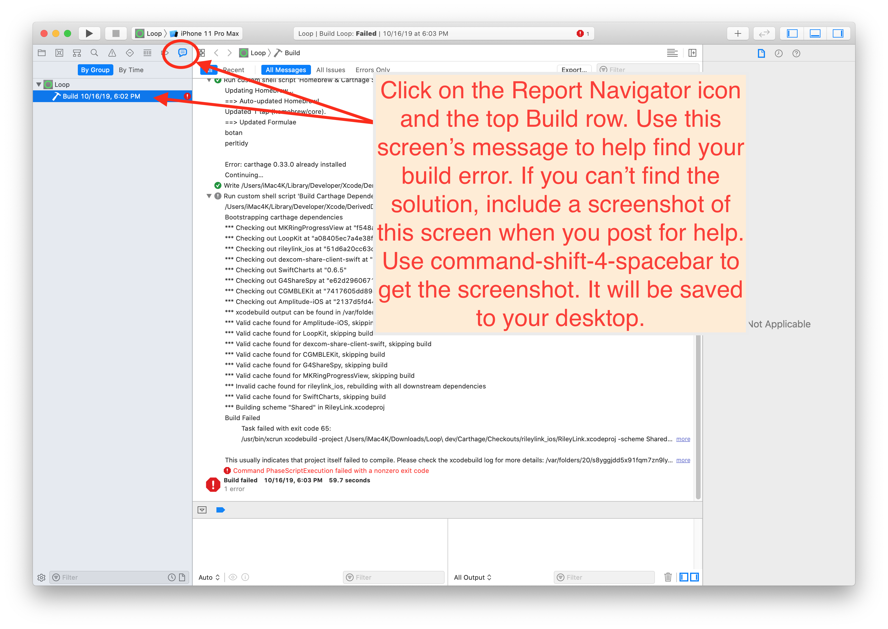

## Build Errors

!!! important

    - **This page is only relevant to building with Mac and Xcode.**  

There are two types of build indications that may be seen: they are warnings (yellow or purple icons) and red errors. You'll see the warnings and errors in the left-hand column of the Xcode window.

**:fontawesome-solid-triangle-exclamation: Yellow and :fontawesome-solid-triangle-exclamation: Purple warnings** do not cause the build to fail, those are just warnings.  You will often see yellow and purple icons. **Ignore those**. Do not try to do anything to fix those.

**:octicons-x-circle-fill-16: Red errors** will **have to be resolved** before you can successfully build the app. The steps below explain how to resolve them based on the messages you are seeing.

### Xcode Not Responding

Sometimes, Xcode stops responding. You have to fix this before any of the other steps on this page will help.  The signature is that Xcode shows a colorful spinning icon and does not respond to anything you do.

This can happen sometimes. You just need to force quit Xcode. Sometimes rebooting the Mac may be required, but start with force quit. Then just open up Xcode again and keep going.

1. Hold down these 3 keys ++option+command+escape++ (or ++alt+command+escape++),  until the `Force Quit` menu appears (should be fast)
2. Select `Xcode` and tap on the `Force Quit` button  
     
    {width="450"}
    {align=center}

## Start with The Obvious Error Causes

Before you start trying to resolve your red errors, start with the most obvious things that can cause a red error message:

1. **Did you check that you have the minimum Xcode version for your iOS?** This is critical. Please review the iOS-driven requirements for the minimum version of macOS and Xcode. Please see [Preparing your Computer](computer.md#computer-compatibility).

2. **Did you check your Apple developer account for a new license agreement?** Periodically, Apple will release a new developer license agreement that you need to sign before you can build new apps. You will get a build failure if there is a pending license agreement to sign. [Login to your Apple developer account](https://developer.apple.com/account) to check if there is a new license agreement.

3. **Do you have a new computer, never used to build Trio?** Did you add you [Apple ID](xcode-setup.md#add-apple-id-to-xcode) to Xcode?

4. **Did you reboot, i.e., restart, your computer after updating Xcode?** You should reboot following Xcode installation or update and you must make sure your command line tools match the version of Xcode you just installed. [Xcode Command Line Tools](xcode-setup.md#command-line-tools)

5. **Did you get a fresh download of Trio code?** If you tried to build with an old download that you used a long time ago, that old version may not be compatible with the new iOS and Xcode versions. Check also, that you are actually using the new download in Xcode.  When you use the Build Select Script, it automatically opens Xcode using the new download.

6. **Are you are using a free developer account?** Make sure you finished the removal of Siri and Push Notification capabilities described in [Free Developer Account Build](build.md#free-apple-developer-account-build).

7. **DO NOT USE BETA VERSIONS**  If you are using an iOS beta version or an Xcode beta version, Trio might not build. Deleting iOS beta from a phone is a pain...so don't install it unless you know what you are doing.

## Fix 95% of errors

If you have checked all those steps above and think you have a true build error, here's a tip that resolves 95% of all build errors when updating Loop code.

1. Open your project in Xcode as normal. Then go to the menu bar at the top of the screen and find the `Product` menu item. Use the drop down selection for `Clean Build Folder` or press ++shift+command+k++. Either will work the same. Wait for the clean to finish before trying to build again.
1. On the far right, next to the name Full Path is the folder name that Xcode will be using to build. Make sure it is the new code you just downloaded and not an older folder.
2. If you are updating Loop and did not [Delete Old Provisioning Profiles](update.md#delete-provisioning-profiles), do it now
3. Return to Xcode and try building your app again.
4. Still failing for phone or watch or both? Try the [Unpair and Reboot](#unpair-and-reboot) procedure.

### Unpair and Reboot

This is reported to fix a variety of watch building errors and `cannot prepare phone for development` errors:

2. Open Xcode.

3. Plug phone into computer and make sure it is unlocked.

4. Using the Xcode menu, select.
    - Windows.
    - Devices and Simulators.
    - On left side, Right-Click (or Control-Click) on your phone.
    - Choose Unpair Device.

It may not be necessary, but the suggestion is to reboot phone, watch and Mac - in other words, you can try to build without rebooting, but if that fails, repeat the steps and reboot before trying again.  
    
{width="400"}
  {align=center}

The next time you plug this phone into your computer, you will be asked to trust the computer on the phone (and watch).  Note, this is unpairing the device from Xcode and your computer, not the same as, and much faster than, unpairing your watch from your phone.

If the build fails again, look through the list below and see if you can match your error message with one of the error messages listed later in this page. If you really can't find your solution, then post for help. But help us help you.

- Ignore yellow and purple warning messages - those are not errors - do **not** try to fix them.
- Confirm it really is an error not already on this page; read this page carefully, including all the circled bits in the images in the Specific Error Messages section.
- Follow the steps in the Posting for Help section.
- WE CANNOT HELP without version numbers and [screenshots](#screenshots).
- Do not take pictures of your computer screen with your phone, use [screenshots](#screenshots).

## Posting for help

!!! important "STOP!!  Read this section! Important!"
    
    The build errors listed below (and the checks listed above) will fix most of the problems you may encounter.  
    
    ***PLEASE READ THIS PAGE***. The volunteers answering questions online would love to spend more time helping people use Trio and less time answering questions that can be addressed by using this page.

Therefore, try to resolve your build error yourself.  
Then, if you need to post for help, please include enough information with the post so the volunteers know where you are in your troubleshooting attempts.

!!! warning "Your Post Must Include:"
    * The version of Xcode you are using.
    * The version of Trio you are using.
    * The version of iOS on your Trio device.
    * Free or paid account, and if free, confirmation that you deleted Siri and Push Notification capabilities.
    * Confirmation that you are not using an Xcode beta or iOS beta version (so we don't have to ask, please actually type "I am not using beta versions").
    * Screenshots of your WHOLE Xcode window and/or Terminal window showing your error and any messages you've seen while working through the build errors/solutions.  Do NOT use phone photographs of your computer screen.  See below for instructions on how to capture a screenshot.
    * State which fixes from the list below you have already tried AND post the screenshots of the results of those fix attempts.

## Screenshots

Please take screenshots of your issue and use them in your posts. On an Apple computer, press ++shift+command+"4"++ keys at the same time followed by pressing the space bar ++space++ and then click on the window of interest. The screenshot will be saved to your desktop with a file name starting with the name "Screen Shot". Use screenshots instead of cell phone images or words whenever possible. Screenshots are higher resolution and easier to read.

Use the whole Xcode window screenshot when posting for build help.

## Find Your Error Message(s)

To begin fixing the error, use the Report Navigator view to find your error message.

{width="750"}
{align="center"}

The key is to (1) **READ THE ERROR MESSAGE** and then (2) **FIND YOUR MESSAGE IN ONE OF THE TOPICS BELOW**.

Here's a super tip: Merely seeing the "exit code" in Xcode is not enough information to discern what error is causing your build to fail; some exit codes have multiple causes. Look at the detailed message to guide your search for the matching solution.

Notice the screenshots below have red circles highlighting certain error messages.  Read your error message(s) from your screen, being guided by the red circles in the screenshots. Once you find your error message (hint: not "exit code"), you can either:

- Take the error message from your Xcode screen and use Trio's  documentation search function to enter in some of that phrase to bring up the appropriate solution topic, or

- Take the error message from your Xcode screen and read through EACH OF THE TOPICS BELOW. Check each of the red circles to see if you have a match. Kind of like a matching puzzle.

For example, if you see "Invalid active developer path (/Library/Developer/CommandLineTools)" in your error message, use the search tool in Trio's documentation with "invalid active". You will get a couple of links and one is the Command Line Tools fix for that error message. Click on the link and you'll find the solution.

## Specific Error Messages

### Xcode Errors with Build-Select

The errors shown below should be prevented - the script will attempt to correct them automatically - follow the directions in the script.

If this is not successful, the script told you the download failed and exited. Scroll up in the terminal to find the error message(s):

* Read the error message
* Try to figure out the problem
* If you need help, reach out to your favorite [Loop Social Media](https://loopkit.github.io/loopdocs/intro/loopdocs-how-to/#how-to-ask-for-help) site

!!! warning "WARNINGS"

    If you see errors like these . . .

    * `xcrun: error: invalid active developer path (/Library/Developer/CommandLineTools), missing xcrun at: /Library/Developer/CommandLineTools/usr/bin/xcrun`
    * `xcode-select: Failed to locate 'git', requesting installation of command line developer tools`
    * `xcode-select: error: tool 'xed' requires Xcode`

    You missed one of these steps:

    * [Install Xcode](xcode-setup.md)
    * [Xcode command line tools](xcode-setup.md#command-line-tools)

**ADD TRIO SPECIFIC BUILD ERRORS HERE**
