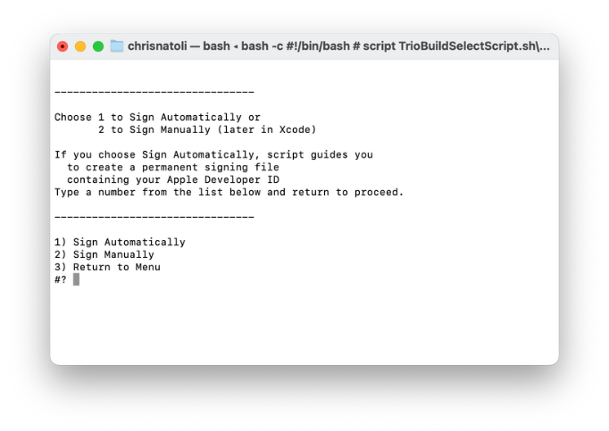
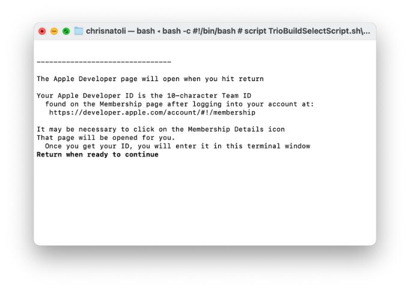
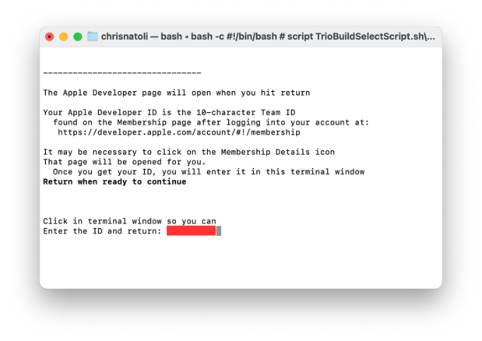
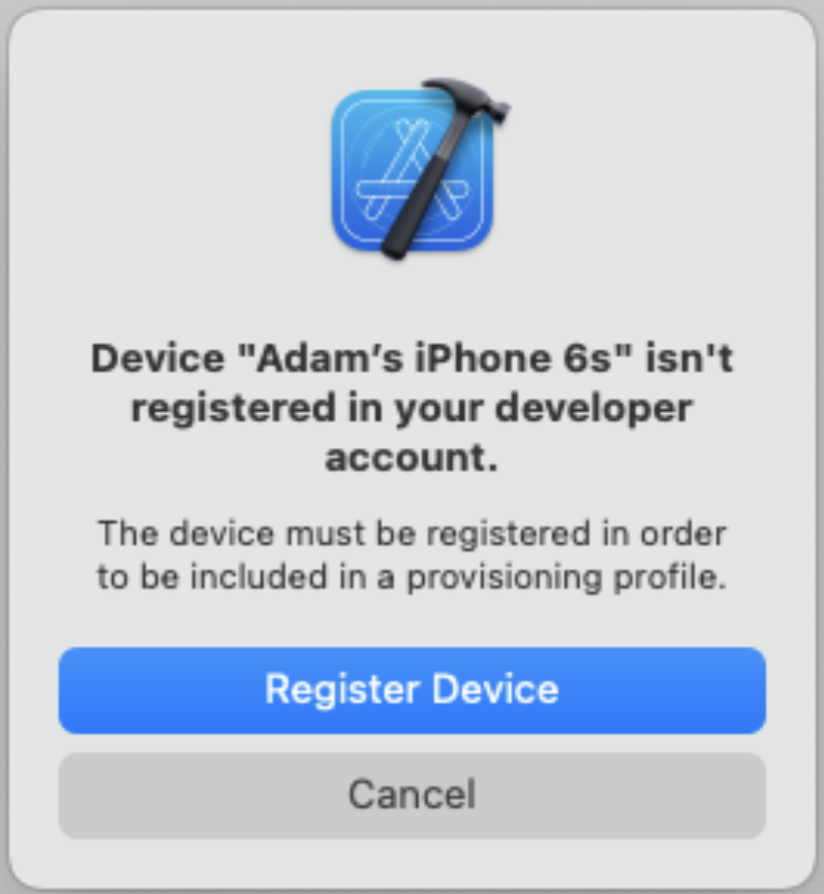
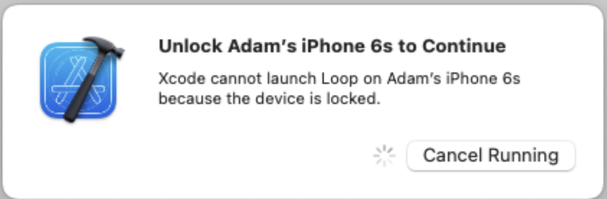
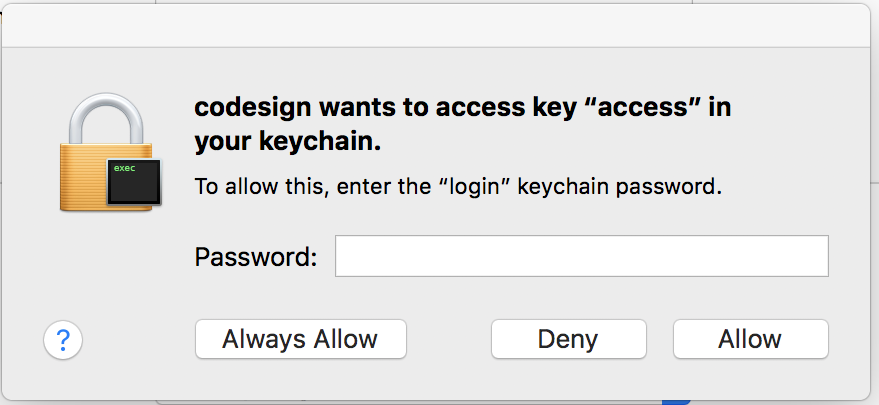
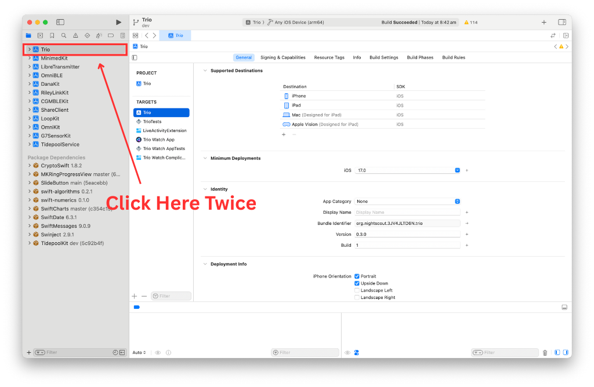
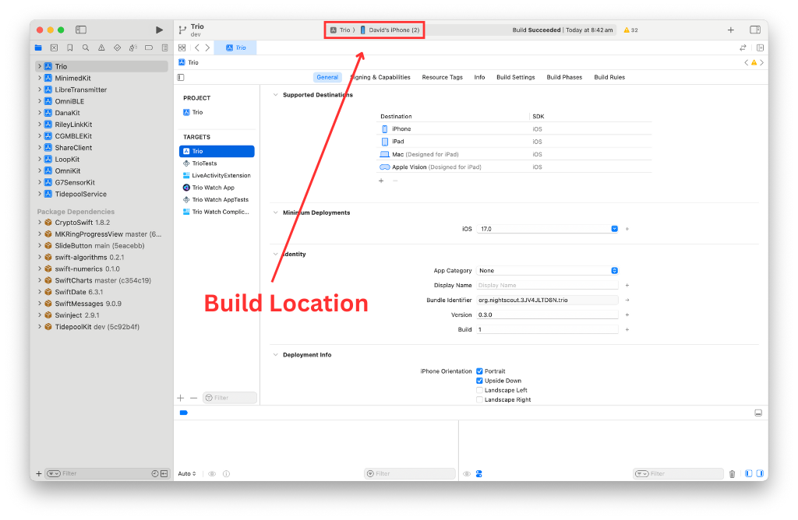
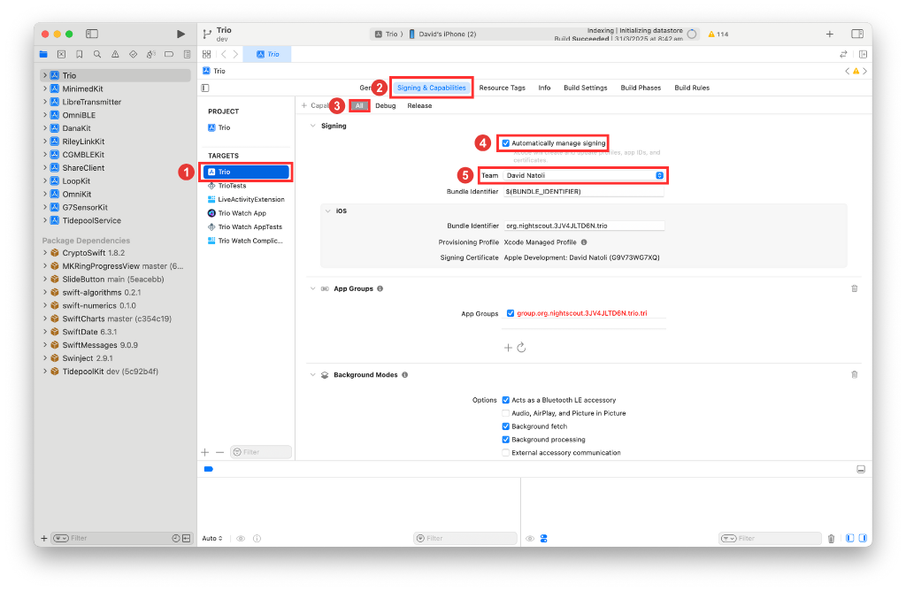
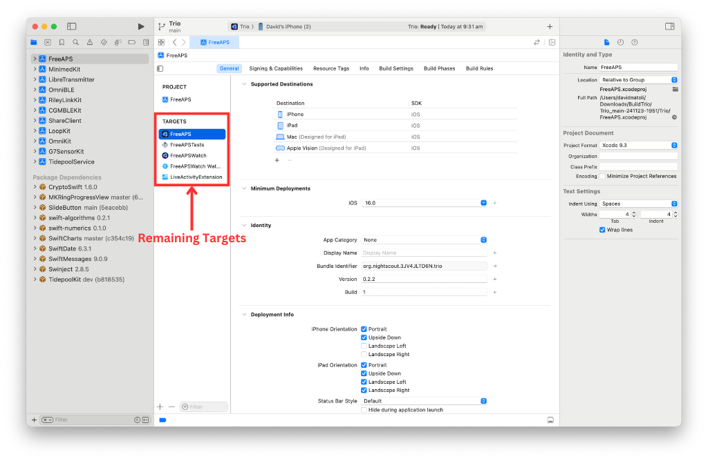

## Overview

!!! info "Time Estimate"

    - 60-80 minutes for first-time builders.
    - 10-15 minutes for repeat builders.

!!! abstract "Summary"

    You will:
    
    - Run the 'Build Select Script' to download Trio code.
    - Follow the step-by-step instructions in the script.
    - Press the Xcode 'Run' button to build Trio.
    - Watch in awe as you build your very own app.

!!! question "FAQs"

    - **Why does Xcode show a colorful spinning icon and not respond to me?** Unfortunately, sometimes Xcode gets confused, and you must force-quit the application.
    - Many more FAQs for building Trio align with the steps that trigger the questions.
    
## Build Trio with Xcode

!!! warning "Release 0.7.0 and newer"

    The main branch is the preferred build for everyone except expert builders.

    If you are coming from an older main version 0.2.x, please read the [Migration Guide](../../../configuration/migration/trio-02x-migration.md) before updating.
    
    All Trio users are encouraged to follow along in [Trio Discord](https://discord.triodocs.org).

### Download Trio with 'Trio Build Select Script'

Trio uses the Trio Build Select Script to download Trio's source code, prepare your computer, and build Trio. Every attempt was made to put messages directly in the script for each step. The next few sections of this page walk you through what you will see when you run the script.

#### Open Terminal

!!! tip ""
    Shortcut: Tap on the CMD and spacebar to open Spotlight search and type `Ter` and then return to open the Terminal

1. On your Mac computer, go to the 'Finder' app.

2. Next, select' Applications' in the navigation pane on the left of the screen.

3. In the 'Applications' folder, scroll to locate and open the 'Utilities' folder.

4. Scroll to and open the 'Terminal' application.

#### Run the 'Trio Build Select Script' in 'Terminal'

The Trio Build Select Script is designed to walk you through downloading Trio. Please take some to read each step carefully. 

1. Copy the below script by hovering the mouse near the bottom right side of the text and clicking the copy icon. 

    ```
      /bin/bash -c "$(curl -fsSL \
        https://raw.githubusercontent.com/loopandlearn/lnl-scripts/main/TrioBuildSelectScript.sh)"
    ```

2. Paste the 'Build Select Script' into Terminal. Press return to run the script.

3. Running the script will display a series of menu options in the 'Terminal' window, as shown below. To build Trio, you will type 1, and the press return. 

    {width="682"}
      {align= "center"}

4. Next, the script will inform you that you are downloading open-source software. If you understand the warning, you will Type 1 and press return.

    {width="682"}
      {align= "center"}

5. Next, the script will prompt you to select which Trio branch you want to download. It is recommended you Type 1 and press return to select the `main` branch. 

6. Next, the script will begin downloading the Trio source code. Depending on your download speed, this can take 3 minutes to 30 minutes. While this happens, you may read words in the Terminal window that you do not understand. That is normal. If the download takes a while, you can leave the room and return later to check progress. 

7. Once successfully downloaded, your terminal window will appear as below.

    {width="682"}
      {align= "center"}

8. If you receive a failure message, scroll up through the window to find the error message(s). For assistance, visit [Xcode Errors with Build Select](build-errors.md#xcode-errors-with-build-select).

9. You can hit return to continue if you did not receive errors.

10. Next, we will configure how we sign targets. If you have never built an Xcode app using your Apple Developer ID on this computer, you will be asked how you want to sign the targets the first time you use the script. If you have previously built with the build script, you can skip forward to step 14. 

11. If you are building with a paid Apple Developer account, type 1 and press return. If you are building with a free Apple Developer Account, type 2 and press return. Free account users go to [Free Apple Developer Account Build](#free-apple-developer-account-build) now. 

    {width="682"}
      {align= "center"}

12. Once users select option 1, they will be prompted to gather their Apple Developer Team ID. To do so, follow the link provided in the Terminal window.

    {width="682"}
      {align= "center"}

13. Once you have gathered your Team ID, you can return to Terminal and press return as prompted. The build script will prompt you to enter your Team ID into the Terminal window. Once you have entered the Team ID, you can press return.

    {width="682"}
      {align= "center"}

14. If you have previously built with the build script, you will be asked to confirm that your Team ID is correct. If it is, you can type 1 and press return.

    {width="682"}
      {align= "center"}

15. The next question asks if you want to ensure a year with your new build. Unless you have a specific reason, type 1 and press return. 

    {width="682"}
      {align= "center"}

16. In the next Terminal window, you will be prompted to do the following:
    - Unlock your phone.
    - If you have an Apple Watch, ensure it is unlocked and on your wrist.
    - Plug your phone into the computer.
    - Press return to continue.
    
    {width="682"}
      {align= "center"}

### Build Trio 

1. Next, the script will open the Xcode application. When Xcode first opens, it takes some time for the project and its associated packages to load. You might see a progress wheel with the words 'downloading', 'copying', or 'indexing'. 

2. Next, we will set our build destination (a.k.a. your device). At the top of the screen, there is a progress/information bar. To the left of the bar, you will see 'Trio' and the logo. Next to this is your build location. Click this and select the device you would like to build to. 

    {width="1024"}
      {align= "center"}

3. We will now build to the location we selected. You can now select the run button. 

    {width="1024"}
      {align= "center"}

4. Once you press the run button, you can monitor progress in the information bar.

5. Once the build is complete, a transient message will pop up on the window saying "Build Succeeded." Trio will launch on your phone or build device. You can unplug the device from the computer. When you unplug the device, a message will pop up in Xcode noting the lost connection. Acknowledge this message. Once unplugged, the Trio app will close on the phone, and users must re-open the application. 

### First Build Messages

If this is your first time building an app with this device. You may get some of the following messages:

- "Device "YOUR DEVICE NAME" isn't registered in your developer account."
    - If this message occurs, select 'Register Device', and Trio will continue to build.

    {width="300"}
      {align= "center"}

- "Unlock "YOUR DEVICE NAME" to Continue"
    - Unlock your device.

   {width="500"}
     {align= "center"}

- "code sign wants to access key "access" in your keychain".
    - Enter your computer password and press 'Always Allow'. 
    - Please note: This message may appear numerous times. **Do not get frustrated and press 'Deny'**. Just keep entering your computer password and press 'Always Allow'.

    {width="500"}
      {align= "center"}

## Build Errors

!!! warning "Yellow Errors"

    If you receive any yellow errors or warnings, don't freak out. This is normal, and Trio will function as normal. Please do not try to fix these errors, as you will likely do more harm than good.

!!! bug "Red Errors"

    If you receive any Red Errors, your application will fail to build. Please visit the [Build Errors](build-errors.md) page to troubleshoot the errors. Once these errors have been addressed, you can return to the build documents and continue.
    
### Clean Build Folder

Once you've resolved a build error and started the build process again, Xcode will continue to show a red indicator on the top line from the previous failure. If you don't like seeing that, clean the build folder to clear the error. Otherwise, Xcode will still work on the build if the steps show across the top line. When the build succeeds, the red circle will disappear.

!!! tip "Clean Build Folder"

    - In the Xcode menu, select Product, then Clean Build Folder
    - Wait for cleaning to complete: you'll see a "Clean Finished" message

## Successful Build

Congratulations on building Trio, and welcome to the community.  
Please see the [New User Guide](../../../configuration/new-user-setup.md) to get started with Trio. 

{width="500"}
{align= "center"}

## Free Apple Developer Account Build

### Prepare to Sign

 You typically get here after choosing to Sign Manually after a successful download using the Build Select script. Normally this option is chosen by people building the app with a Free Apple Developer Accout option or if you want to build to a simulator on your computer.

The instructions found on this page are for the first build.  With the Free version, you need to build every week. You cannot build again on day five and hope for another seven days. Unfortnately, it doesnt work that way.

### Select the Trio Folder

!!! danger "Don't touch that button!"
    You will be told exactly where on each screen you should click. Please only click in the designated places.

Follow the directions and compare your Xcode screen to the graphics as you walk through the steps.

1. Follow the 'Build Select Script' prompts to open Xcode. Ensure you follow the instructions on each screen.

2. Once Xcode is open, in the navigation pane one the left side of the screen, double click on 'Trio'

    {width="1024"}
      {align="center"}
      
3. Next, ensure your phone is set as the build location. If not, click on the build location and select your device from the drop down list. 

    - If this is the first time your phone or watch has been connected to Xcode, you will need to tell the phone and watch to "Trust this Computer".

    {width="1024"}
      {align="center"}
      
!!! Question "I don't see my phone"
    * If you don't see your phone in the Devices section, unplug and plug in again.
    * Still don't see your phone - reboot the phone - and if that doesn't work - reboot the computer.
    * Still don't see your phone - try a different cable or USB slot.
    
### Sign Targets
    
!!! question "What does Signing Targets Mean?"

    "Signing Targets" in Xcode identifies who built the app. You cannot deploy an app to a phone without signing each target associated with that app.

The graphic below indicates in red the places you need to click in order to begin signing targets.

1. First, ensure the target 'Trio' is selected.

2. Next, we are going to select the 'Signing & Capabilities tab.

3. We will then filter the capabilities to 'All'

4. Next, please check 'Automatically manage signing' option.

5. You can now add your 'Team'. Click the drop down box and ensure you select your free team.

    {width="1024"}
      {align="center"}
      
6. Repeat the same steps for the remaining targets.

    {width="1024"}
      {align="center"}
      
### Disable Features

This section is required if you are using the free account. Some features of Trio are not available with a free Apple Developer Account. You will need to remove features that are not supported.

1. You must remove unsupported capabilities from the **Trio Target**. This is best done when you sign the target:
    * Delete **Push Notifications**
    * Delete **NFC Tag Reading** (NFC Scan can stay)
    * For **Healthkit**: Unselect Healthkit background delivery and then reselect it. 
        * The free build doesn't allow HealthKit Access (Verifiable Health Records) capabilities, which is unchecked by default, so shouldn't be an issue, but the only way that I've found to clear the Healthkit Access error is to unselect/reselect background delivery.

**Details about removing unsupported capabilities:**

- You must disable Push Notification, Near Field Communication Tag Reading, and unselect/reselect HealthKit
    - You will see an error message when you select (personal team) for the **Trio Target**
- The Xcode error message starts with "Cannot create . . ." with a list of all the attributes not supported.
    - Scroll down and click on the little trash can icon next to each unsupported attribute
- Scroll up and both the "Cannot create . . ." and "No profiles for . . ." error messages are gone
- You are done with this target
- Proceed to the next target

!!! info "Libre Transmitter not supported with a FREE Apple Developer Account" 
    Libre transmitters require *Near Field Communication (NFC)* for background tag reading.  
     ❌ This capability is not available when building Trio with a **free** Apple Developer Account.  
     You need a **paid** Apple Developer Account for that.

!!! info "Live Activity / Dynamic Island not supported with a FREE Apple Developer Account" 

## End of Free Account Steps

You have now completed the additional steps required for building with a free Apple developer account. You can return to [Build Trio](#build-trio) and complete the remaining steps. 

