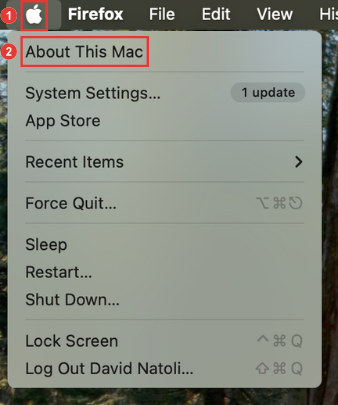
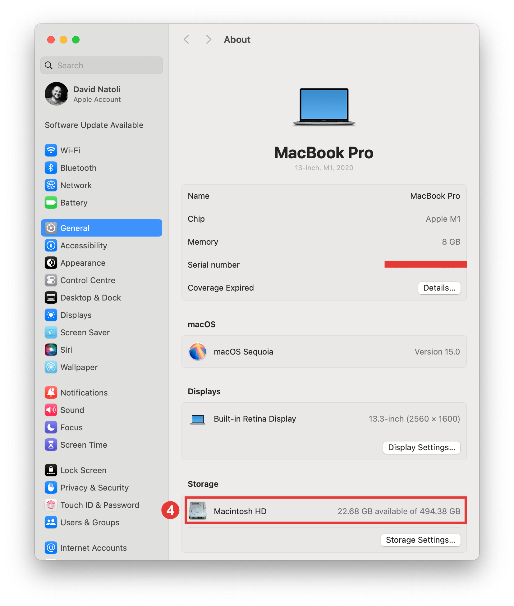

## Prepare your Computer

### Computer Compatibility

Let's confirm that your computer is compatible with and meets the requirements for building Trio. 

The iOS of the phone on which you wish to build Trio dictates the required macOS of your computer. At a minimum, the current release of Trio requires iOS 16.3 or higher, Xcode version 15 or higher, and macOS 13.5 or higher. 

The table below lists the **minimum** requirements to build the current release of Trio. If your macOS or Xcode version is higher, you can build on a Mac.

Find your iPhone iOS version in the table below. 



### Check your iOS version

1. On your iPhone, click on the 'Settings' application.

2. Next, select the 'General' option.

3. Then, select the 'About' option.

4. Review and take note of your 'iOS Version' at the top of the page.

5. Compare your 'iOS Version' with the above table to confirm what "macOS" your computer requires. 

    {width="481"}
      {align= "center"}

### Check your macOS version

1. Select the 'Apple' icon at the top left corner of your computer screen. 

2. Next, select the 'About This Mac' option.

3. This will open an application with information specific to your Mac computer. Take note of your 'macOS', and in combination with your 'iOS Version,' review the above table to confirm compatibility.

    {width="348"}
      {align= "center"}

### Check the Space Available on your Hard Drive

In order to install Xcode on your Mac computer, your hard drive must have at least 50GB of free space. You can check how much space you have by following the instructions below.

1. Select the 'Apple' icon at the top left corner of your computer screen. 

2. Next, select the 'About This Mac' option.

    {width="308"}
      {align= "center"}

3. This will open an application with information specific to your Mac computer. Select the 'More Information' button to open a new window with additional information about your computer. 

    {width="348"}
      {align= "center"}

4. Ensure the 'General' tab is open. Scroll down to the 'Storage' section. Your hard drive will be listed with the volume available out of the total capacity. 

5. As noted above, a minimum of 50GB capacity is required to install Xcode and its components. 

    {width="414"}
      {align= "center"}
   
