## Overview

!!! info "Time Estimate"

    - 25 minutes if Xcode and macOS are already updated to support the current or desired iOS.
    - Up to 2 days, if needed, to install macOS and Xcode update(s).

!!! abstract "Summary"

    Summary of tasks to prepare for and update your app:

    - Determine the required macOS and Xcode versions based on your phone's iOS.
        - If necessary, update first macOS and then Xcode.
    - Check your Developer Account.
    - Download the updated Trio code and build Trio.

    In each of the sections below, follow links to sections of other build pages then hit the back button on your browser to return to this page.

!!! question "FAQs"

    - **When do I update?** Anytime you want to change versions or if the app is about to expire.
    - **Do I delete my old Trio app first?** No! If you keep your Trio app on your phone, your settings (and existing pod) will continue to work the same after the update.
    - **Do I need to start a new pod when I update?** No. Your pod session will continue seamlessly if you use the same Apple Developer Account to sign the Trio app targets as you did the last time you built.
    - **What if I'm using a new/different developer account?** If you aren't building with the same developer account used when your existing app was built (this includes going from free to paid), you will install a brand new (second) Trio app on your phone. Your existing pod won't work with the new app, so you should time this transition when you are due to change pods. Delete the old app once you get the new one all setup.
    - **What if it is a new computer but the same developer account?** No big deal...use the Updating Steps to check that your new computer has the required compatible versions and then build your app. This will include installing Xcode, configuring Xcode Settings, and adding your Developer ID to Xcode.
    
## Prepare to Update

Under ordinary circumstances, you only have to update Trio once it expires (1 year for a paid account). However, we encourage regular updates when new versions are released because they often contain bug fixes or improvements, which may increase operational stability.

### iOS Updates

Before updating Trio, it is important to check for any iOS updates. It's good practice to keep your other devices updated wherever possible. If updates are available, check their compatibility with Trio before updating.

### macOS and Xcode Version

The table below lists the minimum requirements to build the current release of Trio. Find your iOS version and review the correlating minimum MacOS and Xcode versions. If required, update your MacOS and Xcode. 

!!! info "iOS Version"

    If your iOS is not listed, e.g., 17.6.1, choose the first row that is less than your iOS.

| iOS Version | minimum Xcode | minimum macOS | 
|:---:|:---:|:---:|
| 18.1 | 16.1 | 14.5 |
| 18.0 | 15.4 | 14.5 |
| 17.5 | 15.4 | 14.0 |
| 17.4 | 15.3 | 14.0 |
| 16.3 to 17.0 | 15.0 | 13.5 |


!!! warning "Update MacOS first, Then Xcode"

    Your macOS must meet the minimum requirement for the Xcode version needed to support your current iOS, as detailed in the link above.

    - If the macOS is too old, the Xcode version will not appear in the App Store
    - You might think you don't need to update Xcode (but you do)
    - Your build will fail, and mentors might need to help you

### Apple Developer - Check for updated agreements

Apple frequently updates its License Agreement for the Developer Program. You need to log in to your [developer account](https://developer.apple.com/account/) to manually check if there is a new agreement to accept. If you see a big red or orange banner atop your Developer Account announcing a new license agreement, like shown below, please read and accept it before building Trio.

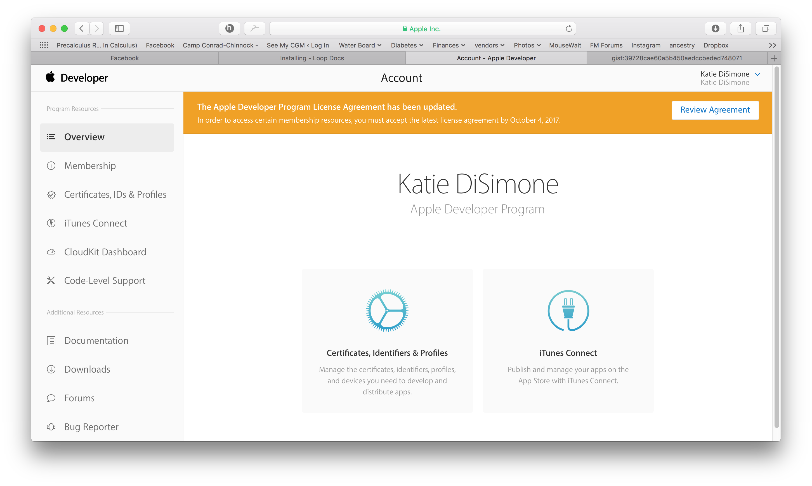{width="1024"}
{align= "center"}

## Update Trio with Xcode

### Open Terminal

1. On your Mac computer, go to the 'Finder' app.

2. Next, select' Applications' in the navigation pane on the left of the screen.

3. In the 'Applications' folder, scroll to locate and open the 'Utilities' folder.

4. Scroll to and open the 'Terminal' application.

#### Run the 'Build Select Script' in 'Terminal'

The Build Select Script is designed to walk you through downloading Trio. Please take some to carefully read each step. 

1. Copy the below script by hovering the mouse near the bottom right side of the text and clicking the copy icon. 

    ```
      /bin/bash -c "$(curl -fsSL \
        https://raw.githubusercontent.com/loopandlearn/lnl-scripts/main/TrioBuildSelectScript.sh)"
    ```

2. Paste the 'Build Select Script' into Terminal. Press return to run the script.

3. Running the script will display a series of menu options in the 'Terminal' window as shown below. To build Trio, you will type 1, and the press return. 

    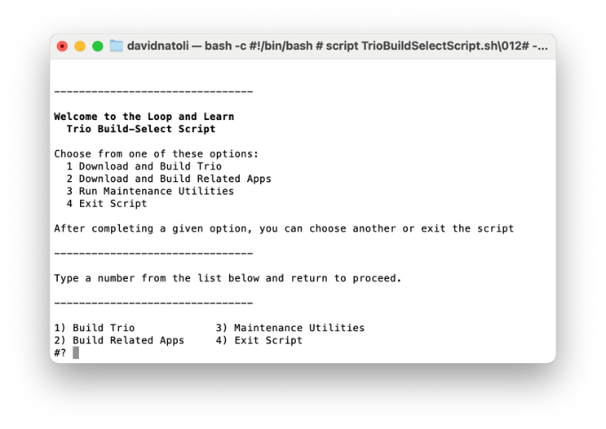{width="682"}
      {align= "center"}

4. Next, the script will inform you that you are downloading open-source software. If you understand the warning, you will Type 1 and press return.

    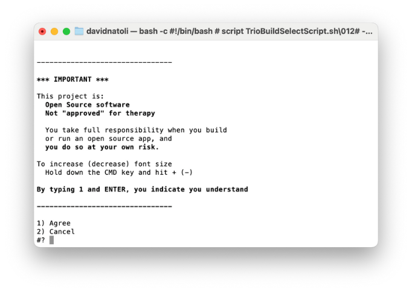{width="682"}
      {align= "center"}

5. Next, the script will prompt you to select which Trio branch you want to download. Unless you are actively contributing to app development, you will type 1 and press return. 

    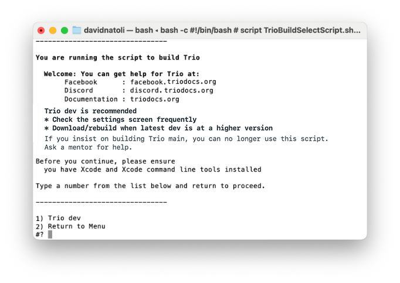{width="682"}
      {align= "center"}

6. Next, the script will begin downloading the Trio source code. Depending on your download speed, this can take 3 minutes to 30 minutes. While this happens, you may read words in the Terminal window that you do not understand. That is normal. If the download takes a while, you can leave the room and return later to check progress. 

7. Once successfully downloaded, your terminal window will appear as below.

    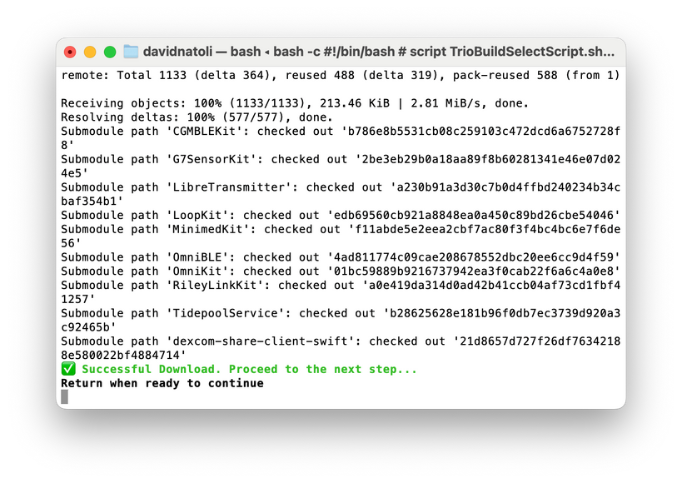{width="682"}
      {align= "center"}

8. If you receive a failure message, scroll up through the window to find the error message(s). For assistance, visit [Xcode Errors with Build Select](build-errors.md#xcode-errors-with-build-select).

9. You can hit return to continue if you did not receive errors.

10. If you have previously built with the build script, you will be asked to confirm that your Team ID is correct. If it is, you can type 1 and press return.

    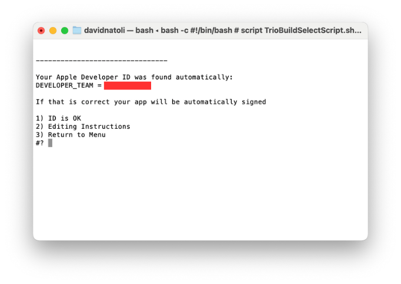{width="682"}
      {align= "center"}

11. The next question asks if you want to ensure a year with your new build. Unless you have a specific reason, type 1 and press return. 

    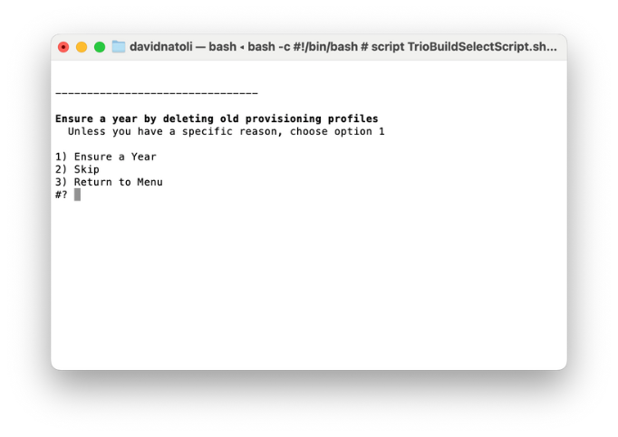{width="682"}
      {align= "center"}

12. In the next Terminal window, you will be prompted to do the following:

    - Unlock your phone.
    - If you have an Apple Watch, ensure it is unlocked and on your wrist.
    - Plug your phone into the computer.
    - Press return to continue.
    
    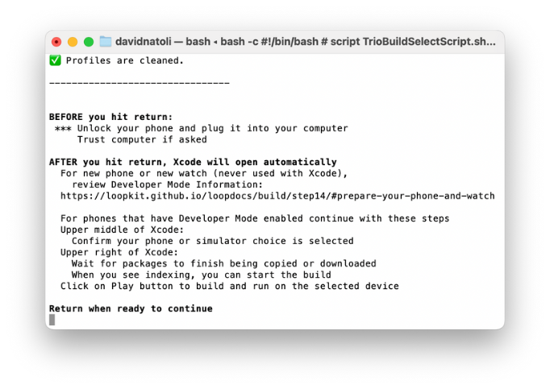{width="682"}
      {align= "center"}

### Build Trio 

1. Next, the script will open the Xcode application. When Xcode first opens, it takes some time for the project and its associated packages to load. You might see a progress wheel with the words 'downloading', 'copying', or 'indexing'. 

2. Next, we will set our build destination (a.k.a. your device). At the top of the screen, there is a progress/information bar. To the left of the bar, you will see 'Trio' and the logo. Next to this is your build location. Click this and select the device you would like to build to. 

    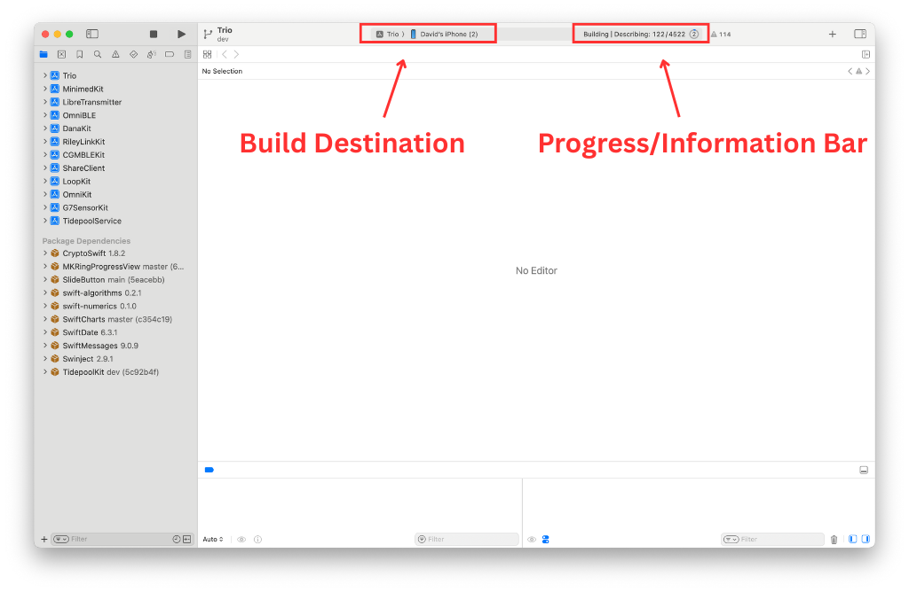{width="1024"}
      {align= "center"}

3. We will now build to the location we selected. You can now select the run button. 

    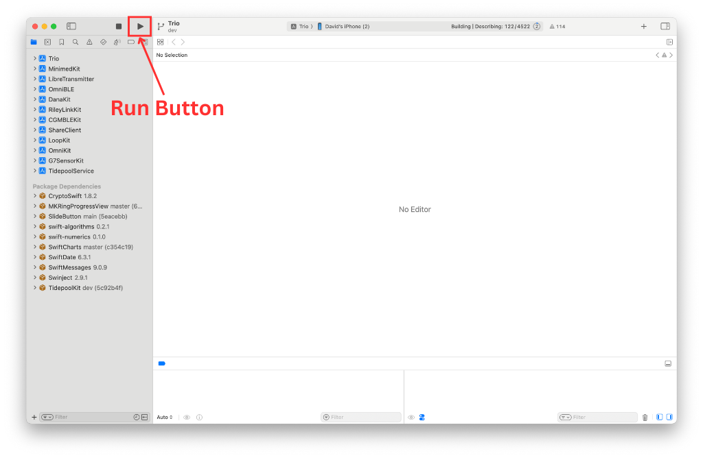{width="1024"}
      {align= "center"}

4. Once you press the run button, you can monitor progress in the information bar.

5. Once the build is complete, a transient message will appear on the window saying, "Build Succeeded." Trio will launch on your phone or build device. You can unplug the device from the computer. When you unplug the device, a message will pop up in Xcode noting the lost connection. Acknowledge this message. Once unplugged, the Trio app will close on the phone, and users must re-open the application. 

### Build Errors

!!! warning "Yellow Errors"

    If you receive any yellow errors or warnings, don't freak out. This is normal, and Trio will function as normal. Please do not try to fix these errors, as you will likely do more harm than good.

!!! bug "Red Errors"

    If you receive any red errors, your application will fail to be built. Please visit the [Build Errors](build-errors.md) page to troubleshoot the errors. Once these errors have been addressed, you can return to the build documents and continue on.

###Successful Update

{width=500"}
{align= "center"}

## Additionals
New Trio users do not need to read the rest of this page.

### Frequent Builders

If you build frequently, you do not have to delete the profiles every time. When the build script asks if you want to "Ensure a Year?", you can skip that step.

On the other hand, you may need to delete the provisioning profiles or saved Xcode information about a version of currently on your computer. The maintenance utilities found in the BuildSelectScrip can be run to delete your provisioning profiles or clear derived data. Or you can use the individual commands in the next sections to do the same thing.

### Delete Provisioning Profiles

You can delete your provisioning profiles by copying this command and pasting it into any terminal. This does not affect any build you currently have on your phone - this just forces your current computer to generate a new one next time you build with *Xcode*.

* For those using *Xcode 16* or newer:

``` { .bash .copy title="Copy and Paste to manually remove Xcode 16 Provisioning Profiles on your computer" }
rm ~/Library/Developer/Xcode/UserData/Provisioning\ Profiles/*.mobileprovision
```

* For those using *Xcode 15* or older:

``` { .bash .copy title="Copy and Paste to manually remove Xcode 15 Provisioning Profiles on your computer" }
rm ~/Library/MobileDevice/Provisioning\ Profiles/*.mobileprovision
```

### Delete Derived Data

If you build using the same clone on your computer and then update that clone, sometimes you want to remove derived information that Xcode remembers and force it to start fresh.

First quit out of *Xcode*. The following command will delete all derived information for all your clones, so next time you build any app from an existing clone on your computer, the build will take longer. All dependencies will download again. So wait until you see the "indexing" indication on *Xcode* before trying to build.

``` { .bash .copy title="Copy and Paste to manually force Xcode on your computer to start fresh" }
rm -rf ~/Library/Developer/Xcode/DerivedData
```

### Revoke Certificate Issue

What does it look like if you run into the Revoke Certificate message? When you prepare to Sign the Targets with Xcode, you'll see the message highlighted in the figure below.

<br/>
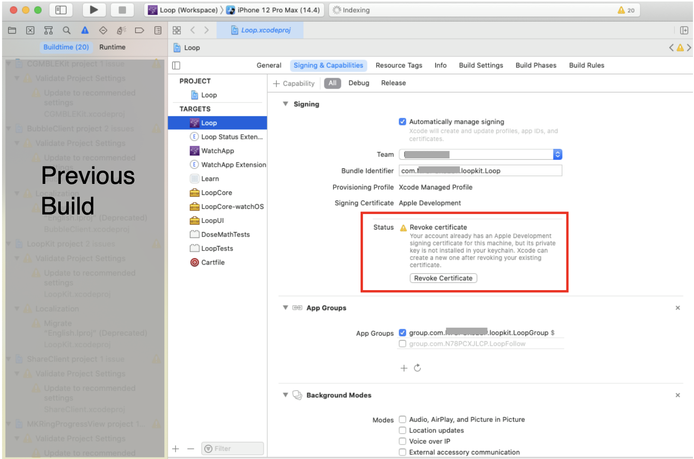{width="850"}
{align="center"}

More information is shown in the orange box below.

!!! warning "Revoke certificate"
    The important part of this message is:

    - ". . . signing certificate . . . private key is not installed in your keychain . . ."

    **WAIT - You might not need to revoke your certificate**

    1. You might get this if you logged in as a different user, have a new computer or if your computer had to undergo a factory reset.
        - You can transfer your keychain to your new computer (or just revoke and keep going).
        - To transfer your keychain, check this [Apple Documentation Link](https://help.apple.com/xcode/mac/current/#/dev8a2822e0b).
    1. Your version of Xcode is way out-of-date
        - Mentors have seen this with people trying to build with Xcode 11.4 or earlier
        - Update Xcode to the most recent version

    **If you revoke and keep going:**

    - If you do hit Revoke Certificate, you'll be given a new one.
    - Even with the new certificate, your Apple Developer ID is not affected.
    - You can re-build on the existing Trio app on your device(s) and maintain all your settings with the new certificate.

    Be aware that you will have to rebuild to every device that used the certificate you just revoked and if you have other apps built with this certificate, they will stop working too.


## Direct Download of Xcode

Many people find updating Xcode from the App Store to be incredibly slow - especially when a new version has just been released.  This method still takes time and enough space on your disk but is faster than going through the App Store.  Depending on your internet speed, this download can be done in about an hour. Then once it is downloaded, expect another fifteen minutes to several hours (depending on the speed of your computer) for the "xip" file to "expand".

The instructions do not hold your hand.

* Your macOS must be at the minimum version (or newer) to support the version of Xcode you're about the download
* You need to know how to log into your Apple Developer account and navigate those menus
* You need to know how to use Finder to navigate to Downloads
* You need to know how to drag the Xcode icon into your Applications folder (after download and expand completes)
* After you have done a direct download, the App Store will not show you updates
    - Either repeat the Direct Download or
    - Delete Xcode from Applications folder
        - Open the App Store and search for Xcode
        - Install fresh
        - After you use the App Store for a download, then Updates will show in the future

Here are the different steps you need to follow when doing the Direct Download instead of the App Store method:

1. Open the [Apple Developer Download page](https://developer.apple.com/download)
    - You may need to login
    - Examine the menus (on my computer there are buttons across the top)
    - Click on Applications
    - Look at the available applications, which should include one or more Xcode version
    - Scroll down until you find the item you want (for example, Xcode 15.4 or Xcode 16)
    - Click on View Details and click on the Download button for the "xip" file
2. Wait for Download to complete
3. Expand the file by clicking on it in Finder
4. Move the Xcode icon to Applications after the expansion completes
5. Check the [Command Line Tools](computer.md#command-line-tools) setting under Xcode->Settings
    - The selection cannot be blank or Build-Script will fail to open Xcode automatically
    - It should be the same version as your Xcode
6. Reboot the computer
