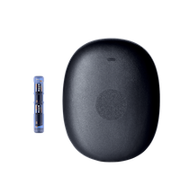

# Compatible CGM



## Nightscout

While using Nightscout as a CGM is an option, it should be avoided if possible because it will not keep Trio running in the background like other CGM options. You will have to open Trio manually to make it run loop cycles.

## xDrip4iOS

To use xDrip4iOS as a CGM source, you must build it yourself with the same Apple Developer account you used to build your Trio app. You cannot use Shuggah or a version distributed by someone else's TestFlight. Please see the following for instructions on how to build xDrip4iOS yourself: [link](../../../ecosystem/xdrip4ios.md#xdrip4ios-as-cgm-source)

However, if you are using Dexcom G6 or ONE with xDrip4iOS, you can choose the Dexcom G6 option in Trio rather than xDrip4iOS, and Trio will intercept the glucose readings even if you're using Shuggah or someone else's TestFlight of xDrip4iOS.

## Dexcom G5 / G6 / ONE

Trio can intercept glucose readings between the transmitter and the Dexcom app.  
If you are using a Dexcom G5, G6, or ONE sensor, tap `Settings` > `Devices` > `Continuous Glucose Monitor`, add your CGM  to enter your transmitter's 6-digit ID.  
*Dexcom Share Credentials* are not necessary. 

When switching transmitters, you must delete your current transmitter from Trio by tapping `Settings` > `Devices` > `Continuous Glucose Monitor` > `Dexcom G6 / ONE`, scrolling down, and tapping <code>Delete CGM</code>.  
Once you do this, you can add the new transmitter with its Transmitter ID.  
Remember to enable `Upload Readings` to have *Trio* send glucose to *Nightscout*.

## Dexcom G7 / ONE+

Trio can intercept its glucose readings as long as the Dexcom G7 or ONE app is installed on the same phone. When a new G7 sensor is paired to the Dexcom G7 app, or a new ONE+ sensor is paired to the Dexcom ONE+ app, Trio will automatically start reading it.

## Glucose Simulator

The Glucose Simulator adds artificial CGM readings to the screen so you can see how your readings might look in the app. When using this CGM option, you cannot manually influence the readings shown to reflect a desired glucose response. Actions taken by the Trio algorithm also do not affect the CGM readings in the Glucose Simulator. They are for visual purposes only. For this reason, using the Glucose Simulator will not help you understand how the algorithm influences blood sugars.

!!! warning
    
    ***The Glucose Simulator should never be used in conjunction with a live pump connected to a person (or animal).***

## Libre Transmitter

This option pairs a compatible Libre CGM directly with Trio without using a separate app like xDrip4iOS.

### Supported Sensors



### Unsupported Sensors



## Eversense E3 / 365

{width="150"}
{align="center"}

Trio supports both the Eversense E3 (90 days & 180 days) and the Eversense 365 (full year) transmitters.
Note that Eversense integration is currently only available with the experimental branch `feat/dev-eversense`.
  
## Medtronic Enlite

The Minimed Enlite CGM, available with the Medtronic 522/722, 523/723, and 554/754, wirelessly sends glucose readings to the pump. Trio can read the Medtronic CGM data directly from the pump using a RileyLink-compatible device.
