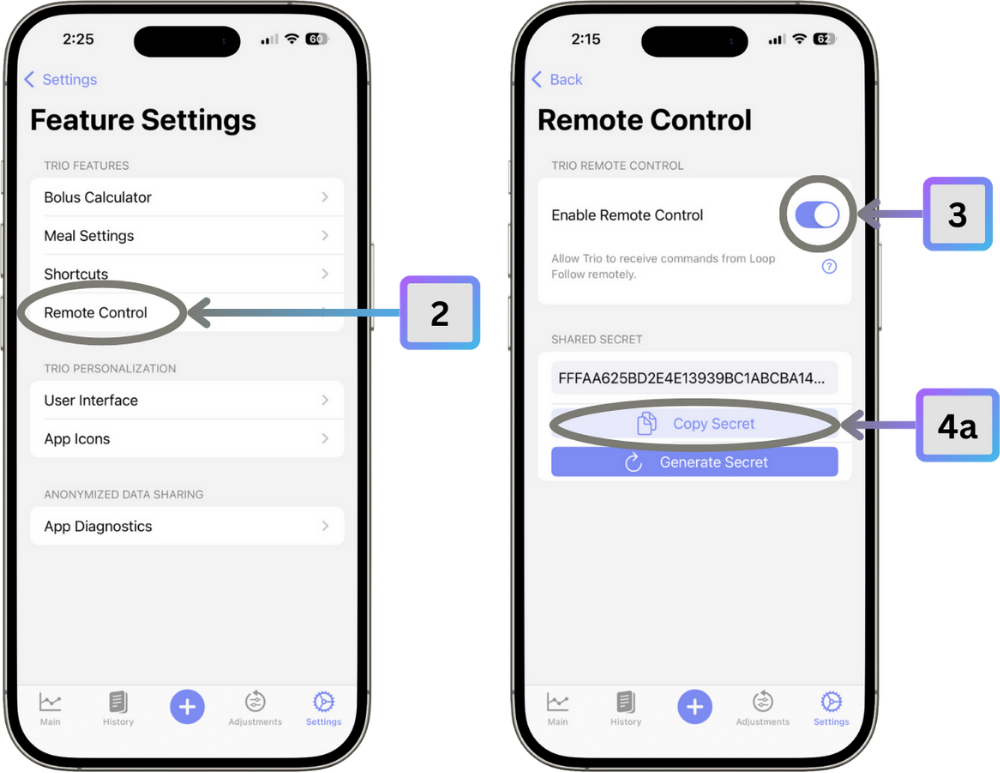

# LoopFollow Integration with Trio

LoopFollow is a companion iOS app designed for remote monitoring and remote control of Trio. It allows caregivers, parents, and friends to view real-time glucose data, loop status, and send remote commands to the Trio app.

!!! info "Learn more about LoopFollow" 
    - [Loop and Learn](https://www.loopandlearn.org/loop-follow/) 
    - [LoopFollow Docs](https://loopfollowdocs.org)

---

## Overview

LoopFollow integrates with Trio in two primary ways:

1. **Data Monitoring**: Displays glucose, insulin, and loop status by reading from your Nightscout site
2. **Remote Control**: Sends commands directly to Trio via encrypted push notifications (Trio Remote Control)

LoopFollow does not communicate directly with Trio's database or app—instead, it uses Nightscout as the data source and Apple Push Notification Service (APNS) for remote commands.

---

## What LoopFollow Does

### Data Display

LoopFollow shows:

- **Glucose readings** with trend arrows and graphs
- **Insulin on Board (IOB)** and **Carbs on Board (COB)**
- **Loop status** (last loop time, success/failure)
- **Pump reservoir** and **battery levels**
- **Temp basals** and **temporary targets**
- **Recent treatments** (boluses, carbs, etc.)
- **OpenAPS predictions** and algorithm decisions

All this data comes from your **Nightscout site**, which Trio uploads to [once configured](nightscout-app.md#configuration).

### Remote Commands (Trio Remote Control)

When configured with Trio Remote Control, LoopFollow can send:

- **Boluses**: Deliver insulin remotely
- **Meals**: Log carbs (with optional bolus)
- **Temp Targets**: Set or cancel temporary glucose targets
- **Overrides**: Activate or cancel override presets (Exercise, Sick Day, etc.)

These commands are sent via **encrypted push notifications** directly to the Trio app, bypassing Nightscout.

---

## Prerequisites

### For Data Monitoring

1. **Nightscout Site**  
    - Active Nightscout instance (version 15.0.2+ recommended)
    - Trio configured to upload to Nightscout
    - See [Nightscout Integration](nightscout-app.md) for setup

2. **Nightscout API Token** (optional but recommended)  
    - For secure access to Nightscout data
    - Token with "readable" access is sufficient for monitoring only
    - Token with "careportal" access allows limited remote commands via Nightscout

### For Remote Control (Trio Remote Control)

1. **Trio Remote Control Enabled**  
    - Enabled in Trio: Settings → Features → Remote Control
    - Shared Secret generated and copied from Trio

2. **LoopFollow App**  
    - Version 2.4.0 or newer
    - Available on the App Store or via TestFlight

3. **Apple Developer Account Details** (for APNS)  
    - Team ID
    - Private Key (for signing JWT tokens)
    - Key ID
    - Bundle ID of Trio app

---

## Configuration

### Step 1: Configure LoopFollow with Nightscout

1. Open **LoopFollow** app
2. Tap the **Settings** icon (bottom right)
3. Under **Data Source**, enter:
    - **Nightscout URL**: Your Nightscout site URL
    - **API Secret**: Your Nightscout API secret or token

4. Verify the status shows **"OK (Read)"** or **"OK (Read & Write)"**

LoopFollow now displays data from Nightscout. This is all you need for monitoring.

### Step 2: Configure Trio Remote Control

To enable remote commands, follow these steps:

#### A. Enable Remote Control in Trio

1. Open **Trio** app
2. Navigate to **Settings → Features → Remote Control**
3. Toggle **Enable Remote Control** to ON
4. **Copy the Shared Secret**  
    4a. Tap `Copy Secret` to copy to clipboard  
    4b. Paste in Notes App  

{width="500"}
{align="center"}

#### B. Configure LoopFollow Remote Settings

1. Open **LoopFollow**
2. Go to **... More → Settings → Remote Settings**
3. Select **Remote Settings**: Trio Remote Control
4. Under **Shared Secret**: Paste the secret from Trio
5. Under **APNS Configuration**, enter:
    - **Bundle ID**: Your Trio app bundle identifier
    - **Team ID**: Your Apple Developer Team ID
    - **Key ID**: Your APNS private key ID
    - **Private Key**: Paste your APNS private key (PEM format)

6. Verify the connection status

!!! info "APNS Keys"
    If you built Trio using GitHub Actions (Browser Build), your APNS keys are stored as GitHub Secrets. You'll need to retrieve:

    - `TEAMID` → Team ID
    - `APPSTORE_KEY_ID` → Key ID
    - `APPSTORE_KEY` → Private Key (base64 decode if needed)

#### C. Test Remote Commands

1. In LoopFollow, tap the **Remote Control** button
2. Try sending a **Temp Target** (safest test)
3. Check Trio receives and applies the command
4. Verify you get a response notification

---

## How It Works

### Data Flow for Monitoring

```
Trio → Nightscout (uploads every 5 min)
Nightscout → LoopFollow (polls every 1-5 min)
LoopFollow → Display on caregiver's phone
```

LoopFollow refreshes data automatically and displays it in real-time.

### Data Flow for Remote Commands

```
LoopFollow → APNS (encrypted push notification)
APNS → Trio (push notification delivery)
Trio → Decrypts command → Validates → Executes
Trio → Response notification → APNS → LoopFollow
```

Commands are encrypted with AES-256-GCM using the shared secret. See [Remote Control documentation](../../configuration/settings/features/remote-control.md) for security details.

---

## Features Available

### Monitoring Features (via Nightscout)

- Real-time glucose display with customizable alerts
- Glucose trend graphs (1h, 3h, 6h, 12h, 24h)
- IOB and COB tracking
- Loop status with last loop time
- Pump reservoir and battery
- Recent treatments timeline
- Predicted glucose from OpenAPS
- Customizable alerts and notifications

### Remote Control Features (via Trio Remote Control)

| Command | Description | Safety Features |
|---------|-------------|-----------------|
| **Bolus** | Deliver insulin | Max Bolus, Max IOB, duplicate detection |
| **Meal** | Log carbs + optional bolus | Max Carbs, Max Fat, Max Protein limits |
| **Temp Target** | Set temp glucose target | Duration limits, can be cancelled |
| **Override** | Activate preset overrides | Must match exact preset name |

See [Remote Control Additions](../../configuration/settings/features/remote-control-additions_x.md) for detailed command documentation.

---

## Alerts and Notifications

LoopFollow can send alerts based on:

- **Glucose levels** (high, low, urgent low)
- **Glucose trends** (rapid rise/drop)
- **Loop status** (not looping, failures)
- **Missed readings** (CGM connection lost)
- **Sage/cage/page** (sensor, cartridge, pod age)
- **Battery** (pump or phone low battery)

Configure alerts in LoopFollow Settings → Alarms.

---

## Limitations

### What LoopFollow Cannot Do

1. **Direct App Access**: Cannot read Trio's local database
2. **Real-Time Updates**: Limited by Nightscout upload frequency (~5 minutes)
3. **No Offline Mode**: Requires internet for both monitoring and remote control
4. **iOS Only**: LoopFollow is only available for iOS devices
5. **Single Direction**: Cannot send data from LoopFollow to Trio except via remote commands

### Data Delay

- **Monitoring data**: 1-5 minute delay (Trio → Nightscout → LoopFollow)
- **Remote commands**: Near real-time (seconds, via push notifications)

---

## Troubleshooting

### LoopFollow Shows "No Data"

**Check**:

1. Nightscout URL is correct in LoopFollow
2. Trio is uploading to Nightscout (check Nightscout site directly)
3. API token is valid (if using one)
4. Internet connection on LoopFollow phone

### Remote Commands Not Working

**Check**:

1. Remote Control is enabled in Trio
2. Shared Secret matches exactly (case-sensitive)
3. APNS keys are correct (Team ID, Key ID, Private Key)
4. Trio app is installed and authorized for push notifications
5. Both phones have internet connection

**Test Steps**:

1. Verify Trio settings show "Enable Remote Control" is ON
2. Try sending a Temp Target (safest test command)
3. Check for response notification in LoopFollow
4. Review error messages if command fails

### Commands Rejected

Common rejection reasons:

- **"Bolus exceeds max bolus"**: Reduce bolus amount
- **"IOB would exceed max IOB"**: Wait for IOB to decrease
- **"Override not found"**: Check preset name spelling/case
- **"Command too old"**: Clock synchronization issue, resend

See [Remote Control documentation](../../configuration/settings/features/remote-control.md) for detailed troubleshooting.

---

## Best Practices

### For Monitoring

1. **Set appropriate alerts**: Avoid alert fatigue by tuning thresholds
2. **Check frequently**: Especially for new Trio users
3. **Understand delays**: Remember ~5 minute data delay from Nightscout
4. **Have backup**: Don't rely solely on LoopFollow; user should monitor themselves

### For Remote Control

1. **Communicate first**: Always tell the Trio user before sending commands
2. **Start with temp targets**: Safest way to test remote control
3. **Verify current status**: Check glucose, IOB, COB before sending bolus
4. **Document commands**: Keep a log of remote commands sent
5. **Have emergency plan**: Know what to do if user is unresponsive

!!! danger "Safety Warning"
    Remote commands deliver real insulin. Always:

    - Communicate with the Trio user before sending commands
    - Verify current glucose and IOB before bolusing
    - Ensure user is aware and able to respond
    - Have emergency glucagon available
    - Never use remote control without user's knowledge and consent

---

## Privacy and Security

LoopFollow with Trio Remote Control uses multiple layers of security:

1. **AES-256-GCM Encryption**: Military-grade encryption of remote commands
2. **Shared Secret**: 32-character secret prevents unauthorized access
3. **Time-Window Validation**: Commands expire after 10 minutes
4. **Feature Toggle**: Remote control can be disabled instantly in Trio
5. **Response Notifications**: Immediate feedback on command success/failure
6. **Audit Trail**: All commands logged to Nightscout

The Trio user always maintains final control—remote control can be disabled at any time in Trio settings.

---

## Summary

LoopFollow transforms Trio into a remotely monitorable and controllable diabetes management system:

- **Monitor** glucose, loop status, and treatments via Nightscout
- **Control** remotely via encrypted push notifications (bolus, carbs, temp targets, overrides)
- **Alert** caregivers to important glucose events
- **Simple setup** with Nightscout URL and optional Trio Remote Control

For caregivers of children, parents of teens, or anyone who wants to support a Trio user, LoopFollow provides peace of mind with powerful monitoring and remote capabilities.

**Resources**:
- LoopFollow GitHub: [https://github.com/loopandlearn/LoopFollow](https://github.com/loopandlearn/LoopFollow)
- LoopFollow Documentation: Check app's built-in help
- Trio Remote Control: See [Remote Control documentation](../../configuration/settings/features/remote-control.md)
