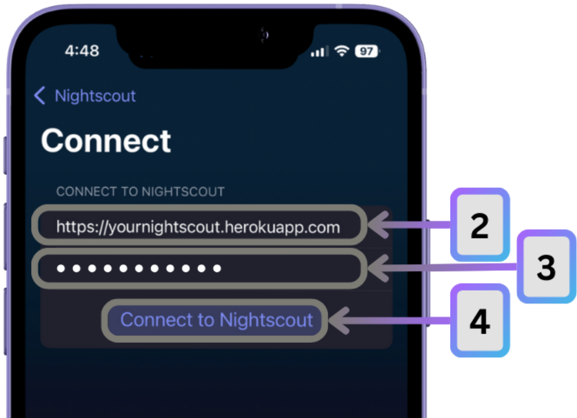

# Nightscout Integration with Trio

Nightscout is a cloud-based diabetes data platform that Trio can integrate with for comprehensive data synchronization, remote monitoring, and caregiver access.

---

## Overview

Trio's Nightscout integration provides bidirectional data synchronization:

- **Upload to Nightscout**: 
    - Device status
    - Glucose readings
    - Insulin delivery
    - Carbs
    - Temp targets
    - Overrides
    - Therapy profiles (during onboarding)
- **Download from Nightscout**: 
    - Therapy profiles
    - Glucose readings (as CGM backup)
    - Carb entries
    - Temp targets

This integration enables:

- Remote monitoring and commands by caregivers
- Data backup and historical tracking
- Integration with other diabetes apps, like Loop Follow
- Transferring therapy settings from other OS-AID systems

---

## Prerequisites

Before configuring Trio to work with Nightscout, you need:

1. **A Nightscout Site**
    - Hosted Nightscout instance (version 15.0.2 or newer recommended)
    - Your Nightscout URL (e.g., `https://yoursite.herokuapp.com`)
    - For help making a Nightscout account, please see the [Nightscout documentation](https://nightscout.github.io/nightscout/new_user/)
2. **API Secret**
    - Your Nightscout API secret (configured during Nightscout setup)
    - Once Trio is connected to Nightscout, it is stored securely in Trio's keychain
    - Required for authenticated uploads/downloads
3. **Network Connection**
    - Active internet connection on your iPhone
    - Trio checks network reachability before uploads

!!! warning "Nightscout Version Requirement"
    To properly display the OpenAPS pill with Trio 0.5.x (or newer), your Nightscout version must be 15.0.2 or newer. Older versions may not correctly display Trio's data.

---

## Configuration

### Step 1: Enable Nightscout in Trio

1. Open Trio and navigate to **Settings → Services → Nightscout → Connect**
2. Enter your Nightscout **URL** (without trailing slash)
    - Example: `https://yoursite.herokuapp.com`
3. Enter your [**API Secret**](https://nightscout.github.io/nightscout/setup_variables/#api-secret-nightscout-password)
    - This is the same secret you configured in Nightscout
    - Stored securely in iOS Keychain
4. Tap **Connect to Nightscout** to validate the connection

Trio will test the connection by uploading a test treatment. If successful, your Nightscout configuration is saved.

!!! important "A Nightscout URL starts with https://"
    
    - Your *Nightscout* URL must start with `https://`.  
    - To set this up correctly, do not forget the letter `s` between `http` and `://`.

### Step 2: Utilize Upload/Download

- **Upload**:
    - Enable **Allow Uploading to Nightscout** toggle
        - Optionally enable **Upload Glucose** if you want CGM data uploaded
        - Trio immediately uploads your current profile when enabled
    - [What Trio Uploads to Nightscout](#what-trio-uploads-to-nightscout)

{width="250"}
{width="250"}

- **Download**:
    - Enable **Allow Fetching from Nightscout** toggle
        - Trio will download carbs, temp targets, and optionally glucose from Nightscout
        - Used as backup or when using Nightscout as primary CGM source
    - [What Trio Downloads from Nightscout](#what-trio-downloads-from-nightscout)

{width="250"}
{width="250"}

- **Backfill Glucose**:
    - Tap **Backfill Glucose**
        - Trio will fetch any missed glucose readings from the last 24 hours

{width="250"}
{width="250"}

---

## What Trio **Uploads** to Nightscout

### 1. Device Status

**Displayed in OpenAPS Pill**:  
All this data appears in the Nightscout "OpenAPS" pill, providing real-time loop status every 5 minutes with every loop cycle.

- **Trio Status**
    - `suggested`: Latest algorithm recommendation (predicted glucose, recommended insulin)
    - `enacted`: What was actually delivered
    - `iob`: Current insulin on board with details
    - `version`: Trio app version

- **Pump Status**
    - Battery level, voltage, state
    - Reservoir remaining insulin
    - Pump clock/timestamp
    - Pump model and status

- **Phone/Uploader Status**
    - iPhone battery percentage
    - Charging state
    - Device timestamp

### 2. Glucose Readings

**Toggle**: Controlled by "Upload Glucose" setting (can be disabled independently)

- CGM glucose values
- Trend/direction arrows
- Timestamp
- Raw/filtered values (if available)
- Uploaded in batches of 100 entries

### 3. Insulin Delivery

- **Boluses**: Manual and automatic (SMB) insulin delivery
- **Basal Rates**: Temporary and scheduled basal
- **Pump Events**: All pump history events
- Uploaded with timestamps and amounts

### 4. Carbohydrate Entries

- Carb amount (grams)
- Fat and protein content (if entered)
- FPU (Fat Protein Units) equivalents
- Absorption notes
- Timestamps (created and scheduled)

### 5. Temporary Targets

- Target range (top and bottom)
- Duration in minutes
- Start time
- Reason/name
- Active and historical temp targets

### 6. Overrides

- Override name
- Duration
- Start timestamp
- Notes

    !!! note "Overrides"
        If duration changes, Trio deletes the old entry and uploads a new one to ensure Nightscout displays correctly.

### 7. Therapy Profile

Uploaded when settings change or upload is first enabled:

- **Insulin Sensitivity Factor (ISF)**: Hourly schedule
- **Carb Ratios**: Hourly schedule
- **Basal Rates**: Hourly schedule
- **Target Ranges**: Hourly low and high targets
- **Duration of Insulin Action (DIA)**
- **Carbs/Hour**: Calculated absorption rate
- **Units**: mg/dL or mmol/L
- **Override Presets**: All configured overrides
- **Additional Metadata**:
    - App bundle identifier
    - APNS device token (for remote control)
    - Team ID
    - App expiration date (for TestFlight builds)

### 8. Notes and Annotations

- User-entered notes
- Treatment annotations
- Uploaded as treatment events

---

## What Trio **Downloads** from Nightscout

When **Allow Fetching from Nightscout** is enabled:

### 1. Glucose Readings

- Downloads up to 1,600 recent glucose entries
- Used as backup CGM source or primary if configured
- Syncs based on last download date

### 2. Carbohydrate Entries

- Fetches carb entries from Nightscout
- Only from trusted sources (prevents duplicated from AndroidAPS, Loop, iAPS)
- Marked as `isUploadedToNS = true` to prevent re-uploading

### 3. Temporary Targets

- Downloads temp target entries
- Event type: "Temporary Target" with duration
- Syncs based on last download date

### 4. Therapy Profiles (Only available during Onboarding)

- Can import profile settings from Nightscout
- Retrieves ISF, CR, basal rates, targets
- Useful for restoring settings or syncing with other devices

---

## Upload Frequency and Triggers

Trio uploads data automatically in response to events:

| Data Type | Trigger | Frequency |
|-----------|---------|-----------|
| Device Status | Every loop cycle | ~5 minutes |
| Glucose | New CGM reading | Real-time |
| Insulin/Bolus | Pump event | Immediate (2s debounce) |
| Carbs | New entry logged | Immediate (2s debounce) |
| Temp Targets | Target set/cancelled | Immediate (2s debounce) |
| Overrides | Override activated/cancelled | Immediate (2s debounce) |
| Profiles | Settings changed | On change |

**Debouncing**: Most uploads are debounced by 2 seconds to batch rapid changes and reduce network requests.

**Batching**: Data is uploaded in chunks of 100 entries to prevent large payloads.

---

## Authentication and Security

### API Secret Authentication

Trio uses SHA-1 hash-based authentication:

1. **Secret Storage**: Your API secret is stored securely in iOS Keychain
2. **Hash Computation**: Trio computes SHA-1 hash of the secret
3. **Header Injection**: Hash included in all API requests as `api-secret` header
4. **HTTPS Required**: All communication over encrypted HTTPS

**Security Note**: The API secret never leaves your device in plaintext. Only the hash is transmitted.

### Connection Validation

When you first configure Nightscout:

- Trio tests the connection by uploading a test treatment
- Validates URL format and authentication
- Confirms Nightscout is reachable and accessible

---

## Unit Conversion

Trio automatically handles unit conversion:

### Glucose Units

If your Trio is set to **mmol/L** but Nightscout expects **mg/dL** (or vice versa):

- **ISF values** are converted
- **Target values** are converted
- **Glucose predictions** in OpenAPS pill are converted
- Conversion formula: `1 mg/dL = 0.0555 mmol/L`

### Profile Units

The uploaded profile includes a `units` field:

- `mg/dl` or `mmol` based on your Trio settings
- Nightscout displays values in the correct units

---

## Troubleshooting

### "Connection Failed" Error

**Possible causes**:

1. **Incorrect URL**: Ensure URL is correct and uses HTTPS
2. **Wrong API Secret**: Verify secret matches your Nightscout configuration
3. **Network Issues**: Check internet connection
4. **Nightscout Down**: Verify Nightscout site is accessible in browser

**Solution**:  
Double-check credentials and test Nightscout URL in Safari

### Data Not Appearing in Nightscout

**Check these settings**:

1. **Upload Enabled**: Verify "Upload to Nightscout" toggle is ON
2. **Network Reachable**: Check iPhone has internet connection
3. **Nightscout Version**: Ensure Nightscout is 15.0.2+ for OpenAPS pill
4. **API Secret**: Confirm secret is correct

**Debug**:  
Check Trio logs for upload errors (if available in settings)

### OpenAPS Pill Not Showing

**Requirements**:

- Nightscout version 15.0.2 or newer
- OpenAPS plugin enabled in Nightscout
- Device status upload successful

**Solution**:  
Update Nightscout and enable OpenAPS plugin in Nightscout settings

### Duplicate Carb Entries

**Cause**:  
Multiple apps uploading to same Nightscout site

**Solution**:

- Trio filters out entries from AndroidAPS, Loop, iAPS only when **downloading from** Nightscout. It cannot prevent duplicate entries being **sent to** Nightscout from multiple apps.
- Ensure "Download from Nightscout" is only enabled on one device
- Check `enteredBy` field in Nightscout to identify source

### Profile Not Syncing

**Check**:

1. Profile uploaded successfully (check upload logs)
2. Nightscout received profile (check Admin Tools → Profile Editor)
3. App expiration date not blocking uploads (TestFlight builds)

**Force Re-Upload**:  
Change any setting slightly to trigger profile upload

---

## Remote Commands via Nightscout

Trio supports limited remote commands through Nightscout Careportal:

### Loop Follow (**Recommended**)

For comprehensive remote control (bolus, overrides, meals), use **Loop Follow**. See [Remote Control documentation](../../configuration/settings/features/remote-control.md) for information on connecting and using Loop Follow.

### Careportal Commands (**Not Recommended**)

When authenticated with a token that has **Careportal access**:

- **Carb Correction**: Log carbs remotely
- **Temporary Target**: Set or cancel temp targets

!!! warning "Nightscout Careportal Not Advised"
    - While you ***are*** able to send limited commands through Nightscout Careportal, it is not advised due to it being less reliable.
    - The preferred and recommended method is using Loop Follow to send remote commands

---

## Advanced Settings

### Upload Glucose Toggle

You can disable glucose uploads while keeping other uploads enabled:

- Turn OFF **Upload Glucose**
- Device status, insulin, carbs, etc. still upload
- Reduces data usage if glucose already uploaded by CGM app

### Use Local Nightscout

For testing or development:

1. Enable **Use Local Glucose Source**
2. Set **Local Glucose Port** (default: 8080)
3. Trio connects to `http://localhost:8080` instead of remote URL

**Use Case**:  
Running Nightscout locally for testing without internet

---

## Data Privacy

When **Allow Uploading to Nightscout** is enabled the following data is transmitted:

### What Leaves Your Device

- All diabetes-related data (glucose, insulin, carbs, settings)
- Device identifiers (for remote control)
- App version information

### What Stays on Your Device

- Your API secret (only hash is transmitted)
- Local app data and databases
- Personal information not related to diabetes

### Nightscout Hosting

- If self-hosting: You control all data
- If using hosted service: Review hosting provider's privacy policy
- All data transmitted over HTTPS encryption

---

## Benefits of Nightscout Integration

1. **Remote Monitoring**: Caregivers can watch glucose and loop status in real-time
2. **Data Backup**: Historical data preserved in cloud
3. **Multi-Device**: Access data from phone, tablet, computer
4. **Reports**: Generate reports and analytics via Nightscout
5. **Sharing**: Share access with healthcare team
6. **Interoperability**: Works with other diabetes apps (Loop Follow, xDrip+, etc.)
7. **Remote Control**: Limited remote commands via Careportal
8. **Transparency**: Full visibility into loop algorithm decisions via OpenAPS pill

---

## Summary

Nightscout integration transforms Trio from a standalone app into a connected diabetes management system:

- **Automatic uploads** of all relevant diabetes data every few minutes
- **Bidirectional sync** for carbs, targets, and profiles
- **Secure authentication** with API secret hashing and HTTPS
- **Real-time monitoring** via OpenAPS pill display
- **Remote access** for caregivers and healthcare providers

To get started, simply configure your Nightscout URL and API secret in Trio's Settings → Services → Nightscout → Connect, then enable [upload and fetch](#step-2-utilize-uploaddownload) as desired.

For more information about Nightscout itself, visit [https://nightscout.github.io/](https://nightscout.github.io/).
