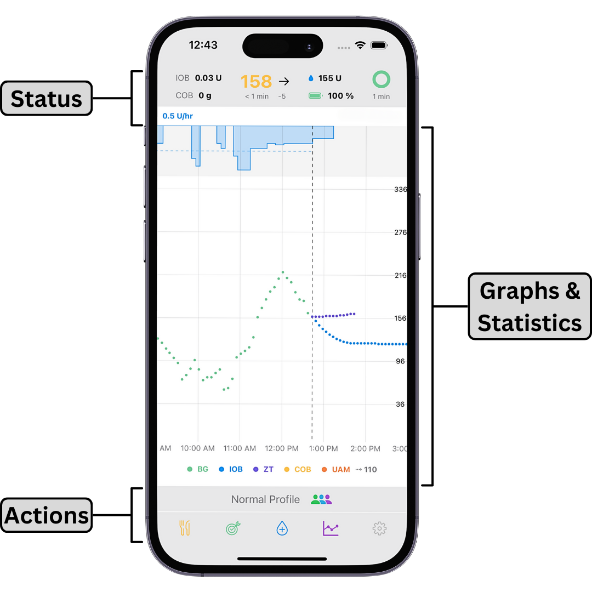
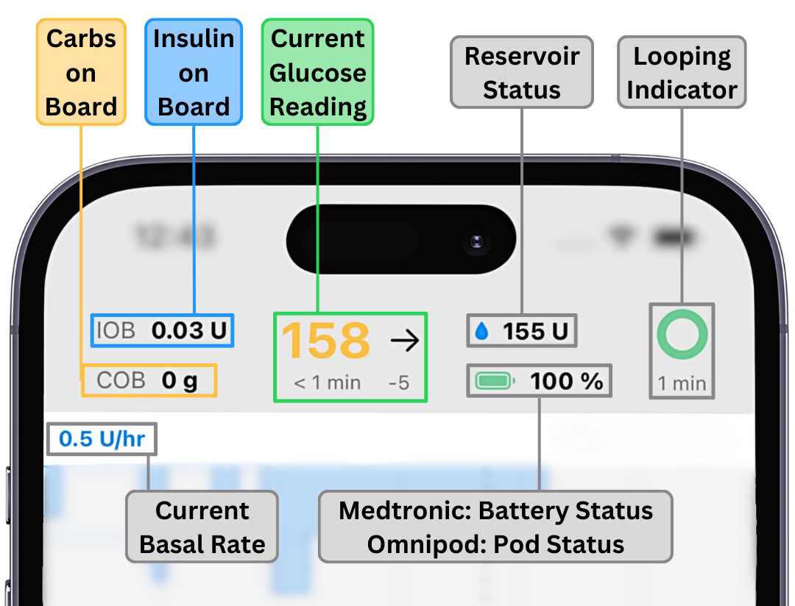
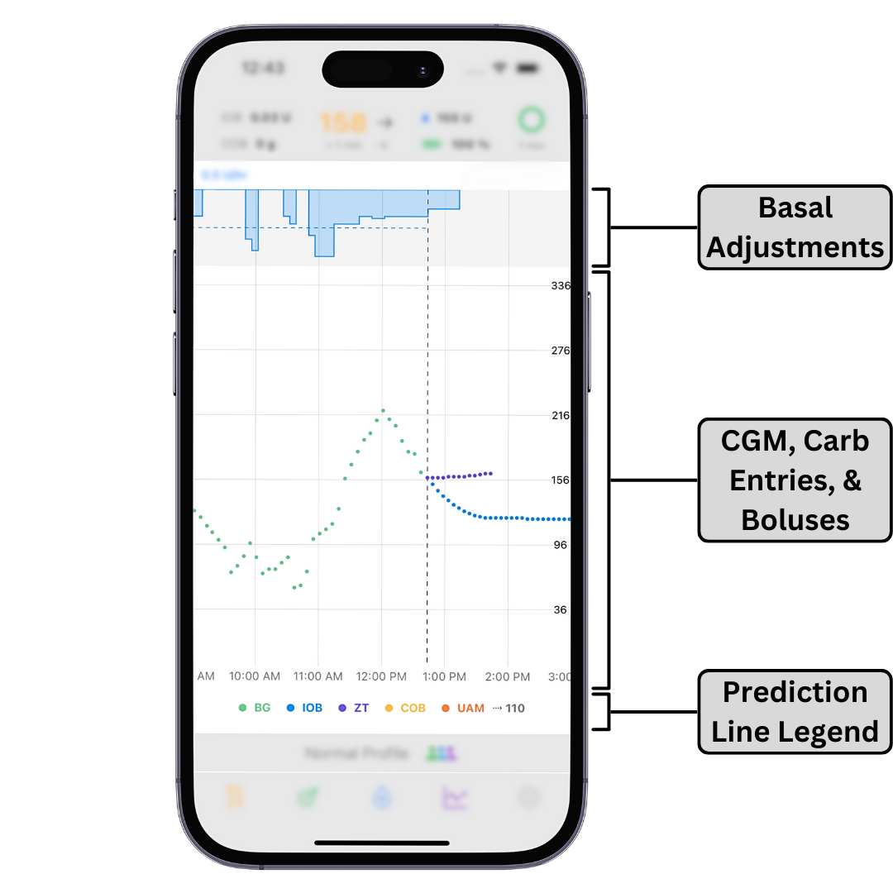
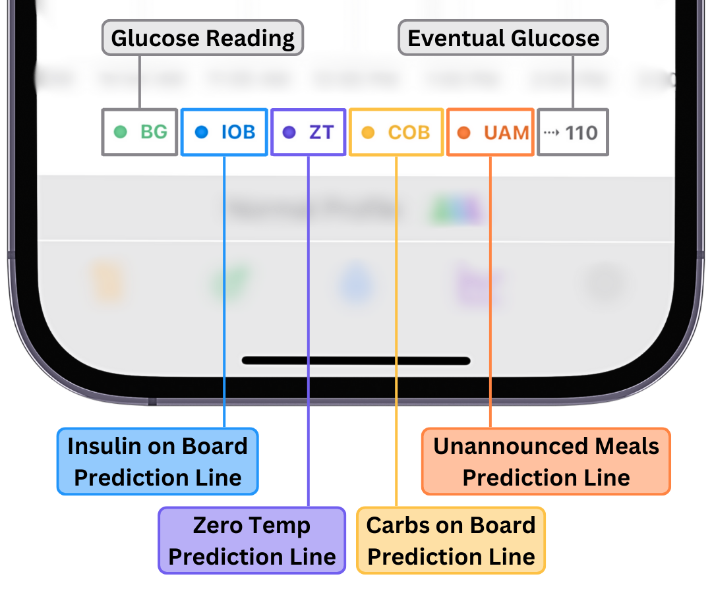
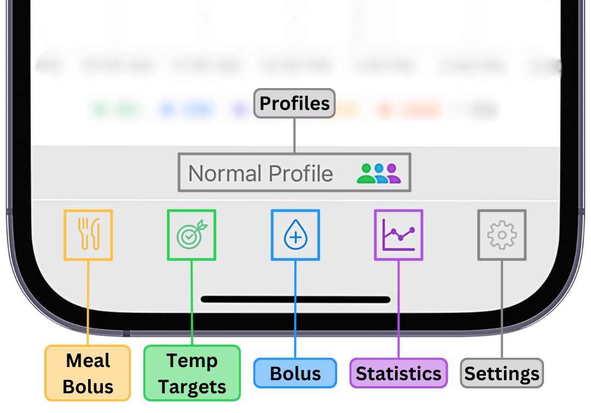

# User Interface

## Main Screen

<b> The main screen of Trio can be divided into three sections: </b>

[Status](#status) | [Graphs & Statistics](#graphs-and-statistics) | [Actions](#actions)

{width="400"}
{align="center"}

### Status

The Status section shows your current insulin on board (IOB), carbs on board (COB), blood glucose, pump status, and looping status. 
The looping indicator will be grey if no data is present. It will be green when it has been less than 5 minutes since a successful loop cycle. It will turn yellow if no loop cycle has been completed for over 5 minutes. If more than 10 minutes go by without a successful loop cycle, the loop circle will turn red. The section to the left of the loop circle shows you the approximate units of insulin left in your pump. If you're using Omnipod, 50+ U means more than 50 units of insulin are left. Below the insulin left, you will see your pump battery status if you're using a Medtronic pump and the days/hours left if you're using an Omnipod.

{width="400"}
{align="center"}

Tapping the top of the screen will bring up a History screen with information on changes implemented by the most recent loop cycle. Tapping the pump status will bring you to pump settings.

### Graphs and Statistics

The middle of the screen graphs your current blood sugar data and inputted carbs overlaid with Trio's insulin delivery and blood sugar predictions.

{width="400"}
{align="center"}

Below the graph is the prediction line legend so you can determine the meaning of your prediction lines.

{width="400"}
{align="center"}

The zero temp (ZT) line predicts where your blood sugar would be if insulin delivery and carb absorption ceased. The IOB line predicts where blood sugar would be if insulin delivery was ceased and carb absorption was minimal. The unannounced meal (UAM) line predicts how long blood glucose will continue to rise, to dose insulin accordingly. The COB line predicts the effects of entered carbs on future blood glucose. For more information on prediction lines, see the [OpenAPS documentation.](https://openaps.readthedocs.io/en/latest/docs/While%20You%20Wait%20For%20Gear/Understand-determine-basal.html)

If enabled, statistics detailing your time in range, coefficient of variance (CV), and average glucose are displayed underneath these graphs. Tapping in this area allows you to change the time interval used to calculate these statistics.

### Actions

At the bottom of the screen, you have five action icons:

{width="400"}
{align="center"}

 <b>Meal Bolus</b> 

The Meal Bolus option allows you to enter Carbs and bolus accordingly. If you have "Fat And Protein Conversion" enabled, you will also be provided the option to enter fat and protein content in grams.

 <b>Temp Target</b> 

The Temp Target icon allows you to set temporary blood glucose targets. The most common targets are a high target for exercise and a low target for meal preparation. 

 <b>Bolus</b> 

The Bolus icon allows you to give manual correction boluses. Manually correcting is not recommended if you are using Trio's SMB and UAM features.

 <b>Statistics</b> 

The Statistics Icon shows your statistical data in the app.

 <b>Settings</b> 

The Settings icon allows you to access your Trio settings. The settings screen allows you to adjust your configuration. Please see [Configure](../settings/devices/pump.md) for more information on each configuration option.

