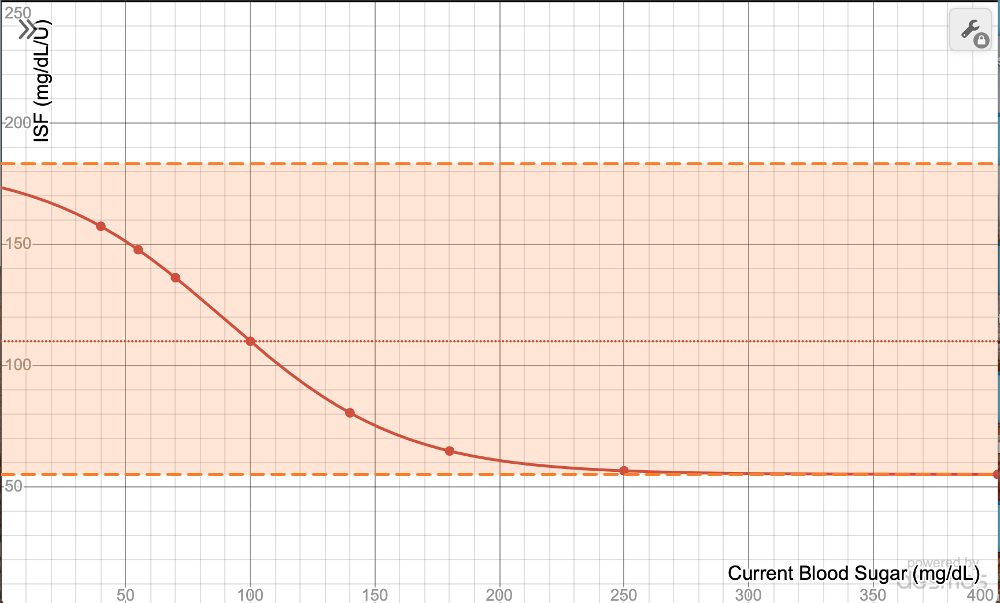

# Sigmoid Function

## What is it?
The sigmoid function provides an alternative to the default logarithmic function. It is called **Sigmoid** because the math used to calculate adjustments forms a sigmoid shape.

{width=865}
{align=center}

## How does it work?
Sigmoid relies upon how far your blood glucose is from your target BG to determine how much to adjust ISF. As blood sugars get farther away from your target BG, sigmoid adjustments get larger. The adjustments are limited by autosens max and autosens min settings.

[Click here to view a graph depicting the sigmoid formula in mg/dL](https://www.desmos.com/calculator/s9jxdmqhh8)

[Click here to view a graph depicting the sigmoid formula in mmol/L](https://www.desmos.com/calculator/nb5l47yx0h)
