# Nightscout Integration with Trio

Nightscout is a cloud-based diabetes data platform that Trio can integrate with for comprehensive data synchronization, remote monitoring, and caregiver access.

!!! info "Learn more about Nightscout"
    - [Nightscout Docs](https://nightscout.github.io/)
    
!!! warning "*Nightscout* version must be 15.0.2 or later"
    To properly display the OpenAPS pill with Trio 0.5.x (or later), your *Nightscout* version must be 15.0.2 (or later).
---

## Overview

Trio's Nightscout integration provides bidirectional data synchronization:

- **Upload to Nightscout**: 
    - Device status
    - Glucose readings
    - Insulin delivery
    - Meals
    - Temp targets
    - Overrides
    - Therapy profiles
- **Download from Nightscout**: 
    - Therapy profiles (during onboarding)
    - Glucose readings (as CGM backup)
    - Carb entries
    - Temp targets

This integration enables:

- Remote monitoring and commands by caregivers
- Data backup and historical tracking
- Integration with other diabetes apps, like LoopFollow
- Transferring therapy settings from other OS-AID systems

---

## Prerequisites

Before configuring Trio to work with Nightscout, you need:

1. **A Nightscout Site**
    - Hosted Nightscout instance (version 15.0.2 or newer required for use with Trio)
    - Your Nightscout URL (e.g., `https://yoursite.herokuapp.com`)
    - For help building a Nightscout site, there are a few options:
        - Follow the [Nightscout documentation](https://nightscout.github.io/nightscout/new_user/) 
        - Use a paid service such as [Nightscout Pro](https://nightscout.pro) or [NS10be.de](https://ns.10be.de/en/index.html)
        - Follow the [Setup and guide](https://google-cloud-nightscout.github.io) for running Nightscout on Google Cloud
2. **API Secret**
    - Your Nightscout API secret (configured during Nightscout setup)
    - Once Trio is connected to Nightscout, it is stored securely in Trio's keychain
    - Required for authenticated uploads/downloads
3. **Network Connection**
    - Active internet connection on your iPhone
    - Trio checks network reachability before uploads

!!! warning "Nightscout Version Requirement"
    To properly display the OpenAPS pill with Trio 0.5.x (or newer), your Nightscout version must be 15.0.2 or newer. Older versions may not correctly display Trio's data.
    
    Find your nightscout version here:
    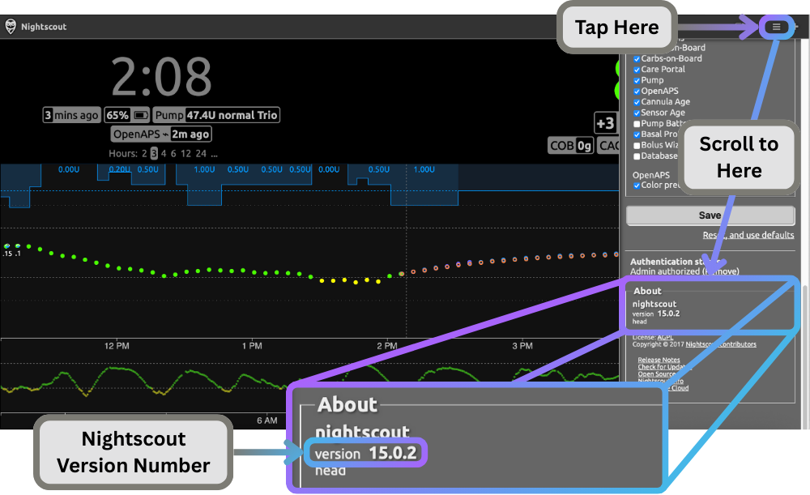{width="600"}
    {align="center"}

---

## What Trio **Uploads** to Nightscout

### 1. Device Status

-   __Time Since Last Glucose Reading__

    - - -
    
    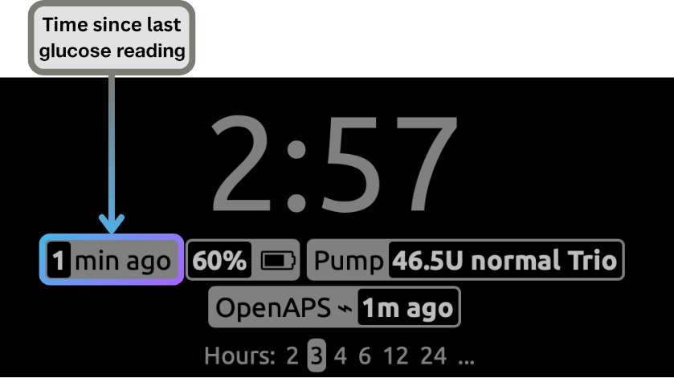{width="300"}

-   __OpenAPS Pill__

    - - -
    
    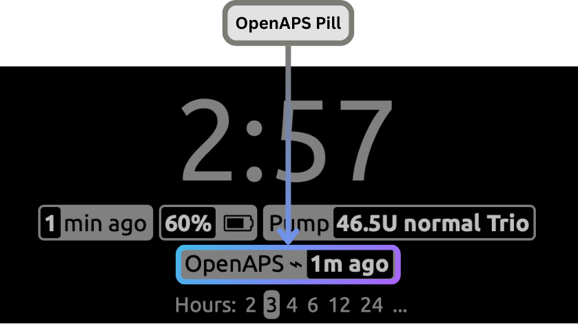{width="300"}

-   __Pump Reservoir Status__

    - - -
    
    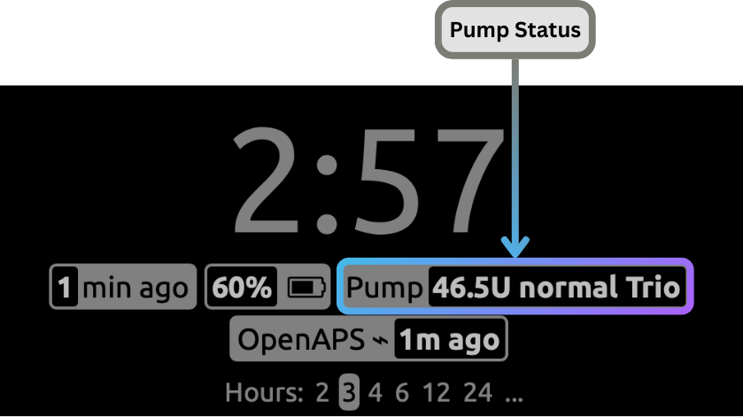{width="300"}

-   __Pump Battery Status__

    - - -
    
    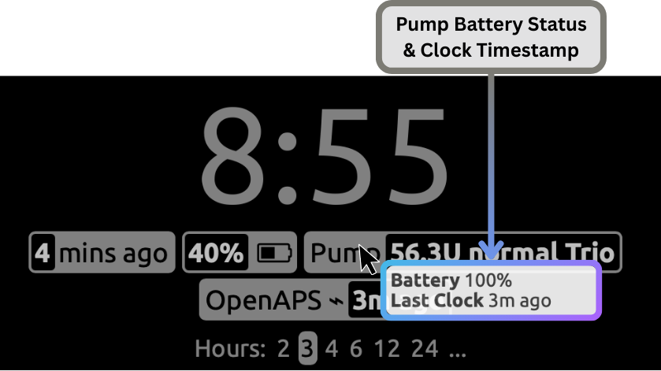{width="300"}
        

!!!info "What in the world is this information in the OpenAPS pill?!?"
    When you tap on the OpenAPS Pill, the details it provides can look very confusing if you don't understand what it's saying. [This page](../../usage/explained/current-loop-status-explained.md) in the docs will hopefully make it a little easier to understand.

### 2. Looping Status

-   __Current Glucose Reading__

    - - -
    
    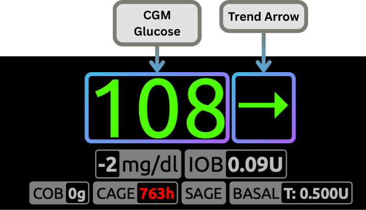{width="300"}

-   __Change in Glucose__

    - - -
    
    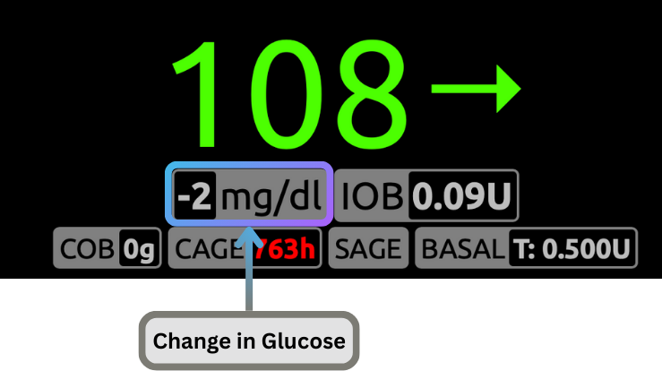{width="300"}

-   __Insulin on Board (IOB)__

    - - -
    
    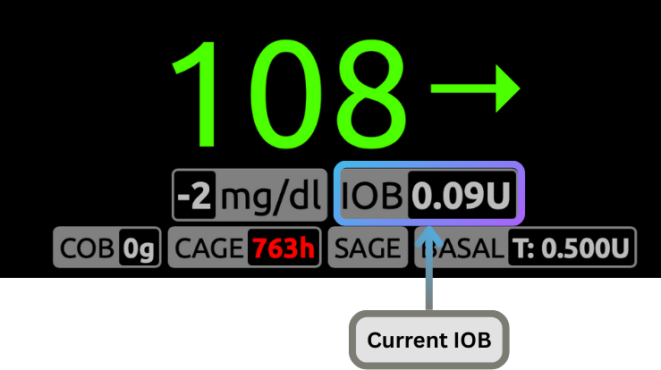{width="300"}

-   __Carbs on Board (COB)__

    - - -
    
    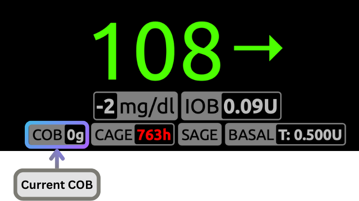{width="300"}

-   __Cannula Age (CAGE)__

    - - -
    
    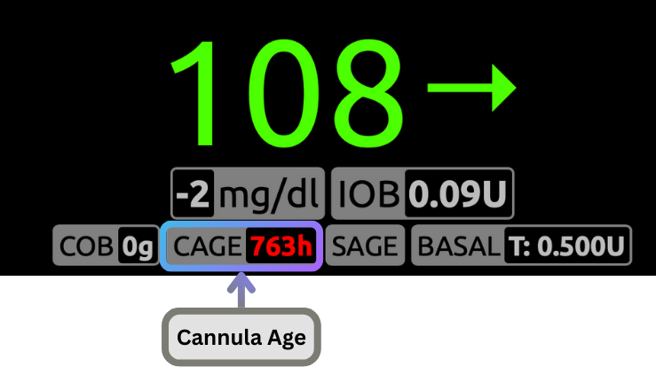{width="300"}

-   __Sensor Age (SAGE)__

    - - -
    
    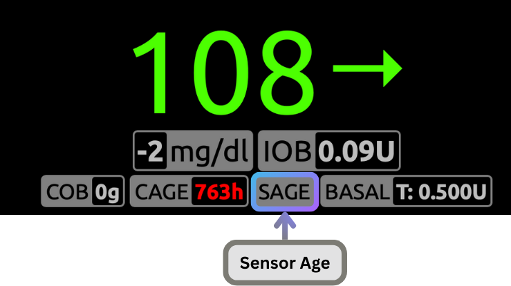{width="300"}

-   __Current Basal Rate__

    - - -
    
    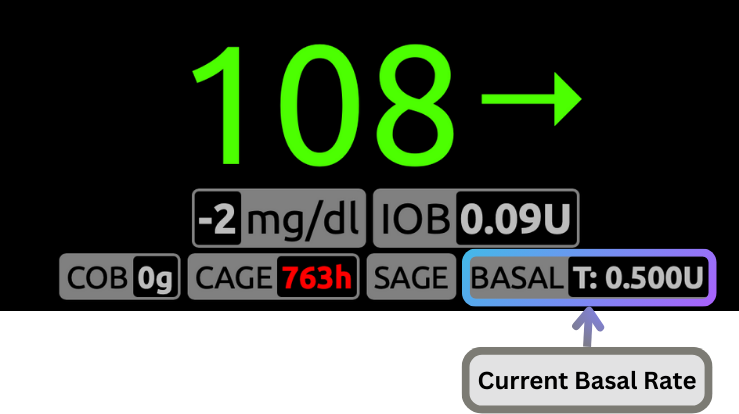{width="300"}

-   __Basal Rate Details__

    - - -
    
    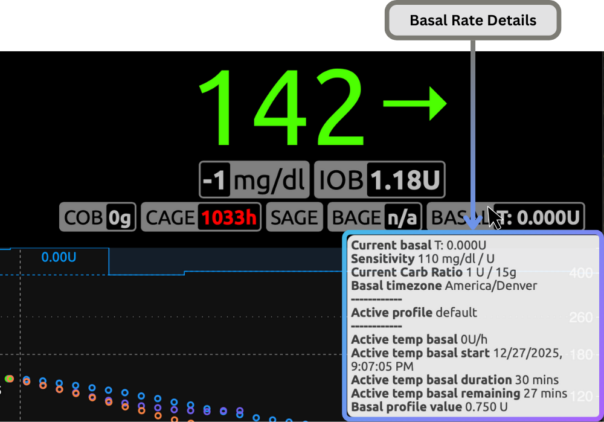{width="300"}
    

### 3. Phone Status

-   __Phone Battery Level__

    - - -
    
    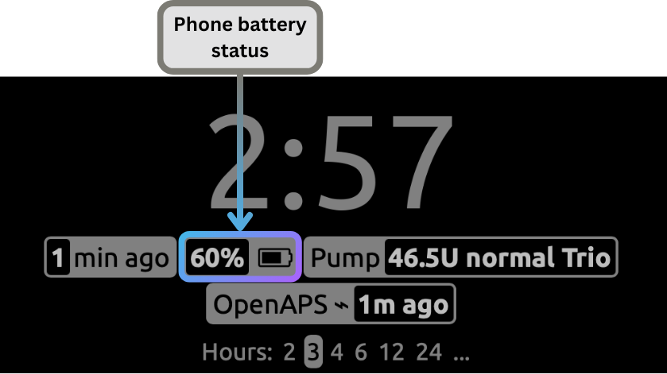{width="300"}

### 4. Insulin Delivery

- **Boluses**: Manual and automatic (SMB) insulin delivery
- **Basal Rates**: Temporary and scheduled basal
- **Pump Events**: All pump history events
- Uploaded with timestamps and amounts

### 5. Meal Entries

- Carb, fat, and protein amounts (grams)
- FPU (Fat Protein Units) carb equivalents

### 6. Temporary Targets

- Glucose Target
- Start time
- Duration
- Name is listed under Notes
- Active and historical temp targets

    !!! note "Sensitivity Adjustment"
        Sensitivity Adjustment is not notated in the Temporary Target but can be found by tapping the OpenAPS pill and looking at Autosens.

### 7. Overrides

- Override name
- Start time
- Duration
- Does not detail what the override does, so make sure the name is useful
- Implemented by using an "Exercise" type event in Nightscout
- Active and historical overrides

    !!! note "Edited while running"
        If an override or temporary target is edited while it's running, Trio deletes the old entry and uploads a new one.

### 8. Therapy Profile

Uploaded when settings change or upload is first enabled:

- **Duration of Insulin Action (DIA)**
- **Carb Ratios**: Hourly schedule
- **Insulin Sensitivity Factor (ISF)**: Hourly schedule
- **Basal Rates**: Hourly schedule
- **Target Ranges**: Hourly schedule

---

## What Trio **Downloads** from Nightscout

When **[Allow Fetching from Nightscout](../../configuration/settings/services/nightscout.md#step-2-utilize-uploaddownload)** is enabled:

### 1. Glucose Readings

- Backfill readings on demand
- Can be used as a CGM (but does not provide a heartbeat)

### 2. Carbohydrate Entries

- Fetches carb entries from Nightscout
- Ignores entries uploaded by OS-AIDs to prevent duplicates (Trio, Loop, AndroidAPS, iAPS)

    !!! note "Deleting Entries"
        - Delete carb entries from Nightscout first, and then delete from Trio.
        - If you delete an entry in Trio but not Nightscout, Trio will re-fetch it.
        - If you delete an entry in Nightscout, it will not automatically get deleted from Trio.

### 3. Temporary Targets

- Start and cancel Temporary Targets via Nightscout's Careportal
- Enter the same target for `Top` and `Bottom` targets

### 4. Therapy Profiles (Only available during Onboarding)

- Can import profile settings from Nightscout
- Retrieves ISF, CR, basal rates, targets
- Useful for restoring settings or syncing with other devices

---

## Upload Frequency and Triggers

Trio uploads data automatically in response to events:

| Data Type | Trigger | Frequency |
|-----------|---------|-----------|
| Device Status | Every loop cycle | ~5 minutes |
| Glucose | New CGM reading | Real-time |
| Insulin/Bolus | Pump event | Immediate (2s debounce) |
| Carbs | New entry logged | Immediate (2s debounce) |
| Temp Targets | Target set/cancelled | Immediate (2s debounce) |
| Overrides | Override activated/cancelled | Immediate (2s debounce) |
| Profiles | Settings changed | On change |

**Debouncing**: Most uploads are debounced by 2 seconds to batch rapid changes and reduce network requests.

!!! info "What is Debouncing?"
    Debouncing is a programming technique to limit how often a function runs, ensuring it only executes once after a set time has passed since the last trigger.

**Batching**: Data is uploaded in chunks of 100 entries to prevent large payloads.

!!! info "What is Batching?"
    Batching is a technique for grouping multiple individual operations, tasks, or data points into a single, more efficient unit for processing.

---

## Authentication and Security

### API Secret Authentication

Trio uses SHA-1 hash-based authentication:

1. **Secret Storage**: Your API secret is stored securely in iOS Keychain
2. **Hash Computation**: Trio computes SHA-1 hash of the secret
3. **Header Injection**: Hash included in all API requests as `api-secret` header
4. **HTTPS Required**: All communication over encrypted HTTPS

**Security Note**: The API secret never leaves your device in plaintext. Only the hash is transmitted.

### Connection Validation

When you first configure Nightscout:

- Trio tests the connection by uploading a test treatment
- Validates URL format and authentication
- Confirms Nightscout is reachable and accessible

---

## Troubleshooting

### Common Issues

- *Nightscout* not displaying Trio data: [OpenAPS Pill Not Showing](#openaps-pill-not-showing)
- I was able to select Trio Remote Control in *LoopFollow* but it is no longer working: [Stop *Nightscout* access from the *Loop* app](#coming-from-loop)
- Cannot select Trio Remote Control in *LoopFollow*: [Update Profile](#update-profile)
- I'm seeing duplicate carb entries: [Duplicate Carb Entries](#duplicate-carb-entries)
- Trio Remote Control was working, but it stopped: [Update Profile](#update-profile)

### "Connection Failed" Error

**Possible causes**:

1. **Incorrect URL**: Ensure URL is correct and uses HTTPS
2. **Wrong API Secret**: Verify secret matches your Nightscout configuration
3. **Network Issues**: Check internet connection
4. **Nightscout Down**: Verify Nightscout site is accessible in browser

**Solution**:  
Double-check credentials and test Nightscout URL in Safari

### Data Not Appearing in Nightscout

**Check these settings**:

1. **Upload Enabled**: Verify "Upload to Nightscout" toggle is ON
2. **Network Reachable**: Check iPhone has internet connection
3. **Nightscout Version**: Ensure Nightscout is 15.0.2+ for OpenAPS pill
4. **API Secret**: Confirm secret is correct

#### **Coming From Loop?**: 

1. If you transitioned from the *Loop* app, you must make some modifications to *Nightscout* before you will be successful viewing your Trio data in your *Nightscout* site.
    - In *Nightscout*, you need to modify these config vars:
    
    | Config Var | `Loop` |    `Trio` |
    |:--|:--|:--|
    | `ENABLE` | `loop` | `openaps` |
    | `SHOW_PLUGINS` | `loop` | `openaps` |
    | `SHOW_FORECAST` | `loop` | `openaps` |
    
    !!! note
        Remember to restart the *Nightscout* server (restart dynos) after updating these variables.
    
2. Stop *Nightscout* access from the *Loop* app
    - If you were previously running the *Loop* app:
        - Remove *Nightscout* from *Loop* Services
        - Add *Nightscout* credentials to Trio
        - You need the URL and the API_SECRET.
    - In addition to this step, you may need to force the profile (from Trio) to upload to *Nightscout* and overwrite the one stored as the default profile in *Nightscout*.

### OpenAPS Pill Not Showing

**Requirements**:

- Nightscout version 15.0.2 or newer
- OpenAPS plugin enabled in Nightscout
- Device status upload successful

**Solution**:  
In *Nightscout*, you need to modify these config vars:
    
| Config Var | `Loop` |    `Trio` |
|:--|:--|:--|
| `ENABLE` | `loop` | `openaps` |
| `SHOW_PLUGINS` | `loop` | `openaps` |
| `SHOW_FORECAST` | `loop` | `openaps` |
    
!!! note
    Remember to restart the *Nightscout* server (restart dynos) after updating these variables.

### Duplicate Carb Entries

**Cause**:  
Multiple apps uploading to same Nightscout site

**Solution**:

- Trio filters out entries from AndroidAPS, Loop, iAPS only when **downloading from** Nightscout. It cannot prevent duplicate entries being **sent to** Nightscout from multiple apps.
- Ensure "Download from Nightscout" is only enabled on one device
- Check `enteredBy` field in Nightscout to identify source

### Update Profile

**Check**:

- Profile uploaded successfully (check upload logs)
- Nightscout received profile (check Nightscout Admin Tools → Profile Editor)
- App expiration date not blocking uploads (TestFlight builds)

**Solution**:  

1. If the Debug Info in *LoopFollow* is missing a Device Token or a Bundle ID, as shown on the left side of the graphic, you need to make sure the [*Loop* app is no longer uploading to *Nightscout*](#coming-from-loop) and proceed to step 2. If those are NOT empty, proceed to step 2.
2. To force a profile to update to *Nightscout*, go to the Trio app and toggle Allow Uploading to Nightscout off (disable) and then enable it again.
2. Once the user has toggled "Allow Uploading to Nightscout", *LoopFollow* needs to be refreshed (pull down glucose value to refresh) or re-started in order to fetch the correct information. *LoopFollow* will refresh eventually, but most users are impatient.

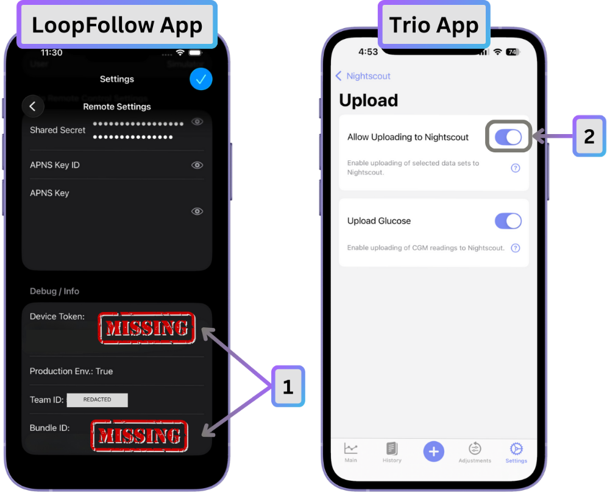{width="600"}
{align=center}

---

## Remote Commands via Nightscout

Trio supports limited remote commands through Nightscout in two ways:

### LoopFollow (**Preferred**)

When authenticated with a token that has **`readable`** access:

- **Carb Entry**: Log carbs remotely
- **Carbs Entry with Remote Bolus**: Log carbs and initiate a bolus remotely
- **Remote Bolus**: Initiate a correction bolus remotely
- **Pre-set Temporary Target**: Set or cancel saved temp targets
- **Pre-set Override**: Set or cancel saved overrides

| *LoopFollow* Remote Type | Options|
|:--|:--|
| ***Nightscout*** | Set and Cancel Temp Target |
| **Trio Remote Control** | Meal (Carbs or Carbs & Bolus) Bolus Temp Target Overrides |

See the [LoopFollow documentation](loop-follow.md) for information on connecting and using LoopFollow.

### Careportal Commands

When authenticated with a token that has **`careportal, readable`** access:

- **Carb Entry**: Log carbs remotely
- **Pre-set Temporary Target**: Set or cancel saved temp targets

| *Nightscout* URL or App | Options|
|:--|:--|
| ***Careportal*** | Carb Correction Temporary Target Temporary Target Cancel |

Additional remote capabilities are offered for Trio using the *LoopFollow* app with these versions:

- Trio 0.5.x (or newer)
- *LoopFollow* version 2.4.0 (or newer)

!!! warning "Nightscout Careportal Not Advised"
    - While you ***are*** able to send limited commands through Nightscout Careportal, it is advised to use with caution as there could be considerable lag.
    - The preferred and recommended method is using LoopFollow to send remote commands.

---

## Advanced Settings

### Upload Glucose Toggle

You can disable glucose uploads while keeping other uploads enabled:

- Turn OFF **Upload Glucose**
- Device status, insulin, carbs, etc. still upload
- Reduces data usage if glucose already uploaded by CGM app

---

## Data Privacy

When **Allow Uploading to Nightscout** is enabled the following data is transmitted:

### What Leaves Your Device

- All diabetes-related data (glucose, insulin, carbs, settings)
- Device identifiers (for remote control)
- App version information

### What Stays on Your Device

- Your API secret (only hash is transmitted)
- Local app data and databases
- Personal information not related to diabetes

### Nightscout Hosting

- If self-hosting: You control all data
- If using hosted service: Review hosting provider's privacy policy
- All data transmitted over HTTPS encryption

---

## Benefits of Nightscout Integration

1. **Remote Monitoring**: Caregivers can watch glucose and loop status in real-time
2. **Data Backup**: Historical data preserved in cloud
3. **Multi-Device**: Access data from phone, tablet, computer
4. **Reports**: Generate reports and analytics via Nightscout
5. **Sharing**: Share access with healthcare team
6. **Interoperability**: Works with other diabetes apps (LoopFollow, xDrip+, etc.)
7. **Remote Control**: Limited remote commands via Careportal
8. **Transparency**: Full visibility into loop algorithm decisions via OpenAPS pill

---

## Summary

Nightscout integration transforms Trio from a standalone app into a connected diabetes management system:

- **Automatic uploads** of all relevant diabetes data every few minutes
- **Bidirectional sync** for carbs, targets, and profiles
- **Secure authentication** with API secret hashing and HTTPS
- **Real-time monitoring** via OpenAPS pill display
- **Remote access** for caregivers and healthcare providers

To get started, simply [configure your Nightscout URL and API secret](../../configuration/settings/services/nightscout.md#configuration) in Trio's Settings → Services → Nightscout → Connect, then enable [upload and fetch](../../configuration/settings/services/nightscout.md#step-2-utilize-uploaddownload).

For more information about Nightscout itself, visit [https://nightscout.github.io/](https://nightscout.github.io/).
