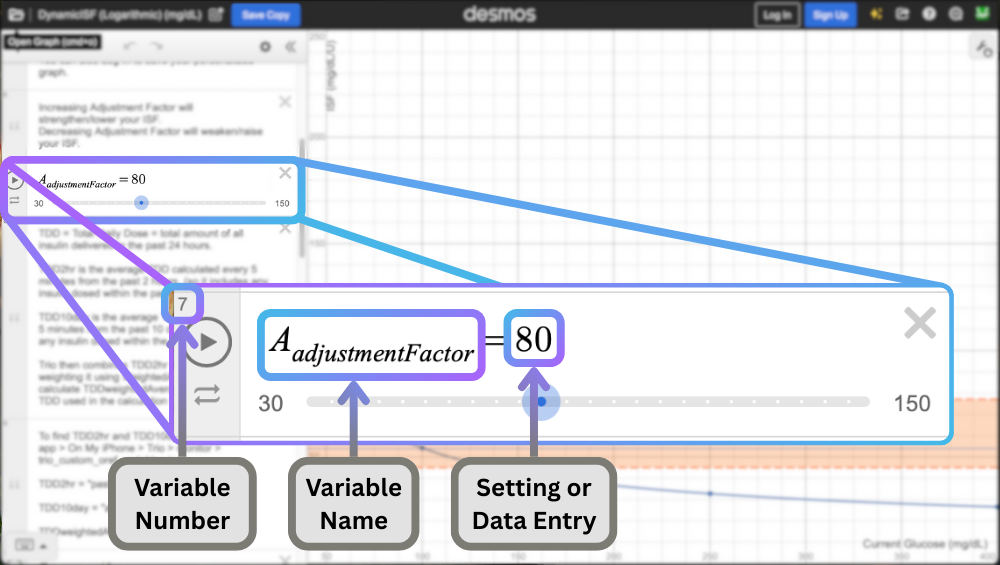
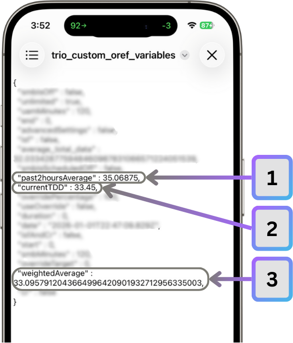
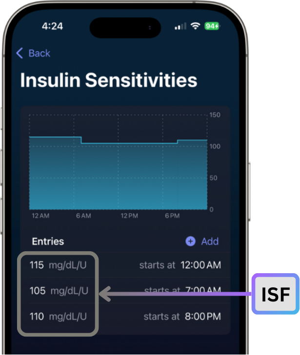
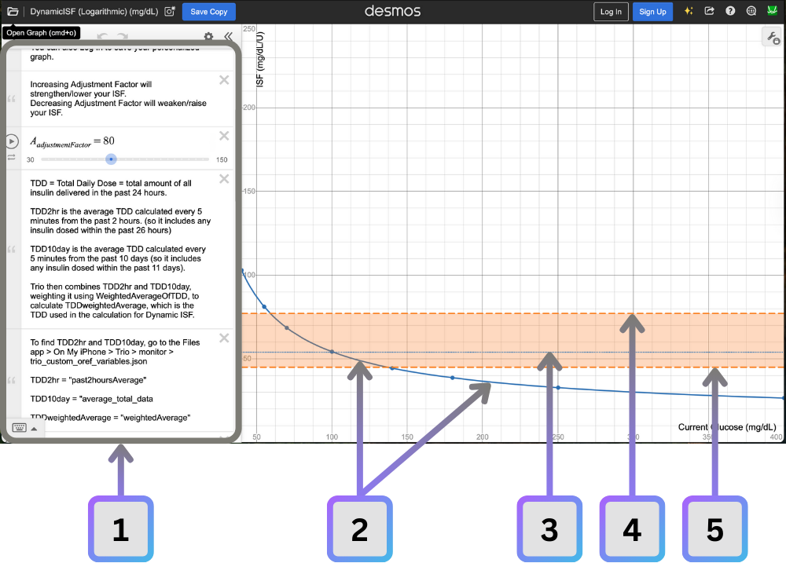
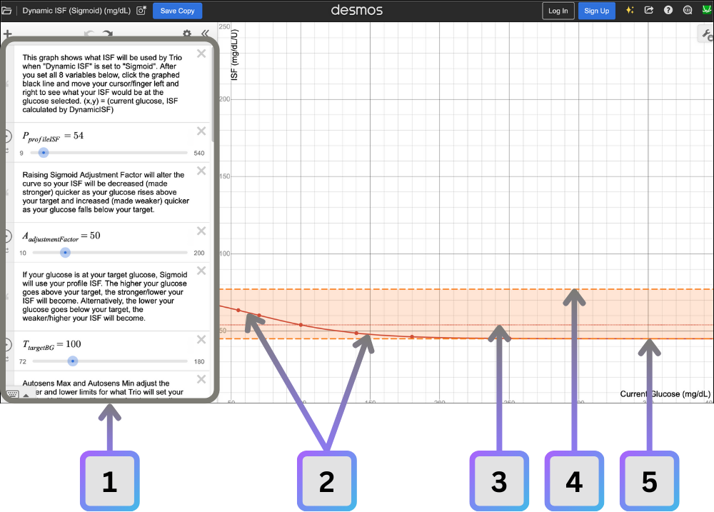

# Understanding the Desmos Graphs

!!!note "What You'll Find In This Section"
    - [Where to find the Desmos Graphs](#desmos-graphs)
    - [Where to find the information needed for the Desmos Graphs](#setting-up-the-desmos-graphs)
    - [How to read the Desmos Graphs](#reading-the-desmos-graphs)
    - [Making Adjustments in the Desmos Graphs](#settings-adjustments)

## Desmos Graphs

There are 2 Dynamic ISF algorithms that behave differently. For this reason, there are 2 separate Desmos Graphs for these algorithms.

!!!important
    - The settings needed with Logarithmic will be different from the settings needed with Sigmoid
    - If switching from one to another, it's important to recheck your settings with the Desmos graphs to ensure Trio is performing as you expect
    
### Logarithmic Desmos Graphs

[Click here to view a graph depicting the logarithmic formula in mg/dL](https://www.desmos.com/calculator/0frb0mvjzr)

[Click here to view a graph depicting the logarithmic formula in mmol/L](https://www.desmos.com/calculator/2iu4cgtqln)

### Sigmoid Desmos Graphs

[Click here to view a graph depicting the sigmoid formula in mg/dL](https://www.desmos.com/calculator/zhc6k580qm)

[Click here to view a graph depicting the sigmoid formula in mmol/L](https://www.desmos.com/calculator/ihjjxwipbt)

- - -

## Setting Up The Desmos Graphs

Below is the information requested by the Desmos Graphs for the Logarithmic and Sigmoid Formulas. They each use many of the same settings and data points, but there are some differences. Please use the information under the formula your are using.

There are multiple variables that you'll need to gather for the Desmos Graphs. The variable number can be found in the upper left of the variable. Each of these variables are numbered in the sections below based on the variable number found in Desmos.

{width="600"}
{align="center"}

-   [**Logarithmic Formula Variables**](#logarithmic-formula-variables)
    
    ---
    
    [7 $A_{adjustmentFactor}$](#aadjustmentfactor)  
    [10 $T_{TDD2hr}$](#tdd-data)  
    [11 $T_{TDD10day}$](#tdd-data)  
    [12 $W_{weightedAverageOfTDD}$](#wweightedaverageoftdd)  
    [15 $I_{insulinPeakTime}$](#iinsulinpeaktime)  
    [17 $P_{profileISF}$](#pprofileisf)  
    [18 $M_{autosensMax}$](#mautosensmax)  
    [19 $M_{autosensMin}$](#mautosensmin)  
    
    
-   [**Sigmoid Formula Variables**](#sigmoid-formula-variables)

    ---
    
    [2 $P_{profileISF}$](#pprofileisf_1)
    [4 $A_{adjustmentFactor}$](#aadjustmentfactor_1) 
    [6 $T_{targetBG}$](#ttargetbg)
    [8 $M_{autosensMax}](#mautosensmax_1)
    [9 $M_{autosensMin}](#mautosensmin_1)
    [15 $T_{TDD2hr}](#tdd-data_1)
    [16 $T_{TDD10day}$](#tdd-data_1)
    [17 $W_{weightedAverageOfTDD}$](#wweightedaverageoftdd_1)
    

## Logarithmic Formula Variables

### _A~adjustmentFactor~_
The logarithmic Adjustment Factor can be found in your Trio settings. In the Trio app, follow these selections:

Settings ➔ Algorithm ➔ Dynamic Settings
{align=center}

 

1. Logarithmic must be selected for Dynamic ISF under Dynamic Settings in order for Adjustment Factor to be visible
2. Here you'll find the value needed for $A_{adjustmentFactor}$ in the Desmos Graph

    
### TDD Data
The TDD data cannot be found in your Trio app, but is still located on your phone. You just have to know where to look. On your phone, open the Files app:

Files ➔ On My Phone ➔ Trio ➔ monitor ➔ trio_custom_oref_variables.json
{align=center}

 

1. $T_{TDD2hr}$ (Desmos) = `past2hoursAverage` (Files)
2. $T_{TDD10day}$ (Desmos) = `currentTDD` (Files)
3. $T_{TDDweightedAverage}$ (Desmos) = `weightedAverage` (Files)
    - verify that you've entered the right information by matching this number in the json file to the number calculated in Desmos

!!!info
    Notice there are **2** similar entries: 
    
    - $T_{TDDweightedAverage}$
    - $W_{weightedAverageOfTDD}$
    
    Compare the **T~TDDweightedAverage~** value in Desmos to the `weightedAverage` value in trio_custom_oref_variables.json
    
### _W~weightedAverageOfTDD~_
The Weighted Average of TDD can be found in your Trio settings. In the Trio app, follow these selections:

Settings ➔ Algorithm ➔ Dynamic Settings
{align=center}

 

1. Here you'll find the value needed for $W_{TDDweightedAverage}$ in the Desmos Graph

### _I~insulinPeakTime~_

Insulin Peak Time is hard coded in Trio based on the insulin selected in your Pump Settings. Below are the peak times used. Enter the peak time that corresponds to the insulin you selected under Pump Settings.

| Insulin | Peak Time |
|:---:|:---:|
| Humalog | 75 |
| Novolog | 75 |
| Apidra | 75 |
| Fiasp | 55 |
| \*Lyumjev | 55 |

!!!info inline "*Lyumjev"
    Lyumjev users often set a custom peak time of **45 min**.

!!!info "If you use a Custom Peak Time"
    If you use a Custom Peak Time, you'll need to use the time found in your Trio settings. In the Trio app, follow these selections:

    Settings ➔ Algorithm ➔ Additionals ➔ Insulin Peak Time
    {align=center}
    
### _P~profileISF~_
You can only enter a single ISF value for $P_{profileISF}$. 

- **If you have multiple, highly variable ISFs**: It is advised to enter your highest and lowest ISF into the graph for analysis to ensure both extremes work with the Dynamic Settings you've entered.
- **If you have multiple ISFs but they do not change drastically**: Average them together for a single ISF entry.

 

**Locate your ISF settings here**:   
Settings ➔ Therapy ➔ Insulin Sensitivities
{align=center}

### _M~autosensMax~_
The Autosens Max can be found in your Trio settings. In the Trio app, follow these selections:

Settings ➔ Algorithm ➔ Autosens Settings
{align=center}

 

1. Here you'll find the value needed for $M_{autosensMax}$ in the Desmos Graph

### _M~autosensMin~_
The Autosens Min can be found in your Trio settings. In the Trio app, follow these selections:

Settings ➔ Algorithm ➔ Autosens Settings
{align=center}

 

1. Here you'll find the value needed for $M_{autosensMin}$ in the Desmos Graph

## Sigmoid Formula Variables

### _P~profileISF~_
You can only enter a single ISF value for $P_{profileISF}$. 

- **If you have multiple, highly variable ISFs**: It is advised to enter your highest and lowest ISF into the graph for analysis to ensure both extremes work with the Dynamic Settings you've entered.
- **If you have multiple ISFs but they do not change drastically**: Average them together for a single ISF entry.

 

**Locate your ISF settings here**:   
Settings ➔ Therapy ➔ Insulin Sensitivities
{align=center}

### _A~adjustmentFactor~_
The Sigmoid Adjustment Factor can be found in your Trio settings. In the Trio app, follow these selections:

Settings ➔ Algorithm ➔ Dynamic Settings
{align=center}

 

1. Sigmoid must be selected for Dynamic ISF under Dynamic Settings in order for Sigmoid Adjustment Factor to be visible
2. Here you'll find the value needed for $A_{adjustmentFactor}$ in the Desmos Graph

### _T~targetBG~_
You can only enter a single glucose target value for $T_{targetBG}$. 

- **If you have multiple, highly variable glucose targets**: It is advised to enter your highest and lowest target into the graph for analysis to ensure both extremes work with the Dynamic Settings you've entered.
- **If you have multiple targets but they do not change drastically**: Average them together for a single $T_{targetBG}$ entry.

**Locate your Glucose Target settings here**:

Settings ➔ Therapy ➔ Glucose Targets
{align=center}

 

1. Here you'll find the value needed for $T_{targetBG}$ in the Desmos Graph

### _M~autosensMax~_
The Autosens Max can be found in your Trio settings. In the Trio app, follow these selections:

Settings ➔ Algorithm ➔ Autosens Settings
{align=center}

 

1. Here you'll find the value needed for $M_{autosensMax}$ in the Desmos Graph

### _M~autosensMin~_
The Autosens Min can be found in your Trio settings. In the Trio app, follow these selections:

Settings ➔ Algorithm ➔ Autosens Settings
{align=center}

 

1. Here you'll find the value needed for $M_{autosensMin}$ in the Desmos Graph

### TDD Data
The TDD data cannot be found in your Trio app, but is still located on your phone. You just have to know where to look. On your phone, open the Files app:

Files ➔ On My Phone ➔ Trio ➔ monitor ➔ trio_custom_oref_variables.json
{align=center}

 

1. $T_{TDD2hr}$ (Desmos) = `past2hoursAverage` (Files)
2. $T_{TDD10day}$ (Desmos) = `currentTDD` (Files)
3. $T_{TDDweightedAverage}$ (Desmos) = `weightedAverage` (Files)
    - verify that you've entered the right information by matching this number in the json file to the number calculated in Desmos

!!!info
    Notice there are **2** similar entries: 
    
    - $T_{TDDweightedAverage}$
    - $W_{weightedAverageOfTDD}$
    
    Compare the **T~TDDweightedAverage~** value in Desmos to the `weightedAverage` value in trio_custom_oref_variables.json
    
### _W~weightedAverageOfTDD~_
The Weighted Average of TDD can be found in your Trio settings. In the Trio app, follow these selections:

Settings ➔ Algorithm ➔ Dynamic Settings
{align=center}

 

1. Here you'll find the value needed for $W_{TDDweightedAverage}$ in the Desmos Graph

- - -

## Reading The Desmos Graphs

=== "Logarithmic Desmos Graph"
    
    
=== "Sigmoid Desmos Graph"
    

### **1** Variables

This is where you enter the variables listed above ([Logarithmic Variables](#logarithmic-formula-variables) or [Sigmoid Variables](#sigmoid-formula-variables)). It also contains explanations of each of the variables and the maths used to calculate the graph on the right.

### **2** Sensitivity Calculation

This line shows a series of coordinates calculated by the algorithm. Each coordinate on this line represents what ISF is used at each glucose reading. It is shown as an (X,Y) coordinate.

X = Glucose Reading 
Y = Calculated ISF

This means, at a Glucose Reading of X, an ISF of Y is used.

??? question "Bill chose a random point on his Sensitivity Calculation Line. It's showing the coordinates of (95, 55). What ISF is used and which glucose reading?"
        
    ??? success "Answer"
        At a glucose reading of 95 mg/dL, an ISF of 55 mg/dL/U is used.
        
### **3** Profile ISF
This line represents your profile ISF.

=== "Logarithmic Formula"
    If using the Logarithmic Formula, you initially want to align your profile ISF with a glucose of 150 mg/dL (8.3 mmol/L). Typically, the setting that is adjusted to accomplish this is the Adjustment Factor.
    
=== "Sigmoid Formula"
    If using the Sigmoid Formula, your profile ISF is always anchored at your target glucose. For this reason, you may find that your profile ISF is too strong (number is too low) when using Sigmoid.

??? question "Bill's profile ISF is 40 mg/dL/U and he is using the Logarithmic Formula. He wants to adjust his Adjustment Factor so that his profile ISF is used at a glucose of 150 mg/dL. What coordinate will he need to match the sensitivity calculation line so that it intersects at that point?"
        
    ??? success "Answer"
        A coordinate of (150, 40)
        
### **4** Autosens Min Limit
The upper line of the orange area is set by your Autosens Min limit. Trio can only use sections of the Sensitivity Calculation Line that are below this limit on the graph, within the orange shaded area.

### **5** Autosens Max Limit
The lower line of the orange area is set by your Autosens Mix limit. Trio can only use sections of the Sensitivity Calculation Line that are above this limit on the graph, within the orange shaded area.

- - -

## Settings Adjustments

For detailed walk through on how adjusting each of these settings or data points will influence the calculations in Dynamic ISF, read the section on [Using Dynamic ISF](dynamic-isf.md).

- - -
