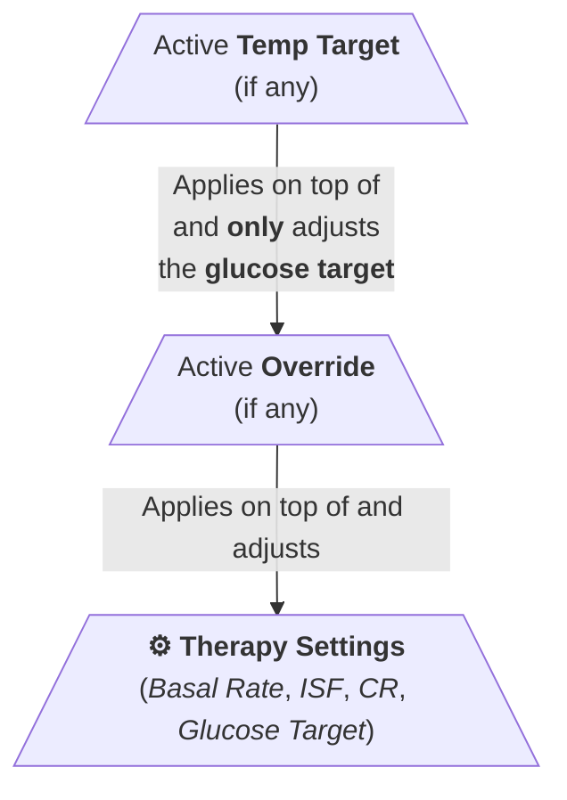

# Adjustments

## Definition

An *Adjustment* in Trio is a temporary change applied on top of your Therapy settings, allowing the system to adapt to current physiological or situational conditions, such as exercise, illness, or menstruation.

There are two **types** of Adjustments: (**Override** and **Temp Target**)

- **[Override](overrides.md)** – overrides your *Therapy settings*.  
  An **Override** is a **broad adjustment** that can temporarily change multiple therapy settings, such as your insulin sensitivity factor (ISF), carb ratio (CR), and glucose target.  
  Overrides are used for situations that affect your overall insulin needs, such as **illness**, **menstruation**, or a day with prolonged **insulin resistance**. They apply **on top of** your base therapy profile.
- **[Temp Target](temp-targets.md)** – A temporary target **only** adjusts the **glucose target**.  
  A **Temp Target** is a **narrower adjustment** that only modifies the **glucose target** and nothing else, for a given period.  It’s typically used for **short-term** physiological states like **exercise**, **stress**, after a low, or to **lower the glucose target before a meal**.  
  A Temp Target can be used:
    
    - **on its own**, to raise or lower the glucose target,
    - In combination, **on top of an active Override**, in which case it **overrides the glucose target** defined by the Override.  
        
     Temp Targets are especially helpful when you want to **temporarily fine-tune** the glucose target for a specific context without altering other therapy settings, or when **layering a temporary effect** on top of an active Override.
      
      The table below presents several use cases where Temp Targets are useful.
      
     | Temp Target                  | Glucose Target | Use Case                                                                                 |
     | ---------------------------- | -------------- | ---------------------------------------------------------------------------------------- |
     |  Exercise           | ⤴️ Increase    | Reduce the risk of hypoglycemia during aerobic exercise. |
     | Pre-meal          | ⤵️ Lower       | Improve the outcomes of future carb intake by lowering the glucose target before a meal. |
     | Stress or anxiety    | ⤴️ Increase    | Accommodate adrenaline-related glucose rises. |
     | Illness                      | ⤵️ Lower       | Normalize glucose levels to baseline during illness. |
     | Post-exercise         | ⤴️ Increase    | Prevent the risk of hypoglycemia after exercise. |
    | Post Hypoglycemia | ⤴️ Increase    | Prevent insulin overcorrection after treating a low. |

## How Temp Targets and Overrides Work Together

In Trio, **Override** and **Temp Target** are two types of Adjustments that can both be [active](#active-adjustment-limits) at the same time, each with its own effect on your [therapy settings](../../configuration/settings/therapy/index.md).

The diagram below illustrates how each adjustment type applies its effects.

An active **Override** adjusts your baseline therapy settings.  
An active **Temp Target** applies **on top of the Override** and only adjusts the glucose target.

```mermaid
gantt
title Adjustment Timeline Example
dateFormat  HH:mm
axisFormat  %H:%M

section Temp Targets: 
HYPO TEMP TARGET:     tt, 10:00, 1h
EXERCISE TEMP TARGET: tt, 08:30, 1h

section Override: 
SICK OVERRIDE       :active, ovr, 08:00, 4h
```

So in a layered structure:

- The algorithm starts with your **therapy settings**
- Applies the **active Override** (if any) on top to adjust your therapy settings for a certain duration.
- Then applies the **active Temp Target** (if any) on top of the Override, but **only** for the glucose target

This layering ensures **flexibility**, letting you temporarily fine-tune glucose targets *without affecting other settings*.

## Why Temp Targets Still Matter (Even with Overrides)

If Overrides can do everything Temp Targets do, why would you still need Temp Targets?
   
**Overrides can technically do everything a Temp Target does**, since they include the glucose target **plus** other therapy parameters.  
But **Temp Targets still matter** in Trio because you can [combine a Temp Target with an Active Override](#how-temp-targets-and-overrides-work-together).  
Trio will apply:

- The **Override** to modify therapy settings,
- Then apply the **Temp Target** on top of it to temporarily override just the glucose target.

A few examples where a Temp Target can be layered on top of an active Override.

!!! example "Sick + Exercise"
     
    You’re sick (Override active) but doing a bit of exercise — a Temp Target raises the glucose target briefly without touching your illness-specific Override.

!!! example "Sick + Hypoglycemia"
     
    You're sick (Override active), and then want a **temporary glucose target** tweak to raise glucose after a hypoglycemia ⤴️, a Temp Target **lets you do that without replacing the sick Override**. 

## Active Adjustment Limits

✅ You can have one Temp Target, one Override, or both **active at the same time**.  
**At most two adjustments** can be active at the same time.  
❌ However, you cannot have two Temp Targets or two Overrides active simultaneously.

The table below shows which combinations of Temp Targets and Overrides can be active at the same time.

| Active Temp Targets | Active Overrides | Valid? | Why?                                         |
| :-----------------: | :--------------: | :----: | -------------------------------------------- |
|          1          |        0         |   ✅    | Only a Temp Target is active                 |
|          0          |        1         |   ✅    | Only an Override is active                   |
|          1          |        1         |   ✅    | Both are active and layered                  |
|          2          |        0         |   ❌    | Only one Temp Target can be active at a time |
|          0          |        2         |   ❌    | Only one Override can be active at a time    |
|          2          |        1         |   ❌    | Max one Temp Target; max one Override        |
|          1          |        2         |   ❌    | Max one Override; max one Temp Target        |

## Usage

This section explains how to [create](#add-an-adjustment), [view](#view-adjustment-details), [modify](#modify-an-adjustment), [delete](#delete-an-adjustment), [start](#start-an-adjustment), [stop](#stop-an-adjustment) an adjustment.

### List Adjustments

- Tap the { width="15" style="vertical-align: middle;" } `Adjustments` tab in the bottom navigation bar.
- Tap the type of adjustment you want to display: **<code>Temp Target</code>** or **<code>Override</code>**.
- This displays a list of the corresponding presets/favorite adjustments

- From there, you can [start](#start-an-adjustment), [view](#view-adjustment-details), [modify](#modify-an-adjustment), or [delete](#delete-an-adjustment) an adjustment:
    - Tap on an adjustment in the list to **activate** it
    - Swipe left on an adjustment.  
      That is, place your finger on an adjustment in the list and slide it to the left. 
    - You’ll see two action buttons appear on the right side: :material-pencil:{ style="background-color: blue; color: white;" } (Edit), and :material-trash-can-outline:{ style="background-color: red; color: white;" } (Delete).  
        - :material-pencil:{ style="background-color: blue; color: white;" }: The leading blue button with a **pencil** lets you edit or view this adjustment. 
	        - **Edit this adjustment**:  When saving, the changes will also be applied to this adjustment if active.
	        - **View this adjustment details**: Be sure to tap the Cancel button when you are done viewing, not to modify the adjustment accidentally.
        - :material-trash-can-outline:{ style="background-color: red; color: white;" }: The red button with a **trash can** allows you to **delete** this adjustment.

### Add an Adjustment

You can configure an Adjustment—either a Temp Target or an Override—for one-time use or save it as a favorite/preset for later use.

- [List the adjustments](#list-adjustments)
- Tap the **add button** in the top right corner:
    - [Add an Override](overrides.md#add-an-override)
    - [Add a Temp Target](temp-targets.md#add-a-temp-target)  
      
    Refer to the links above for detailed steps on how to configure the selected adjustment type.
      
- When you are done configuring the adjustment, you can either:
	- Tap the **Save** button to make it a preset (favorite) ready to be enacted later when needed.
	- Tap the **Enact** button to enable the adjustment without saving it.  
	  This is for a one-time use.

### Delete an Adjustment

- [List the adjustments](#list-adjustments)
- Swipe left on an adjustment.  
  That is, place your finger on an adjustment in the list and slide it to the left. 
- You’ll see two action buttons appear on the right side: :material-pencil:{ style="background-color: blue; color: white;" } (Edit), and :material-trash-can-outline:{ style="background-color: red; color: white;" } (Delete).  
- :material-trash-can-outline:{ style="background-color: red; color: white;" }: Tap the red button with a **trash can** to **delete** this adjustment.
- When asked, press the button to confirm the deletion.

### Modify an Adjustment

- [List the adjustments](#list-adjustments)
- Swipe left on an adjustment.  
  That is, place your finger on an adjustment in the list and slide it to the left. 
- You’ll see two action buttons appear on the right side: :material-pencil:{ style="background-color: blue; color: white;" } (Edit), and :material-trash-can-outline:{ style="background-color: red; color: white;" } (Delete).  
- :material-pencil:{ style="background-color: blue; color: white;" }: Tap the leading blue button with a **pencil** to edit this adjustment.  
  When saving, the changes will also be applied to this adjustment if active.

### View Adjustment Details

- [List the adjustments](#list-adjustments)
- Swipe left on an adjustment.  
  That is, place your finger on an adjustment in the list and slide it to the left. 
- You’ll see two action buttons appear on the right side: :material-pencil:{ style="background-color: blue; color: white;" } (Edit), and :material-trash-can-outline:{ style="background-color: red; color: white;" } (Delete).  
- :material-pencil:{ style="background-color: blue; color: white;" }: Tap the leading blue button with a **pencil**
	- The adjustment details are displayed
	- Ensure to tap the Cancel button in the top-left corner when you are done viewing, so as not to modify the adjustment accidentally.

### Start an Adjustment

- [List the adjustments](#list-adjustments)
- Tap on an adjustment in the list to **enact** it

<!-- TODO: How and where can I see if an adjustment is active? -->

### View Active Adjustments

<!--TODO-->

### Stop an Adjustment

<!-- TODO: How and where (Main / Adjustment tabs) to stop an adjustment? -->

When stopping an active adjustment (_Override_ or _Temp Target_), all profile parameters return to normal—unless another adjustment is still active. In that case, the remaining adjustment continues to apply and modifies the profile parameters according to its configuration.

When two adjustments (an Override and a Temp Target) are active and you request Trio to **stop** them, it offers the option to stop one or both.

