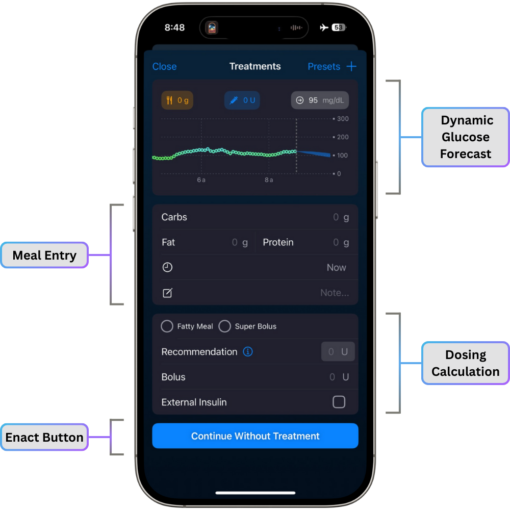
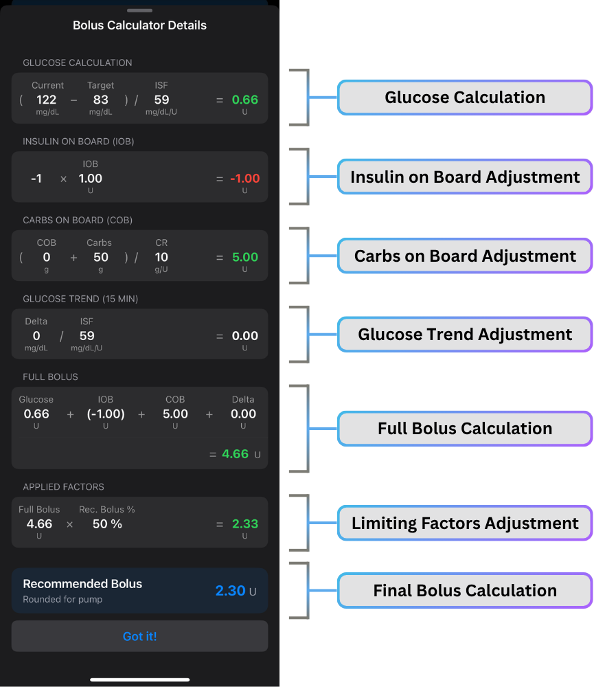

# Bolus Calculator

<!-- Include the following
- How doses are calculated in bolus calc
- Interface walkthrough
- ??? Bill examples
- highlight confirmation feature
-->

## Bolus Calculator Interface

You can access the bolus calculator by tapping the :fontawesome-solid-circle-plus: icon

There are 4 main sections of the Bolus Calculator Interface

{width="500"}
{align="center"}

### Dynamic Glucose Forecast

As you enter your carbs and insulin, this dynamic graph at the top of the bolus calculator will adjust the forecast lines or cone to account for your future data.  
Watch the video below to see this in action.

  <video controls  preload="metadata" height="664" width="334">
    <source src="/usage/img/bolus-entry-dynamic-graph.mp4" type="video/mp4">
    Your browser doesn’t support the HTML5 video tag.
  </video>

### Meal Entry

In the Meal Entry section, you will enter your carbs. If you have [FPU](../../configuration/settings/features/meal-settings.md#enable-fat-and-protein-entries)'s enabled, you can also enter your fat and protein.

Below this, there is a place to enter the time for future or past carbs.

You can also add a note for this meal.

### Dosing Calculation

In the Dosing Calculation section, it starts with the [Fatty Meal and Super Bolus options](../../configuration/settings/features/bolus-calculator.md#fatty-meal-and-super-bolus-options) at the top, if you have those enabled.

Below that is the suggested bolus amount that Trio has calculated. Tap the "i" icon for more details and [read the section below](#how-does-the-bolus-calculator-determine-dosage) for more details on the information shared when you tap on this icon.

If you check the "External Insulin" box, the bolus will be added to your IOB, but it will not be delivered by Trio.

### Enact Button

This button will show one of the following messages:

- **Continue Without Treatment**: This means no COB or IOB will be added
- **Log Carbs**: Carbs will be logged, but no insulin will be delivered
- **Log FPU**: FPUs will be logged, but no insulin will be delivered
- **Log Meal**: Both carbs and FPUs will be logged, but no insulin will be delivered
- **Log Meal/FPU/Carbs and Enact Bolus**: Carbs and/or FPUs will be logged and insulin will be delivered
- **Log External Insulin**: Insulin will be added to IOB, but it will **not** be delivered

## How Does the Bolus Calculator Determine Dosage?

There are multiple calculations that are used to determine the bolus recommendation in Trio.  

A positive calculation will be shown in green and a negative calculation will be shown in red.

{width="500"}
{align="center"}

### Glucose Calculation

The bolus calculator in Trio starts with your basic dosage needed to address your current glucose reading. If your glucose is below your target, it will be a negative number. If your glucose is above your target, it will be a positive number.

Let's walk through Bill's current bolus calculation, starting with the first step, **Glucose Calculation**.  

??? question "**Glucose Above Target**: Bill's current glucose reading is 122 mg/dL. His target glucose is 83 mg/dL. Trio is currently using a calculated ISF of 59 mg/dL/U. How much insulin does Bill need to reach his target glucose?"
    
    ??? info "Here is the formula you will need:"
    
        $$
        \frac{(Current\ Glucose - Target\ Glucose)}{\mathit{IS}\mathit{F}}
        $$
        
    ??? note "Calculate Bill's Glucose Calculation:"
    
        $$
        \frac{(122-83)}{59} =
        $$
        
        $$
        \frac{39}{59} =
        $$
        
        $$
        0.66\ units
        $$
    
    ??? success "Answer"
        Bill needs **0.66 units** to reach his glucose target without accounting for any other factors.
    
    
??? question "**Glucose Below Target**: Bill's current glucose reading is 70 mg/dL. His target glucose is 83 mg/dL. Trio is currently using a calculated ISF of 90 mg/dL/U. How much insulin does Bill need to reach his target glucose?"
    
    ??? info "Here is the formula you will need:"
    
        $$
        \frac{(Current\ Glucose - Target\ Glucose)}{\mathit{IS}\mathit{F}}
        $$
        
    ??? note "Calculate Bill's Glucose Calculation:"
    
        $$
        \frac{(70-83)}{90} =
        $$
        
        $$
        \frac{-13}{90} =
        $$
        
        $$
        -0.14\ units
        $$
    
    ??? success "Answer"
        Because Bill was below target, the bolus calculator estimates he has the equivalent of 0.14 units already present based on his current ISF. Therefore, Trio will **subtract 0.14 units** from his insulin needed in the bolus calculator.
    
Trio takes many additional factors into account. Next, it will adjust for the amount of insulin already in his system.
        
### Insulin on Board Adjustment

The next step in the bolus calculation is the adjustment for current insulin on board (IOB). To prevent the calculator from giving you insulin already given, it subtracts your current IOB.  

This will also replace any missing insulin that may have occurred after basal reduction or suspension. If you are trending low before a meal, this will add any negative IOB to return you to baseline basal in preparation for addressing your insulin needed for the incoming carbs.

Let's look at how Trio addresses both positive and negative IOB:

??? question "**Postive IOB**: Bill currently has 1.0 units of insulin on board (IOB) from previous SMBs, manual boluses, and/or increased temp basal rates. How will the bolus calculator adjust for this IOB?"

    ??? info "Here is the formula you will need:"
    
        $$
        -(\mathit{IO}\mathit{B})
        $$
    
    ??? note "Calculate Bill's Insulin on Board Adjustment:"
    
        $$
        -(1.0) =
        $$
        
        $$
        -1.0\ units
        $$
        
    ??? success "Answer"
        The bolus calculator will **subtract 1.0 units** from the bolus recommendation.
        
??? question "**Negative IOB**: Bill currently has -1.0 units of insulin on board (IOB) from previous reduced or suspended basal rates. How will the bolus calculator adjust for this IOB?"

    ??? info "Here is the formula you will need:"
    
        $$
        -(\mathit{IO}\mathit{B})
        $$
    
    ??? note "Calculate Bill's Insulin on Board Adjustment:"
    
        $$
        -(-1.0) =
        $$
        
        $$
        +1.0\ units
        $$
        
    ??? success "Answer"
        The bolus calculator will **add 1.0 units** from the bolus recommendation.
        
There are still more factors for Trio to take into account, so we aren't done yet! Next, let's see how your current COB and the new carbs entered will influence the bolus recommendation.

### Carbs on Board Adjustment

The previous step took into account the insulin you already have in your system. This next step will add the insulin needed for both the carbs already on board and the new carbs you just entered, which serves to negate any IOB that was due to previous meals (COB).

Let's look at how Trio addresses times when there are carbs on board and times when there are no carbs on board:

??? question "**Without COB**: Bill currently has no carbs on board (COB), but he is entering 50g into the bolus calculator. His current carb ratio (CR) is 10 g/U. How much insulin does he need to counter both the existing and new carbs in his system?"
    
    ??? info "Here is the formula you will need:"
    
        $$
        \frac{(\mathit{CO}\mathit{B} + Carbs\ Entered)}{\mathit{C}\mathit{R}}
        $$
        
    ??? note "Calculate Bill's Glucose Calculation:"
    
        $$
        \frac{(0+50)}{10} =
        $$
        
        $$
        \frac{50}{10} =
        $$
        
        $$
        5.00\ units
        $$
    
    ??? success "Answer"
        Based on his current core settings, Bill needs **5.00 units** to counter the carbs he's entered.

??? question "**With COB**: Bill currently has 20g carbs on board (COB), but he is entering 50g into the bolus calculator. His current carb ratio (CR) is 10 g/U. How much insulin does he need to counter both the existing and new carbs in his system?"
    
    ??? info "Here is the formula you will need:"
    
        $$
        \frac{(\mathit{CO}\mathit{B} + Carbs\ Entered)}{\mathit{C}\mathit{R}}
        $$
        
    ??? note "Calculate Bill's Glucose Calculation:"
    
        $$
        \frac{(20+50)}{10} =
        $$
        
        $$
        \frac{70}{10} =
        $$
        
        $$
        7.00\ units
        $$
    
    ??? success "Answer"
        Based on his current core settings, Bill needs **7.00 units** to counter the carbs he's entered and his current COB.

We aren't done yet! Aren't you glad Trio is doing all of this for you and you only need to follow along to understand the reasoning behind it? Next, it will look at how our glucose is trending to ensure it's not over or under treating you.

### Glucose Trend Adjustment

Your glucose trend (Delta) takes into account how much your glucose readings have changed over the last 15 minutes. If you are experiencing a steep rise or steep fall, this helps Trio counter that activity and prevent an over- or under-dose.

Let's look at how Trio accounts for an increasing trend and a decreasing trend in glucose:

??? question "**Increasing Trend**: Bill's last 3 glucose readings were steadily increasing for a combined change of +29 mg/dL. His current ISF is 59 mg/dL/U How will Trio treat this trend in glucose?"
    
    ??? info "Here is the formula you will need:"
    
        $$
        \frac{Delta}{\mathit{IS}\mathit{F}}
        $$
        
    ??? note "Calculate Bill's Glucose Trend Calculation:"
    
        $$
        \frac{29}{59} =
        $$
        
        $$
        0.49\ units
        $$
    
    ??? success "Answer"
        Based on his current ISF, Bill needs **0.49 units** to counter the current trend in his glucose readings.

??? question "**Decreasing Trend**: Bill's last 3 glucose readings were steadily decreasing for a combined change of -15 mg/dL. His current ISF is 100 mg/dL/U How will Trio treat this trend in glucose?"
    
    ??? info "Here is the formula you will need:"
    
        $$
        \frac{Delta}{\mathit{IS}\mathit{F}}
        $$
        
    ??? note "Calculate Bill's Glucose Trend Calculation:"
    
        $$
        \frac{-15}{100} =
        $$
        
        $$
        -0.15\ units
        $$
    
    ??? success "Answer"
        Based on his current ISF, Trio will **subtract 0.15 units** to counter the current trend in his glucose readings.

Next, Trio combines all of the dosage components that it has calculated into one full bolus recommendation.

### Full Bolus Calculation

Trio starts your bolus recommendation at the full bolus amount, then adjusts it in the next step. Before it can adjust, it needs to know what the full bolus needed is. To do this, it takes all the previous calculations and combines them.

Let's look at the combination used in the image to see what the full bolus recommendation is:

??? question "In the [image](#how-does-the-bolus-calculator-determine-dosage) above, you can find the steps of each calculation. Let's combine them to see what Bill's full bolus calculation will be."
    
    ??? info "Here is the formula you will need:"
    
        $$
        \mathit{Glucose\ Calc} + \mathit{IO}\mathit{B\ Calc} + \mathit{CO}\mathit{B\ Calc} + \mathit{Delta\ Calc}
        $$
        
    ??? note "Calculate Bill's Full Bolus Calculation:"
    
        $$
        0.66 + (-1.00) + 5.00 + 0.00 =
        $$
        
        $$
        0.66 - 1.00 + 5.00 + 0.00 =
        $$
        
        $$
        4.66\ units
        $$
    
    ??? success "Answer"
        Based on all the important factors that make up his bolus calculation, Trio determines Bill needs 4.66 units for this bolus.

Now that Trio has the full bolus determined, Trio reduces this based on the settings you've put in place.

### Limiting Factors Adjustment

Trio will reduce your bolus amount by the [Recommended Bolus Percentage](../../configuration/settings/features/bolus-calculator.md#recommended-bolus-percentage) you've set.

Let's look at how Trio will adjust Bill's bolus based on the default setting of 50%:

??? question "Bill has his Recommended Bolus Percentage set to the default of 50%. In the previous step, we calculated he needed 4.66 units. How will Trio adjust his bolus recommendation based on this setting?"
    
    ??? info "Here is the formula you will need:"
    
        $$
        Full\ Bolus \times Recommended\ Bolus\ Percentage
        $$
        
    ??? note "Calculate Bill's Limiting Factors Adjustment:"
    
        $$
        4.66 \times 50\% =
        $$
        
        $$
        2.33\ units
        $$
    
    ??? success "Answer"
        Trio determines Bill needs 2.33 units for this bolus.

But, wait! Trio can't administer 2.33 units because he's using an Omnipod pump. Trio addresses this in the final step.

### Final Bolus Calculation

Now that Trio has the final recommended bolus determined, it must ensure it provides the pump with a bolus command that it can execute. Meaning, a bolus amount that the pump can give.

This is pretty simple. Trio will round up or down the bolus calculation. If the calculated amount is greater than 0.06, it will round up. If it is less than 0.05, it will round down. If it is exactly 0.00 or 0.05, it will not change the amount.

??? question "Trio has determined Bill needs 2.33 units. Bill is using an Omnipod pump, so boluses can only be delivered in increments of 0.05 units. How will Trio adjust Bill's final bolus recommendation?"
    
    
    ??? success "Answer"
        Because Bill's recommended bolus ends in a number less than 0.05, it will be **rounded down to 2.30 units**.

Congratulations! You've completed the full bolus calculation. We realize this is an extensive and lengthy process, so we encourage you to ensure your [core settings](../../configuration/settings/therapy/index.md) are tested and accurate for the Trio algorithm and your [algorithm settings](../../configuration/settings/algorithm/index.md) are set appropriately so that you do not need to constantly second guess these determinations.

!!! tip
    - While it is **always** wise to use your best judgement rather than trusting the bolus recommendation blindly, accurate settings will prevent the need for you to manually intervene and override the bolus recommendation.
    - If your glucose updates in the middle of your meal entry, Trio will update your calculation in real time.
