# Using Dynamic ISF

!!! important
    The images used are hypothetical graphs. Where the lines and values actually fall for you rely heavily on *your* personal settings. The focus of these illustrations is to show what shifts rather than what values will be used for your specific settings.

## Logarithmic Dynamic ISF

If you've spent any time in the [Desmos Graphs](../../configuration/settings/algorithm/dynamic-settings.md#logarithmic-desmos-graphs), you may have noticed certain adjustments do not have the impact you'd expect. Below are a few that you should know about:

### Profile ISF

- Your profile ISF is not directly used to determine your ISF when logarithmic dynamic ISF is enabled. It influences the limits of what ISF is allowed.
- Adjusting your profile ISF when using logarithmic dynamic ISF will not have a direct impact on your sensitivity calculations. It will only have an impact on the Maximum and Minimum values allowed.

Notice how the graph shifts towards (0,0) to increase the rate of change as Adjustment Factor increases. While this does increase how fast ISF adjusts, if Autosens Maximum and Autosens Minimum aren't also adjusted, it can have the unintended consequence of always using a much too high or much too low ISF.

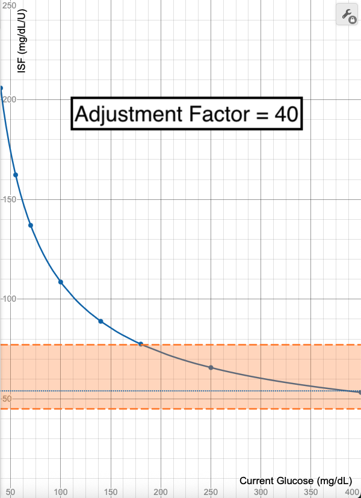{width="250"}
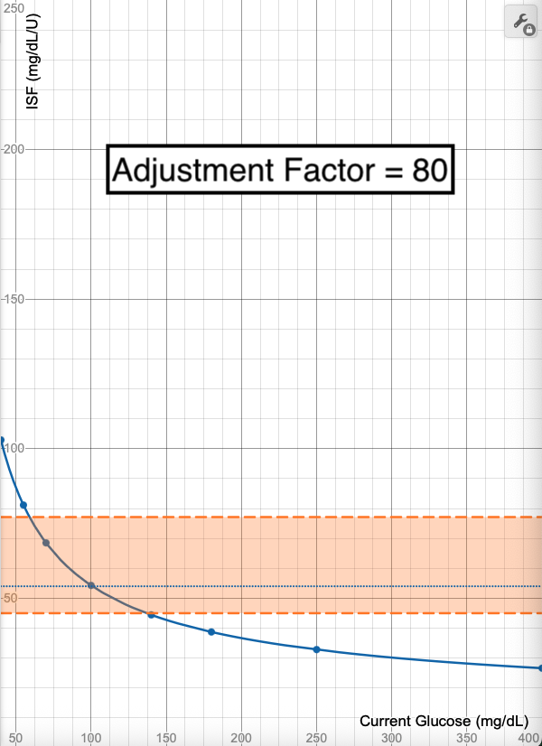{width="250"}
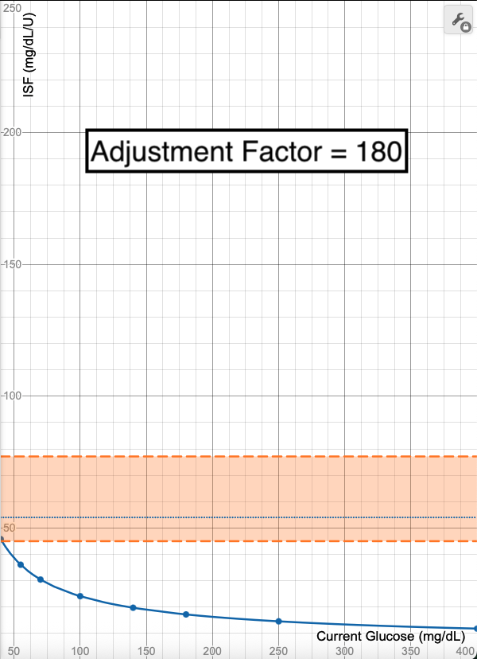{width="250"}
{align="center"}

!!! tip "Profile ISF Tip"
    - This is why the Desmos graphs come in clutch whenever adjustments are needed with Logarithmic Dynamic ISF.

### Adjustment Factor

- Changing your [Adjustment Factor](../../configuration/settings/algorithm/dynamic-settings.md#adjustment-factor-logarithmic) will have a huge impact on what sensitivity ratio and thus what ISF is used.
- It is strongly advised to enter any planned changes to Adjustment Factor into the [Desmos Graph](../../configuration/settings/algorithm/dynamic-settings.md#logarithmic-desmos-graphs) before changing it in your settings.

### Using Overrides With Logarithmic Dynamic ISF

Overrides change your profile settings before they are sent to the Oref algorithm for adaptation. As noted above, because Logarithmic Dynamic ISF does not utilize your profile ISF for the sensitivity calculation, adjusting your profile ISF using an override will not have a significant impact on your dosage calculations. For this reason, it is advised to use [Temp Targets](temp-targets.md) instead of or in conjunction with Overrides when using Logarithmic Dynamic ISF.

!!! question "What effect will using a >100% Override have on Logarithmic Dynamic ISF?"
    
    If you start with a Profile ISF of 50 mg/dL and set an override of 150%, this will change your Profile ISF to 33 mg/dL/U.
    
    Notice how the calculated ISF line does not change with this adjustment to the Profile ISF, only the limits of what section of the curve are allowed. It shifts the limits to only allow the lower ISF portions of the graph, meaning the ISF allowable range will be 27-47 mg/dL/U and the adjustments are capped if glucose is reading higher than 87 mg/dL.
    
    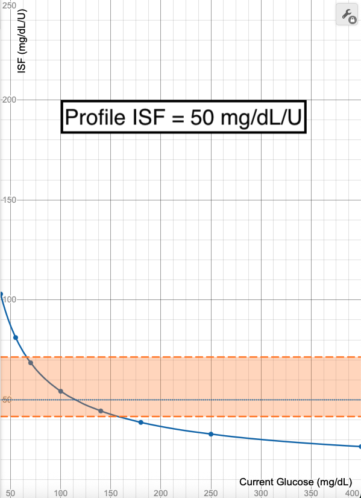{width="250"}
    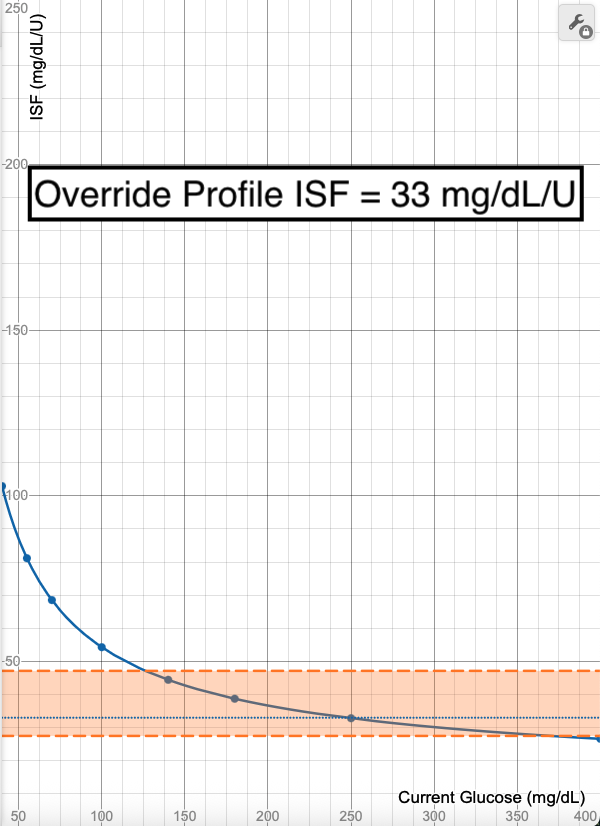{width="250"}
    {align="center"}
    
!!! question "What effect will using a <100% Override have on Logarithmic Dynamic ISF?"
    
    If you start with a Profile ISF of 50 mg/dL and set an override of 70%, this will change your Profile ISF to 71 mg/dL/U.
    
    Notice how the calculated ISF line does not change with this adjustment to the Profile ISF, only the limits of what section of the curve are allowed. It shifts the limits to only allow the higher ISF portions of the graph, meaning the ISF allowable range will be 59-100 mg/dL/U and the adjustments are capped if glucose is reading lower than 126 mg/dL.
    
    {width="250"}
    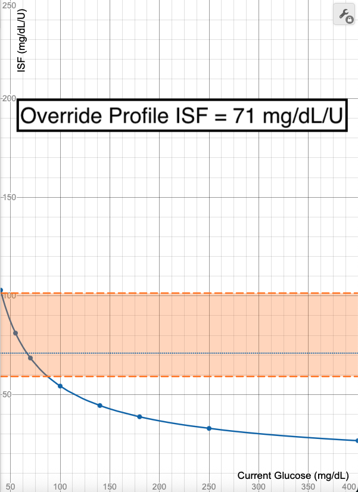{width="250"}
    {align="center"}

### Using Temp Targets With Logarithmic Dynamic ISF

When you utilize a Temp Target AND have [Target Behavior](../../configuration/settings/algorithm/target-behavior.md) settings enabled, this will disable Logarithmic Dynamic ISF and utilize a [new formula](../../configuration/settings/algorithm/target-behavior.md#half-basal-exercise-target) for your sensitivity ratio.

!!! tip "Temp Targets Tips"
    - Worth noting that your Autosens Maximum and Autosens Minimum are still respected when this is utilized.
    
    - If setting a Temp Target adjusts your Sensitivity Ratio to 60%, but your Autosens Minimum is 70%, the Autosens Minimum will be used.
    
### Using Both Overrides and Temp Targets with Logarithmic Dynamic ISF

Yes, you can enable both an Override and a Temp Target at the same time. When you do, Trio will first adjust your profile settings based on the Override set, then those profile settings will be sent to the Oref algorithm for the Sensitivity Ratio and insulin required calculations. The [Target Behavior](../../configuration/settings/algorithm/target-behavior.md) settings will influence the Sensitivity Ratio used as explained above. Your other override-adjusted profile settings will then be utilized to determine the next insulin dosing decision.

### Influence of Total Daily Dose on Logarithmic Dynamic ISF
It's not unheard of for there to be occasions when your daily insulin use can change drastically. It can increase significantly if you need a dose of steroids or are coming down with an illness. It can decrease significantly if you start a new exercise regimine. It's important to know how those changes will influence Trio's calculation in dynamic ISF.

Using a Total Daily Dose (TDD) of 40 units as a baseline, you can see how this changes the ISF calculations when TDD is halved (20 units) or doubled (80 units).

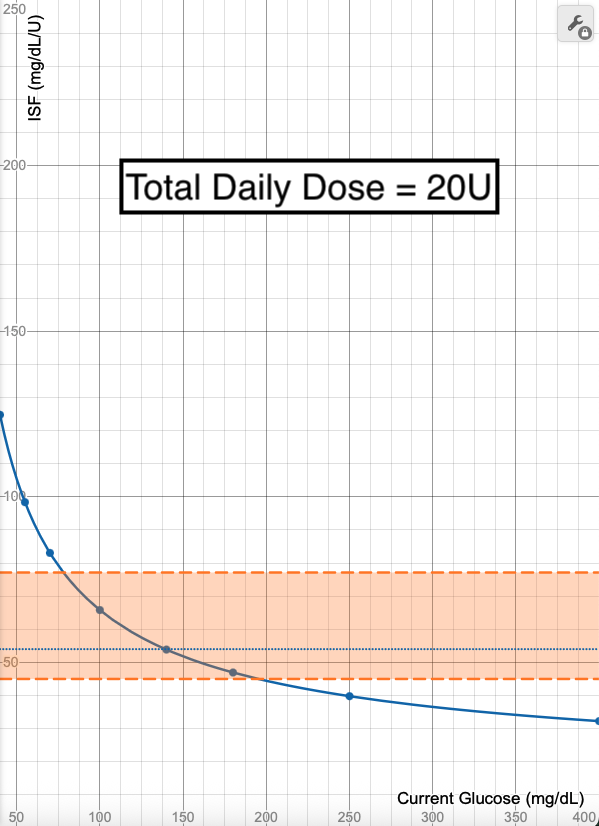{width="250"}
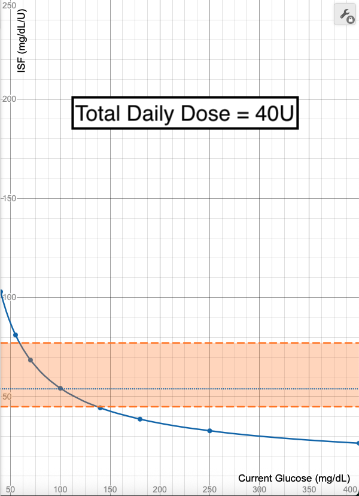{width="250"}
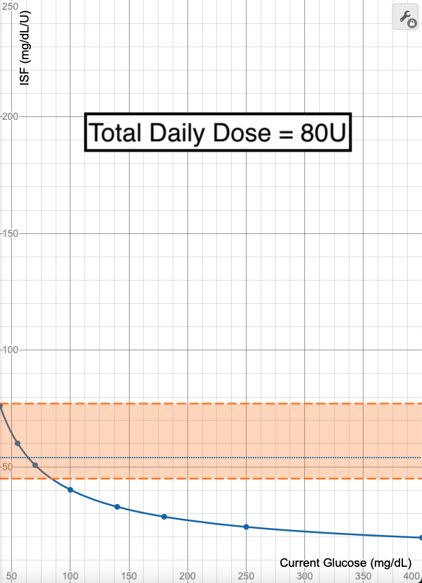{width="250"}
{align="center"}

!!! tip "TDD & Logarithmic Tip"
    - You may want to temporarily adjust your Autosens Minimum or Maximum if you notice a significant change in your TDD.
    - Before making changes, remember to check them in the [Desmos Graph](../../configuration/settings/algorithm/dynamic-settings.md#logarithmic-desmos-graphs) to ensure your new insulin needs are being met.
- - -

## Sigmoid Dynamic ISF

### Profile ISF
When you make changes to your Profile ISF, either as a profile setting change or through an Override, it will shift your Sigmoid Dynamic ISF curve to ensure your Profile ISF is always used when you are at your target glucose.
    
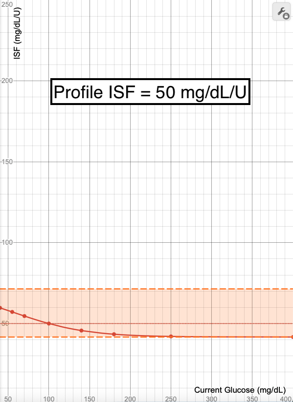{width="250"}
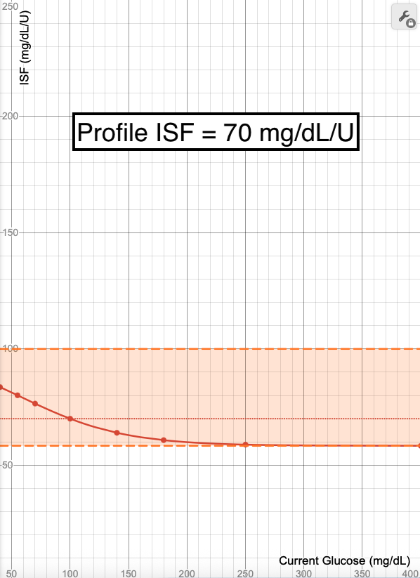{width="250"}
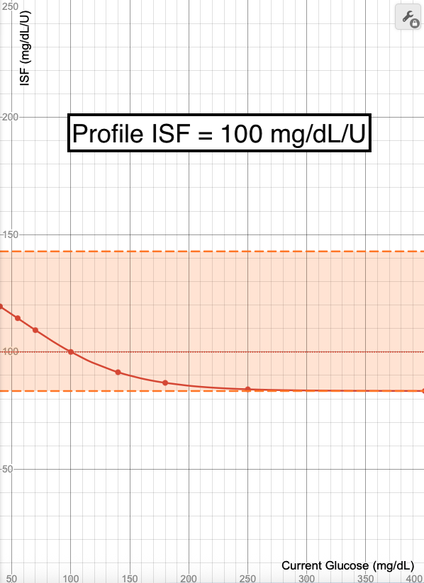{width="250"}
{align="center"}
    
Though it can also shift how steep the curve is, and thus how quickly and to what degree adjustments change, changing your ISF should be done with caution and not as a means to change the curve. Rather, adjusting your [Adjustment Factor](../../configuration/settings/algorithm/dynamic-settings.md#sigmoid-adjustment-factor) is the preferred way to adjust how quickly values adjust.

!!! tip "Profile ISF Tips"
    - If you have tested your ISF at a glucose of 150 mg/dL (8.3 mmol/L) or greater, you may find your Profile ISF is too strong when you enable Sigmoid especially if your target glucose is 100 mg/dL (5.5 mmol/L) or lower.
    
    - To resolve this, you can either increase your target glucose to 150 mg/dL (8.3 mmol/L) or increase your Profile ISF to account for the difference.

### Autosens Maximum
Increasing your Autosens Maximum has the expected effect of raising the percentage in which ISF can be adjusted when using Sigmoid Dynamic ISF. What may not be as expected is the steepness of the curve also changes. If you increase your Autosens Maximum with Sigmoid, you'll see the maximum sensitivity ratio increase and also the speed and amount of ISF changes getting greater.

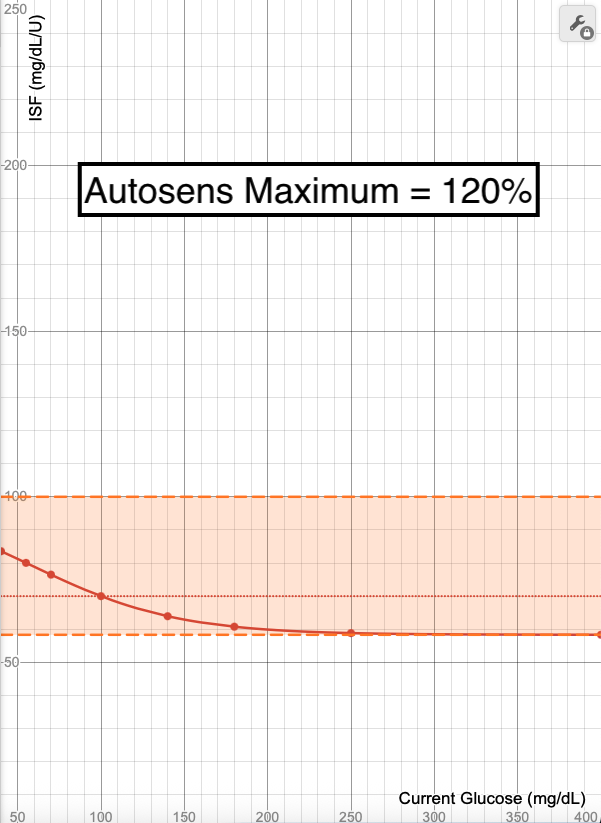{width="250"}
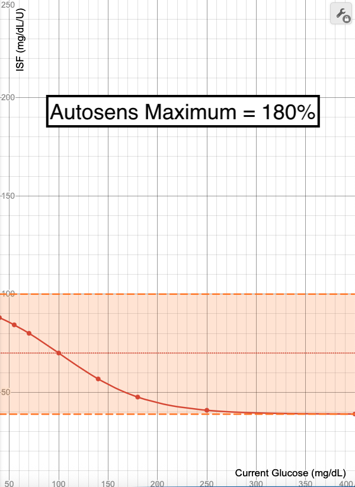{width="250"}
{align="center"}

!!! tip "Autosens Maximum Tip"
    - If you want to avoid the steepness of the curve increasing while increasing your Autosens Max, reduce your Adjustment Factor to counter this effect.

### Autosens Minimum
Decreasing your Autosens Minimum has the expected effect of lowering the percentage in which ISF can be adjusted when using Sigmoid Dynamic ISF. The same way that Autosens Maximum will change the steepness of the curve, adjusting Autosens Minimum will have the same effect.

Notice how Sigmoid is still locked at your Profile ISF being used when glucose is at target? And notice how there's a significant amount of empty space at the top of the orange section in the 50% graph? This means that lowering your Autosens Minimum may not actually lower the adjustments allowed to the extent that you hope, but the only noticeable result may be the curve becoming steeper.

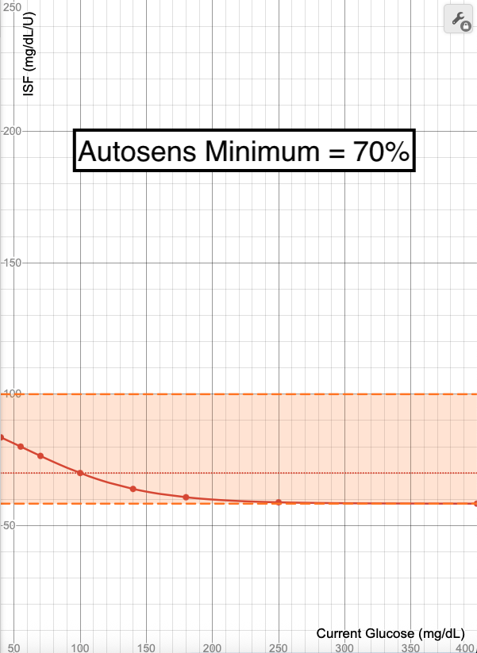{width="250"}
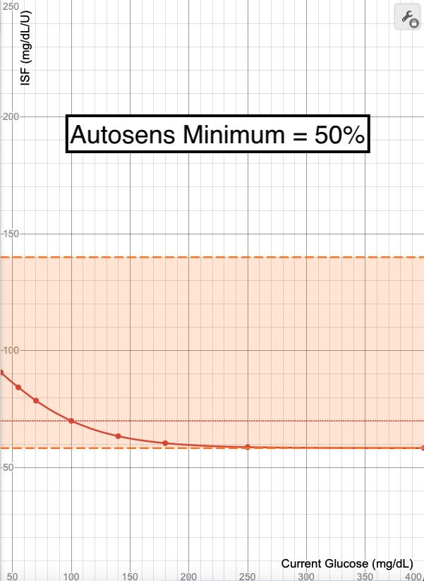{width="250"}
{align="center"}

!!! tip "Autosens Minimum Tips"
    - Check your planned adjustment in the [Sigmoid Desmos Graph](../../configuration/settings/algorithm/dynamic-settings.md#sigmoid-desmos-graphs) to ensure it's having the intended result.
    
    - If you are looking to decrease Autosens Min because of lows, the issue may be with your [Profile ISF setting](#profile-isf_1).

### Adjustment Factor
<Changes the steepness of the curve>
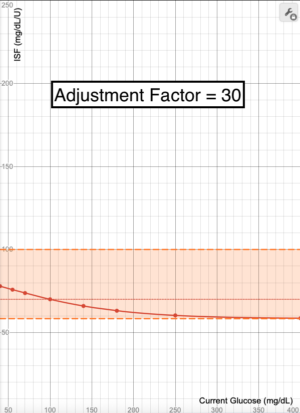{width="250"}
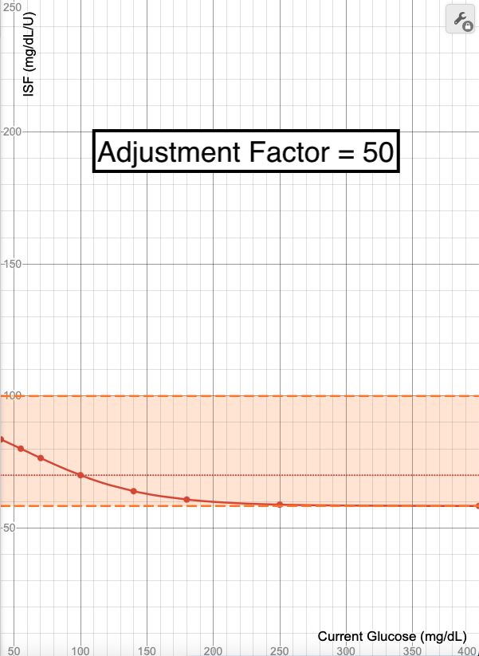{width="250"}
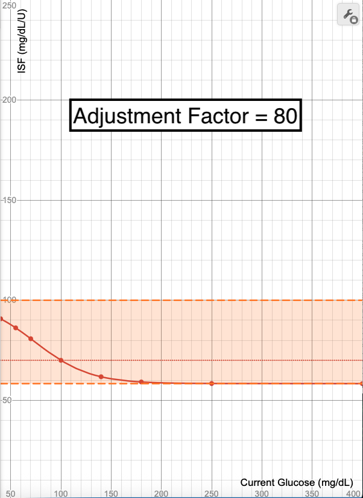{width="250"}
{align="center"}

### Target Glucose
<Shifts whole sigmoid graph within boundaries of AS Max & AS Min>
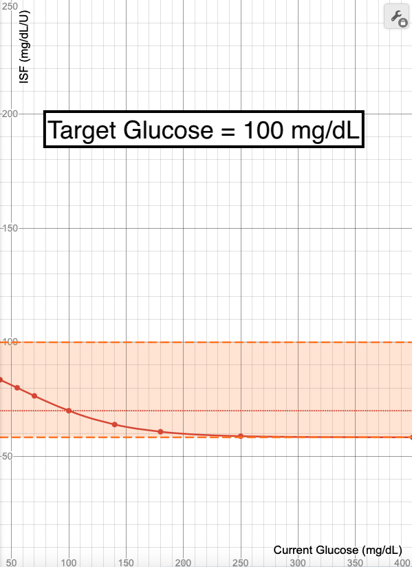{width="250"}
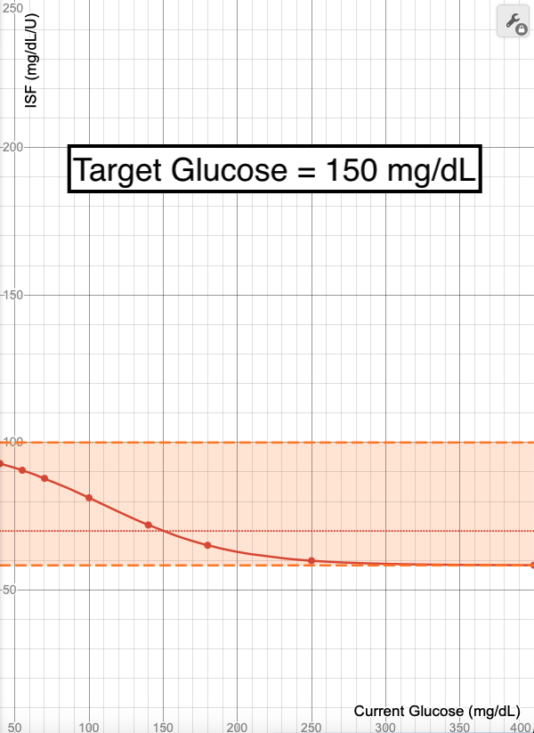{width="250"}
{align="center"}

### Influence of Total Daily Dose on Sigmoid Dynamic ISF
<changes steepness of curve>
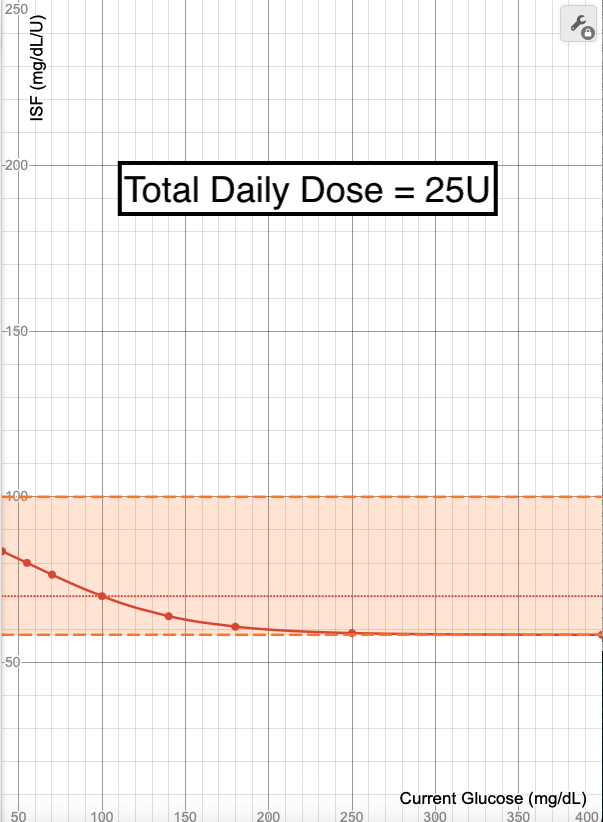{width="250"}
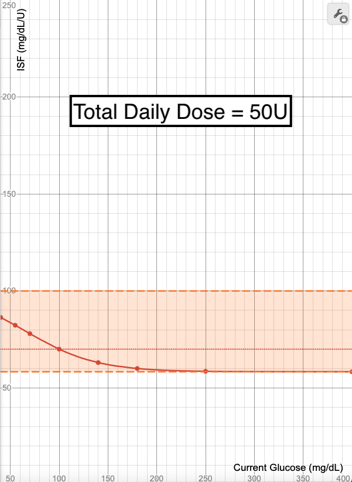{width="250"}
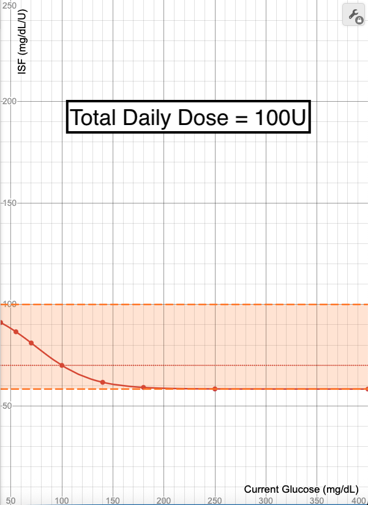{width="250"}
{align="center"}
