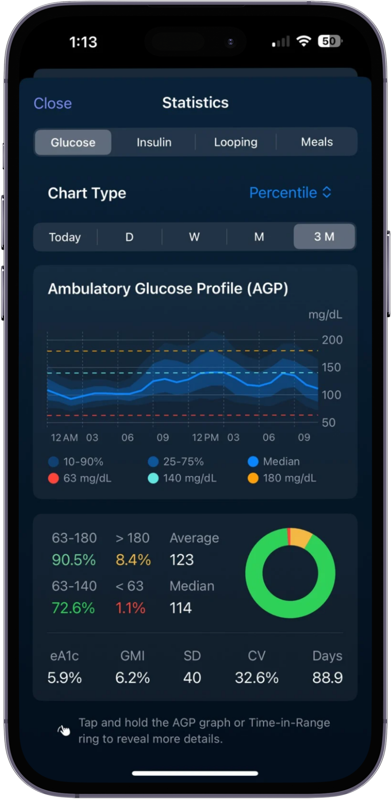
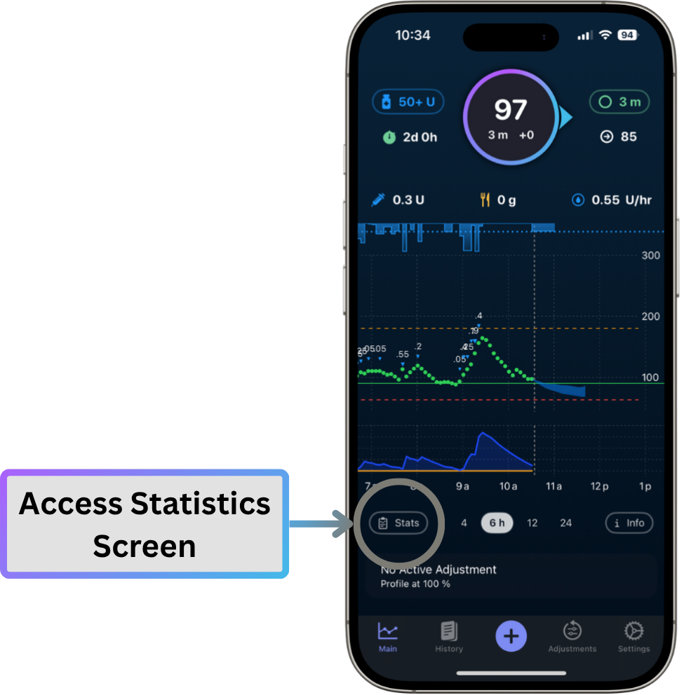
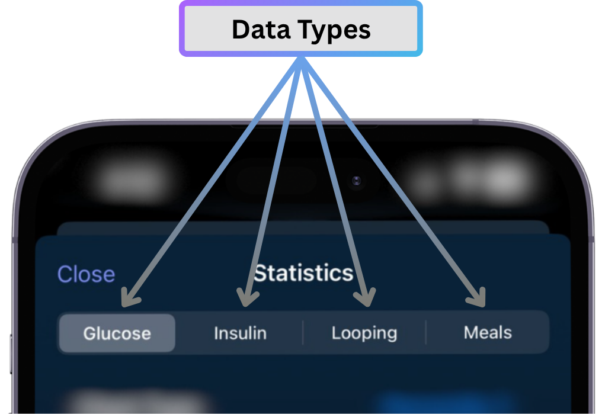
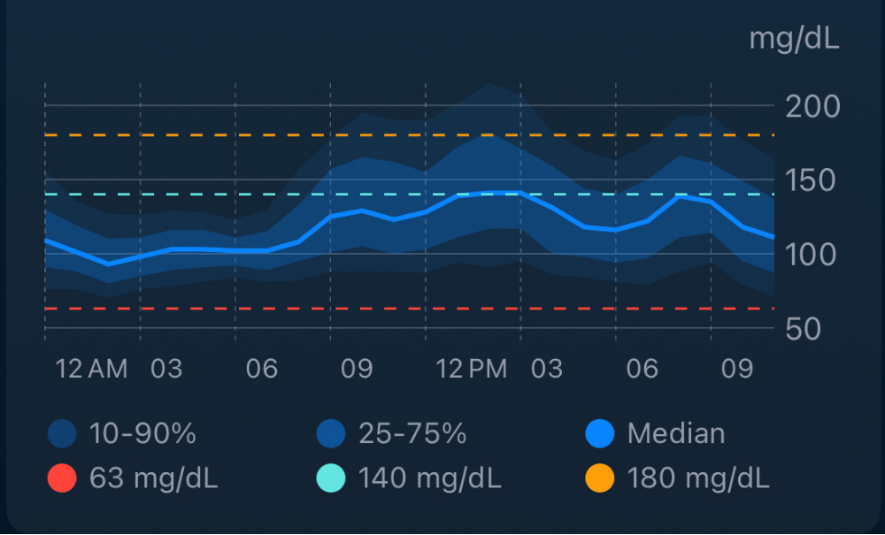
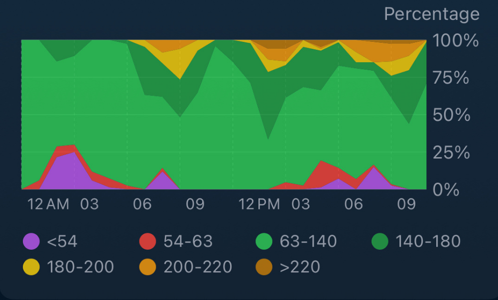
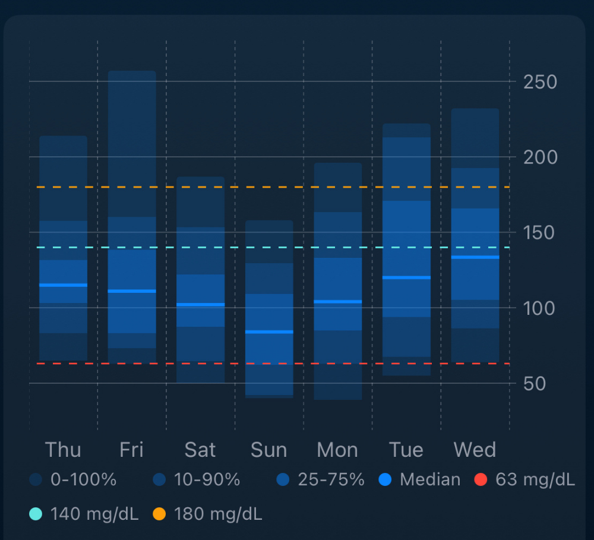
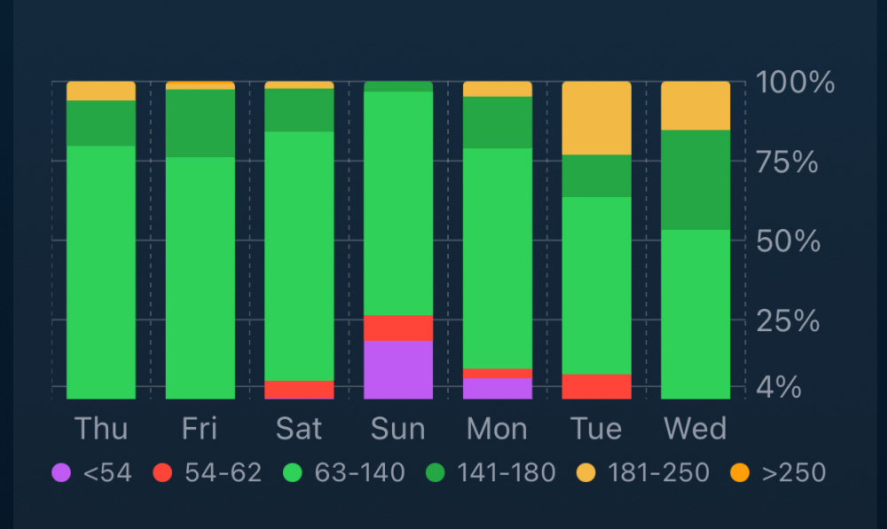

# Statistics

Trio's Statistics feature provides comprehensive data analysis and visualization of your diabetes management metrics. View detailed glucose patterns, insulin usage, loop performance, and meal data across multiple time periods.

{width="300"}
{align="center"}

- - -

## Accessing Statistics

-   To view statistics:
    1. Open Trio
    2. Navigate to the Statistics screen (icon in the navigation menu)
    3. Select a category tab (Glucose, Insulin, Looping, or Meals)
    4. Choose your preferred chart type and time period
    
-   {width="400"}
    {align="center"}
    

- - -

## Data Types

The Statistics screen is organized into four main categories, each accessible via tabs at the top:

{width="400"}
{align="center"}

- **Glucose** - Blood sugar metrics, time-in-range, and glucose distribution
- **Insulin** - Total daily dose and bolus breakdown
- **Looping** - Loop cycle performance and reliability metrics
- **Meals** - Macronutrient tracking and meal analysis

Each category offers multiple chart types and time period options to help you understand patterns and make informed adjustments to your therapy settings.

## Glucose Statistics

### Available Metrics

The Glucose section displays seven key metrics:

| Metric | Description | Formula |
|--------|-------------|---------|
| **eA1c** | Estimated A1c from CGM data | mg/dL: $\frac{Avg\ Glucose + 46.7}{28.7}$ |
| **GMI** | Glucose Management Indicator | $3.31 + (0.02392 × Avg\ Glucose)$ |
| **Average** | Mean of all glucose readings | $Sum / Count$ |
| **Median** | 50th percentile glucose value | Middle value when sorted |
| **SD** | Standard Deviation (glucose variability) | $√(\frac{Σ(x - mean)²}{(n-1)})$ |
| **CV** | Coefficient of Variation | $\frac{SD}{Mean} \times 100\%$ |
| **Days** | Number of days with glucose data | Count of unique dates |

!!! info "Display Units"
    - **eA1c**: Available as % (NGSP) or mmol/mol (IFCC)
    - **GMI**: Available as % or mmol/mol
    - **Glucose values**: Displayed in mg/dL or mmol/L based on your settings

### Chart Types

#### 1. Percentile by Time (AGP - Ambulatory Glucose Profile)

{width="300"}
{align="center"}

The default view shows hourly glucose percentiles across 24 hours:

- **Dark band**: 25th-75th percentile (middle 50% of values)
- **Light band**: 10th-90th percentile (middle 80% of values)
- **Center line**: Median (50th percentile)
- **Reference lines**: Your configured low, target, and high thresholds

This chart helps identify:

- Time-of-day patterns (dawn phenomenon, overnight lows, etc.)
- Glucose variability at specific times
- How tightly controlled your glucose is

#### 2. Distribution by Time

Shows the percentage of time spent in each glucose range for every hour of the day:

{width="300"}
{align="center"}

**Ranges displayed**:

- Purple: < 54 mg/dL (< 3 mmol/L)
- Red: 54-70 mg/dL (3-3.9 mmol/L)
- Bright Green: 70-140 mg/dL (3.9-7.8 mmol/L)
- Dark Green: 140-180 mg/dL (7.8-10 mmol/L)
- Yellow: 180-200 mg/dL (10-11.1 mmol/L)
- Orange: 200-220 mg/dL (11.1-12.2 mmol/L)
- Dark Orange: > 220 mg/dL (> 12.2 mmol/L)

Use this to identify times when you're most likely to be out of range.

#### 3. Percentile by Day

Box plot showing daily glucose distribution:

{width="300"}
{align="center"}

- Each day shows a box-and-whisker plot
- Box represents 25th-75th percentile
- Whiskers extend to 10th and 90th percentiles
- Center line is the median
- Compare day-to-day variability

#### 4. Distribution by Day

{width="300"}
{align="center"}

Stacked bar chart showing the percentage of time in each range per day:

- See which days had optimal control
- Identify patterns across multiple days
- Useful for reviewing weekly trends

Distribution by Day uses the same color chart as the [Distribution by Time chart](#2-distribution-by-time).

### TITR vs. TING

Trio supports two tighter TIR calculation methods:

#### Time in Tight Range (TITR)

- **In Range**: 70-140 mg/dL (3.9-7.8 mmol/L)
- **Low**: 54-70 mg/dL (3-3.9 mmol/L)
- **Very Low**: < 54 mg/dL (< 3 mmol/L)

#### Time in Normoglycemia (TING)

- **In Range**: 63-140 mg/dL (3.5-7.8 mmol/L)
- **Low**: 54-63 mg/dL (3-3.5 mmol/L)
- **Very Low**: < 54 mg/dL (< 3 mmol/L)

You can select your preferred method in the Statistics settings.

!!! tip "TIR Goals"
    The American Diabetes Association recommends:

    - **> 70%** time in range (70-180 mg/dL or 3.9-10 mmol/L)
    - **< 25%** time above range (>180 mg/dL or >10 mmol/L)
    - **< 4%** time below 70 mg/dL or 3.9 mmol/L
    - **< 1%** time below 54 mg/dL or 3 mmol/L

### Time Periods

Select from five time period options:

- **Today**: From midnight to current time
- **Day (D)**: Last 24 hours
- **Week (W)**: Last 7 days
- **Month (M)**: Last 30 days
- **3 Months (3M)**: Last 90 days

- - -

## Insulin Statistics

### Chart Types

#### Total Daily Dose (TDD)

View your insulin usage broken down by type:

**Components**:

- **Manual Bolus**: Insulin you delivered manually for meals/corrections
- **SMB**: Super Micro Boluses delivered automatically by Trio
- **External**: Insulin injections logged but not delivered by pump
- **Temp Basal**: Insulin from temporary basal rates (above scheduled)
- **Scheduled Basal**: Insulin from your scheduled basal profile

The TDD chart displays:

- Bar graph of total daily insulin
- Statistics panel showing totals and averages for the visible range
- Scrollable timeline to review historical data

#### Bolus Distribution

Detailed breakdown of bolus insulin types:

- Manual bolus totals
- SMB totals
- External insulin totals
- Average bolus amounts per period

Use this to understand:

- How much insulin comes from automatic vs. manual delivery
- SMB effectiveness and contribution to total insulin
- Bolus patterns over time

### Time Periods

Choose from four time periods:

- **Day (D)**: Last 24 hours (shows hourly breakdown)
- **Week (W)**: Last 7 days
- **Month (M)**: Last 30 days
- **3 Months (3M)**: Last 90 days

- - -

## Looping Statistics

### Loop Performance Metrics

Track how reliably Trio is functioning:

| Metric | Description |
|--------|-------------|
| **Loop Count** | Total number of loop cycles executed |
| **Successful** | Number of successful completions |
| **Failed** | Number of failed cycles |
| **Success %** | Percentage of successful loops |
| **Median Interval** | Typical time between loops (minutes) |
| **Median Duration** | Typical loop execution time (seconds) |
| **Glucose Count** | Number of CGM readings received |
| **Days** | Days tracked |

### Chart Types

#### Loop Performance Chart

Bar chart showing loop execution over time:

- **Green bars**: Successful loops
- **Red bars**: Failed loops
- Hover/tap for detailed counts per time period
- Scrollable timeline

Use this to identify:

- Times when loops frequently fail
- CGM connection issues
- Overall system reliability

### Time Periods

Same as glucose statistics:

- Today, Day (D), Week (W), Month (M), 3 Months (3M)

!!! info "Good Loop Performance"
    You should typically see:

    - Loop interval: 5-6 minutes (Trio loops every 5 minutes normally)
    - Success rate: > 95%
    - Failures usually indicate CGM or pump connectivity issues

---

## Meal Statistics

### Macronutrient Tracking

View your nutritional intake over time:

**Macros tracked**:

- **Carbohydrates**: Total grams per period
- **Fat**: Total grams per period
- **Protein**: Total grams per period

The meal chart displays:

- Bar graph showing daily or hourly totals
- Breakdown by macronutrient type
- Scrollable timeline
- Date range label

### FPU (Fat Protein Units) Support

If FPU conversion is enabled in settings, Trio tracks fat and protein to calculate their insulin impact for low-carb meals.

### Time Periods

Same as insulin statistics:

- Day (D), Week (W), Month (M), 3 Months (3M)

!!! note
    Meal statistics only include carbs, fat, and protein that you've logged in Trio. Accurate logging is essential for useful meal statistics.

---

## Customization Options

**Time-in-Range Type**:

- Select TITR (Time in Tight Range) or TING (Time in Normoglycemia)
- Changes the range definitions for TIR calculations

*Found under User Interface in Features settings*

**eA1c/GMI Display**:

- Percentage (NGSP format)
- mmol/mol (IFCC format)

*Found under User Interface in Features settings*

**Glucose Units**:

- mg/dL
- mmol/L

*Found under Units and Limits in Therapy Settings*

**Target Ranges**:

- High Limit: Default 180 mg/dL (customizable)
- Low Limit: Default 70 mg/dL (customizable)

These limits affect the color coding and range calculations in all glucose charts.

*Found under User Interface, Low and High Thresholds, in Features Settings*

---

## Understanding Your Statistics

### Glucose Variability

**Standard Deviation (SD)**:

- **Low SD** (< 30 mg/dL): Stable, consistent glucose
- **Moderate SD** (30-50 mg/dL): Some variability
- **High SD** (> 50 mg/dL): Significant swings

**Coefficient of Variation (CV)**:

- **Target**: < 36%
- **CV < 36%** indicates well-controlled glucose variability
- **CV > 36%** suggests unpredictable glucose patterns

!!! tip "Improving CV and SD"
    High variability often indicates:

    - Inaccurate carb counting
    - Incorrect ISF or carb ratios
    - Inconsistent meal timing
    - Exercise without appropriate adjustments

### GMI vs. eA1c

Both provide estimates of your average glucose management:

- **eA1c**: Calculated from average glucose using the ADAG formula
- **GMI**: Similar calculation, recommended by international consensus

These are **estimates** based on CGM data, not laboratory A1c measurements. They correlate well but may differ from lab results.

### TDD Trends

Monitoring your Total Daily Dose helps you understand:

- **Increasing TDD**: May indicate insulin resistance, weight gain, or illness
- **Decreasing TDD**: May indicate increased sensitivity, weight loss, or more activity
- **Stable TDD**: Consistent insulin needs

Significant TDD changes should prompt review of your basal rates, ISF, carb ratios, and Dynamic ISF Settings.

### Loop Reliability

High loop success rates (> 95%) indicate:

- Good CGM connectivity
- Reliable pump communication
- Stable Trio operation

Frequent loop failures warrant investigation:

- Check CGM sensor placement and transmitter battery
- Verify pump is in range and functioning
- Review phone battery and background app settings

---

## Data Availability

Statistics are calculated from data stored in Trio's database:

- **Glucose**: Requires CGM data
- **Insulin**: Requires pump event history
- **Looping**: Requires loop execution records
- **Meals**: Requires logged carb entries

If you've recently started using Trio or reset your data, some statistics may not be available until sufficient data accumulates.

**Minimum data for meaningful statistics**:

- **1 day**: Today and Day views
- **7 days**: Week view
- **30 days**: Month view
- **90 days**: 3 Month view

---

## Performance Notes

Statistics calculations can be intensive for large datasets. Trio uses several optimizations:

- **Caching**: Frequently accessed calculations are cached
- **Background processing**: Heavy calculations run in background threads
- **Pagination**: Charts load data in scrollable segments
- **Concurrent calculations**: Multiple statistics computed in parallel

You may notice a brief delay when first opening Statistics or switching time periods on older devices. This is normal and ensures the UI remains responsive.

---

## Troubleshooting

### "No data available" Message

If you see this message:

1. **Check data source**: Ensure you have CGM data (for glucose), logged carbs (for meals), etc.
2. **Verify time period**: Try a shorter time period if you recently started using Trio
3. **Restart Trio**: Sometimes refreshing the app resolves data loading issues

### Statistics Don't Match Other Apps

Small differences are normal due to:

- Different calculation methods (mean vs. median)
- Different time period boundaries
- Different range definitions
- Data filtering (Trio may exclude some invalid readings)

Large discrepancies should be investigated—verify your data is syncing correctly.

### Slow Performance

If statistics load slowly:

- **Reduce time period**: Use Day or Week instead of 3 Months
- **Clear app cache**: Settings > Advanced (if available)
- **Update Trio**: Ensure you're running the latest version
- **Device storage**: Free up space on your iPhone

---

## Summary

Trio's Statistics feature provides powerful insights into your diabetes management:

- **Glucose Statistics**: Understand your time-in-range, variability, and patterns
- **Insulin Statistics**: Monitor your TDD and bolus distribution
- **Loop Statistics**: Track system reliability and performance
- **Meal Statistics**: Review your macronutrient intake

Use these statistics to:

- Identify patterns and trends
- Make informed adjustments to therapy settings
- Share data with your healthcare team
- Track progress toward your diabetes management goals

Regularly reviewing your statistics helps ensure Trio is working optimally and your settings remain accurate as your insulin needs change.
