# User Interface
## Trio User Interface

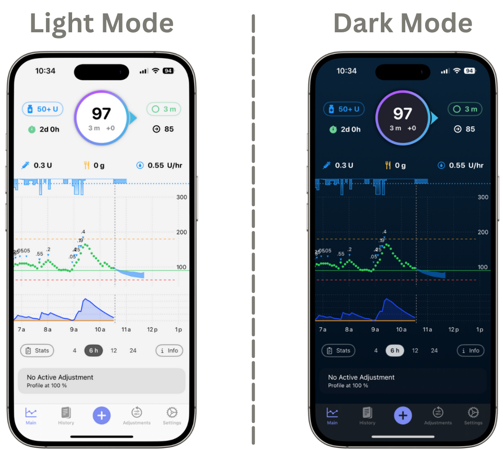{width="600"}
{align="center"}

- - -

## Main Screen

**The main screen of Trio can be divided into four sections:**

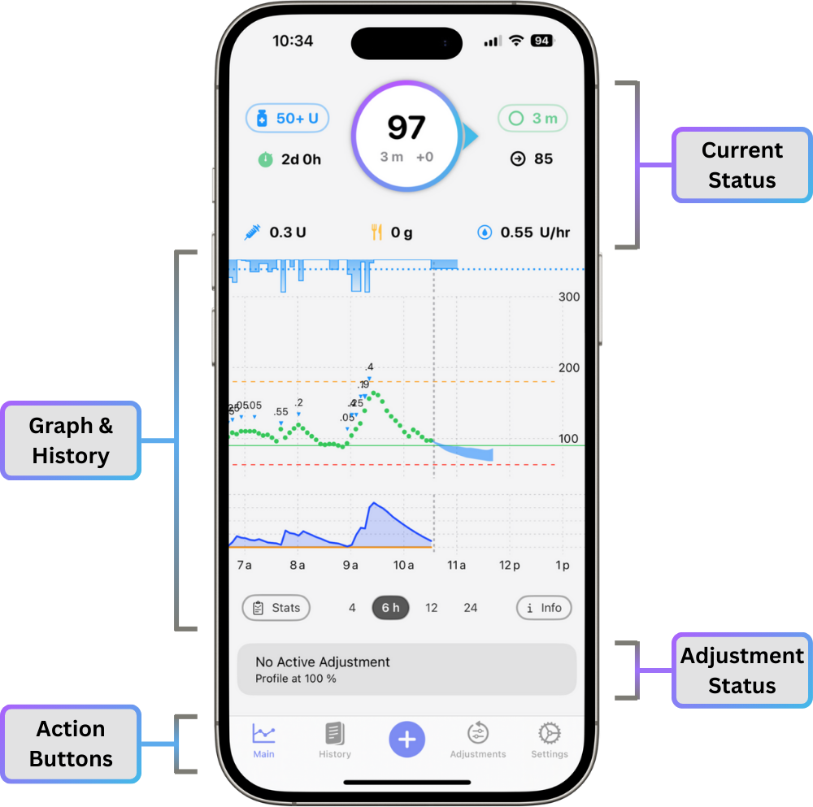{width="500"}
{align="center"}

Use the links below to learn more about each section:  
[Current Status](#current-status) | [Graph & History](#graph-and-history) | [Adjustment Status](#adjustment-status) | [Action Buttons](#action-buttons)

- - -

### Current Status

The Current Status section functions as an easy reference point for a variety of important data points.  
Use the tabs below to learn more about each section:  

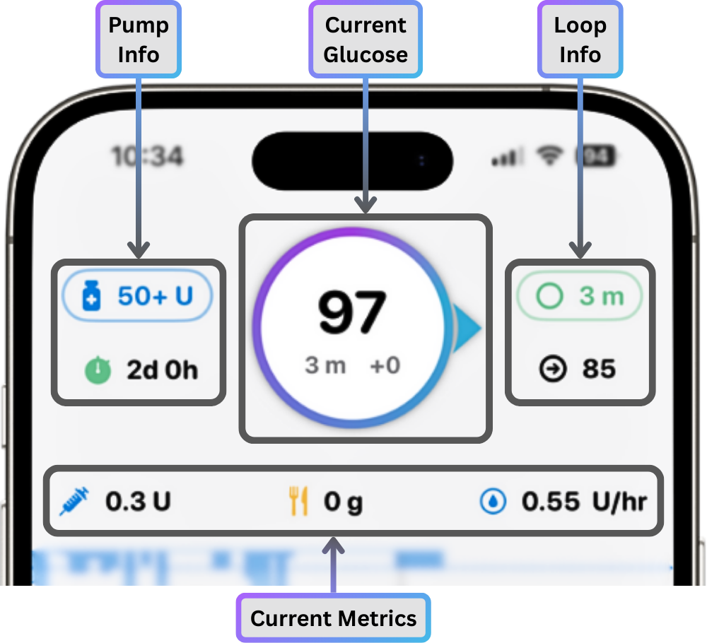{width="400"}
{align="center"}  

=== "Current Glucose"
    Here you will find a centered bobble containing your current glucose reading, the time since the last glucose reading, the change in glucose from the previous reading, and an arrow that indicates the trending direction of your glucose.

    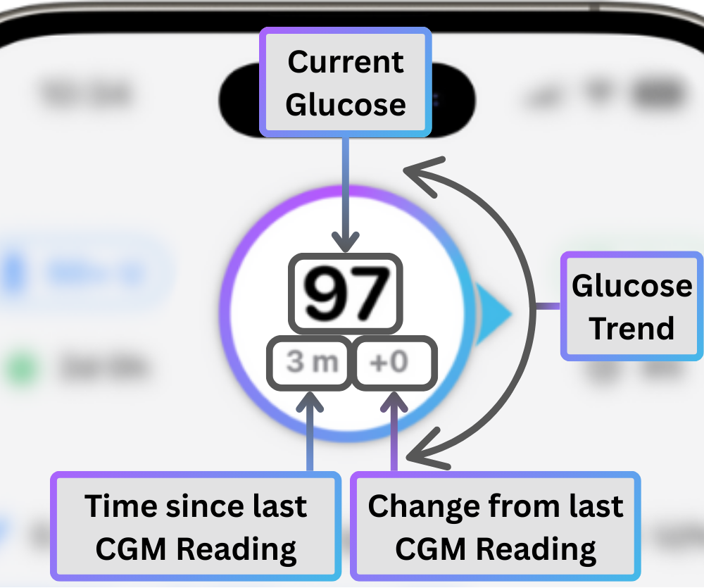{width="300"}
    {align="center"}
    
    !!! tip "Pro Tip"
        If you long press the bobble, it will snooze CGM alerts
    
=== "Pump Info"

    === "Omnipod Users"
        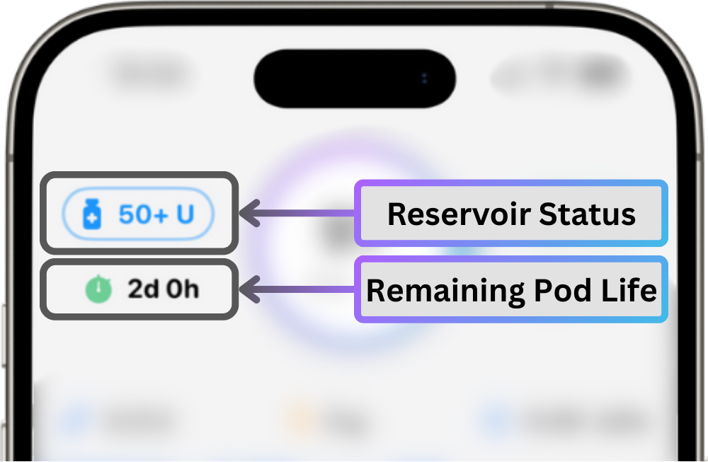{width="300"}
        {align="center"}
    
        * **Reservoir Status:** Units Remaining in your pod  
        * **Remaining Pod Life:** Remaining time left on your current pod  
        **Keep in mind:** 50+ U means more than 50 units of insulin are left. Omnipod only provides an exact value for the reservoir if the amount is less than 50 Units. 
    
    === "Medtronic & Dana Users"
        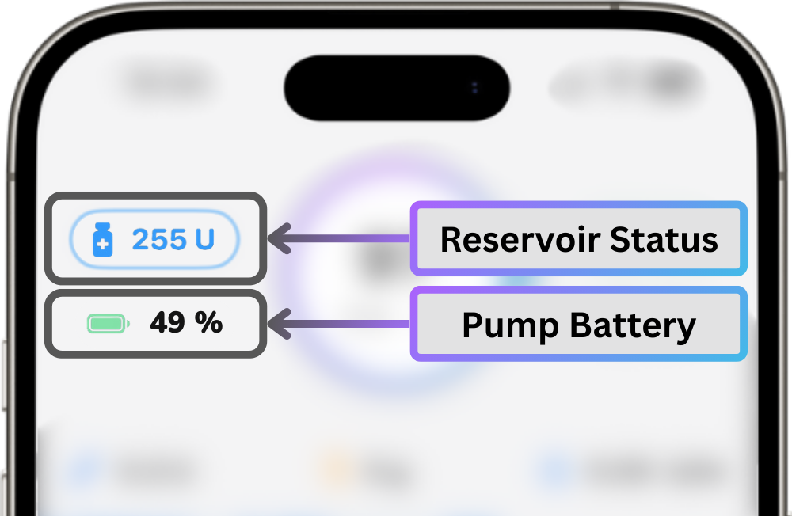{width="300"}
        {align="center"}
    
        * **Reservoir Status:** Units remaining in your reservoir  
        * **Pump Battery:** Pump battery percentage remaining  
    

=== "Loop Info"
    To the right of the bobble, you will find the current looping status and the time since the last loop cycle. Below that, is your 4-hour glucose forecast.
    
    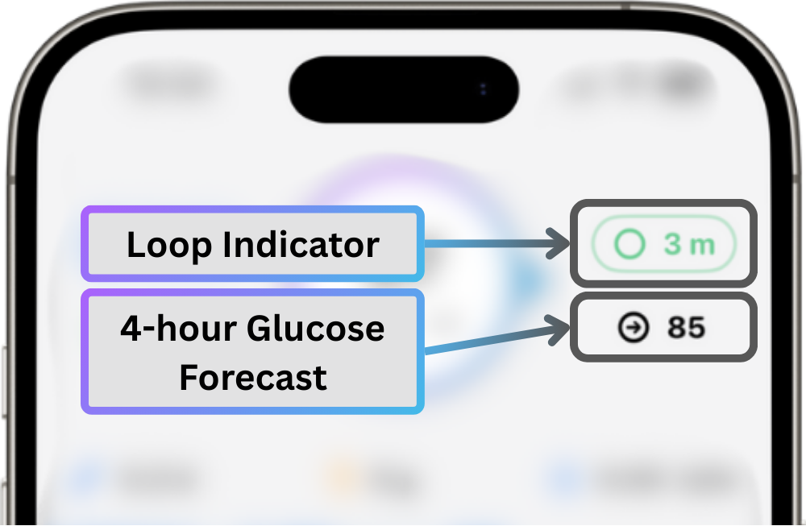{width="300"}
    {align="center"}
    
    The Loop Indicator tells you how long it has been since the last loop cycle using specific colors:
        
    :fontawesome-regular-circle: **Green:**  
        It has been **_5 minutes or less_** since a successful loop cycle
        
    :fontawesome-regular-circle: **Yellow:**  
        It has been **_6-10 minutes_** since a successful loop cycle
        
    :fontawesome-regular-circle: **Red:**  
        It has been **_10+ minutes_** without a successful loop cycle
        
    :fontawesome-regular-circle: **Grey:**  
        No data or not enough data to complete a loop cycle
        
    !!! tip "Pro Tip"
        If you long press the loop indicator, it will force a loop cycle
    
=== "Current Metrics"
    Below the bobble, you'll find 3 icons that provide you with the current IOB, COB, and adjusted basal rate. These values were determined by the calculations made in the most recent loop cycle.
    
    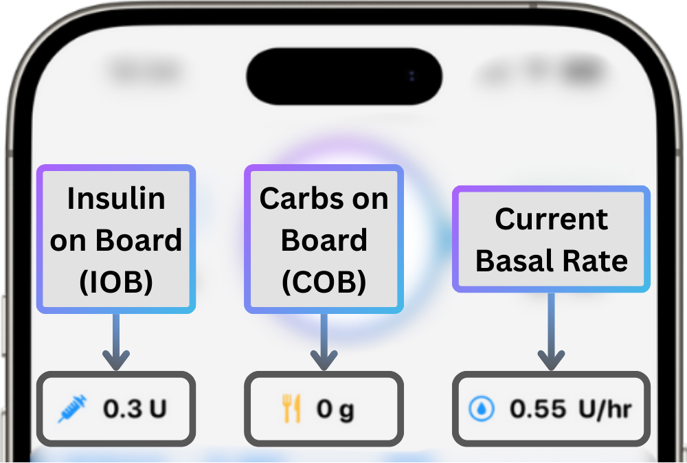{width="300"}
    {align="center"}

- - -

### Graph and History

The middle of the screen graphs your blood sugar data and entered carbs overlaid with Trio's insulin delivery and glucose forecasting.  
Use the tabs below the image to learn more about each section.  

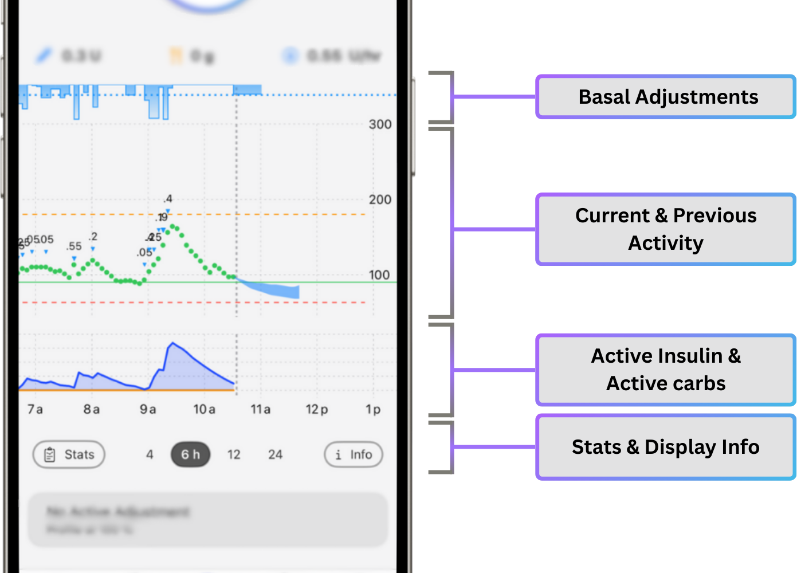{width="400"}
{align="center"}

=== "Basal Adjustments"
    Here you will find the adjustments made to your basal delivery. See below for more details:  
    
    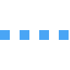{width="40" style="vertical-align: middle;"}  **Therapy Basal Reference Line:** The rate you entered in settings. (In Trio 0.2.x, this was called "Profile Basal Rate")  
    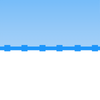{width="40" style="vertical-align: middle;"}  **No Basal Adjustment** Basal is being delivered at your current therapy basal rate.  
    {width="40" style="vertical-align: middle;"}  **Basal Increase** Basal increased above your current therapy basal rate.  
    {width="40" style="vertical-align: middle;"}  **Basal Decrease** Basal decreased below your current therapy basal rate.  
    
=== "Current & Previous Activity"
    This section shows a combined view of your previous, current, and forecasted activity.
    
        
    === "{width="20" style="vertical-align: middle;"}  **Cone of Uncertainty**"
        
        !!! info inline end "Graph Legend"
    
            :fontawesome-solid-circle:  CGM Glucose Value  
            :fontawesome-solid-circle-dot:  CGM Glucose Value (Smoothed)  
            :fontawesome-solid-droplet:  Manual Glucose Entry  
            {width="15" style="vertical-align: middle;"}  Bolus (SMB or Manual)  
            {width="15" style="vertical-align: middle;"}  Carb Entry  
            :fontawesome-solid-circle:  Fat-Protein Carb Equivalent (FPU)  
            {width="15" style="vertical-align: middle;"}  Override Active  
            {width="15" style="vertical-align: middle;"}  Temp Target Active  
            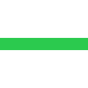{width="15" style="vertical-align: middle;"}  Target Glucose  
        
        
        This forecast option displays the full range of possible forecasted predictions as a simplified view of oref's four forecast lines.  
        
    === "{width="20" style="vertical-align: middle;"}  **Forecast Lines**"
        
        !!! info inline end "Graph Legend"
    
            :fontawesome-solid-circle:  CGM Glucose Value  
            :fontawesome-solid-circle-dot:  CGM Glucose Value (Smoothed)  
            :fontawesome-solid-droplet:  Manual Glucose Entry  
            {width="15" style="vertical-align: middle;"}  Bolus (SMB or Manual)  
            {width="15" style="vertical-align: middle;"}  Carb Entry  
            :fontawesome-solid-circle:  Fat-Protein Carb Equivalent (FPU)  
            {width="15" style="vertical-align: middle;"}  Override Active  
            {width="15" style="vertical-align: middle;"}  Temp Target Active  
            {width="15" style="vertical-align: middle;"}  Target Glucose  
        
        
        :fontawesome-solid-circle:  **IOB Forecast:** Forecasts future glucose readings based on the amount of insulin still active in the body  
        :fontawesome-solid-circle:  **ZT Forecast:** Forecasts the worst-case future glucose reading scenario if no carbs are absorbed and insulin delivery is stopped until glucose begins to rise  
        :fontawesome-solid-circle:  **COB Forecast:** Forecasts future glucose readings by considering the amount of carbohydrates still being absorbed in the body  
        :fontawesome-solid-circle:  **UAM Forecast:** Forecasts future glucose levels based on the difference between expected glucose and actual glucose readings
    
    - - -
        
    === "{width="18" style="vertical-align: middle;"} Static Glucose Color"
        
        !!! info inline end "Threshold Graph Legend"
    
            {width="15" style="vertical-align: middle;"}  High Threshold   
            {width="15" style="vertical-align: middle;"}  Low Threshold  
            :fontawesome-solid-circle:  Above Range Glucose  
            :fontawesome-solid-circle:  In Range Glucose  
            :fontawesome-solid-circle:  Below Range Glucose      
            
        {width="300"}
        {align="center"}
        
    === "{width="20" style="vertical-align: middle;"} Dynamic Glucose Color"
    
        !!! info inline end "Threshold Graph Legend"
    
            {width="15" style="vertical-align: middle;"}  High Threshold (=180)  
            {width="15" style="vertical-align: middle;"}  Low Threshold (=70)  
            {width="15" style="vertical-align: middle;"}  Above Target  
            {width="15" style="vertical-align: middle;"}  At or Near Target  
            {width="15" style="vertical-align: middle;"}  Below Target  
            
            _*The colors of the threshold lines are also dynamic, so the exact coloring will depend on your settings_ 
        
        {width="300"}
        {align="center"}
    
=== "Active Insulin & Carbs"
    This section shows the decay of your active insulin and carbohydrates.  
    
    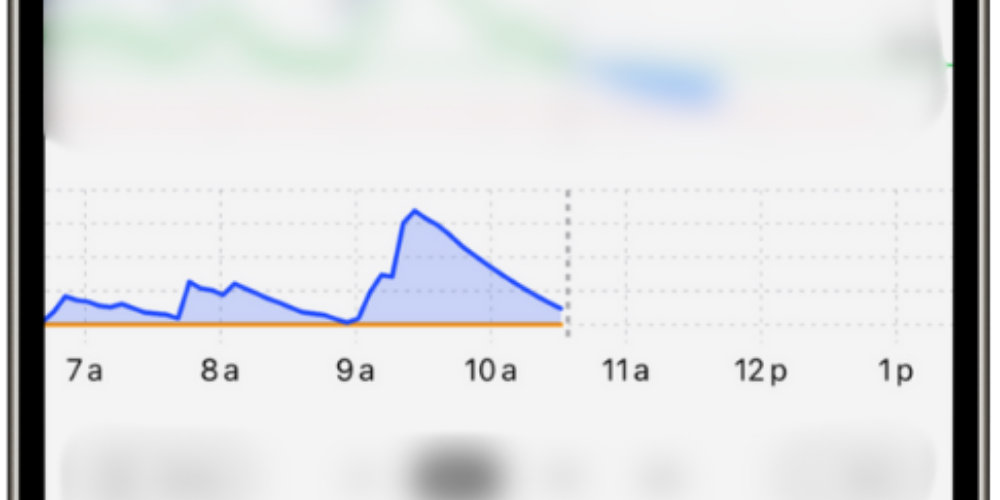{width="300"}
    {align="center"}
    
    Insulin is shown in blue and carbs are shown in orange.
    
=== "Stats & Display Info"
    Here you will find 3 main sections for statistics and display information.
    
    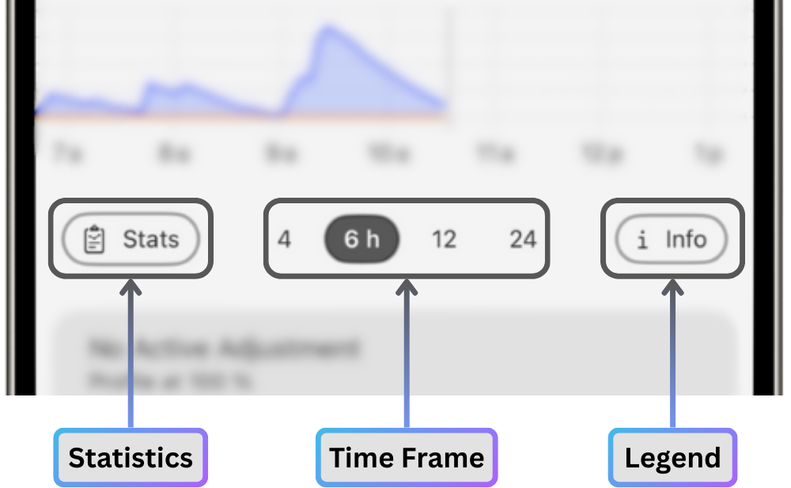{width="300"}
        {align="center"}
    
    === "Statistics"
        This opens the statistics view. You can learn more about the new statistics page [here](statistics.md).
            
    === "Time Frame"
        This allows you to choose the time frame shown in the graph.  
        It defaults to 6 hours, but you can choose 4, 6, 12, or 24 hours to be displayed.
            
    === "Legend"
        Tapping this will open a detailed, in-app description of each item shown on the graph.

- - -

### Adjustment Status

Under the graph you'll find the current status of any adjustment currently active. Adjustments include boluses in progress, temp targets, and overrides.  
Use the tabs below to learn more:    

=== "No Active Adjustment"
    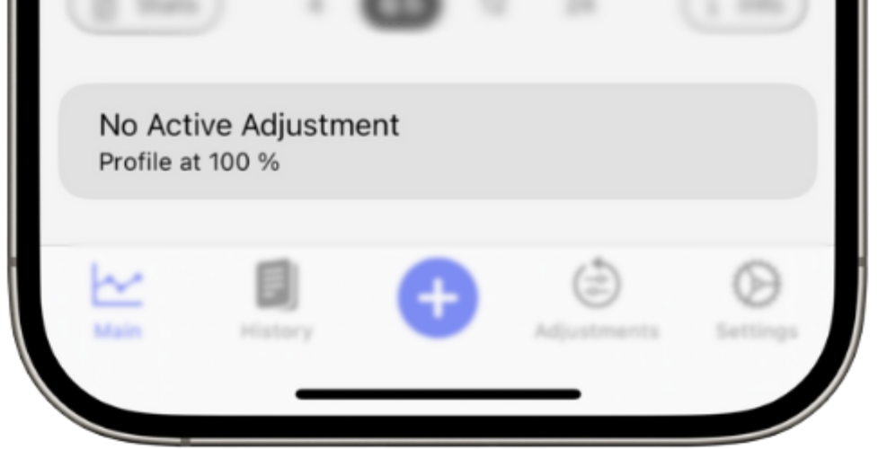{width="300"}
    {align="center"}
    
    - This is the default view when there is no bolus-in-progress, active override, or active temp target
    
=== "{width="10" style="vertical-align: middle;"} Bolus in Progress"
    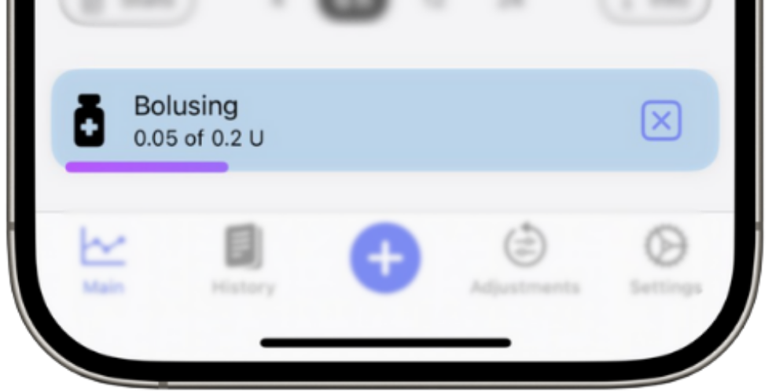{width="300"}
    {align="center"}
    
    - Shows the status of current bolus
    - Press the {width="20" style="vertical-align: middle;"} to cancel the current bolus
    
=== "{width="15" style="vertical-align: middle;"} Active Override"
    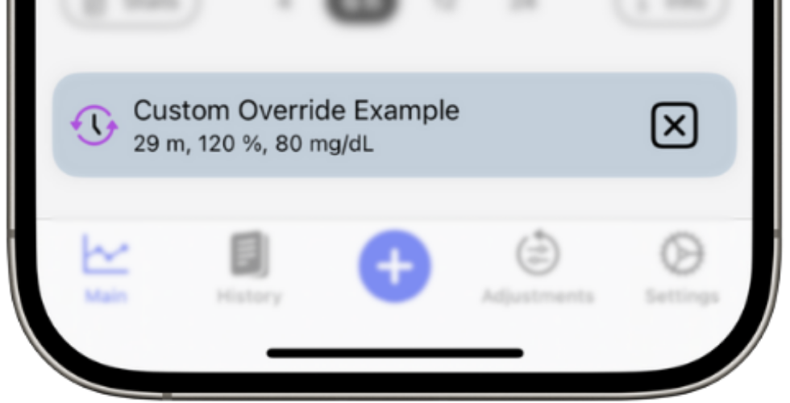{width="300"}
    {align="center"}
    
    - Shows details of the current override running
    - Press the {width="20" style="vertical-align: middle;"} to cancel the override
    
=== "{width="15" style="vertical-align: middle;"} Active Temp Target"
    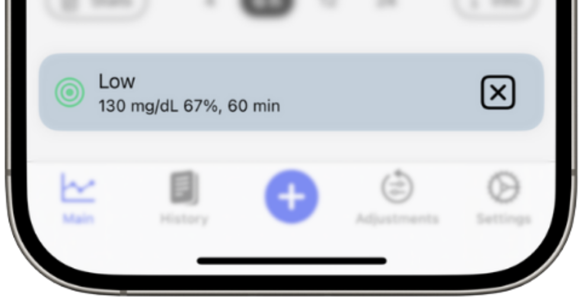{width="300"}
    {align="center"}
    
    - Shows details of the current temp target running
    - Press the {width="20" style="vertical-align: middle;"} to cancel the temp target

- - -

### Action Buttons

At the bottom of the screen, you have five action buttons. Use the tabs below to learn more about each section:  

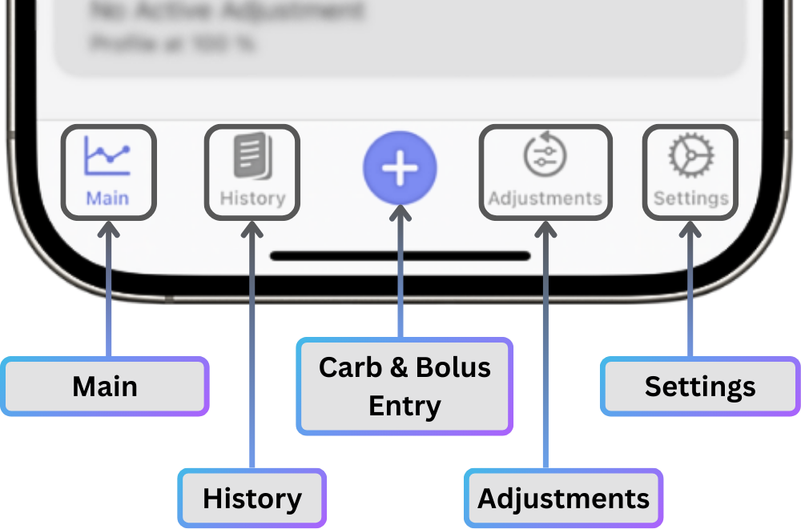{width="400"}
{align="center"}

<!-- Intentionally left off the "s" in the nested Adjustments tab title because it keeps jumping to the Adjustments tab above -->

=== "{width="15" style="vertical-align: middle;"} Main"
    This button takes you back to the home screen no matter where you are in the app.
    
=== "{width="15" style="vertical-align: middle;"} History"
    This button brings up the History screen. Here you will find previous treatments, meal entries, glucose readings & manual glucose entries, and previous use of adjustments. Here you can add a finger stick glucose entry by tapping the "+" at the top right.  
    **More information about each tab:**
    
    === "Treatments"
        - Scroll to see previously enacted Temp Basals, Boluses, and SMBs
        - Swipe left to delete inaccurate bolus and SMB entries. You cannot delete Temp Basal entries
        
    === "Meals"
        - Scroll to see previously entered carb, fat, and protein entries
        - Swipe left to edit or delete inaccurate entries
        - Tap "Show Future" or "Hide Future" to expose and remove future carb entries (This does not delete them, only allows you to see or not see them)
        
    === "Glucose"
        - Scroll to see previous glucose readings
        - Swipe left to delete inaccurate entries
        - CGM readings are marked with "→" and finger stick readings are marked with "🩸"
        
    === "Adjustment"
        - Scroll to see previous temp targets and overrides that have been enacted
        - Temp Targets are indicated by a green target icon
        - Overrides are indicated by a purple time icon
        
=== ":fontawesome-solid-circle-plus: Carb & Bolus Entry"
    This button opens the treatments entry screen, also known as the bolus calculator.
    
=== "{width="15" style="vertical-align: middle;"} Adjustments"
    This button opens the Overrides and Temp Targets screen.  
    More information about each option:
    
    === "Overrides"
        - Add an override by tapping the "+" at the top right
        - With an override, you can:
            - Name your override to save it as a preset
            - Increase or decrease basal by a percentage
            - Attribute that % change to both ISF and CR, just one of them, or neither of them
            - Override your target glucose
            - Allow, disable or disable on schedule all SMBs
            - Override your Max SMB Basal Minutes and/or Max UAM Basal Minutes
            - Enable indefinitely or for a set length of time
        - You can save it as a preset to enact later or start the override now
            - If you need to edit or delete a preset override, just swipe left on the override
        
    === "Temp Targets"
        - Add a temp target by tapping the "+" at the top right
        - With a Temp Target, you can:
            - Name your temp target to save it as a preset
            - Set your temporary target glucose
            - Set it to start now or in the future
            - Set the duration of your temp target
        - You can save it as a preset to enact later, start the temp target now, or set a start time for a future time and/or date.
            - If you need to edit or delete a preset temp target, just swipe left on the temp target
                
=== "{width="15" style="vertical-align: middle;"} Settings"
    This button opens the settings menu
    Below you will (_soon_) find links to each of the settings pages within the docs that correlate to the menus you see:  
    - Closed Loop  
    - Devices
    - Therapy  
    - Algorithm  
    - Features  
    - Notifications  
    - Services  
    - Support & Community  
    

- - -
